# 数独和时间表

> 原文：<https://medium.com/hackernoon/sudokus-and-schedules-4b4693b07c2b>

## 用树搜索解决调度问题


Pan Am’s Reservation Center in the 1950’s

如今，机器学习非常流行，以至于人们很容易忽视“人工智能”领域还有其他算法的事实。事实上，这些算法是如此的重要，以至于忽视它们是很容易的。

Video version of this article

假设你需要安排课程和教室。有 36 节课、36 个房间和 800 个讲座作为你的时间表。想猜猜有多少种可能的配置吗？这里是答案:1⁰ ⁴⁹⁰可能的配置。客观地说，宇宙中有 1⁰⁸⁰可观测的原子。即使像教室安排这样平凡的任务也要处理天文数字和排列，并冒险进入 [NP 难领域](https://youtu.be/YX40hbAHx3s)。但是我可以告诉你如何及时地用算法解决这些问题。

运筹学领域并不新鲜，但它的技术和算法对日常实际问题至关重要。在工厂产能如此有限的情况下，如何在多条产品线中实现利润最大化？你如何安排一家医院的 200 名护士，他们有不同的休假要求、职位、工会限制和工作时间规定？如果你需要[安排体育比赛并最小化团队旅行距离](https://en.wikipedia.org/wiki/Traveling_tournament_problem)该怎么办？如何优化列车网络的准点性能？还是简单的解一个数独？

有许多算法可以解决优化性质的问题。其中包括[线性规划](https://en.wikipedia.org/wiki/Linear_programming)、[元启发式](https://en.wikipedia.org/wiki/Metaheuristic)和[整数规划](https://en.wikipedia.org/wiki/Integer_programming)等等。我个人觉得这些优化和搜索算法非常迷人，并且有大量的实际问题需要用它们来解决。有趣的是，这些算法中的一些如何直接应用于机器学习，因为机器学习本身在其核心是一个优化问题。

但今天，我想谈谈如何安排大学课堂，以及解决数独。您可以使用这种整数规划方法在基于规则的约束下安排员工、工厂生产线、云服务器作业、运输车辆和其他资源。我们可以使用数学建模实现神奇的一键生成时间表，而不是依赖迭代的强力策略来将事件放入时间表中(这可能是无药可救的低效)。你甚至可以[采用这些方法来构建象棋人工智能算法](https://medium.freecodecamp.org/simple-chess-ai-step-by-step-1d55a9266977)或者进行任何基于离散的回归。

> 在我开始之前，我强烈推荐这个具有挑战性但很有用的 [Coursera 离散优化课程](https://www.coursera.org/learn/discrete-optimization/)。这门课相当雄心勃勃，但是很有价值，很有用，也很有趣。这是值得的时间和精力，即使你不得不放慢自己的步伐。

做好准备，对于你们这些技术人员来说，将会有相当多的代码！重要的是要着眼于大局，从概念上理解模型。所以我鼓励你在第一次阅读这篇文章的时候忽略掉这段代码(或者干脆跳过它)。如果您决定深入研究，请确保您熟悉面向对象和函数式编程。

## 定义问题

在本文中，我们将针对一个教室生成每周大学课程表。我们将在两个维度上绘制占领状态网格:班级与 15 分钟离散间隔的时间线。如果我们想要安排多个房间，那将是三个维度:班级对时间线对房间。我们现在将坚持前者，做一个房间，稍后我将解释如何做多个房间。

这些课程时间长短不一，可能会在一周内“重复出现”。每个重复会话必须在一天中的同一时间开始。

以下是这些类:

*   心理学 101 (1 小时，2 节课/周)
*   英语 101 (1.5 小时，2 节课/周)
*   数学 300 (1.5 小时，每周 2 节课)
*   心理学 300(每周 3 小时 1 节课)
*   微积分 I (2 小时，2 节课/周)
*   线性代数 I (2 小时，每周 3 节课)
*   社会学 101 (1 小时，2 节课/周)
*   生物 101 (1 小时，2 节课/周)
*   供应链 300 (2.5 小时，每周 2 次会议)
*   定位 101 (1 小时，1 节课/周)

一天应该以 15 分钟为间隔，并且只能以这些间隔来安排课程。换句话说，一节课只能在整点的 00、15、30 或 45 开始。

运营周是周一至周五。营业时间为上午 11:30 至下午 1:00，休息时间如下:

*   上午 8 时至 11 时 30 分
*   下午 1 时至 5 时

**你的目标:**创建一个模型，安排这些课程，没有重叠，并符合这些要求。

**剧透提示:**这是我们最终将使用我们从头构建的“人工智能”算法来计算的解决方案。如果你想知道这是如何做到的，请继续阅读。

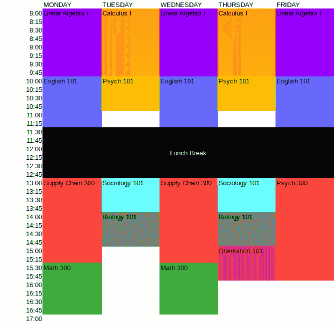

SPOIILER ALERT: Here is the schedule our algorithm will build by the end of this article

# 奠定基础

好吧，不知所措了吗？有很多规则，要探索的排列数量是天文数字。但是一旦我向您展示了这种技术，它将有望非常直接地实现。

关于这个问题，你应该注意的第一件事是每件事是如何被分成“15 分钟”块的。这不是一个连续的/线性的问题，而是一个离散的问题，这就是现实世界中大多数计划是如何建立的。假设我们已经为整个周创建了一个时间表，分成 15 分钟的时间段，如下所示:

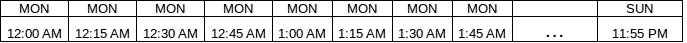

请注意，“…”只是一个折叠的占位符，因为我们没有足够的空间来显示一周的 672 个数据块(672 = 7 天* 24 小时*一小时 4 个数据块)。

现在让我们扩展这个概念，把类作为时间轴的轴。每个交叉点/单元是一个可以是 1 或 0 的`Slot`。这个二进制变量将被求解，以指示`Slot`是否是该类第一次循环的开始时间。我们现在将它们都设置为 0，如下所示:

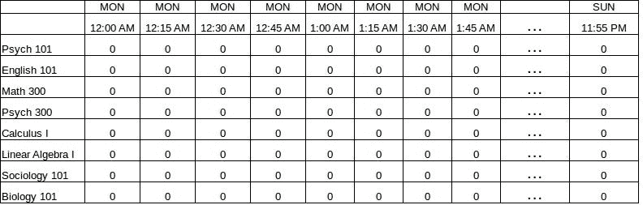

A grid of our decision variables

这个网格对于从逻辑上思考这个问题至关重要。这将是一个有效的视觉辅助，因为我们的约束将集中在网格内的区域。

我将使用 [Kotlin](http://kotlinlang.org/) 作为编程语言，它与 Java 库配合得非常好，但比 Java 更易读、更简洁。我们将利用 Java 8 强大的`LocalDate` / `LocalTime` API 来简化我们的日历工作。

> 如果你不熟悉 Kotlin，它基本上是一个类似 Swift 的“dumbed down Scala”，大量用于 Android 开发。它本质上利用了 Java、C#、Scala、Groovy 和 Python 的实用特性来创建一种实用的工业语言。它还可以编译成 Java 字节码，并与 Java 库无缝互操作。

让我们像这样设置我们的基本规则参数:

```
**import** java.time.LocalDate
**import** java.time.LocalTime *// Any Monday through Friday date range will work* **val** *operatingDates* = 
    LocalDate.of(2017,10,16)..LocalDate.of(2017,10,20)**val** *operatingDay* = LocalTime.of(8,0)..LocalTime.of(17,0)**val** *breaks* = *listOf*<ClosedRange<LocalTime>>(
        LocalTime.of(11,30)..LocalTime.of(12,59)
)
```

接下来让我们声明`ScheduledClass`,它保存了我们想要调度的给定类的属性。

```
**data class** ScheduledClass(**val id**: Int,
                          **val name**: String,
                          **val hoursLength**: Double,
                          **val recurrences**: Int,
                          **val recurrenceGapDays**: Int = 2)
```

`recurrenceGapDays`是每次重复的开始时间之间所需的最少天数。例如，以`Psych 100`为例，它需要 2 次重复，默认间隔为 2 天。如果第一堂课是在星期一上午 8 点，那么第二堂课必须安排在两天(48 小时)后，也就是星期三上午 8 点。我们将把这个值默认为`2`，这将使每个会话的开始间隔 48 小时。

接下来我们可以在一个`List`中声明所有的`ScheduledClass`实例:

```
**val** *scheduledClasses* = *listOf*(
        ScheduledClass(
            id=1, 
            name=**"Psych 101"**,
            hoursLength=1.0,
            recurrences=2
        ),
        ScheduledClass(
            id=2, 
            name=**"English 101"**,  
            hoursLength=1.5, 
            recurrences=3
        ),
        ScheduledClass(
            id=3, 
            name=**"Math 300"**, 
            hoursLength=1.5, 
            recurrences=2
        ),
        ScheduledClass(
            id=4, 
            name=**"Psych 300"**,  
            hoursLength=3.0, 
            recurrences=1
        ),
        ScheduledClass(
            id=5, 
            name=**"Calculus I"**, 
            hoursLength=2.0, 
            recurrences=2
        ),
        ScheduledClass(
            id=6, 
            name=**"Linear Algebra I"**, 
            hoursLength=2.0, 
            recurrences=3
        ),
        ScheduledClass(
            id=7, 
            name=**"Sociology 101"**, 
            hoursLength=1.0, 
            recurrences=2
        ),
        ScheduledClass(
            id=8, 
            name=**"Biology 101"**, 
            hoursLength=1.0, 
            recurrences=2
        ),
        ScheduledClass(
            id=9, 
            name=**"Supply Chain 300"**, 
            hoursLength=2.5, 
            recurrences=2
        ),
        ScheduledClass(
            id=10, 
            name=**"Orientation 101"**,
            hoursLength=1.0, 
            recurrences=1
        )
    )
```

`Block`类将代表每个离散的 15 分钟时间段。我们将使用一个 Kotlin `Sequence`结合 Java 8 的`LocalDate/LocalTime` API 来为整个规划窗口生成所有块。我们还将创建几个助手属性来提取`timeRange`以及它是否是`withinOperatingDay`。`withinOperatingDay`属性将确定此`Block`是否在可安排的时间窗口内(例如，未安排在午夜或休息时段内)。

```
*/** A discrete, 15-minute chunk of time a class can be scheduled on */* **data class** Block(**val range**: ClosedRange<LocalDateTime>) { **val timeRange** =     
       **range**.**start**.toLocalTime()..**range**.**endInclusive**.toLocalTime()*/** indicates if this block is in operating day/break
    constraints */* **val withinOperatingDay get**() =  
        *breaks*.*all* **{ timeRange**.**start !in it }** &&
            **timeRange**.**start in** *operatingDay* &&
            **timeRange**.**endInclusive in** *operatingDay* *// manage instances* **companion object** { */* 
        All operating blocks for the entire week, broken up in 15
        minute increments.
        Lazily initialize to prevent circular construction issues 
       */* **val all by** *lazy* **{***generateSequence*(*operatingDates*.**start**.atStartOfDay()){
                dt **->** dt.plusMinutes(15)
                  .*takeIf* **{ it**.plusMinutes(15) <= 
                       *operatingDates*.**endInclusive**.atTime(23,59) 
                   **}
            }**.*map* **{** Block(**it**..**it**.plusMinutes(15)) **}** .*toList*()
        **}** */* only returns blocks within the operating times */* **val allInOperatingDay by** *lazy* **{
            all**.*filter* **{ it**.**withinOperatingDay }
        }** }
}
```

注意我将使用一个`[lazy { }](https://kotlinlang.org/docs/reference/delegated-properties.html#lazy)` [委托](https://kotlinlang.org/docs/reference/delegated-properties.html#lazy)为每个域对象初始化项目。这是为了防止循环构造问题，方法是在第一次调用这些项之前不构造它们。

最后，`Slot`类将代表一个`ScheduledClass`和一个`Block`之间的交集/单元。我们将通过将每个`ScheduledClass`与每个`Block`配对来生成它们。我们还将创建一个未赋值的`selected`二进制变量，它将是`null`，直到我们给它赋值为`1`或`0`。

```
**data class** Slot(**val block**: Block, 
                **val scheduledClass**: ScheduledClass) { **var selected**: Int? = **null** **companion object** { **val all by** *lazy* **{** Block.**all**.*asSequence*().*flatMap* **{** b **->** ScheduledClass.**all**.*asSequence*().*map* **{** Slot(b,**it**)**}
            }**.*toList*()
        **}** }
}
```

# 建模约束

在我进入模型的实现之前，我应该强调你可以使用混合整数解算器库来建模带有线性函数的约束，并让它求解`selected`变量。在 Python 中你可以使用[纸浆](https://github.com/coin-or/pulp)或者 [PyOmo](https://www.pyomo.org/) 。在 Java 平台上，您可以使用 [ojAlgo](https://github.com/optimatika/ojAlgo) 或 [OptaPlanner](https://www.optaplanner.org/) 。对于许多这样的库，我还可以加入一个$10K [IBM CPLEX 许可证](https://www.ibm.com/analytics/data-science/prescriptive-analytics/cplex-optimizer)，它可以更快地解决更大、更复杂的问题。

但是我将展示如何从头开始构建一个解决方案。在没有任何库的情况下进行优化的好处是，您可以对启发式算法(搜索策略)进行大量控制，并根据您的领域来表达模型。

在我们开始求解每个`Slot`中的`selected`变量之前，让我们做一些思维实验来理解我们的约束。我可能浪费了 50 张纸来做这个模型，但我发现了一些有用的东西。它有点抽象，但是对于这个特殊的问题来说是强大而有效的。

同样，我们将为每个`Slot`分配一个`1`或`0` *来指示第一节课重复*的开始。这是我们的求解器可能会想到的一个可能的迭代，其中第一节心理学 101 课在周一上午 9:00 开始，社会学 101 课在周一上午 9:15 开始。这是我们的地图:

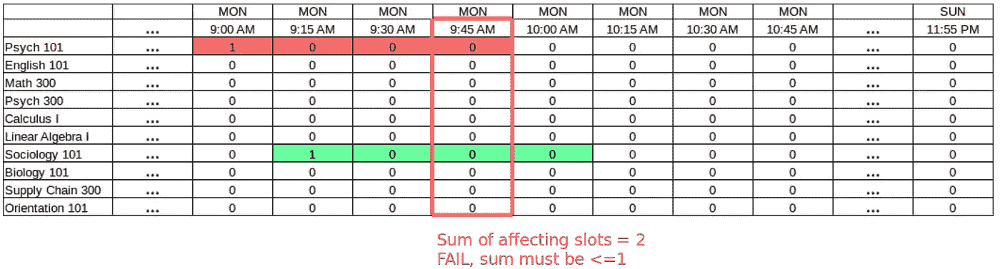

仔细研究这个场景。你明白为什么这是一个无效的案例了吗？在周一上午 9:45，心理学 101(需要四个街区)和社会学 101(也需要四个街区)相互冲突。视觉上，你也许能看到冲突。但是怎么形容呢？

“影响”上午 9:45 时间段的计划班时段的总和必须小于或等于`1`。总和`1`实际上意味着只有一个类占用那个块，而`0`意味着根本没有类占用那个块(也有效)。以下情况也是失败，因为“影响”槽的总和是`2`。

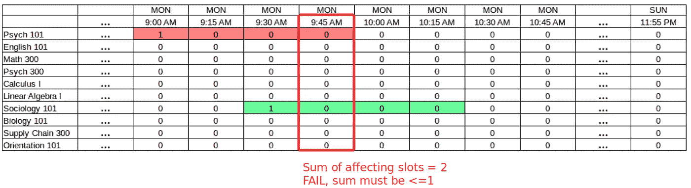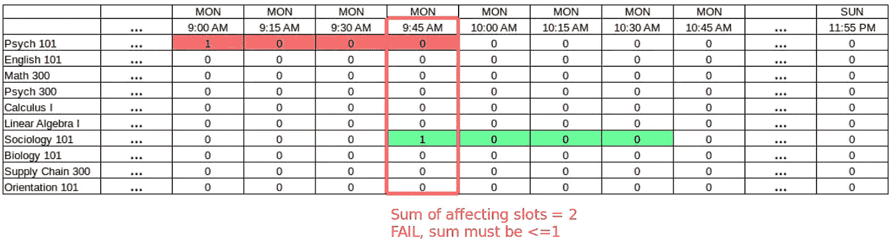

如果我们将社会学 101 移到上午 10:00，那么总和将是`1`，一切都好(如下所示):

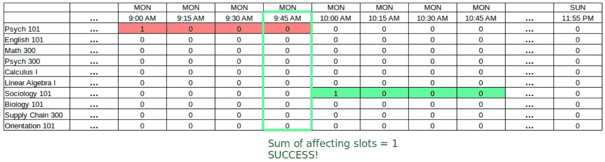

我们需要将这个逻辑应用于整个时间线上的每个块的*，查询占据这个块的每个类的更早的槽，并规定它们的总和必须不大于 1。这个抽象但强大的想法实现了我们在约束方面需要的一切。下面是实际情况，所有影响上午 9:45 的时间段都用蓝色突出显示。所有这些蓝色时间段的总和必须不超过 1，这样上午 9:45 的时间段才不会被重复预订。*

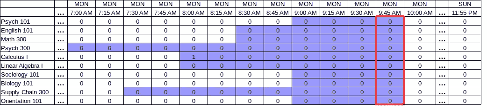

这甚至可以解释复发的原因。毕竟，我们在一个槽中放了一个`1`来表示第一个类的候选开始时间*。如果我们正在查看星期五上午 9:45 的时间段，我们将查询一周中会导致星期五上午 9:45 的时间段被占用的时间段(一直到星期一)。下面是一个大视野。这些蓝色槽的总和必须不大于 1。*


好的，你开始头晕了吗？这个模型的强大之处不在于数学，而在于每个块能够查询影响它的槽，并要求它们的总和不超过 1。这是艰苦工作发生的地方。另一个好处是，我们不需要创建任何新的变量来模拟约束，并且可以用一系列简单的求和约束来约束现有的槽二元变量。

# 提取重复和受影响的插槽

为了执行影响给定块的槽的想法，我们首先需要做的是为给定块上的每个类识别这些槽，并且说它们的总和必须是“1”。这个代码库的明星是针对给定的`List`项的 Kotlin 函数:

```
**enum class** RecurrenceMode { **PARTIAL_ONLY**, **FULL_ONLY**, **ALL** }**fun** List<T>.affectedWindows(slotsNeeded: Int, 
       gap: Int, 
       recurrences: Int,
       mode: RecurrenceMode = RecurrenceMode.**FULL_ONLY**) =(0..**size**).*asSequence*().*map* **{** i **->** (1..recurrences).*asSequence*().*map* **{** (**it** - 1) * gap **}** .*filter* **{ it** + i < **size }** .*map* **{** r **->** subList(i + r, 
                           (i + r + slotsNeeded)
                             .*let* **{ if** (**it** > **size**) **size else it }**)
                    **}** .*toList*()
        **}**.*filter* **{
            when** (mode) {
                RecurrenceMode.**ALL** -> **true**RecurrenceMode.**FULL_ONLY** -> 
                     **it**.**size** == recurrences && 
                         **it**.*all* **{ it**.**size** == slotsNeeded **}**RecurrenceMode.**PARTIAL_ONLY** -> 
                     **it**.**size** < recurrences || 
                         **it**.*any* **{ it**.**size** < slotsNeeded **}** }
        **}**
```

我将让您自己深入研究这个函数的实现。现在，更有效的方法是覆盖它所完成的任务，即获取任何`List<Slot>`并执行一个专门的窗口操作，在每次循环之间注入一个`gap`。这将返回一个列表列表，`List<List<T>>`，其中每个列表都是一个循环，列表中的元素是受影响的元素。注意`gap`是窗口每次开始之间的元素数量。

为了了解这种模式，我们可以将整数 1 到 20 分成 4 个一组，每个循环开始之间的间隔为 6，并且有 3 个循环。我们将只考虑完整的而不是部分的组，所以`mode`将被设置为`RecurrenceMode.FULL_ONLY`。

```
**fun** main(args: Array<String>) {(1..20).*toList*()
            .*affectedWindows*(slotsNeeded = 4,
                    gap = 6,
                    recurrences = 3,
                    mode = RecurrenceMode.**FULL_ONLY** )
            .*forEach* **{** *println*(**it**) **}** }
```

**输出:**

```
[[1, 2, 3, 4], [7, 8, 9, 10], [13, 14, 15, 16]]
[[2, 3, 4, 5], [8, 9, 10, 11], [14, 15, 16, 17]]
[[3, 4, 5, 6], [9, 10, 11, 12], [15, 16, 17, 18]]
[[4, 5, 6, 7], [10, 11, 12, 13], [16, 17, 18, 19]]
[[5, 6, 7, 8], [11, 12, 13, 14], [17, 18, 19, 20]]
```

如果我们将`mode`设置为`RecurrenceMode.PARTIAL_ONLY`，它将给出无法产生长度为`4`的`3`循环的“破碎”组。这将有助于稍后识别必须为 0 的槽，因为我们无法获得给定块所需的所有槽(例如，它们溢出超过 5pm 限制)。

```
**fun** main(args: Array<String>) {
    (1..20).*toList*()
            .*affectedWindows*(slotsNeeded = 4,
                    gap = 6,
                    recurrences = 3,
                    mode = RecurrenceMode.**PARTIAL_ONLY** )
            .*forEach* **{** *println*(**it**) **}** }
```

**输出:**

```
[[6, 7, 8, 9], [12, 13, 14, 15], [18, 19, 20]]
[[7, 8, 9, 10], [13, 14, 15, 16], [19, 20]]
[[8, 9, 10, 11], [14, 15, 16, 17], [20]]
[[9, 10, 11, 12], [15, 16, 17, 18]]
[[10, 11, 12, 13], [16, 17, 18, 19]]
[[11, 12, 13, 14], [17, 18, 19, 20]]
[[12, 13, 14, 15], [18, 19, 20]]
[[13, 14, 15, 16], [19, 20]]
[[14, 15, 16, 17], [20]]
[[15, 16, 17, 18]]
[[16, 17, 18, 19]]
[[17, 18, 19, 20]]
[[18, 19, 20]]
[[19, 20]]
[[20]]
```

我们可以使用这个`affectedWindows()`函数来处理课程重复，并在周一到周五的时间规划窗口内生成所有可能的排列。然后，我们可以使用它来查找影响特定块的特定类的槽。我们还将“清除”属于损坏组的插槽。例如，在下午 4:15 开始生物 101 将导致它溢出超过下午 5:00。因此，这个槽应该被固定为“0 ”,甚至在我们稍后进行的搜索中不被考虑。

```
*/** A discrete, 15-minute chunk of time a class can be scheduled on */* **data class** Block(**val range**: ClosedRange<LocalDateTime>) { **val timeRange** =     
       **range**.**start**.toLocalTime()..**range**.**endInclusive**.toLocalTime()*/** indicates if this block is zeroed due to operating 
         day/break constraints */* **val withinOperatingDay get**() =  
        *breaks*.*all* **{ timeRange**.**start !in it }** &&
            **timeRange**.**start in** *operatingDay* &&
            **timeRange**.**endInclusive in** *operatingDay***val affectingSlots by** *lazy* **{** ScheduledClass.**all**.*asSequence*()
                .*flatMap* **{
                    it**.affectingSlotsFor(**this**).*asSequence*()
                **}**.*toSet*()
    **}** **companion object** { */* 
        All operating blocks for the entire week, broken up in 15
        minute increments.
        Lazily initialize to prevent circular construction issues 
       */* **val all by** *lazy* **{***generateSequence*(*operatingDates*.**start**.atStartOfDay()){
                dt **->** dt.plusMinutes(15)
                  .*takeIf* **{ it**.plusMinutes(15) <= 
                       *operatingDates*.**endInclusive**.atTime(23,59) 
                   **}
             }**.*map* **{** Block(**it**..**it**.plusMinutes(15)) **}** .*toList*()
        **}** */* only returns blocks within the operating times */* **val allInOperatingDay by** *lazy* **{
            all**.*filter* **{ it**.**withinOperatingDay }
        }** }
} **data class** ScheduledClass(**val id**: Int,
                          **val name**: String,
                          **val hoursLength**: Double,
                          **val recurrences**: Int,
                          **val recurrenceGapDays**: Int = 2) { */** the # of slots between each recurrence */* **val gap** = **recurrenceGapDays** * 24 * 4 */** the # of slots needed for a given occurrence */* **val slotsNeededPerSession** = (**hoursLength** * 4).toInt() */** yields slots for this given scheduled class */* **val slots by** *lazy* **{** Slot.**all**.*asSequence*()
             .*filter* **{ it**.**scheduledClass** == **this }** .*toList*()
    **}***/** yields slot groups for this scheduled class */* **val recurrenceSlots by** *lazy* **{
        slots**.*affectedWindows*(slotsNeeded = **slotsNeededPerSession**,
                gap = **gap**,
                recurrences = **recurrences**,
                mode = RecurrenceMode.**FULL_ONLY** ).*toList*()
    **}***/** yields slots that affect the given block for this  
         scheduled class */* **fun** affectingSlotsFor(block: Block) = 
          **recurrenceSlots**.*asSequence*()
            .*filter* **{** blk **->** blk.*flatMap* **{ it }** .*any* **{ it**.**block** == block **} 
            }** .*map* **{ it**.*first*().*first*() **}***/** These slots should be fixed to zero **/* **val slotsFixedToZero by** *lazy* **{** *// broken recurrences* **slots**.*affectedWindows*(slotsNeeded = **slotsNeededPerSession**,
                gap = **gap**,
                recurrences = **recurrences**,
                mode = RecurrenceMode.**PARTIAL_ONLY** ) .*flatMap* **{ it**.*asSequence*() **} //flatten the groups!** .*flatMap* **{ it**.*asSequence*() **}**.*plus*(
                    **recurrenceSlots**.*asSequence*()
                            .*flatMap* **{ it**.*asSequence*() **}** .*filter* **{** slot **->** slot.*any* **{** !**it**.**block**.**withinOperatingDay 
                                 }
                            }** .*map* **{ it**.*first*() **}** )
            .*distinct*()
            .*onEach* **{
                it**.**selected** = 0
            **}** .*toList*()
    **}***/**translates and returns the optimized start time of the class */* **val start get**() = 
        **slots**.*asSequence*()
             .*filter* **{ it**.**selected** == 1 **}** .*map* **{ it**.**block**.**dateTimeRange**.**start }** .*min*()!! */** translates and returns the optimized end time of the class */* **val end get**() = **start**.plusMinutes(
         (**hoursLength** * 60.0).toLong()
    ) */** returns the DayOfWeeks where recurrences take place */* **val daysOfWeek get**() = (0..(**recurrences**-1)).*asSequence*()
         .*map* **{ 
           start**.*dayOfWeek*.plus(**it**.toLong() * **recurrenceGapDays**) 
         **}**.*sorted*() **companion object** {
        **val all by** *lazy* **{** *scheduledClasses* **}** }
}
```

# 求解变量

现在我们已经建立了一个有效的基础设施来查询影响给定块的槽，我们现在准备求解符合我们的约束的变量。希望你对编写递归算法相当熟悉。如果没有，这里有一个练习的机会！

但是首先我要用一个更简单明了的例子来证明这个想法:数独。在我回到调度问题之前，它将演示如何使用分支算法求解变量。

## 想想数独游戏

但愿数独是一个熟悉的益智游戏。您将看到一个 9x9 的单元格网格，其中一些单元格已经有了可能的数字 1-9。您需要找到其余空白单元格的值，以便每一行、每一列和 3×3 的正方形都有数字 1-9。

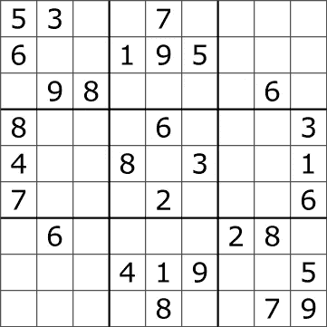

A typical Sudoku puzzle

那么如何求解空白值呢？强行搜索效率会非常低，所以我们需要一个更聪明的搜索策略。

请允许我向您介绍树搜索。感觉类似于决策树，但是我们处理的是离散变量(整数)而不是连续变量(小数)。

首先获取单元格，并在列表中根据它们拥有的候选值的数量对它们进行排序。例如，单元格[4，4]只能是一个值 5，所以它先出现，而单元格[2，6]应该是最后一个，因为它有 6 个可能的值。然后创建一个函数，作为分支算法递归地探索每个可能的值。以下是这种递归算法如何探索可能值的视觉效果:

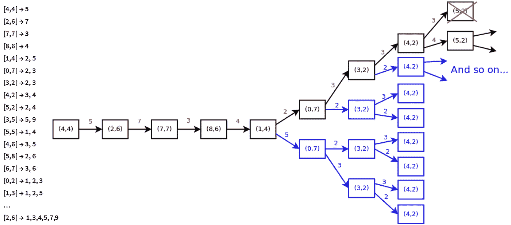

With this sorted list, create a recursive tree that explores each Sudoku cell and its possible values.

请注意我们是如何首先从最受约束的单元格开始的，这大大缩小了我们的搜索空间。搜索策略的这种用法被称为“启发式”。当一个给定的分支被认为不可行时(违反了数独规则)，该分支立即终止并转移到下一个替代分支。上图中，单元格[4，2]不能被赋值为“3”，因为单元格[3，2]已经被赋值为“3”。这意味着“3”已经存在于列 2 中，所以没有理由继续搜索那个分支，我们*修剪*它。

当我们找到一个探索了所有 91 个值的分支，并且没有违反任何约束时，我们就解决了我们的数独游戏！然后，我们可以将分支值折叠回游戏板，如下所示:


We have solved our Sudoku!

如果你想看数独解算器的源代码，你可以在这里找到。[这部分代码](https://github.com/thomasnield/kotlin-sudoku-solver/blob/master/src/main/kotlin/Solvers.kt#L12-L103)是递归树发生的地方。

[](https://github.com/thomasnield/kotlin-sudoku-solver) [## 托马斯尼尔德/科特林数独求解器

### 一个用 Kotlin 写的 suduko 游戏解算器。有助于托马斯尼尔德/科特林数独解决方案的开发，通过创建一个…

github.com](https://github.com/thomasnield/kotlin-sudoku-solver) 

## 回到调度问题

那么数独和日程安排问题有什么关系呢？嗯，实际上很多！我们可以应用这种技术，通过使用搜索树来解决 1 或 0 值的槽。在每一个被探索的分支上，你可以像数独游戏一样检查你的约束是否仍然被满足，确保课程没有被安排在已经被占用的时间段。

从概念上讲，这是我们的递归搜索树的样子:

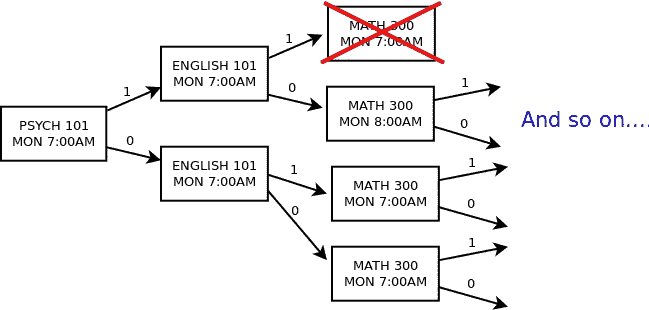

下面是我如何从零开始实现这个野蛮的算法(请原谅我的代码格式或[只看源代码](https://github.com/thomasnield/optimized-scheduling-demo/blob/master/kotlin_from_scratch_solution/src/main/kotlin/BranchingAlgorithm.kt))。请注意我是如何使用`BranchNode`来表示正在搜索的分支的顶端的，我可以在分支上向后遍历，以评估到目前为止所做的决策是否与我当前的决策不冲突。然后我可以创建一个`traverse()`函数来递归地探索整个树，直到找到解决方案。

```
**import** java.time.DayOfWeek**class** BranchNode(**val selectedValue**: Int,
                 restOfTree: List<Slot>,
                 **val previous**: BranchNode? = **null**) { **val slot** = restOfTree.*first*() **val traverseBackwards** =  *generateSequence*(**this**) **{ 
        it**.**previous 
    }**.*toList*() *// calculate remaining slots and prune where constraint propagates* **val remainingSlots by** *lazy* **{
        if** (**selectedValue** == 0)
            restOfTree.*minus*(**slot**)
        **else** { *// if this slot is occupied, affected slots can be pruned* **val** affectedSlotsPropogated = Block.**allInOperatingDay** .*asSequence*().*filter* **{
                    slot in it**.**affectingSlots
                }**.*flatMap* **{ it**.**affectingSlots**.*asSequence*() **}** .*filter* **{ it**.**selected** == **null }** .*toSet*() restOfTree.*asSequence*()
                    .*filter* **{
                        it**.**scheduledClass** != **slot**.**scheduledClass** && **it !in** affectedSlotsPropogated
                    **}**.*toList*()
        }
    **}** **val scheduleMet get**() = **traverseBackwards** .*asSequence*()
            .*filter* **{ it**.**selectedValue** == 1 **}** .*map* **{ it**.**slot**.**scheduledClass }** .*distinct*()
            .*count*() == ScheduledClass.**all**.*count*() **val isContinuable get**() = !**scheduleMet** && 
         **remainingSlots**.*count*() > 0**val isSolution get**() = **scheduleMet** **fun** applySolution() {
        **slot**.**selected** = **selectedValue** }
}**fun** executeBranchingSearch() { *// pre-constraints* ScheduledClass.**all**.*flatMap* **{ it**.**slotsFixedToZero }** .*forEach* **{ it**.**selected** = 0 **}***// Encourage most "constrained" slots to be searched first* **val** sortedSlots = Slot.**all**.*asSequence*()
        .*filter* **{ it**.**selected** == **null }**.*sortedWith*(
            *compareBy*(
                    **{** *// prioritize slots dealing with recurrences* **val** dow = **it**.**block**.**range**.**start**.*dayOfWeek* **when** {
                            dow == DayOfWeek.**MONDAY** && 
                              **it**.**scheduledClass**.**recurrences** == 3 
                                 -> -1000dow != DayOfWeek.**MONDAY** && 
                               **it**.**scheduledClass**.**recurrences** == 3 
                                 -> 1000dow **in** DayOfWeek.**MONDAY**..DayOfWeek.**WEDNESDAY** && **it**.**scheduledClass**.**recurrences** == 2 
                                -> -500dow **!in** DayOfWeek.**MONDAY**..DayOfWeek.**WEDNESDAY** && **it**.**scheduledClass**.**recurrences** == 2 
                                -> 500dow **in** DayOfWeek.**THURSDAY**..DayOfWeek.**FRIDAY** && 
                              **it**.**scheduledClass**.**recurrences** == 1 
                                -> -300dow **!in** DayOfWeek.**THURSDAY**..DayOfWeek.**FRIDAY** && 
                              **it**.**scheduledClass**.**recurrences** == 1 -
                                 > 300**else** -> 0
                        }
                    **}**,*// make search start at beginning of week
*                    **{ it**.**block**.**range**.**start }**,*// followed by class length* **{**-**it**.**scheduledClass**.**slotsNeededPerSession } **)
    ).*toList*() *// this is a recursive function for exploring nodes 
    // in a branch-and-bound tree* **fun** traverse(currentBranch: BranchNode? = **null**): BranchNode? { **if** (currentBranch != **null** && 
            currentBranch.**remainingSlots**.isEmpty()) {
            **return** currentBranch
        } **for** (candidateValue **in** intArrayOf(1,0)) {
            **val** nextBranch = BranchNode(candidateValue, 
                 currentBranch?.remainingSlots?: sortedSlots,
                currentBranch
            ) **if** (nextBranch.isSolution)
                **return** nextBranch **if** (nextBranch.isContinuable) {
                **val** terminalBranch = traverse(nextBranch)
                **if** (terminalBranch?.isSolution == **true**) {
                    **return** terminalBranch
                }
            }
        }
        **return null** } *// start with the first Slot and set it as the seed
    // recursively traverse from the seed and get a solution* **val** solution = traverse() solution?.traverseBackwards?.forEach **{** it.applySolution() **}**?: **throw** Exception(**"Infeasible"**)
}**import** java.time.LocalDate
**import** java.time.LocalTime *// Any Monday through Friday date range will work* **val** *operatingDates* = 
    LocalDate.of(2017,10,16)..LocalDate.of(2017,10,20)**val** *operatingDay* = LocalTime.of(8,0)..LocalTime.of(17,0)**val** *breaks* = *listOf*<ClosedRange<LocalTime>>(
        LocalTime.of(11,30)..LocalTime.of(12,59)
)
```

我还使用启发式搜索“最受约束”的位置，这意味着它们更有可能被分配“1”。例如，3-recurrence 类必须安排在星期一，所以我们应该首先评估它在星期一的时间段。启发式算法还会优先搜索高重现类(比如 3 和 2 ),这样我们就可以完成搜索。毕竟高递归类没有太大的灵活性，应该先评估。

请注意，我们还积极地“提前”删除我们不再有理由搜索的未探索的值。例如，如果我的分支刚刚为生物 101 的 9:30AM 时间段分配了“1 ”,我应该为该 9:30AM 时间段和生物 101 提前修剪所有时间段，因为这两个时间段都已被该分支占用。

现在我剩下要做的就是调用这个递归函数并打印结果！

```
**fun** main(args: Array<String>) { *executeBranchingSearch*()ScheduledClass.**all**.*sortedBy* **{ it**.**start }** .*forEach* **{** *println*(**"${it**.**name}-   
              ${it**.**daysOfWeek**.*joinToString*(**"/"**)**} 
              ${it**.**start**.toLocalTime()**}-${it**.**end**.toLocalTime()**}"**)
         **}**
}
```

如果你像我一样设置你的试探法和参数，下面是它生成的时间表:

```
Linear Algebra I- MONDAY/WEDNESDAY/FRIDAY 08:00-10:00
English 101- MONDAY/WEDNESDAY/FRIDAY 10:00-11:30
Supply Chain 300- MONDAY/WEDNESDAY 13:00-15:30
Math 300- MONDAY/WEDNESDAY 15:30-17:00
Calculus I- TUESDAY/THURSDAY 08:00-10:00
Psych 101- TUESDAY/THURSDAY 10:00-11:00
Sociology 101- TUESDAY/THURSDAY 13:00-14:00
Biology 101- TUESDAY/THURSDAY 14:00-15:00
Orientation 101- THURSDAY 15:00-16:00
Psych 300- FRIDAY 13:00-16:00
```

验证输出。不错吧？如果我们要直观地绘制出来，时间表应该是这样的:


很酷，不是吗？除了调度员工和其他资源，我们还可以使用完全相同的方法。它还可以用于任何需要找到可行或最优值以找到更好的解决方案的离散模型。这在最意想不到的情况下非常方便。我不能分享细节，但我有一个项目，似乎有预测/回归的性质。当我放弃了传统的连续回归模型，并离散地使用树搜索技术时，它非常有效，并且比任何[回归库](https://facebook.github.io/prophet/)更好地解决了我的具体问题。

在我结束之前，如果您想要针对多个教室进行调度，只需针对时间段、班级和房间设置每个二进制`Slot`变量，使其成为三维的，如下所示。然后，您可以创建约束，以确保任何房间都不会被占用两次。否则，建模工作是一样的。

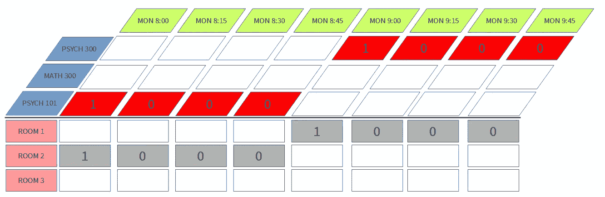

A 3-dimensional model that defines variables against multiple rooms

希望你们觉得这很有趣并且有用。我也希望这能让你看到其他已经存在了几十年却很少曝光的“人工智能”模型。如果你想了解更多，一定要看看 Coursera 上的[离散优化课程，从运筹学领域了解更多的秘密。](https://www.coursera.org/learn/discrete-optimization/)

**源代码:**

[](https://github.com/thomasnield/optimized-scheduling-demo/tree/master/kotlin_from_scratch_solution) [## 托马斯尼尔德/优化调度演示

### 创建教室时间表的分支定界求解器—Thomas nield/优化时间表演示

github.com](https://github.com/thomasnield/optimized-scheduling-demo/tree/master/kotlin_from_scratch_solution)