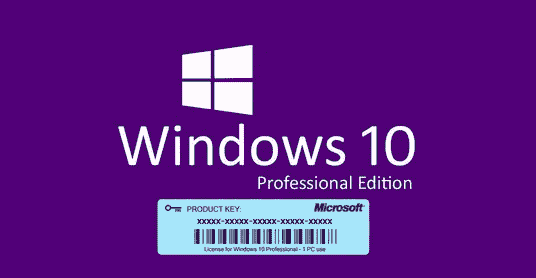

# 如何以低于 12 美元的价格获得 Windows 10 PRO OEM 密钥

> 原文：<https://medium.com/hackernoon/summer-sale-windows-10-pro-oem-keys-under-12-a0ed2c77437a>

多年来， [Windows 10](https://hackernoon.com/tagged/windows-10) 一直是运行 Windows 平台的笔记本电脑和手机的标准。虽然许多人更喜欢吹捧 Windows 7 和 8 等软件的优势，但 Windows 10 以一种真正革命性的方式提供了两种系统的融合。

因此，为了结束这场辩论，下面是 Windows 10 是迄今为止最完整的操作系统版本的几个原因。

**Windows 10 大优惠**

Windows 10 最突出的意义在于，在电脑的整个生命周期内，它都是免费的。显然，微软认为让用户升级操作系统的最好方法是免费。不用说，这个策略非常有效。

HN20 Win Pro OEM 关键销售价格因您的购买地点而异，但事实是，无论您认为自己支付了多少钱，如果您必须不断更新，与 Windows 10 的成本相比，它仍然很可能是微不足道的。

[使用代码 HN20 后，Win Pro Oem 密钥销售价格](https://www.urcdkey.com/microsoft-windows-10-pro-oem-cd-key-global_1966-20.html?hackernoon)11.74 美元

就目前情况而言，一些服务提供优惠券代码让你以更低的价格获得 Windows 10，你也可以获得服务的促销活动，例如 Office Pro 16 关键销售价格的折扣。

[Office Pro 16 使用代码 HN20](https://www.urcdkey.com/office2016-professional-plus-cd-key-global_1980-20.html?hackernoon) 后的关键销售价格为 31.7 美元

**面向所有设备的单一内核**

微软一直致力于允许单一操作系统在任何地方运行，Windows 10 几乎就是这个梦想的实现。如果你有 Windows 10 的正版版本，那么它可以在平板电脑、手机、游戏机和你的电脑上运行。微软甚至发布了一个在物联网上运行的版本。

由于这种无缝集成，你可以放心，你的 Windows 10 在任何地方看起来都差不多，作为一名开发人员，你将能够开发适用于所有设备的应用程序。

Windows 7 因其稳定性而被许多人视为开发者最喜欢的平台，但皇冠上的明珠现在已经夺走了这一宝座。

**Windows 即服务**

从本质上来说，Windows 即服务是去除版本控制概念并定期发布新版本的想法。Windows 10 不是一个新版本，而是标志着微软只发布更新的承诺。

因此，微软将不再寻找重要的发布服务包，而是设计更新，并在经过测试后尽快发布补丁。所以，Windows 现在处于一个持续的进化模式中。

这也意味着一旦你安装完 Windows 10，你的设备就会一直保持最新。

**开始菜单的返回**

Windows 10 几乎结合了 Windows 7 和 Windows 8.1 中所有的[优秀功能](https://www.pcmag.com/feature/364187/windows-10-october-2018-update-the-best-new-features)。因此，虽然开始屏幕仍然存在，但有一些调整。在 Windows 10 中，Windows 7 中的开始菜单与 Windows 8.1 中的开始屏幕相结合。

因此，你会在左侧看到 Windows 7 的元素，包括设备上最常访问的应用程序列表，以及控制面板和电脑内存本身等位置。

您还可以访问电源选项，也可以查看设备上所有可用的应用程序。

然后，在右边，你有 Windows 8 的元素。你的实时磁贴还在，它们在切换时会向你显示实时信息。您可以个性化这些磁贴并进行排列，也可以将其转换为全屏显示。