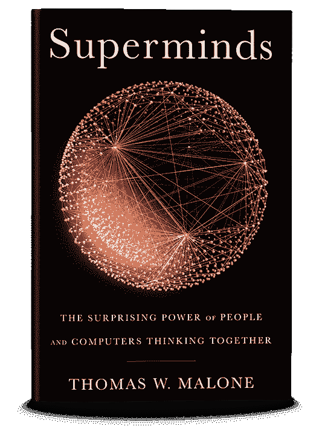
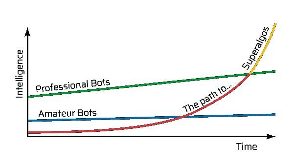

# Superalgos &交易奇点

> 原文：<https://medium.com/hackernoon/superalgos-part-one-the-trading-singularity-6f66f419982f>

*Image © GarryKillian, Shutterstock.*

在未来的某一天，一个能够胜过市场上所有其他实体的交易智能将会出现。无论是人类还是现在的算法都会被 Superalgos 超越。

路易斯·莫利纳&朱利安·莫利纳

人工智能是最近的热门话题。

[埃隆·马斯克仍然担心人工智能进步导致的](https://www.cnbc.com/2018/03/13/elon-musk-at-sxsw-a-i-is-more-dangerous-than-nuclear-weapons.html)[技术奇点](https://en.wikipedia.org/wiki/Technological_singularity)的风险。

你知道，当人工智能开始 24/7 不间断地自我改进，产生智能的指数增长时，在很短的时间内，会使地球上最聪明的人变得愚蠢。

这种担心当然是有道理的…

我们知道当一个物种变得如此聪明时会发生什么:其余的最终会在动物园，马戏团，作为食物生长或灭绝。幸运的可能会在优势物种无法触及的最后一点生存下来——一段时间。

技术奇点尚未发生的原因是因为机器非常擅长所谓的专业智能(控制特定的任务，例如下棋)，但在一般智能(以智能的方式同时联系多个不同专业主题的想法)方面仍然很差。

换句话说，机器可以在专业智能方面胜过人类，但在一般智能方面仍然输得很惨。

# 超级敏兹

*A supermind is a group of individuals acting together in ways that seem intelligent | Image © GarryKillian, Shutterstock.*

科学家发现，计算机和一起思考的人——作为一个群体——比单独的计算机更聪明。

麻省理工学院集体智能中心的托马斯·w·马龙教授和他的同事花了几年时间研究群体、机器以及群体和机器一起工作的集体智能。广泛的研究和结论总结在他的书里。

*The Superalgos project is framed around the perspective of Superminds and Collective Intelligence. | Image © Thomas W. Malone.*

一个关键的观点是，集体智慧是可以衡量的，有一些因素与一个群体的智慧相关。本质上，现有的科学为最大化一个群体的集体智慧提供了明确的指导方针。

从维基百科(Wikipedia)等集体项目的研究和实际经验证据中提炼出的另一个有价值的结论是，超连接性(hyperconnectivity)，即世界上任何地方的大量人能够以几乎零成本实时相互交流的能力，使大规模超级 mind 成为可能。

# 交易智能

“所有的交易都是赌博”…我第一次听到这句话是从我的朋友丹尼尔·杰弗里斯那里听到的，我相信你也听过。

不管你是否同意，事实是——像赌博一样——交易不仅仅是关于机会。这也是关于概率，博弈论，统计学，基本面和更多领域的知识，可以用来做出更好的交易决策。

今天的交易仍然是由人和机器共同完成的。

我的猜测是，在未来，将主要由机器来做这项工作，但正如对集体智能的研究所表明的那样，人类仍将躲在幕后与机器一起工作，各自专注于自己最擅长的领域:机器将使用专门的交易智能来执行实际交易，而人们将使用自己的一般智能来改进机器使用的算法。

在交易智能这一特定领域，类似奇点的事件有可能发生吗？

可能会出现比其他交易实体表现更好的超级交易实体吗？

让我们假设这两个问题的答案都是肯定的。

然后…

**是什么导致了超级 lgo 的出现？**

这个问题让 superalgos.org 团队夜不能寐。我们花了不到两年的时间在雷达下找到了答案，现在准备向更多的人敞开大门。

本文的其余部分展示了我们对 superalgos 崛起之路的愿景，并讲述了我们如何开始一步一步地构建我们对交易未来的愿景。

# 通往超级 lgos 的道路

这条路实际上是一长串需要解决的问题。如果我们能全部解决，超级 lgo 将会出现。然而，这份清单并不仅仅是技术问题的集合。

因为通用人工智能还是一个遥远的科技目标，superalgos 会从一群机器和人一起思考中产生。

我们认为最简单的部分是让*机器*一起思考。激励和协调大量*人*一起思考，让他们为人类和机器的超级智慧贡献智慧，这是一个更大的挑战。

# 智力的指数增长

目前市场上最先进的交易者既有人类交易者，也有算法交易者，也称为算法、机器人或交易机器人。

在某种光线下，算法可以分为业余和专业。业余爱好者是由爱好者创造出来的，而专业人士是由大大小小的公司培养出来的。

从定性的角度来看，我们也可以认为专业机器人是那些质量允许它们上市的机器人。

可以有把握地假设，一般的业余机器人并不十分聪明，其智力随着时间的推移而缓慢增长。业余机器人智能的提高受到参与机器人开发的个人或合作者小组能力的限制。

另一方面，一般的职业 bot 已经相当智能，而且智能增长速度更快。然而，智力的增长也是有限的，只是这一次的限制是由公司雇佣的人才设定的，这可能要大得多。

尽管如此，大多数公司在垂直隔离方案下工作，整个公司的人才子集在自己的筒仓中工作，有时是由于利润中心的划分。

*Image © Superalgos.org*

同样值得注意的是，除了可能使用开源代码的业余爱好者，专业人士不会分享他们的算法。相反，他们尽可能地保守秘密，因为他们认为市场是一个零和游戏。

没有一家公司希望其他公司知道自己的制胜法则，否则算法可能会失去优势。

为了让 superalgos 超越业余和专业算法，我们系统的智能需要比业内其他任何东西都快一个数量级。

只有这样，才可能在开始时智力很低，最终在合理的时间范围内超越业余和专业机器人。

公司的智慧受制于他们可以雇佣的人力资源的数量和质量。如果我们能激励越来越多的交易者、开发者、分析师、爱好者等，那会怎么样？，成为超级 mind 的一员，为集体贡献自己的聪明才智？

**一旦我们明白了这一点，不断增长的人群就成了这个系统中不可或缺的组成部分。**

我们开始设想一个有这样一群人参与的项目。

这个社区将如何组织？

什么样的机制可以用来将人们的智慧传递给项目的超级智慧？

我们从自然界的进化中找到了答案。

# 进化模型

*Image © Yurchanka-Siarhei , Shutterstock.*

我们观察大自然，开始玩一个小小的地图游戏…

业余机器人像虫子一样聪明，而专业机器人像鸟一样聪明。在这种情况下，该项目的目标是从单细胞生物的智能开始，变得和人类一样智能。

艰难的工作，对吧？

在生物生命中，细胞有包含基因的 DNA。在我们的模型中，机器人会有源代码、配置和参数。许多生物学家将 DNA 与计算机软件中的源代码进行比较，因此这种映射看起来相当简单…

细胞具有受化学和物理法则支配的生物生命。生命、繁殖和死亡的循环定义了进化，所以这让我们相信算法也应该有某种生命……也许是金融生命？

经济上的生存意味着什么？

公司有一种财务生活:他们有收入和支出；当他们没钱时，他们会破产，通常会死去。

公司是由人类创建的，靠资本支撑，并反过来向创造者支付红利。他们也是超级智慧者——一起工作的群体——因此，他们有智慧。它们受到人为法律的监管，这些法律赋予它们 T2 法人的地位。

我们认为，如果我们的算法有财务生命，我们应该期望它们有收入和支出。如果他们的钱用完了，他们就应该死去，因为这个系统有第一层自然选择。

收入需要与他们的交易业绩挂钩，这样表现最好的人才有更好的机会生存和繁衍。

必须有人来创造它们——人类群体——但在某个时间点上，它们应该变得自主，以便能够独立地过自己的财务生活。

自然界中的生物是由它们的父母创造出来的，迟早会自主，这推动着它们为自己的生存而斗争。这种生存斗争是进化的主要驱动力之一。

**事情开始呈现出可识别的形状，以至于我们开始称算法为金融生物*。***

*我们只需要找出管理金融生活的规则。*

*我们很清楚，这不会是人为的任意规则，因为管理不同生命形式的规则通常是由它们生活的环境定义的。*

*就金融生物和我们的进化模型而言，环境将是一个与市场相连的软件平台。*

*这让我们明白，自由市场法则将主宰金融生活。*

*市场将是不可预测的生态系统，金融生物将在其中尽最大努力繁荣，与环境互动，就像动物和植物与它们的生态系统互动一样。*

*早期金融生物的行为对市场几乎没有影响，就像植物或动物在特定的山脉、河流或草原生态系统中的行为一样。然而，随着智能和优势的增加，bot 在市场中的作用将变得越来越重要，就像地球上人类足迹的增长一样。*

*人类花了几百万年才走出生物生命的自然进化模式。*

*很明显，用自然进化来描绘我们的模型是不够的。我们需要一个允许快速进化的加速模型。*

# *叉赢家！*

*在那个阶段，我们已经明白，在自由市场法则支配的环境中，会有金融生物生存和死亡。最大的缺失是社区的角色。*

*是的，人是创造金融生命的人…但是为什么呢？*

*他们为什么要这么做？*

*人们投入时间和精力创造金融生物的动机是什么？*

*这群人会是什么样子？*

*在自然界中，每种生物都在竞争交配和食物。*

*在我们的模型中，对食物的竞争类似于市场中对资源的竞争。最优秀的金融人士将获得丰富的资源，这将有助于他们成长并成为主导，因为人群中的人们会愿意投入更多的时间来改善获胜的样本。*

*然而，在我们的模型中，只有占优势的物种才能交配这一进化的关键特征仍然不存在。*

*我们需要一种方法来确定哪些是最好的算法。*

*我们需要一种机制让成功的算法繁殖并把它们的基因传递给后代。*

*我们需要群众培育出最好的算法！*

*最重要的是，我们需要人群*想要*去做！*

*这就是我们如何想出在模型中引入算法交易竞赛的想法。*

*竞赛有多种内在的激励机制，能与不同类型的人产生共鸣。因为竞赛迎合了各种各样的人，所以它比其他活动吸引了更多的人，同时也促进了多样性。*

*我们为比赛的音乐和娱乐价值而竞争…*

*为了挑战…*

*为了名誉和荣耀，荣誉和骄傲…*

*衡量我们的技能…*

*对于社区的归属感…*

*或者干脆，赢！*

***我们的竞争动力是由我们的 DNA 决定的。尤其是好玩的时候！***

*竞争将是默认的机制，既可以确定谁是最好的金融人，也可以让社区参与进来。*

*在我们的脑海中，我们已经确定了赢家和社区想要培育机器人和竞争的动机。*

*模型中的下一个元素落在我们头上，就像想象之树上成熟的果实:*

***开源赢家的代码……分叉赢家！改进它们，重新比赛！嘣！***

*这就是最好的机器人如何将他们的基因传递给下一代！我们拿到了。*

*这就是群众的智慧如何以最有效的方式发挥作用！*

*这就是知识和新发现是如何瞬间传播的，以便社区中没有人被落下！*

*这就是每场比赛后公平竞争的方式，让整个社区都参与进来，并有公平的机会在下一场比赛中表现出色！*

*但最重要的是，这就是我们战胜自然、加速进化的方式！*

*我们不需要等待跨越数年的生物学寿命来测试新的特征，并希望每个个体的最佳特征最终会流行起来。*

*我们只是黑进去！*

*我们将竞争频率提高到最有效的水平，创造各种形式和规则的竞争，以促进多样性，加速整个交易空间的发展！*

*在发现这些解决方案后，我们知道我们有机会实现智能的快速增长，这是超级生命体出现的主要条件。*

# *ALGO 代币*

**

**Eat or die!**

*在文章的前面，我们提到了食物。*

*[人类学家现在推测](https://www.worldscientific.com/worldscibooks/10.1142/5769)当一小群狩猎采集者从中非迁移到今天的南非海岸，在一次冰河时期持续了四万年的严重干旱中幸存下来时，可能是富含脂肪酸的饮食将人类的智力推向了新的高度。*

*争夺食物在进化中起着关键作用。*

*在自然界中，能够给自己持续供应食物的个体变得强壮和具有统治地位，更有可能交配，从而更有可能将他们的基因传递给下一代，传递他们一生中学到的重要经验，这些经验一丝不苟地储存在他们的 DNA 中。*

*我们在密码行业的经验很快让我们明白，有收入和支出的自主机器人需要一个交易媒介。*

*ALGO 代币将是生态系统内的交换媒介，也将扮演金融生命可持续性所必需的稀缺资源的角色。*

***就像生物每天需要食物才能生存一样，金融生物也需要赚取 ALGO 才能生存。***

*ALGO 将是一个有上限的加密令牌(总供应量为 10 亿)，其价格将在加密市场上发现。*

*这一特征将构成金融生物圈中生命的又一个调节器。*

*如果金融生物的数量增加太多，食物将变得稀缺和昂贵，导致效率低下的机器人死亡，而让表现最好的机器人生存和繁荣。*

*另一方面，如果人口减少，食物会变得丰富，这就刺激了人口的再次增长。*

# *算法交易世界锦标赛*

**

**FIFA 2018 eWorld Cup Grand Final in London | Image © Getty Images**

*增加竞争的频率会增加新一代算法的诞生率。这肯定会有实际的限制，因为每分钟都进行一场比赛不会让观众有时间来改善获胜者的后代。*

*提高金融生物出生率的另一条途径是创造不同类型的竞争。毕竟，每个单独的交易机器人会专注于一个单一的策略，甚至可能使用一个特定的指标。*

*每种策略都可能有竞争。*

*当代集体智慧科学指出——很多时候——非专家能够做出比专家更好的预测。*

*所以我们提出的一个想法是向各种各样的人开放社区。对交易知之甚少的聪明人也能对超级智慧做出很大贡献。*

*此外，希望从社区的交易情报中受益的资产持有人也希望扮演一个角色。*

*也许甚至会有观众关注比赛！*

*沿着这些思路思考，一个奇怪的想法出现了…*

*扑克。*

*在我们的模型中，比赛将在受扑克启发的多层联盟系统中组织。在我们的情况下，锦标赛将被设计成推动大资本交易的演变。*

*人群会自发组织成团队，创造和训练交易机器人。这使得团队可以将各种各样的才能融合在一起。*

*球队可以选择参加小联盟或大联盟。这将有助于细分具有不同兴趣的人，并相应地定制他们的体验。例如，希望为了乐趣而竞争的人可能大部分时间都在小联盟中玩，具有游戏化的主题和流量，而具有专业取向的人则主要在更高的联盟中玩，用户体验面向专业交易者。*

*底层联盟将举办短期比赛，资本要求最低，奖金相对较少。通过这种方式，进入壁垒将降至最低，竞争将令人兴奋。*

*更高的联赛会有更长的比赛周期，更高的资本要求，并提供可观的奖金。给算法更长的时间来证明自己是实现性能可靠性的一个要求。*

*赢得联赛的球队将获得足够的奖金来支付下一个联赛的资金需求，为表现出色的球队提供流动性。*

*大多数交易者会反对开源交易机器人的概念，因为他们认为一个流行的策略会很快失去优势。*

*确实如此。*

*事实上，所有的策略都有一个死亡证明，因为它们都有一个有限的预期寿命。在我们看来，这甚至可能是一种优势，因为这是一个鼓励无情进化的因素。*

*此外，在这样的多样化水平下，成千上万的团队将产生成千上万种不同的不断进化的策略，在不同的方案和规则集下竞争，我们相信没有一种策略会在其余的策略中占主导地位。*

*我们设想将会发生的是，更高级别的交易生物将使用单一策略机器人作为巨大工具箱中的个体工具，在给定各种变量(从市场条件、趋势、基本面到生态系统可用的每一个可以想象的数据来源)的情况下，动态地决定部署什么策略。*

# *交易情报市场*

*让我们想象一下，每个机器人需要支付的费用与它们每次运行时使用的执行时间、存储和内存有关。*

*那么，他们的收入呢？收入从何而来？*

*琐碎的答案可能来自竞赛奖金；那么机器人就会真的去争夺食物。*

*一个更复杂的方法是通过在市场上提供服务来获得额外的收入。换句话说，其他人——包括人类和其他机器人——可以在 ALGO 支付一定的费用后租用它们的服务。*

*考虑以下场景:*

*   *在柜台的一边，会有交易机器人，有各种各样的专业可供出租。*
*   *在柜台的另一边，会有消费者愿意为 bot 的服务付费。*

*市场交易是任何数量的当事人之间在任何时间点发现产品或服务的价值的最有效的互动类型。也就是说，市场参与者将决定喂养哪些机器人，让哪些机器人死去。*

*这听起来像是另一种自然选择机制吗？的确是！*

*这个市场将充当更高级的智能，能够决定哪些机器人值得继续存在。*

*这就是不断增长的社区是如何出现的:*

*supermind 获得的情报越多，它的机器人在市场上的表现就越好，生态系统就会吸引更多的资产持有者。因此，越来越多的人会通过选择最好的机器人来增加系统的智能！*

*此外，越多的资产持有人愿意租用交易机器人，越多的价值被注入经济，因为人们从生态系统之外拿钱来购买 ALGO 代币，以支付机器人的服务。因此，就有越多的激励让机器人制造商继续制造更好的机器人，也就有越多的机器人制造商被吸引到 supermind！*

*市场是我们自我平衡进化模型中的最后一个关键要素。*

*该模型可能是一个粗略的简化，可能需要相当多的调整，因此，像项目中的其他东西一样，模型本身也受到进化的影响。*

# *时间范围*

*由两个人在 2001 年创立，与微软 Encarta 或大英百科全书竞争的维基百科——完全由志愿编辑维护——多年来一直统治着百科全书市场，[跨越 302 种语言](https://en.wikipedia.org/wiki/List_of_Wikipedias)，仅英文版就创作了[近 600 万篇文章](https://en.wikipedia.org/wiki/Special:Statistics)。*

*这怎么可能呢？*

*因为这个社区有大约 125，000 名活跃的编辑在这些天里关闭了超过 34，000，000 个编辑账户，还有几百万没有账户的零星贡献者。*

*维基百科设法吸引了大批编辑，没有任何经济激励。*

*[Topcoder](https://en.wikipedia.org/wiki/Topcoder) 是一家众包公司，拥有一个开放的全球设计师和开发人员社区，参与设计和编码竞赛，在 14 年的时间里，社区成员增加到了 100 万。*

*在 Superalgos 项目中，我们的目标是在第一个 10 年吸引 100 万开发人员、交易者和数据分析师。到那时，包括租赁资产管理服务的资产持有人在内的整个群体，以及关注竞赛的观众，应该至少会增加一个数量级。*

*我们不会冒险不负责任地预测超级巨星何时会出现。*

*事实是我们不知道。*

*我们知道的是，生产交易算法的大公司通常有数百名专业人力资源。*

# *保持平衡*

*如前所述，在自然界中，父母赋予后代生命。*

*一个父亲和一个母亲。*

*我们相信这有助于确保我们将男性和女性原则正确地映射到我们的系统中，从而创造一个能够*支持*持续快速发展的环境。*

*平衡中的男性和女性原则是通过养育和支持来平衡的竞争和活力。*

*持续的成长应该在一个支持的氛围中愉快地进行。*

*想象一个新人第一次进入社区的场景…*

*这个人会发现的是一个开放的社区，通过慷慨地向她提供任何机器人，提供对其集体知识产权的免费访问。社区支持她，免费教育她，欢迎她成为自己的一员。*

*然后，社区鼓励新来者参与并回馈社会，通过改进机器人，让它参与竞争，并让它自由地过上财务生活，将她自己的知识添加到集体智慧中。*

*现在，新来者的创造物将试图通过赢得无数比赛中的任何一场来供养她。如果她的机器人做得好，它可能会分叉，它的种子可能会随着她的智慧一起传递下去。*

*该社区将帮助她将自己的创造迭代成一个适销对路的机器人，并将为其提供一个市场来销售其服务。机器人将成为金融生物圈中有价值的居民，作为回报，它将回报她的创造者和所有帮助它进化成成功个体的人。*

*正是这种充满活力、专注的努力，加上滋养和支持的环境，我们认为是超级藻类的丰富滋生地。*

# *为什么？*

*现在，你可能已经问过自己一个相当重要的问题:为什么？*

*我们为什么要这么做？*

*或者，用怀疑的话来说…*

*为什么这个项目很重要？*

*为什么值得？*

*我们认为该项目有可能扰乱金融市场，尤其是可投资基金领域。*

*我们的项目将使获得最佳交易技术的途径民主化，同时大幅降低投资者和 bot 制造商的准入门槛，以便每个人都可以参与进来，并从世界金融体系中获取价值。*

*因为我们从加密市场开始，我们的项目将成为中期采用加密的主要驱动力:随着所提供的资产管理服务质量的提高，越来越多的人将被诱惑将他们的部分可投资资产投入加密，以便能够在早期阶段参与并受益于生态系统。*

*后来，随着我们进入传统金融市场，到我们的模型能够产生优于市场上所有其他交易实体的 superalgos 时，投资基金、投资银行和其他投资经理可能最终会放弃他们的筒仓，开始利用我们的技术管理他们的基金。*

*此外，我们的生态系统将为来自各种背景的各种人提供丰富的机会，让他们作为一个巨大的、无国界的、开放的全球超级市场的一部分，谋生并享受充实的工作。*

*最后，我们都应该考虑技术奇点固有的不那么长期的危险…*

*我们的项目基于一个系统，在这个系统中，人类是第一位的，并且总是处于控制之中。*

*机器为了人类的利益而工作的系统。*

*所有人类。*

# *初速电流状态*

*第一行代码要追溯到 2017 年 8 月。*

*我们的 MVP 现在已经启动并处于 alpha 阶段。*

*算法交易比赛 2019 年 2 月开始！*

*[加入超神](https://platform.superalgos.org)！*

*游戏开始。*

*[*第二部分*](/@luisfernandomolina/superalgos-part-two-building-a-trading-supermind-a47bdc73aed) *在这两段式介绍中，我们深入了解 Superalgos 项目，并解释我们如何打造一个全球贸易超级市场。**

**

*简单介绍一下我:我是一名企业家，很久以前就开始了他的职业生涯，设计和构建银行系统。经过多年发展出许多有趣的想法后，我在 2017 年创办了 Superalgos。最后，一生的项目。*

**关注 Superalgos 上的* [*推特*](https://twitter.com/superalgos) *或* [*脸书*](https://www.facebook.com/Superalgos-375022859724428)*；或访问我们的* [*电报*](https://t.me/superalgoscommunity) *或我们的* [*网站*](https://superalgos.org/) *。**