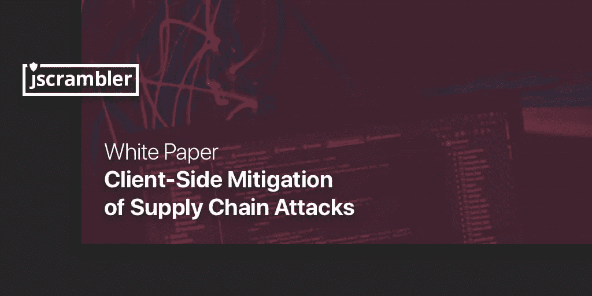

# 供应链攻击:企业如何行动？

> 原文：<https://medium.com/hackernoon/supply-chain-attacks-how-can-enterprises-act-68cfd03bc83f>

很明显，我们正在经历一个**数字化转型时代**。所有行业的公司都在自己的数字平台上投入了大量资金:电子银行、电子商务、PWA、流媒体服务等等。

在这个时代实现差异化意味着推动软件开发团队在创纪录的时间内交付高度先进的应用程序。在内部开发每一个功能早已不再是可持续的。现在，开发数字产品意味着**重用第三方代码和集成第三方脚本**以增加功能。

# 代码依赖和第三方脚本

JavaScript 作为 Web 语言的发展导致了库和框架的出现——这是开发速度的两个主要推动者。

如果我们看看用`create-react-app`创建 React.js 应用程序的典型开发场景，仅这一步就涉及安装超过 1000 个代码依赖项的**，这些代码依赖项大多是由志愿者维护的开源项目。**

当公司寻求扩展现有应用程序的功能时，也会出现类似的情况。集成第三方脚本可以轻松访问各种服务，如分析、UX 改进和广告。最近对网络应用的分析把这变成了数字:

> 今天，web 应用程序中 67%的代码是第三方脚本。

如果现代应用如此依赖第三方代码，**当第三方开发者或提供商受到攻击时会发生什么？**

# 供应链攻击的出现

依靠第三方代码大大增加了应用程序的攻击面。攻击者很快发现了软件供应链中这一新的最薄弱环节:**与其直接攻击一家知名公司**(该公司可能拥有先进的安全系统)，**为什么不破坏一个代码依赖或第三方脚本**(该脚本可能由一个开发人员维护)？

> ***大多数第三方代码提供商没有企业级的安全系统。***

通过使用**代码依赖**，公司相信它的维护者会让这些代码无害。然而，情况并非总是如此，正如最近的[事件](https://www.zdnet.com/article/hacker-backdoors-popular-javascript-library-to-steal-bitcoin-funds/)和**事件流**库所见。一名志愿者获得了对项目的合法控制权，插入了带有恶意代码的直接代码依赖。该代码到达其下游目标，感染 Copay 加密货币钱包的生产版本，从几个 Copay 用户帐户中窃取帐户数据和私钥。

> 一个怀有恶意目的的贡献者可以损害一个组件，而这个组件本身就损害了成千上万个依赖它的项目。

使用**第三方脚本**时风险非常类似。当应用程序直接加载脚本时，它默认接受第三方提供者对此代码所做的任何更改。因为这个第三方代码[与所有内部开发的代码具有相同的特权](https://www.owasp.org/index.php/Top_10-2017_A9-Using_Components_with_Known_Vulnerabilities)，所以它可以直接危及整个应用程序。

这是网络犯罪集团 [**Magecart**](https://blog.jscrambler.com/magecart-2-architecture-of-a-what-if/?utm_source=medium.com&utm_medium=referral) 的*作案手法:攻破第三方脚本提供者攻击高知名度公司。臭名昭著的英国航空公司的入侵是通过在该公司加载到其网站和移动应用程序的 Modernizr 脚本中注入恶意代码实现的。结果， **38 万客户的信用卡数据被盗**。*

在所有情况下，公司都需要很长时间来检测这些供应链攻击并做出反应，这大大增加了随之而来的数据泄露的规模。

减轻供应链攻击需要解决几种网络弹性技术，包括**分析监控**、**适应性响应**和**证实完整性**。

为了满足这些缓解技术，公司必须采用**深度安全方法**。单独在外围防御或 SAST(静态应用程序安全测试)上投入资源不是一个合适的方法，因为这些方法对于供应链攻击是无效的。**客户端安全**解决方案在缓解供应链攻击方面变得有害，因为这些攻击通常是通过客户端的变化来实现的。在几种策略中， [**网页监控**](https://jscrambler.com/webpage-integrity?utm_source=medium.com&utm_medium=referral) 能够实时缓解这些攻击。

**我们免费的** [**供应链攻击白皮书**](https://jscrambler.com/webpage-integrity/white-paper-supply-chain-attacks?utm_source=medium.com&utm_medium=referral) **中概述了所有这些可行的缓解策略。**

# 最后的想法

供应链攻击越来越频繁，因为与典型的网络攻击相比，攻击者的投资回报要高得多。通过利用软件供应链中最薄弱的环节，一次攻击就能攻破数千家公司。

**第三方代码也不会消失**。它将仍然是一个标准的开发实践。现在，在成为又一个代价高昂的头条新闻之前，采用适当的客户端安全性并减轻供应链攻击的负担落在了安全团队的肩上。

**更多阅读尽在我们的** [**免费白皮书**](https://jscrambler.com/webpage-integrity/white-paper-supply-chain-attacks?utm_source=medium.com&utm_medium=referral) **。**

*原载于* [*Jscrambler 博客*](https://blog.jscrambler.com/supply-chain-attacks-how-can-enterprises-act-white-paper/?utm_source=medium.com&utm_medium=referral) *。*