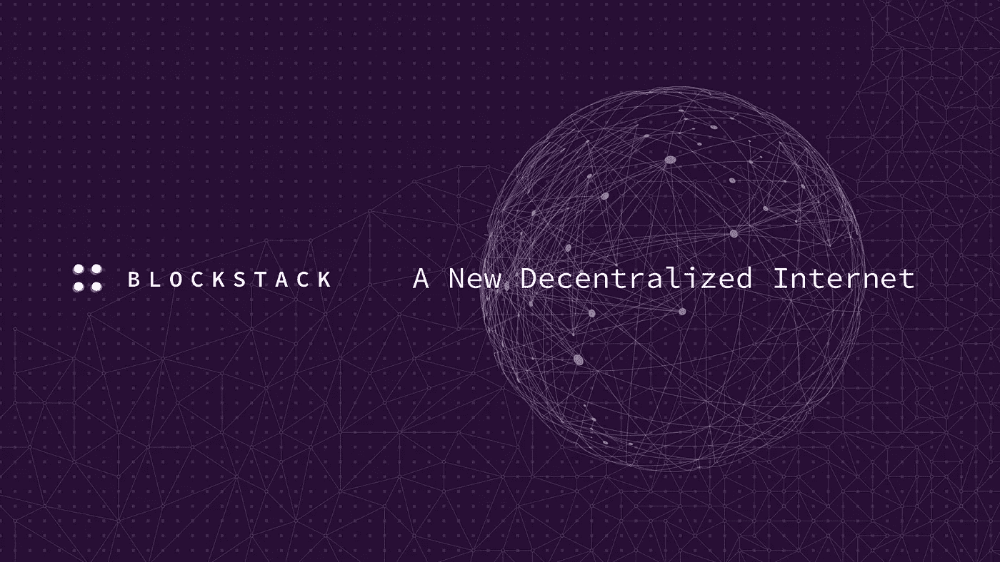
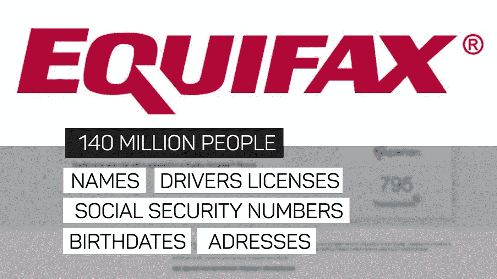
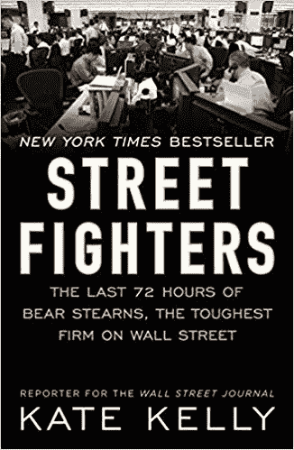
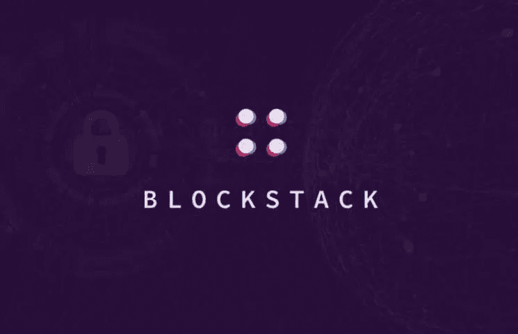
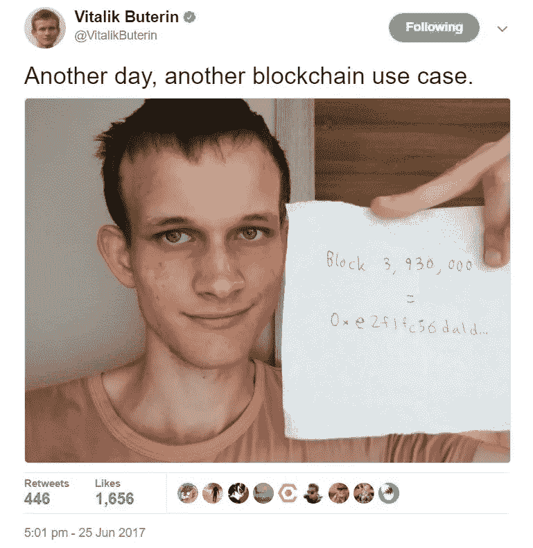
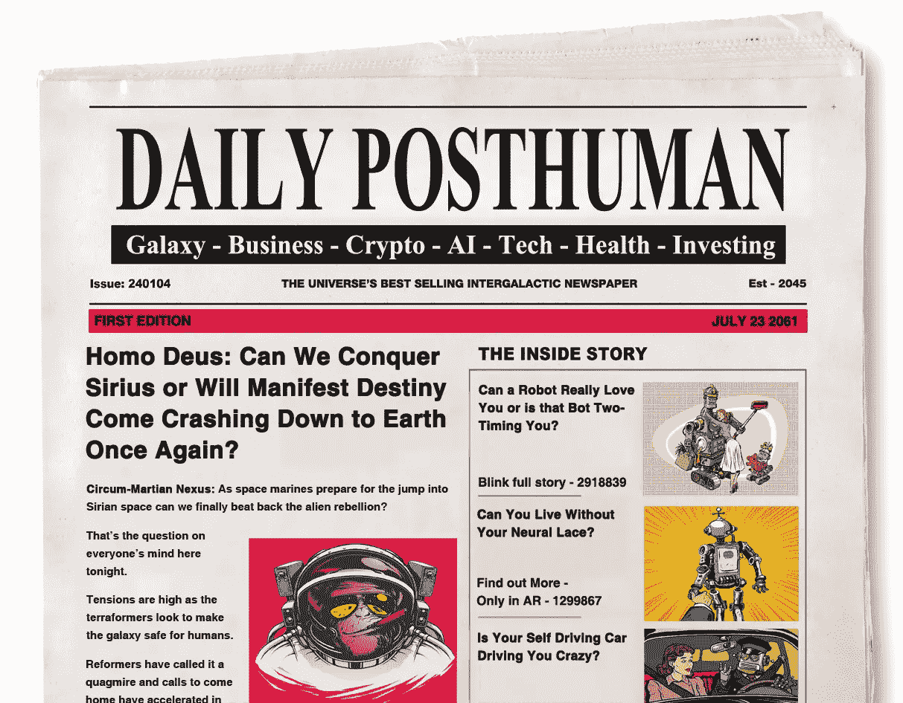
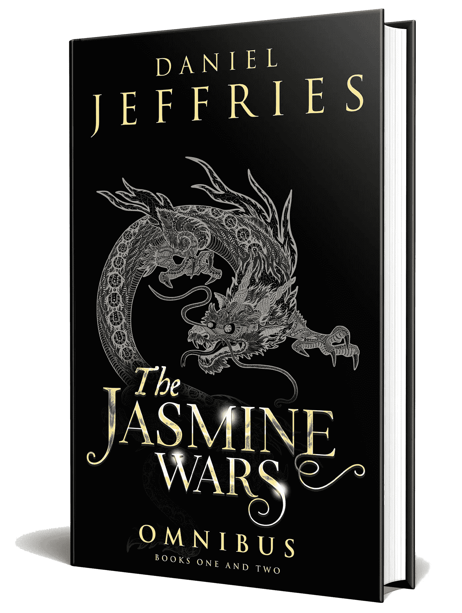

# 熬过加密的冬天——第二部分:Blockstack 和历史的大钟摆

> 原文：<https://medium.com/hackernoon/surviving-crypto-winter-part-2-blockstack-and-the-great-pendulum-of-history-c56d30c0c236>

*欢迎来到第二部分的***【系列】(* [*第一部分在这里*](https://hackernoon.com/surviving-crypto-winter-part-one-mattereum-and-the-internet-of-agreements-19c99453060) *)，在这里，我将介绍那些有机会在寒冬中幸存下来，并在春梦重现时茁壮成长的公司和项目。这次我来介绍一下这个领域最大最好的公司之一，****block stack****。**

*############################################*

*历史是一个钟摆。*

*它来回摇摆，从封闭到开放，从复杂到简单，从集中到分散，然后又回来，一个无止境的循环。*

**

*世间万物都存在于永不停息的激进转化状态中。无论是锁定在无限概率之舞中的粒子的无情量子波动，还是从单细胞变形虫到智能生命的生物系统的激增，或者是伟大文明兴衰的膨胀，生命总是在运动。*

*唯一不变的是变化。*

*如果你能看到这种更深层次的聚散模式，那么你就知道我们在哪里，我们要去哪里。如果你想看到未来，你只需要看看过去。*

*精确定位我们在循环中所处的位置，你就有了一张穿越混沌风暴的地图。*

*你不会知道未来的确切形式，但你会知道它的抽象特征。*

*一些目光短浅的人，比如永远暴躁的末日博士，认为区块链、dApp 平台和加密货币会失败，但那只是因为他们没有看到永恒的循环。那些末日预言家最终将成为历史的注脚，被人们遗忘，尽管他们活着时愤怒地挥舞着拳头，但他们发出的声音和愤怒毫无意义。*

*未来许多最大的公司将来自三个领域，[人工智能](https://hackernoon.com/learning-ai-if-you-suck-at-math/home)、 [3D 打印](https://en.wikipedia.org/wiki/3D_printing)和密码驱动平台。在这里，我们将只关注以密码为中心的未来，分散的应用程序已经取代了集中的应用程序，云被推到了迷雾之中。*

*每个行业都要忍受冬天，在冬天里，希望破灭，春天的梦想看起来像是妄想。*

**

*人工智能经历了两个冬天，花了 50 年时间才获得像自动驾驶汽车这样的回报。互联网在最初的二十年里看起来像个笑话。3D 打印仍然处于冬季，因为没有理由拥有一台打印机，早期每个家庭都有打印机的希望未能实现。*

*当然，加密市场在 2018 年遭遇了惊人的崩盘，因为市场在漫长的缓慢下滑中失去了 80%或更多的价值。严冬的风正猛烈地刮着，风暴已经带走了许多受害者。*

*在这个系列中，我将介绍谁最有可能从严寒中醒来，并在春天到来时茁壮成长。*

*[Blockstack](https://blockstack.org/) 是那些构建去中心化未来的公司之一，他们已经在该领域的许多其他项目上占了上风。他们有资金、智慧，最重要的是工作代码，这是许多银行里有数百万美元的项目还不能说的。*

*但是也许你想知道为什么有人需要一个分散的应用程序？集中式的还不够好吗？*

*要理解为什么你只需要仔细看看互联网曾经的位置和今天的位置。*

# ***互联网又回来了***

*互联网最初是一个充满无限可能的狂野开放的仙境。*

*早期的网络追随者看到了如此多的潜力，从远程工作，到网上购买从书籍到电子产品的一切，到自由交流的共享空间。*

*所有这些都发生了，甚至更多。从推特到远程办公，再到亚马逊，我们从网络上得到了我们想要的东西。这比任何人预期的都要长，但是仅仅 25 年，互联网就成了任何人都离不开的东西。*

*今天，很难想象在国外着陆时，不立即拿出谷歌地图或猫途鹰。你需要尽快找到食物。当你找到一个完美的地方吃饭时，你可能会打电话给优步。只要[当地政府没有干预削弱它](https://www.huffingtonpost.com/entry/uber-countries-governments-taxi-drivers_us_55bfa3a9e4b0d4f33a037a4b)并让时钟回到糟糕的出租车服务时代，你在那个陌生的土地上会有和在洛杉矶一样的乘车体验。*

*但是在去天堂的路上发生了一些事情。*

*推特催生了[阿拉伯之春](https://www.history.com/topics/middle-east/arab-spring)，但是春天很快就变成了[冬天](https://www.economist.com/middle-east-and-africa/2016/01/09/the-arab-winter)。*

*我们从一个开放的、覆盖全球的自由和可能性网络，变成了一个由几家公司控制的广告驱动的赛博朋克荒原。*

**

*我曾经用一个[元搜索](http://www.dogpile.com/)从几十个搜索引擎中提取结果。现在我只是像其他人一样使用谷歌，因为其他引擎已经被遗忘了。*

*谷歌可能在搜索方面做得更好，这就是为什么他们击败了竞争对手，但现在他们是镇上唯一的游戏。如果他们弄错了，我们真的不知道什么隐藏在我们面前。谷歌[框定了我们对世界的看法](https://amzn.to/2LyzKtS)以及我们看到的和看不到的。*

*我过去常常花几个小时在网上漫游，寻找奇怪的小网站。现在我像其他人一样花时间在十几个主要网站上，通常是在我的闭源手机上，而不是在我的电脑上。*

*大公司抽走我们的数据，建立巨大的私有库，预测我们想要什么，什么时候想要，这样他们就可以卖给我们更多我们不需要的东西。我们的[数据是新油](https://www.economist.com/leaders/2017/05/06/the-worlds-most-valuable-resource-is-no-longer-oil-but-data)和新金。*

*世界前五大公司中有四家是科技和互联网公司，包括排名第一的苹果和第二的谷歌。脸书被嘲笑后，[它的股票几乎一上市就暴跌 50%](https://marketrealist.com/2014/01/facebook-ipo) ,现在它是世界第七。2018 年，22.7 亿人使用了该网站，几乎占整个地球人口的四分之一，即 70 亿人。*

*不过，事情并不总是这样。我已经长大了，足以记得互联网的早期，那时网络公司是大多数传统公司认为是一个笑话的勇敢的小暴发户，就像今天许多人认为的加密货币和去中心化平台一样。*

*1999 年，我在一家名为[骚动](https://www.bloomberg.com/research/stocks/private/snapshot.asp?privcapId=109603)的网络游戏公司工作。有一年，他们发展得如此之快，从旧纽约市服装区的一层楼发展到了五层楼。我们无法以足够快的速度雇人或购买足够的服务器来满足需求。*

*随着网络时代的繁荣，派对变得越来越奢华和精致。我记得有一次，一家大型广告公司在纽约租出了一家大型俱乐部，举办冬季仙境派对，里面挤满了舞女和冰雕酒吧。他们让打扮成 Oompa Loompas 的人分发糖果，干冰机使俱乐部充满了缥缈的薄雾。*

*然后一切都结束了。*

*网络泡沫破裂，公司无法足够快地解雇员工。*

*在骚动的几个月里，我和技术支持团队的其他人开始工作，做我们想做的任何事情，因为我所有的老板都走了，没有人管理这艘没有舵的船。*

*几个月后，当所有人都被解雇后，一箱箱的网线被堆到了天花板上。*

*反对者出来了。他们也是永恒循环的一部分，他们总是嘲笑失败的实验，嘲笑任何敢于梦想改变的人。他们嘲笑互联网和网络公司，嘲笑网上买书和远程办公。*

*现在没人笑了。*

*这些巨大的科技公司扫除了旧经济，现在他们控制着我们所有数字生活的管道。*

*谷歌在任何一天都能看到大约 40%的互联网流量。他们可以让声音沉默，也可以让声音变成星星。他们可以切断我们的联系，让我们仿佛从未存在过。*

*互联网被设计成一个分散的、无定形的系统，但它已经完全变成了另外一个样子。*

*它的主要协议 TCP/IP 是为了在核打击和灾难中幸存而创建的。如果一个大节点出现故障，流量仍然可以通过路由到其他节点。*

*今天，我们所有的交通都通过巨型管道流动。网络泡沫破灭 20 年后，[国家安全局在美国主要网络提供商](https://theintercept.com/2018/06/25/att-internet-nsa-spy-hubs/)处有黑匣子来收集数据，因为这些大型网络提供商充当着网络上几乎每一个比特都要通过的集中瓶颈。*

*但是，我们不需要世界各国政府将互联网变成一个监控国家，因为我们委托给我们的数据公司很乐意为他们这样做。斯大林和其他旧世界的宣传大师会嫉妒人们如此轻易地将他们的私人信息交给机器。*

**

*《T4》中有一集非常精彩，为政府工作的杰出计算机科学家不顾一切地想找到秘密获取每个人数据的方法，但他做不到。因此，他为脸书设计了一个薄薄的替身，“每个人都免费送给我。”*

*他们不需要拿着枪拿走我们的数据，我们径直走过去，高兴地把它交给他们。*

*今天的互联网是一个美人计。所有的服务都是免费的，但是我们应该知道在这个世界上没有什么是免费的。总是有代价的。代价是一些知道我们一切的大公司。*

*监控是互联网的商业模式。*

*这是正式的。转弯完成了。去中心化的网络已经死亡。*

# ***国王已死，国王万岁***

*分权已死，分权万岁。*

*向中央集权的转变已经完成，现在钟摆将摆回到另一个方向。到处都有迹象表明即将到来的变化。*

*一系列新的创业公司正在崛起，以重新分散网络的权力，并把我们带回到网络及其无限可能性的狂野和开放的早期。*

*意识到网络变得越来越集中并不是什么新鲜事，但只是在过去几年里，我们才看到资金的激增支持了改造网络的概念。*

**

*Sir Tim Berner’s Lee*

*蒂姆·伯纳斯·李爵士是互联网的教父之一，他花了几年的时间在麻省理工学院研究一个名为 Solid 的去中心化项目，现在他有了资金将它推广到全世界。2016 年，他举办了第一届去中心化的互联网大会，目标是“[永远锁定开放。](https://2016.decentralizedweb.net/)*

*Blockstack 是那些寻求重新编织网络的公司之一，但他们甚至领先于像李这样的伟大人物。他们于 2013 年推出，比李开复举办分散式网络会议早了三年。他们由分布式系统专家，医生[穆尼布·阿里](https://twitter.com/muneeb?ref_src=twsrc%5Egoogle%7Ctwcamp%5Eserp%7Ctwgr%5Eauthor)，我刚刚在[我的播客](http://dailyposthuman.com/)中采访了他。从 Y Combinator 项目毕业后，他们筹集了早期种子资金[，后来又从联合广场风险投资公司(Union Square Ventures)获得了早期种子资金，一起筹集的还有投资者和 Twitter 圣人](https://www.crunchbase.com/organization/blockstack-inc) [Naval Ravikant](https://twitter.com/naval?ref_src=twsrc%5Egoogle%7Ctwcamp%5Eserp%7Ctwgr%5Eauthor) 。*

*从这些新的竞争者公司中，将诞生明日的谷歌。*

*这就把我们带回了为什么有人需要一个分散的应用程序？*

*为什么奶奶需要 dApp？脸书和谷歌还不够好吗？我们真的需要去中心化的 Instagram 吗？*

*答案可能会让你大吃一惊。*

*集权本身不是坏事。这没什么大不了的。一个平衡的系统有集中和分散的组成部分。一棵大树有一个强有力的树干，它的树枝是分散的。每个人都在整体中扮演自己的角色。*

*但是我们现在没有一个平衡的互联网。我们拥有的是一个极度集中的互联网。*

*而极度集权*就是*不好。*

*历史的循环不是为了根除中央集权。它是来根除极端的。*

*中国有句古老的谚语:*

***“事情走向极端就会向相反的方向发展。”***

*生活寻求平衡。集权和分权各有优缺点。一个极端系统的解药是该系统对立面的健康剂量。*

*过度集中的系统是病态的系统。它是停滞的。它粉碎了创新和创造力。它不灵活，不容易增长或改变。最糟糕的是，它让问题恶化，没有办法解决它们。*

**

*说明原因的最简单方法是 Equifax。*

*Equifax 是我们敏感个人信息的三大处理器之一。他们设法丢失了整个美国一半的数据，向全世界的黑客泄露了我们的社会安全号码、生日和信用卡号码。*

*但是，他们是否因为可怕的安全措施而受苦呢？他们倒闭了吗？他们被更好的公司取代了吗？*

*号码*

*事实上，[他们很可能赚了钱](https://www.digitaltrends.com/computing/equifax-make-money-breach-millions-more-exposed/)。他们拥有监控信用数据的公司，在数据泄露后，各地的人们开始为这些服务付费。*

***更糟糕的是，他们*仍然信任*处理和存储我们的信息。***

*他们深深植根于权力之中，即使他们让我们失望透顶，我们也无法将他们铲除。*

*这是最大限度的集权。我们可以看到错误，但我们对当前的系统无能为力。*

*要解决这个问题，我们需要分布基础设施、治理和应用程序本身，这样就不会有任何损坏的节点存在于系统中，即使它们让我们所有人都失望了。*

*但不仅仅是 Equifax。放眼望去，越来越多的中央集权正在生根发芽。*

# ***云的崛起***

*当我还是个孩子的时候，我建立了自己的服务器，并在本地数据中心托管它们。今天刚开始工作的 IT 管理员永远不会安装和堆叠服务器。他们只是使用云。*

*但是什么是云呢？只是别人的服务器。*

*而今天的公共云是集中化的极致。*

*我们有三个大玩家，亚马逊、谷歌和微软，运行着数十亿个服务器节点。它们是令人惊叹的技术奇迹，但如果你正在构建一个应用程序，它们也是一个主要问题，因为你被锁定在一家公司的控制之下。*

*亚马逊网络服务是目前最大的云提供商。他们运行着一个不可思议且不断发展的平台。成千上万的世界上最大的公司现在依靠它来运行所有你知道和喜欢的服务，比如网飞。*

*但是如果他们倒闭了呢？*

*认为他们太大而不能倒？*

*如果再来一次金融危机呢？*

**

*2007 年，贝尔斯登拥有 3950 亿美元资产，几个月后就破产了。亚马逊去年拥有[2200 亿美元的资产。如果他们倒下了，他们不仅仅会拖垮数百万投资者的银行账户，他们还会拖垮数万家公司，这些公司的 IT 基础设施依赖亚马逊非常昂贵的数据中心来维护。当然，这不是一个完美的比较，因为贝尔斯登的杠杆率是 35 比 1，而亚马逊的业务真实而繁荣，但这并不意味着亚马逊不会陷入困境。](https://www.macrotrends.net/stocks/charts/AMZN/amazon/revenue)*

***没有什么是大到不能倒的。不是亚马逊。不是谷歌。不是任何人。***

*这些巨型云数据中心不是你一夜之间就能复制的。如果下跌，那将是一场噩梦，让 2008 年的金融危机看起来像儿戏。*

*其中一个云的失败将会产生多米诺骨牌效应，拖垮所有那些依赖的小公司，因为它们在创纪录的时间内争先恐后地重新部署到其他地方。大多数会和亚马逊一起失败。*

*答案是在多个云、端点和节点之间分配这种能力。*

*我们必须将权力推回到边缘。*

*我们可以在现有的云上冲浪，但我们需要像对待愚蠢的计算层一样对待它们，我们不信任它们，也不会依赖它们。我们需要在云的顶部有一个元层，它可以延伸到世界各地，这样即使一朵云倒下了，一切都可以继续运行。*

*一个真正去中心化的互联网需要超越单点故障。把鸡蛋放在一个篮子里是个糟糕的主意。把你的鸡蛋扔在一朵云里更糟糕。*

**

*Blockstack 的平台从云中提取能量，并将其分布在数万个不可知的节点上，相互复制它们的状态。*

*他们的[白皮书](https://blockstack.org/whitepaper.pdf)对其工作原理进行了重要的技术细节说明，但通过他们的一些简短总结可以更好地理解，比如这篇特别有用的讨论，涵盖了[以太坊和 Blockstack](https://forum.blockstack.org/t/what-is-the-difference-between-blockstack-and-ethereum/781) 之间的差异，或者下面这篇来自他们的 [Blockstack 核心 Github](https://github.com/blockstack/blockstack-core) 的文章，概述了他们的节点架构。*

> *“Blockstack Core 实现了 BNS 和 [Atlas](https://github.com/blockstack/blockstack-core/blob/master/docs/atlas_network.md) ，后者是 Gaia 的存储路由系统。Blockstack 核心节点构成了 Blockstack 网络的主干。每个节点索引比特币区块链，并维护所有名称、公钥和存储路由信息的完整副本。这使得块堆栈网络对节点故障具有特别的弹性——应用程序只需与单个块堆栈核心节点通信即可工作，新的或正在恢复的节点可以从其对等节点快速重建其所有丢失的状态。”*

*但是简单地在多个云中分布基础设施是不够的。要把它变成现实，还需要做更多的事情。*

*我们如何真正建立一个不可知论的层面，漂浮在现有互联网的顶端，从控制互联网的大型中央实体手中夺走权力？*

***抽象起来堆砌。***

*这也是伟大历史运动的一部分。自动化和抽象化导致新的创新，下一代互联网将站在这些创新的背后。*

*通过理解为什么锤子和钉子敲打泥屋，让我们深入研究一下为什么。*

# ***从泥屋到锤子和钉子***

*我们在不同的周期中来回移动，但我们也在不断地向上移动，我们的社会和文明随着每个时代的过去变得越来越复杂。*

*这个进步的引擎是自动化和抽象化。*

*让人类如此特别的一点是，我们可以抽象地思考和推理。如果我们被一块锋利的石头割伤，我们不需要看到二十个其他锋利的东西就知道它们是危险的。我们抽象出对“尖锐”、“痛苦”和“危险”这些概念的理解，并将它们应用于我们环境中的其他事物。现在，当我们看到一把刀时，我们知道它也会割伤我们。*

*我们还可以抽象出以前的问题的自动化解决方案，这些问题不再需要再次解决。*

*就拿泥屋之类的东西来说。*

*千百年来，人类建造泥屋来躲避暴风雨和野生动物。每个泥屋都很独特。每一个都必须手工制作。这个过程需要一个部落团队的大量劳动和协调。收集木头，把它摆成合适的形状，然后用泥巴把它们粘在一起。最终，这个过程变得相当统一，但却无法扩展。*

*这些小屋都受到他们的解决方案的限制。用木棍和泥土等原始工具建造像泰姬陵这样的多层泥屋或宫殿是不可能的。*

**

*锤子和钉子代表了人类的巨大进步。锤子和钉子解决了将一个结构的各个部分连接在一起的抽象问题。Mud 是以前最好的解决方案，但它只能扩展到目前为止。随着锤子和钉子的发明，我们现在可以建造更复杂的结构。我们抽象并自动化了旧的构建过程的一部分。*

*正因为如此，我们可以“向上移动”*

*有了统一的木板、锤子和钉子，我们的想象力转向了更复杂的问题。现在我们可以梦想多层建筑和伸向天空的寺庙来崇拜神灵。*

*请注意，当我们在较低层次上解决一个问题时，我们现在会担心建立在前一个解决方案基础上的更复杂的解决方案。*

*同样的运动正在互联网上发生。*

*互联网的基本协议抽象了通信和信息传输。不管这种交流是文本、加密文本、图像、声音还是电影。所有这些都可以通过 [TCP/IP](https://amzn.to/2SmVmfv) 传输。*

*在这个神奇的协议背后，互联网公司建立了强大的帝国。*

*但是有一个问题。*

*所有使用互联网的公司都在浪费时间构建完全相同类型的后端来管理他们面向世界的应用程序的工作。以优步这样的公司为例。他们不仅需要建立一个网站，还需要建立一个移动应用程序、身份系统、支付系统、存储系统等等。*

*当 Lyft 来与他们竞争时，他们必须构建自己版本的完全相同的组件。每家公司都推出了自己的身份系统或支付基础设施。*

*所有这些都是对资源的浪费。*

*Blockstack 和其他去中心化公司正在做的事情是抽象出我们构建现代应用程序所需的积木类型。他们从使用[区块链命名系统或 BNS](https://docs.blockstack.org/core/naming/introduction.html) 自动化 DNS 开始。DNS 使用被称为注册商的集中公司，他们收取你的钱并发布你的域名。当你去 Medium.com 的时候，媒体必须在一个集中的公司注册那个名字。*

*区块链给了我们抽象命名系统的能力，这样我们就不再需要公司作为中介。*

*他们用[身份](https://docs.blockstack.org/browser/ids-introduction.html)和[存储](https://docs.blockstack.org/browser/blockstack_storage.html)和[中间件](https://docs.blockstack.org/core/atlas/overview.html)做着同样的事情。*

*每个应用程序都需要一个 ID 系统和一种登录方式。每个应用都需要存储。*

*每个公司不需要的是推出自己版本的这些堆栈。*

*未来的公司将不再需要担心建立自己的 ID 系统。我们会有一个或几个可以共享的通用配置文件。当分散的优步席卷全球时，他们将只使用一个通用 ID 和存储堆栈。当未来的 Lyft 来与他们竞争时，他们将通过激励人们将他们的个人资料发送到他们的乘车服务来竞争。几秒钟之内，你就可以使用优步的竞争对手，而不用创建一个你不记得的新密码和用户名。*

*当然，集中化的公司也会从这些分散化的平台中受益。他们将接入传统的 web 服务器，并像其他人一样使用相同的通用 ID 堆栈。*

# *等等，什么是去中心化，为什么它很重要？*

*如果你密切关注，你会意识到我没有回答为什么应用程序本身需要去中心化的问题？*

*我们能不能只自动化这些较低层次的功能，但保持它全部集中？*

*如果你是一个真正的加密信徒，你可能会接受去中心化作为一个默认的好东西，但这还不够好。我们必须知道为什么我们现在比以往任何时候都更需要权力下放。*

*事实上，你可能开始想知道分权到底是什么意思？*

**

*这是一个被反复讨论的术语，大多数人似乎都没有很好地理解它。为此，你可以去看看以太坊的 Vitalik Buterin 写的这篇精彩的文章，他对它进行了分解，包括从政治分权到容错系统架构的所有内容。*

*我不会在这里重复他的论点，因为那完全是另一篇文章，但值得回顾一下这篇惊人文章的每一行。*

*最后，你会开始问自己一些艰难的问题，是否有人真正实现了去中心化，是否真的有可能实现平台的每一点，或者我们是否必须接受一些强有力的妥协？*

*例如，如果系统中的每个节点都基于相同的代码，而该代码有一个 bug，那么所有的节点都会崩溃，这不是真正的分散。如果一个团队为一个生态系统做所有的决定，那也不是真正的去中心化。*

*未来的所有平台都将需要经历一个漫长而痛苦的演变过程，才能在它们的平台之间联合力量。还没有人完全做到这一点，Blockstack 或以太坊或其他任何人都没有做到，但他们都在朝着这个目标努力。*

*随着这些平台的发展，请密切关注。观察它们的进化。追究他们的责任。*

*在每一步询问他们是否实现了真正去中心化的承诺，如果你是他们的用户和开发者社区的一员，就推动他们走得更远。*

*我不知道当一个真正的去中心化的系统最终展现出它所有的荣耀时会是什么样子，但是我知道我们需要它的最重要的原因。对我来说，我们需要分散的应用、数据和服务器的最大原因是:*

*集中式平台无法保证我们所有数据的安全。*

*我们让黑客的工作变得更容易。我们把所有的数据放在一个地方。*

*就像那个老笑话，为什么银行抢劫犯要抢银行？因为那是他们放钱的地方。黑客们知道该去哪里。这就是为什么在过去的几年里，没有一个大公司或政府实体没有成为 T2 某种数据泄露的牺牲品。*

*只有两种方法可以解决这个问题。首先是根本不保留数据。这是[珠穆朗玛峰 ID](https://everest.org/) 在与政府合作进行分散 ID 时采用的方法。他们检查数据，但他们不会存储超过 24 小时，他们的偏好是根本不存储数据。*

*第二种方法是保留数据，但将其推到边缘。让每个人都存储自己的 id，保留数据。然后黑客必须攻击每一个叶子节点来窃取它。*

*互联网从设计上就不安全。*

*默认情况下，未来的互联网是安全的。*

# ***大循环继续***

*如果你看了过去三十年的技术发展，你会一次又一次地看到这种演变。*

*我们从封闭走向开放，然后再回来。我们从分散到完全集中。*

**

*这是一个分形。它发生在宏观层面和微观层面。*

*我们从大型中央主机开始，然后转移到个人电脑。个人电脑很容易拆卸和重建。它们是带有通用组件的开放硬件。所有的能量都存在于边缘，从巨型空调建筑中的主机上收回，由 it 团队管理。*

*许多小型数据中心曾经遍布地球的各个角落。今天，几个巨大的云帝国统治着世界。随着越来越多的公司寻求放弃他们的私有数据中心，转向云，大整合仍在继续。*

*计算机行业的一句老话是“没有人会因为收购 IBM 而被解雇。”今天，没有人会因为购买亚马逊网络服务而被解雇。*

*这很好。直到它消失。*

*五年后，公司将会意识到他们已经把自己锁在里面，出不来了。他们可怕地依赖于专有基础设施，而当他们一头扎进去的时候，他们本应该更加密切地关注这些基础设施。*

*云就像乌合之众，进去容易，出来难。*

*今天，智能手机主宰了网络。随着智能手机进入每个人的口袋和钱包，我们从开放式架构转向封闭式架构。现在，所有的智能都存在于云中的服务器上，而应用程序只是那些中央机器巨大能力的纤细接口。*

*但是历史和进化的分形从未停止向前涌动。总是会越走越远。*

*现在，数字世界再次发生变化。*

*我们正在构建一个分布式层，它可以在集中式云上冲浪，使其更具弹性，并再次将权力还给人们。*

*钟摆永远来回摆动。*

*事情越是变化，就越是保持不变。*

*###########################################*

*查看我在每日邮报上对 Blockstack 首席执行官穆尼布·阿里的采访:*

* [## Blockstack 的穆尼布·阿里访谈

### Blockstack 的穆尼布·阿里访谈

采访 Blockstackplayer.blubrry.com 的穆尼布·阿里](https://player.blubrry.com/id/40646864/) 

###########################################

来**听听我在香港的演讲**在 **Blockstack 去中心化世界巡演**:

作家兼未来学家[@**Dan _ Jeffries 1**](https://twitter.com/Dan_Jeffries1)of[@**hacker noon**](https://twitter.com/hackernoon)将于 1 月 10 日在我们的分散世界巡回演唱会上发表演讲。门票在这里:[https://community.blockstack.org/dwt-tour-hk](https://t.co/YIxr06kYG6)

###########################################

## 如果你喜欢我的作品，请访问我的个人主页，因为在那里我和我所有的粉丝分享特别的见解。

## 顶级赞助人可以独享这么多东西:

*   **每篇文章、播客和私人谈话的早期链接。你比任何人都先阅读和聆听！**
*   **一个月月虚拟出来和我见面问&一个。问我任何问题，我都会回答。我也分享我正在做的一切，并给你一个幕后看我的过程。**

## 访问传说中的硬币表 Discord，您会发现:

*   **市场呼声**来自我和其他专业技术分析大师。
*   **投币者**只能**私聊**。
*   **私人海龟滩频道，程序员们在这里分享各种版本的** [**密码海龟操盘策略**](https://hackernoon.com/my-super-secret-crypto-turtle-strategy-revealed-ae7492fb01a6) **等信号和交易软件**。
*   **幕后**看看我和其他专业人士是如何解读市场的。

############################################

## 我有一个新的播客， [The Daily PostHuman](http://dailyposthuman.com/) ，涵盖加密、人工智能、科技、未来、历史、社会等等！查看我最著名的文章和观点的扩展报道。上 RSS 频道，不要错过任何一集，请在接下来的几个月里关注一些非常特别的嘉宾！

############################################

[Photo credit](https://extranewsfeed.com/the-winds-of-world-war-iii-8bc369584f67)

*简单介绍一下我:我是一名作家、工程师和连续创业者。在过去的二十年中，我涉及了从 Linux 到虚拟化和容器的广泛技术。*

*你可以看看我的最新小说，* [***一部史诗般的中国科幻内战传奇***](http://amzn.to/2gAg249) *在这部小说中，中国摆脱了共产主义的枷锁，成为世界上第一个直接民主国家，运行着一个高度先进的、人工智能的去中心化应用平台，没有领导人。*

## 加入我的读者群，你可以免费得到一本我的第一部小说《蝎子游戏》。读者称之为“神经癌的第一次严重竞争”和“黑色侦探会见约翰尼记忆术。”

############################################

## 最后，你可以[加入我的私人脸书小组，Nanopunk Posthuman 刺客](https://www.facebook.com/groups/1736763229929363/)，在这里我们讨论所有的科技、科幻、幻想等等。

############################################*