# 熬过加密的冬天——第三部分:为什么隐私币将统治下一轮牛市

> 原文：<https://medium.com/hackernoon/surviving-crypto-winter-part-three-why-privacy-coins-will-rule-the-next-bull-run-7a50a093e596>

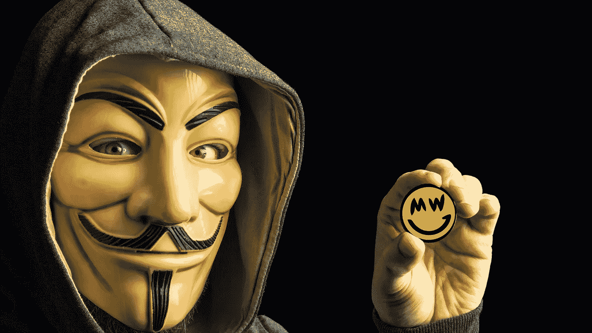

*欢迎来到* [***幸存的秘密冬天***](https://hackernoon.com/crypto-winter/home) *系列的第三部分(查看* [*第一部分*](https://hackernoon.com/surviving-crypto-winter-part-one-mattereum-and-the-internet-of-agreements-19c99453060) *和* [*第二部分*](https://hackernoon.com/surviving-crypto-winter-part-2-blockstack-and-the-great-pendulum-of-history-c56d30c0c236) *)，在这里我将介绍那些有机会在秘密冬天的寒风中幸存下来，并在春天的梦想再次到来时茁壮成长的公司和项目。这次我简介了一整类项目:* ***隐私币*** *。*

############################################

二十年后，现金将是非法的。

迈向无现金社会的伟大运动几年前就已经开始了。

计算机的发明使它成为必然。那些无法抗拒窥探我们生活方方面面的政府将会让它成为现实。

在印度等地已经开始了。2016 年末，纳伦达·莫迪总理[大笔一挥，突然禁止了该国大部分货币](https://money.cnn.com/2017/01/04/news/india/india-cash-crisis-rupee/index.html)。它本应减少腐败，让人们缴纳税款。

两者都是现实问题。只有大约 2%的印度公民纳税。当政府不能充实国库时，很难支持一个庞大国家的基础设施。

但是，它没有解决这些问题，而是导致了对穷人打击最大的巨大痛苦和苦难。弱者和赤贫者在银行排了好几天的队来上缴他们的钱。街头小贩卖不出他们的货物。富人仍然通过投资钻石和珠宝等易于交易的奢侈品来避税。

到 2017 年 8 月，印度出尔反尔。99%的被禁钞票重新流通。

首相走在了历史潮流的前面。他只是动作太快了。他试图强迫它。

向无现金世界的转变已经自然而然地发生了。看看亚洲就知道了。

在最近一次去香港的旅行中，为了在 Blockstack 的分散世界巡演上做一个演讲，我不得不使用香港[的八达通卡](https://www.octopus.com.hk/en/consumer/index.html)。很简单。只要在一家小杂货店里装上一点现金，你就可以出发了。把卡在终端机上一碰，你就付款了。不需要刷卡。太美了。

八达通卡最初是作为乘坐地铁的一种方式。当你在城市中穿梭时，轻点它就可以上下车。但很快就传开了。各地的商店开始接受它作为信用卡和现金的替代品。

事情就是这样。它开始很小，然后扩散。

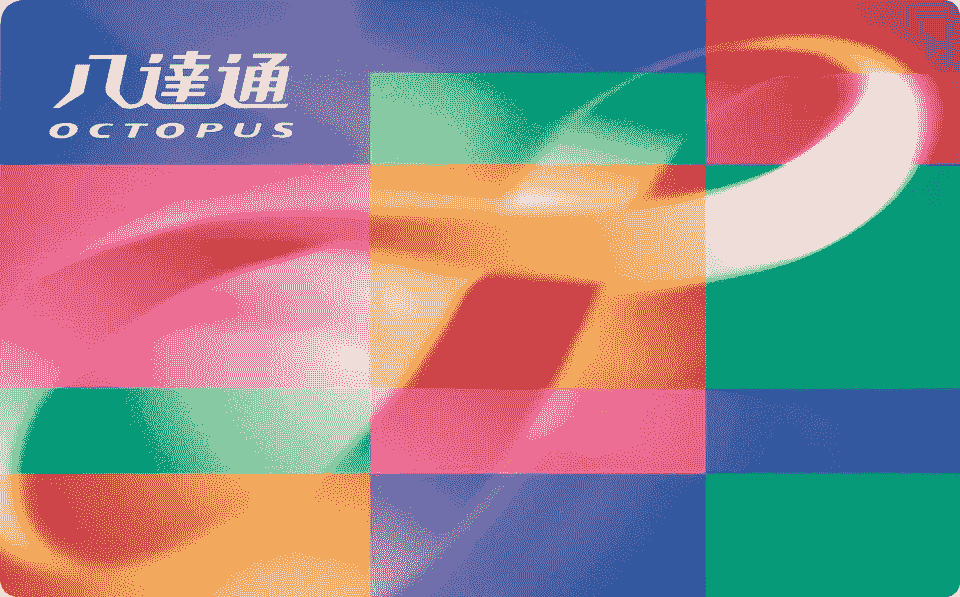

未来几年，越来越多的社会将以这种方式前进。集中式数字货币将把触角伸向你生活的方方面面。

从很多方面来说，这是一件好事。当人们不必随身携带一堆重金属硬币时，生活会变得更容易(我正在看*你*欧洲与你的口袋撕裂金属怪物)。它简化了从咖啡到耳机的所有商品的支付。

但是这个伟大的历史运动也有黑暗的一面。

所有的钱都是集中的，可以审查的。

可能你觉得数字现金和折叠钱基本一样？

不是的。

正如互联网让世界变成了一面双面镜，以[监控作为商业模式](https://www.securityweek.com/surveillance-business-model-internet-bruce-schneier)，集中的数字货币将把[全景监狱](https://www.utilitarianism.com/panopticon.html)放在你的口袋里。

你的手机在你之前就知道你要去哪里，你的朋友是谁，你想买什么。

集中的数字货币会知道更多。

# **圆形监狱货币的兴起**

你的整个生活都围绕着钱。

你吃早餐，拿一个优步，在亚马逊上买一副新眼镜，去酒吧。

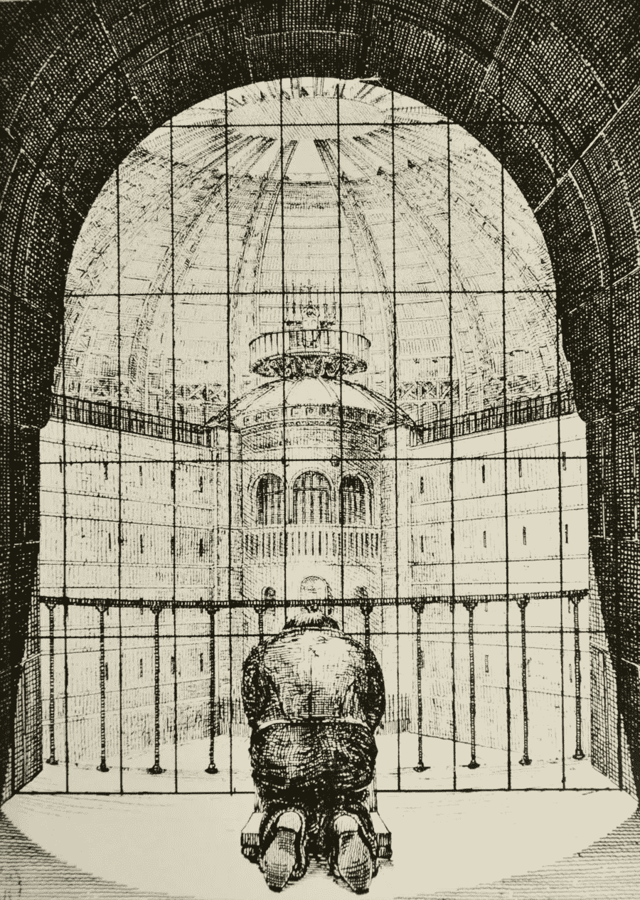

将来，发行这种货币的政府也会知道这一切，因为微型人工智能会以超人的效率跟踪和关联所有这些数据。

政府、企业和黑客将能够让你的生活倒退，看到你曾经做过的每件事的时间表，你曾经喜欢或讨厌的每件事，你曾经去过的每一个地方。

收税呢？

这也不会再是国家的问题了。

年底你就不用交税了。每次交易时，你都要全天候向他们付款。

正如 Vinay Gupta 在我的播客中所说:

> “收税会变成一个剧本而已。”

无论你是在当地的标签拍卖上买房子还是买价值两美元的小饰品，税务员都会知道。

更糟糕的是，当权者不必担心阻止一些网站或当地的高利贷者做生意。他们只会把自己用钱的能力列入黑名单。

想想吧。

**如果政府能切断你口袋里的钱，会怎么样？**

或者，如果他们只需轻轻一按开关，就能关闭街道那头商店做生意的能力，那会怎么样？

你知道当你的信用卡在晚餐时当着所有人的面无法使用，你不得不打电话给银行时你会有多害怕吗？

想象一下恐惧增加了一千倍。

当政府可以瞬间把你的钱关了的时候就是这种感觉。

现在你不得不打电话给一些像政府机构这样的车管所来解冻你的账户，或者你不能在寒冷的冬天购买食品杂货或支付电费，或者给汽车充电送孩子去学校，而所有这些你都要等上两个小时，然后才能断开连接，不得不再次打进来。

有时候开关的另一端甚至不会是一个冷漠的官僚。这只是一个有缺陷的黑盒欺诈检测算法。

抱歉，你触发了自动欺诈审查程序，导致你的数字现金被冻结。请稍等。您的来电对我们非常重要。

在政府对恐怖主义的偏执中，他们会在系统中建立各种自动触发器和黑名单。因为这些触发器是由政府设计的，也就是那些给你带来 DMV 和房屋管理局的人，它们会比你的信用卡公司用来检测欺诈的触发器更糟糕，有大量的误报。你的钱会一直被冻结，因为另一端的小算法不知道你为什么从一家新的网上商店购物，或者在市场街的加油站购物，而不是在百老汇。

这只是在第一世界国家，在多个层面上运作良好。也许他们试图阻止犯罪或阻止恐怖分子在任何地方制造恐慌。

但是当一个独裁政府获得这种权力时会发生什么呢？

你在社交媒体上发布了他们不喜欢的东西，或者你大声反对腐败和贪污，或者你对政府持有不利的看法，现在你就有大麻烦了。几个小时后，你下班后，发现你的钱被关闭，你不能坐公交车回家。也许无人机警察已经沿着你最喜欢的路线等着你走了，准备用逮捕网喷你，把你拖到一个虚假的审判？

但是现在有了新的希望。

一种加密货币拥有让原力恢复平衡的力量。

**隐私币。**

隐私币是匿名的、分散的数字货币。它们模仿现金的特性。

没有人知道你如何或在哪里花你的折叠现金。你去自动提款机，取出钱，你就可以在附近的庭院甩卖中买到泡泡糖或那盏漂亮的小灯，而且到处都没有记录，不像用信用卡。

这些强大的隐私保护硬币将成为抵御不可避免的全景监狱数字货币崛起的重要壁垒。

他们可能是我们唯一的希望。

当然，除非我们想重新使用鹿皮或胡椒作为货币，或者用奶牛换成捆的干草。

这就是为什么我在《幸存的加密冬天》系列的第三篇文章中，深入研究了一整类致力于保护我们的隐私并在数字世界中模仿老式折叠现金的项目。

# **但我没什么好隐瞒的**

在我们讨论硬币之前，有必要问一下:

为什么我们需要隐私？

难道我们不希望我们所有的交易都是透明和可追溯的吗？也许你在想“我没什么好隐瞒的。我不是罪犯。”

格伦·格林沃尔德在这个问题上有一个很棒的 Ted 演讲[。“我没什么好隐瞒的”是那些很少考虑隐私及其含义的人的经典辩护。](https://www.ted.com/talks/glenn_greenwald_why_privacy_matters)

在谈话中，格林沃尔德说，如果你没有什么可隐瞒的，那就告诉我你私人邮箱的密码。不是你的工作邮件。你的私人邮箱。我会在三个月内每天浏览一遍，任何我觉得有趣的东西我都会发布在社交媒体上。

还没什么好隐瞒的吗？

隐私和犯罪没有任何关系。

我们都不希望自己的私生活公之于众。正如我们不希望邻居在我们光着身子走来走去的时候看到我们的窗户，我们不希望有人偷听我们对爱人说情话，我们也不希望一些冷漠的官僚或公司匿名监视我们生活中的每一天每一秒。

我们都有自己的观点，我们不希望被分享或被一群不同意我们观点的愤怒的暴民举起。不管你的人生观是什么，总有人和你的人生观相反。如果你是保守派，就有自由派，反之亦然。如果你是一个环保主义者，有人会认为气候变化是一个笑话。如果你热衷于动物权利，有人可能不太关心如何对待牛。

我们谁也不想面对持不同观点的敌对大国的不断审视。

但是那些滥用这种隐私来隐藏他们非法所得的人呢？执法部门不应该有阻止坏人的权力吗？

现在，坏人建立了一个类似夜总会的现金生意，并通过它洗钱。也许它来自毒品或谋杀，他们让它看起来像是通过俱乐部。难道我们不需要给执法部门额外的权力来阻止这种事情吗？

号码

执法部门已经有了一个广泛的工具包来阻止这种犯罪。

不相信我？

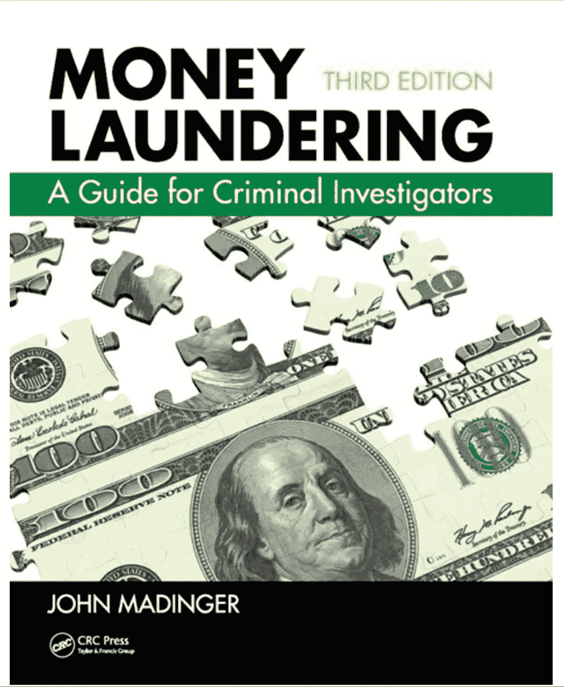

这是一本关于人们试图隐藏非法所得的所有方法的书，专门针对这方面的执法部门。

我最亲密的朋友之一是白领犯罪调查员。相信我，他不需要一堆新工具就能找到藏钱的人。他知道去哪里找。

当我们添加这些工具时，我们基本上假设每个人都是默认的罪犯，我们所做的只是制造更多的问题，而不是解决它们。

就拿 KYC 或者[了解你的客户](https://blocktelegraph.io/kyc-effect-bitcoin/)法则来说吧。当你在交易所注册交易黄金、咖啡或股票时，交易所需要你上传一个 ID 和一张照片，还需要你的各种个人信息，比如你的住址和电话号码。

简而言之，他们需要身份窃贼窃取您的身份所需的所有信息。

集中式实体一次又一次地证明，他们无法保证数据的安全。每隔一天，一些大的中央实体就会丢失我们的信息。Equifax 丢失了半个美国的个人数据，但那只是一个华而不实的大例子。

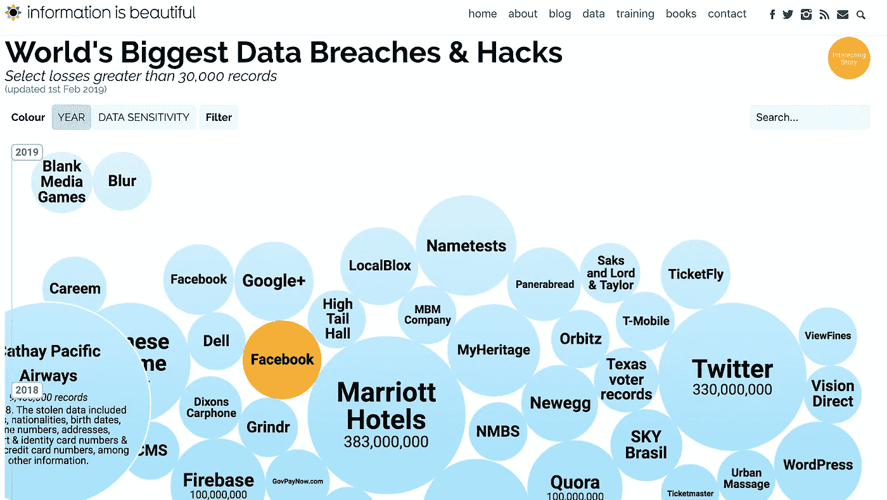

[违规事件每天都在发生](https://informationisbeautiful.net/visualizations/worlds-biggest-data-breaches-hacks/)，地球上的每一个主要组织都是如此。

安全很难做。非常辛苦。

“在过去的六年里，身份窃贼仅在美国就盗窃了超过 1070 亿美元”,为《福布斯》撰稿的阿萨夫·格雷纳说。

**身份盗窃让所有其他类型的财产盗窃相形见绌*加起来*。**

把所有被盗的汽车和被盗的艺术品和酒类商店的抢劫加在一起，他们甚至都不接近身份盗窃。坏人已经知道从远处偷东西比拿枪指着他们的脸要好。风险也小了很多。

换句话说，KYC 法律和在中央数据库中保存大量个人信息的需要导致了更多的犯罪，而犯罪也更容易发生。

KYC 法律阻止不了坏人。坏人知道如何在黑网上花 25 美元获得 100 个 id，并建立一个假的角色。这些法律只会让所有无辜的人处于危险之中。

这是逆向思维。

这就像人们争论说[电子游戏让人杀人(他们没有)](https://www.psychologytoday.com/gb/blog/media-spotlight/201304/can-video-games-cause-violence)。你在 80 年代和 90 年代见过很多这样的争论，[尤其是在大规模枪击事件后](https://www.engadget.com/2018/03/07/video-game-violence-trump-meeting-esa-nra/)，媒体会挖掘一名枪手的背景，发现他玩电子游戏。啊哈！当然啦！肯定是那些游戏。

**让我们把那些邪恶的电子游戏定为非法，我们将永远停止所有的暴力！**

当然，这基本上是疯狂的。

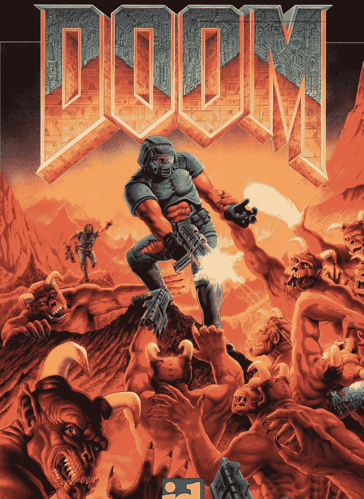

如果有 1000 个人碰巧玩电子游戏并且也杀人，那么另外 3 亿人玩电子游戏和不玩电子游戏呢？这是统计学上的荒谬，然而人们仍然相信它。

这才是真正的问题，错误的信仰体系。人类很擅长相信事情是可行的，即使它们并不可行。

你仍然会发现世界各地的人都认为视频游戏正在制造杀手，我们需要将这些身份数据存档，否则恐怖分子就赢了！中央集权有一种自然的倾向，嗯，中央集权。

如果他们能抓住一个坏人，他们认为这是值得的。但事实并非如此。如果治疗比疾病更糟糕，那么我们所做的就是给每个人制造更多的问题。为了抓住一些额外的坏人，我们让每个人都成为罪犯，我们为精通数字技术的国际罪犯开辟了全新的犯罪途径。

# 丝绸之路

或者你认为黑市是现金的唯一用途？

如果某样东西是非法的，那么在某个地方就会有黑市。不管是毒品还是书籍，都会有人冒险卖给你。

难道我们不想停止所有这些非法活动吗？这难道还不足以成为取缔现金的理由吗？

号码

同样，执法部门不需要任何新的工具来阻止黑市。他们已经每天都这样做了。

我还会说一些一开始可能听起来很疯狂的话。世界需要黑市。

这是因为黑市的定义会随着你生活在世界的哪个地方而发生巨大的变化。

如果你生活在一个健康、稳定的第一世界国家，那里的商业和社会运作良好，警察一般都在做他们的工作，政府提供它承诺的服务，即使效率低下，那么黑市只是一个坏人通过毒品和妓女交易的地方。

但如果你生活在一个不稳定的国家，比如委内瑞拉或津巴布韦，你对黑市的看法就会非常非常不同。

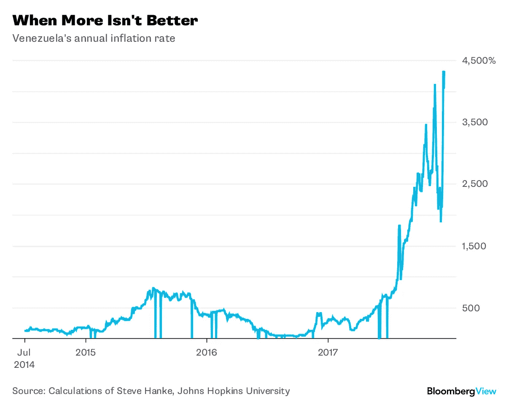

我最近为人权基金会主持了一个小组讨论会，在那里我采访了一些演讲者，他们经历了恶性通货膨胀，因为他们的国家在各个层面都崩溃了。人们排队等糖等了几个小时。一条面包可能要花掉一个月的工资。黑市是人们获取生存所需商品的地方。尿布。香蕉。干净的水。气体。

事物的本质根据上下文而变化。

但是你不需要一个疯狂的社会大崩溃来避免老大哥的监视。比方说，你生活在一个第一世界国家，反对派政党进入并禁止向所有支持你事业的组织捐款。

他们让它看起来合法。也许他们关闭了三四个规避捐赠法的组织。他们说，也许他们是对接管企图的回应。他们随后关闭了所有这类组织，以便“研究”这个问题，但他们的真正目标根本不是研究这些组织，而是彻底关闭它们。

现在你不能把钱捐给那些能够制衡当权者的人，他们的权力很快就会扩大。很快，就没有制衡了。

这一切都发生在土耳其的[和之后的](https://www.bbc.com/news/world-middle-east-44519112)。

我们在世界各地的[独裁者剧本](https://amzn.to/2EqOYiS)中看到这种举动。在没有法治或法治正在被侵蚀的社会中，我们看到当权者对反对派提出指控，逮捕他们，或者他们只是禁止向任何事业捐款，除了掌权者的事业。

集中的数字货币意味着合理制衡的终结。如果你不同意现在当权的人，你仍然可以把你的钱放在你所说的地方，进行抵抗。

当中央权力完全控制纯数字货币时，这一切都将结束。

现金的终结意味着自由选择的终结。

这就是隐私币重新出现的原因。

很多人说 crypto 没有杀手级应用。他们错了。

我们已经知道如何在一个完全不尊重隐私的环境中模仿现金:

互联网。

# **隐私的归还**

现金最大的特点就是真的真的很难追踪。

**换句话说，匿名性是现金的主要特征。**

只有做生意的双方知道这件事。

但是等等，比特币不是匿名的吗？

肯定是吧？我的意思是，我听说那些邪恶的人在丝绸之路上购买毒品，比特币只为罪犯和疯子以及朝鲜服务。

比特币绝不是匿名的。

在和平年代早期，它可能看起来是匿名的，因为中央权力不理解它，但这只是通过模糊的[安全](https://stackoverflow.com/questions/533965/why-is-security-through-obscurity-a-bad-idea)，这根本不是安全。

事实上，早期的数字账本容易追踪得荒谬。比特币记录了所有公开进行的交易。数字分类账是[三重分录会计系统](https://hackernoon.com/why-everyone-missed-the-most-important-invention-in-the-last-500-years-c90b0151c169)的第三个分录，它们将整个系统的财务历史公开给每个知道去哪里找的人。

即使有了[和其他旨在隐藏这些交易的技术的兴起，比特币也很容易理解。随着中央权力机构开始了解数字总账是如何运作的，区块链分析应运而生。在许多方面，区块链让追踪资金变得更加容易。相比之下，通过电汇追踪旧世界的资金和开曼群岛的离岸银行看起来就像是穴居人。](https://news.bitcoin.com/meet-bestmixer-the-bitcoin-tumbler-trying-to-outwit-chainalysis/)

随着渴望了解我们生活方方面面的政府和企业加深对这些新技术的理解，这种知识只会在未来几年增加。

**隐私币是区块链的死穴分析。**

他们带回了现金真正的匿名性。

为了做到这一点，他们必须解决一个第 22 条军规。

我们如何证明我们交换了数字货币，而没有把它登录到中央服务器或者公开登录到区块链？

在现实世界中，这个问题已经为我们解决了。我们的视觉和触觉就足够了。证据就在我们面前。我给你现金，你拿走现金。你知道你得到了现金，因为你实际上占有了它并数了数。

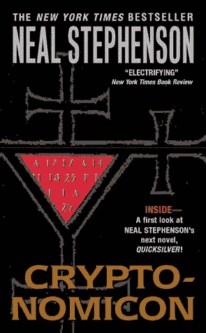

If you haven’t [read this book](https://amzn.to/2GZHbKk) you are banished from the crypto community.

为了模仿现金美丽的匿名特性，隐私币采用了许多聪明的加密技巧，即使是伟大的极客之神[尼尔·斯蒂芬森](https://amzn.to/2GZHbKk)、*也会感到自豪，它们可能会让我们在虚构的基纳库塔苏丹国*、*资助数据避难所，但这是另一个故事了*。)

这些伎俩掩盖了两个人或两个实体之间货币交换过程中的每一步交易。这包括钱从哪里来，谁有，谁有多少，钱去了哪里，什么时候？

因为他们在处理“第 22 条军规”,我如何在不暴露的情况下证明事情发生了，他们存在于密码研究的绝对前沿。

从[零知识非交互证明](https://blog.cryptographyengineering.com/2017/01/21/zero-knowledge-proofs-an-illustrated-primer-part-2/)，又名 zk-SNARKS，到[环签名](https://coinsutra.com/monero-cryptocurrency/)和隐形地址，到[将所有交易混在一起](https://github.com/mimblewimble/grin/blob/master/doc/intro.md)因此没有一项交易可以单独识别，隐私币开发者正在努力探索人类密码学知识的外部极限，并使科学越来越向前发展。

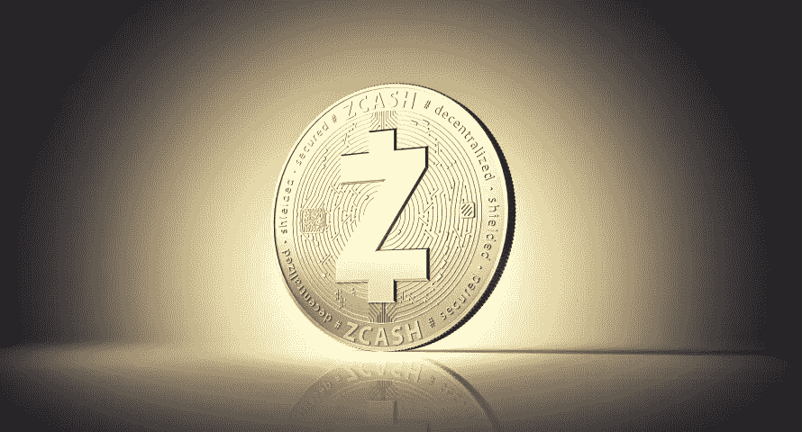

隐私竞赛中的领先项目是 [Monero](https://www.getmonero.org/) 、 [Zcash](https://z.cash/) 、 [ZCoin](https://zcoin.io/) 和基于[mimble 协议](https://cryptopotato.com/what-is-mimblewimble-the-complete-beginners-guide/)的硬币，这是该领域的一个全新领域，也是最有前途的领域之一。中波币目前有[光束](https://www.beam.mw/)和 [Grin](https://grin-tech.org/) 两种。

先说 Zcash。

Vinay Gupta 在我最近与他的播客中称 zk-SNARKS 为“与洞穴技术相比相当于宇宙飞船”。

它们是什么？

值得信赖的 Zcash 网站为我们指出了正确的方向:

> “零知识”证明允许一方(证明者)向另一方(验证者)证明一个陈述是真实的，而不透露任何超出陈述本身有效性的信息。"

基本上，它们允许在“屏蔽”第三方视线的情况下发生交易，同时还允许某人证明交易的某些事情已经发生，而无需透露交易的任何其他信息。

形象化的经典方法是:

你有一个色盲朋友。你递给他两个球，一个绿色，一个红色。他看不出它们有什么不同，但你可以。对他来说他们看起来一样。

你其实不想让他知道哪个是哪个，但你想证明你知道。为了证明他们是不同的，你告诉他把球放在背后，洗牌或者不洗牌。他的选择。

然后他给你看两个球。你每次都正确地告诉他球是否被洗牌了。

他重复了很多次，以至于你不可能全都猜对了。你现在已经让你的朋友相信球实际上是不同的，但是因为他是“零知识”,他仍然不知道哪个是绿色的，哪个是红色的。

如果我想证明金额为 10，000 美元的钱被发送到某个地址，同时又不想透露是谁发送的，这就很有用。

zk-SNARKS 代表“零知识简洁的非交互式知识论证”

“简洁”部分意味着所有这些密码魔术发生得很快(几毫秒)。换句话说，它不会占用太多的处理时间，而且证明做起来和测试起来都很快。

非交互意味着没有人需要做任何事情来证明什么。我不需要大声说出我的问题并等待你的回答。

所有这些都是通过[使用几个键](/@linda.xie/a-beginners-guide-to-zcash-3b37190affc)实现的，一个“查看键”让我看到交易的某些方面，一个“花费键”让我控制花费资金。

但是 zk-SNARKS 也不是没有一些缺点。最大的一个问题是，他们要求一群人在货币的初始创造阶段进行多方计算仪式。你必须相信至少有一名成员没有受到威胁，才能相信系统没有后门。在这篇引人入胜的文章中，你可以读到一些关于[创始人所做的努力。](https://z.cash/blog/the-design-of-the-ceremony/)

如果创始人没有做到这一点，你可能会有一个从第一天开始就被破坏的整个加密系统，没有办法回去修复它。

除了 Zcash 我们还有 Monero。

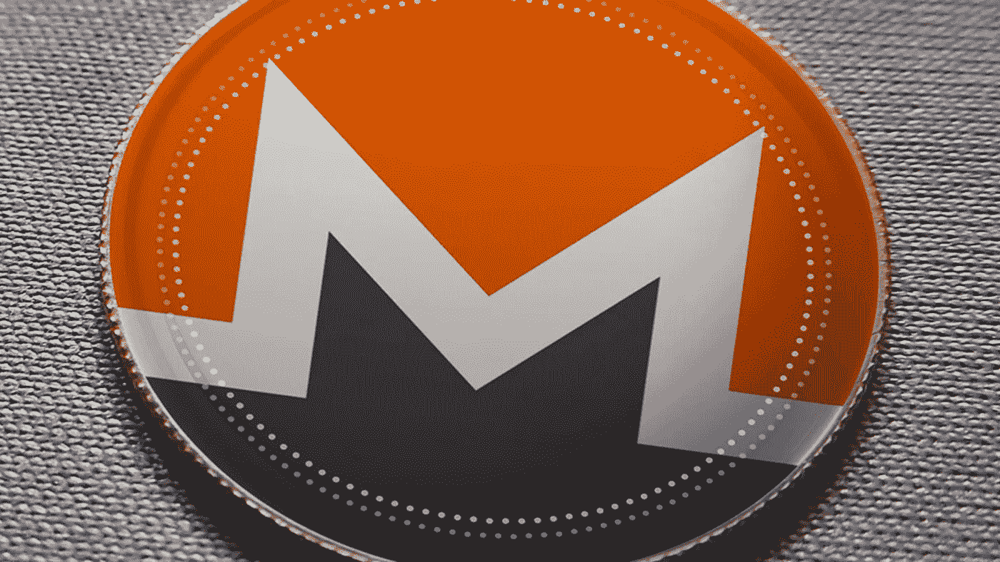

在注重隐私、思想自由的人群中，Monero 可能拥有最大的思想份额。

许多[的主要开发者完全匿名](https://www.reddit.com/r/Monero/comments/304em2/why_are_monero_developers_anonymous/)，就像 Satoshi 保持匿名一样。他们不希望自己的工作受到影响，也不希望愤怒的中央权力敲他们的门，把他们拖到宗教裁判所。

Monero 吹捧他们货币的可替代性。那是什么？

[Investopedia](https://www.investopedia.com/terms/f/fungibles.asp) 是这样定义的:

> “可替代物是指等价的商品、证券或票据，因此可以互换。换句话说，它们是由许多相同的零件组成的商品，这些零件很容易被其他相同的商品所替代。如果商品是按重量或数量出售的，这是一个很好的迹象，表明它们是可替代的。”

但是这和加密货币有什么关系呢？

如果有人用比特币做了一些非法的事情，比如通过黑暗网络购买违禁药物，这些比特币就会受到打击。他们被污染了。花掉它们会变得更加困难，而且它们在未来可能会变得不值钱，因为它们变得更加难以使用。

好的老式折叠现金是不同的。

就像一个道德败坏的女人，我不知道我口袋里的钱以前去过哪里。

这其实是一件好事。

就像在拉斯维加斯发生的事情只能留在拉斯维加斯。

我们不知道是否有人用我们的百元大钞买了一个冰淇淋蛋卷，或者卷起来，从妓女的肚子上吸了一口。在我之前有人用那些钱做了什么与我无关。我的一百美元仍然值一百美元。我仍然可以做我完全合法的交易，在农贸市场买一些新鲜蔬菜之前，在旧货店买一本旧书。它没有被去过的地方和认识的人污染。

由于 Monero 的所有交易都是匿名的，这意味着我们也不知道 Monero 去过哪里，这意味着在我拥有一些硬币之前，没有任何硬币受到黑暗的污染。

除了所有隐私硬币以某种方式共享的可替代性，也许 Monero 带来的最大的加密技巧是环签名。

环签名将一群人聚集在一起，给他们一种方法来签署消息或交易。我知道该集团签署了该交易，但我不知道该集团的哪个人签署了它。可能是组里的任何人。

匿名货币是如何运作的？

[Monero 网站](https://www.getmonero.org/resources/moneropedia/ringsignatures.html)很好地解释了这一点:

> “一个环签名使用你的[账户](https://www.getmonero.org/resources/moneropedia/account.html)密钥和一些公钥(也称为输出),这些公钥是使用三角分布方法从[区块链](https://www.getmonero.org/resources/moneropedia/blockchain.html)中提取的。随着时间的推移，可以多次使用过去的输出来形成可能的签名者参与者。在可能签名者的“环”中，所有环成员都是平等和有效的。外部观察者无法分辨签名组中哪个可能的签名者属于你的[账户](https://www.getmonero.org/resources/moneropedia/account.html)。因此，环签名确保交易输出不可追踪。”

换句话说，它将一堆事务输出混在一起，所以很难区分哪个事务属于谁。如果我不知道谁做了什么交易，我就有可能否认。

这就把我们带到了 Zcoin，一个零硬币协议的实现。

它使用洋葱网络和 Tor 来试图保持交易的私密性。但是使用 Tor 已经过时了，国家安全局和联邦调查局不会无所事事地担心如何攻击 Tor，因为他们可以攻击一个或多个节点。所以 Tor 还不够。

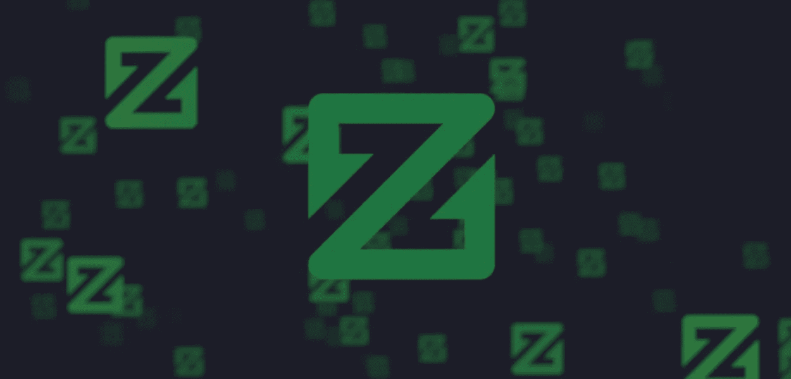

Zerocoin 最初是由约翰·霍普金斯大学的 Matthew D. Green 教授和一些研究生提出的，作为比特币私有化的一种扩展，但从未被采用。Zerocoin 通过创建一个名为 zerocoin 的混合服务或平底玻璃杯来实现匿名。本质上，它将一堆硬币交易汇集在一起，并将它们混在一起，因此在它们跌入池中之前，很难看出它们的去向或来源。

在你问之前，是的，格林教授从洗钱池中得出了这个想法。

比特币已经有了翻转机制，但它们是由第三方运营的，这意味着你必须信任第三方。如果这个派对被破坏，不倒翁会让你失败，你所有的硬币都会被追踪。这就像用隐形墨水给现金贴标签。但是 zerocoin 系统在协议层实现了 tumblers，完全不需要信任第三方。

zerocoin 和 Zcoin 的设计者也认为协议级不倒翁优于环形签名。

主要优势似乎是，它不是像 ring 签名那样混合几个输出，而是将数千个交易混合在一起，这使得去匿名化的难度增加了几个数量级。根据[Zcoin 网站](https://zcoin.io/tech/):

> “Zcoin”有一个匿名集，包含了一个特定的 RSA 累加器中所有铸造的硬币，可以扩展到数千个。

最大的缺点似乎是所有这些都需要大量的计算。根据 Zerocoin 上的比特币 Wiki 条目:

> “由于零币的验证过程比比特币的计算量大得多，根据比特币和零币的比例，[区块](https://en.bitcoinwiki.org/wiki/Block)的验证时间将增加 6 倍。”

Zerocoin 协议的一些实现，如 [Pivx](https://pivx.org/) ，似乎已经解决了这个问题，但工作仍在进行中。

这就把我们带到了奇怪的名字 MimbleWimble，也就是 MW。

MimbleWimble。快速说五遍。

Lord Voldemort wants you to use Mimble Wimble.

这个名字来自哈利波特，以一个诅咒命名。它有一段好奇且有点异想天开的历史，但它吸引了一些最铁杆的比特币狂热分子的热爱，他们认为这是自比特币本身以来该领域最大的创新。

2016 年 8 月，洋葱网络在[#比特币巫师 IRC 频道](http://gnusha.org/bitcoin-wizards/2016-08-01.log)上匿名发布了一篇论文，这是对 MW 协议的第一次描述。一个匿名的创作者(惊喜！)自称汤姆·埃尔维斯·杰杜索尔掉了报纸。Jedusor 是法语版《哈利·波特》中的大坏蛋伏地魔的变位词。

这篇论文吸引了一些密码高手的目光，比如 blockstream 数学天才 Andrew Poelstra。他修复了原始设计中的一些缺陷，并发布了论文的更新版本。

到 2016 年 11 月底，IRC 频道上又有一张匿名海报，使用了哈利波特世界中的另一个名字，隐身斗篷的发明者 Ignotus Peverell。Perverell 更进一步，推出了 Mimblewimble 的第一个工作实现。换句话说，工作代码有自己的 [Github 链接](https://github.com/ignopeverell/grin)。

[咧嘴一笑](https://grin-tech.org/)。

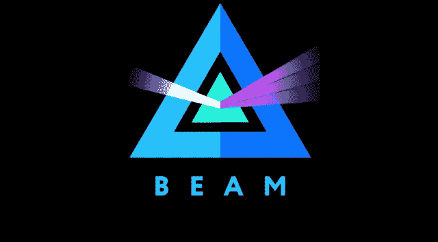

其他硬币紧随其后，包括 [Beam](https://www.beam.mw/) ，他的联合创始人与 Poelstra 合作，他的标志看起来像是创始人在听与《绿野仙踪》同步的[月亮的阴暗面](https://www.youtube.com/watch?v=p6HHA4y6G5g)时服用了过多的酸。

Grin 让那些老派的比特币狂热分子兴奋不已，因为与许多较新的加密硬币不同，它没有[创始人奖励](https://z.cash/blog/funding/)或 ICO。人们必须挖掘硬币，没有人有早期优势，所以没有预先铸造的百万富翁被认为是更“公平”的。

最重要的是，mimble 提供了许多令人难以置信的性感创新。

它将所有事务聚集在一起，因此它们看起来就像白噪音一样。从字面上看，不可能将一项交易与其他交易分开。

[Cryptobriefing](https://cryptobriefing.com/grin-coin-mimblewimble-introduction/) 对此做了最好的解释:

> “MimbleWimble 通过为所有输入和输出创建一个多重签名来改变这种比特币模式。参与交易的各方创建一个可以验证交易的公共多重签名密钥。系统中没有地址，因为参与交易的双方共享所谓的“致盲因子”，只有这两方知道他们正在进行交易；保持网络的私密性。
> 
> 隐蔽因素是双方之间的共享秘密，该秘密对特定交易中的输入和输出以及交易方的公钥和私钥进行加密。MimbleWimble 利用 [Pedersen 承诺方案](https://en.wikipedia.org/wiki/Commitment_scheme)，其中完整节点从交易接收方(输出)的加密数量中减去交易发送方(输入)的加密数量。

换句话说，MW 似乎因为其[机密交易](https://github.com/mimblewimble/grin/blob/master/doc/grin4bitcoiners.md)而摇摆了一些[同态加密](https://blog.cryptographyengineering.com/2012/01/02/very-casual-introduction-to-fully/)。这是加密的数据，我们不需要解密就可以使用，这是过去数十亿美元研究的主题，到现在为止还没有多少。

哦，你没看错，我没有地址。

这有利于隐私，因为我们可以期待中央权力在未来强制地址注册，或公钥注册。但是如果一个地址不存在，没人能强迫你注册。只有你的私人钥匙知道你的钱包里有多少钱，你在什么时候把它送到了哪里。

MW 它是超级可扩展的。它只存储了比特币所需数据的一小部分。一千兆字节左右的比特币区块链可以装进一兆字节的兆瓦。

最后，Grin 的创造者们使硬币具有了 ASIC 抗性，这在未来几年将变得越来越重要。

现在，巨型 ASIC 农场是中央集权的噩梦，腐败的政府将它们搜出并要求征税，或者没收它们并铸造自己的硬币，委内瑞拉就是一个最好的例子。随着比特币在世界舞台上变得越来越有利可图和必不可少，未来几年情况只会变得更糟。

ASIC 阻力意味着人们可以使用商用硬件在网络上运行完整的节点，这使得网络更加分散。随着比特币区块链在未来几年变得越来越大，最终只有拥有 Pb 级 SAN 集群的人才会运行完整的节点，这使得它高度集中，除非我们提出某种共享的分布式数据库。

但是 Grin 的区块链要小得多，这意味着我们不必担心大而集中的看护者。随着区块链变得更小，这意味着越来越多的人可以运行一个完整的节点，因为它适合商用硬件，这使得硬币对故障更有弹性。

我们拥有的连锁副本越多，从长远来看就越安全。

问问你的 DNA 就知道了。每个细胞中都有一个副本，这是有充分理由的。

# **隐私和自由**

很多人认为现金的消亡是一件好事。

他们错了。

想要隐私，你不必是个罪犯。每个人都应该有隐私。

就像你不希望有人在你换衣服的时候从窗户往里看，或者从你的肩膀后面看你发给你最好朋友的电子邮件一样，你也不希望一家大公司看着你花血汗钱买的所有东西，这样他们就可以为你做另一件毛衣或一双鞋子的广告。

我们必须能够在任何特定时刻与掌控权力的人持不同意见，否则我们只是奴隶。现在，我们正走向一个集中的数字货币将永远把现金一扫而光的社会。

没有什么能把你从圆形监狱的窥探中解救出来。

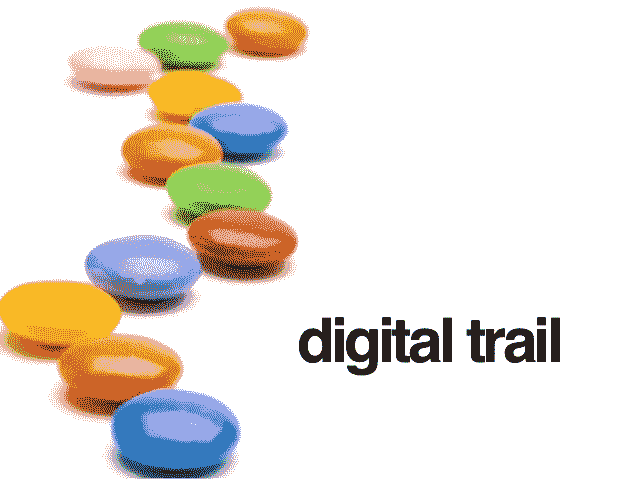

你整个生活的数字痕迹将会永远存在，并允许任何当权的人，无论是好人还是坏人，让时间倒流，仔细观察你的生活，探索他们想知道的关于你的任何事情。

当普通人意识到这种危险时，已经太晚了。

唯一真正的希望是分散的隐私硬币在现实世界中流行起来。如果我们能够围绕分散的货币建立一个真正的经济，普通人每天都在使用分散的货币并信任它，那么自由保护货币将成为世界的平行经济操作系统。

中央集权的货币将继续存在，但会慢慢消亡。一百年后，谁会想要一个国家的钱，这个国家可以在一夜之间改变你的规则，或者做出一个糟糕的决定，搞垮经济？

但是如果分散的货币不能流行起来，中央货币将意味着绝对的命令和控制，这是过去的独裁者只能在他们最疯狂的梦想中想象的。

不受制约的权力是一场灾难，国父们对此再清楚不过了。

约翰·亚当斯说:“不经检查，决不能相信权力。”。

现金的死亡就是自由的死亡。

**隐私币可能只是它的重生。**

###########################################

 [## 生存加密冬季系列-黑客中午

### 加密冬天是什么意思？伟大的加密货币、产品和公司将在所有的加密季节生存下来。这里…

hackernoon.com](https://hackernoon.com/crypto-winter/home) 

## 如果你喜欢我的作品，请[访问我的 Patreon 页面](https://www.patreon.com/danjeffries)，因为那是我与所有粉丝分享特别见解的地方。

## 顶级赞助人可以独享这么多东西:

*   **每篇文章、播客和私人谈话的早期链接。你比任何人都先阅读和聆听！**
*   **一个月月虚拟的和我见面并问&一个。问我任何问题，我都会回答。我也分享我正在做的一切，并给你一个幕后看我的过程。**

## 访问传说中的硬币表 Discord，您会发现:

*   **市场来电**来自我和其他专业技术分析大师。
*   **投币者**只能**私聊**。
*   **私人海龟滩频道，程序员们在这里分享各种版本的** [**密码海龟交易员策略**](https://hackernoon.com/my-super-secret-crypto-turtle-strategy-revealed-ae7492fb01a6) **等信号和交易软件**。
*   **幕后**看看我和其他专业人士是如何解读市场的。

############################################

如果你刚刚开始交易或建立你的技能，那么检查一下 [**Boss Crypto 七天免费**](https://bosscrypto.samcart.com/referral/freetrial/Q954CTQkZr5gNt8H) ，里面有大量顶级教育内容、课程、课程、交易策略、信号、投资组合策略和市场分析。

############################################

## 我有一个新的播客， [The Daily PostHuman](http://dailyposthuman.com/) ，涵盖加密、人工智能、科技、未来、历史、社会等等！查看我最著名的文章和观点的扩展报道。上 RSS 频道，不要错过任何一集，请在接下来的几个月里关注一些非常特别的嘉宾！

############################################

[Photo credit](https://extranewsfeed.com/the-winds-of-world-war-iii-8bc369584f67)

*简单介绍一下我:我是一名作家、工程师和连续创业者。在过去的二十年中，我涉及了从 Linux 到虚拟化和容器的广泛技术。*

*你可以看看我的最新小说，* [***一部史诗般的中国科幻内战传奇***](http://amzn.to/2gAg249) *在这部小说中，中国摆脱了共产主义的枷锁，成为世界上第一个直接民主国家，运行着一个高度先进的、人工智能的去中心化应用平台，没有领导人。*

## 加入我的读者群，你可以免费得到一本我的第一部小说《蝎子游戏》。读者称之为“神经癌的第一次严重竞争”和“黑色侦探会见约翰尼记忆术。”

############################################

## 最后，你可以[加入我的私人脸书小组，Nanopunk Posthuman 刺客](https://www.facebook.com/groups/1736763229929363/)，在这里我们讨论所有的科技、科幻、幻想等等。

############################################