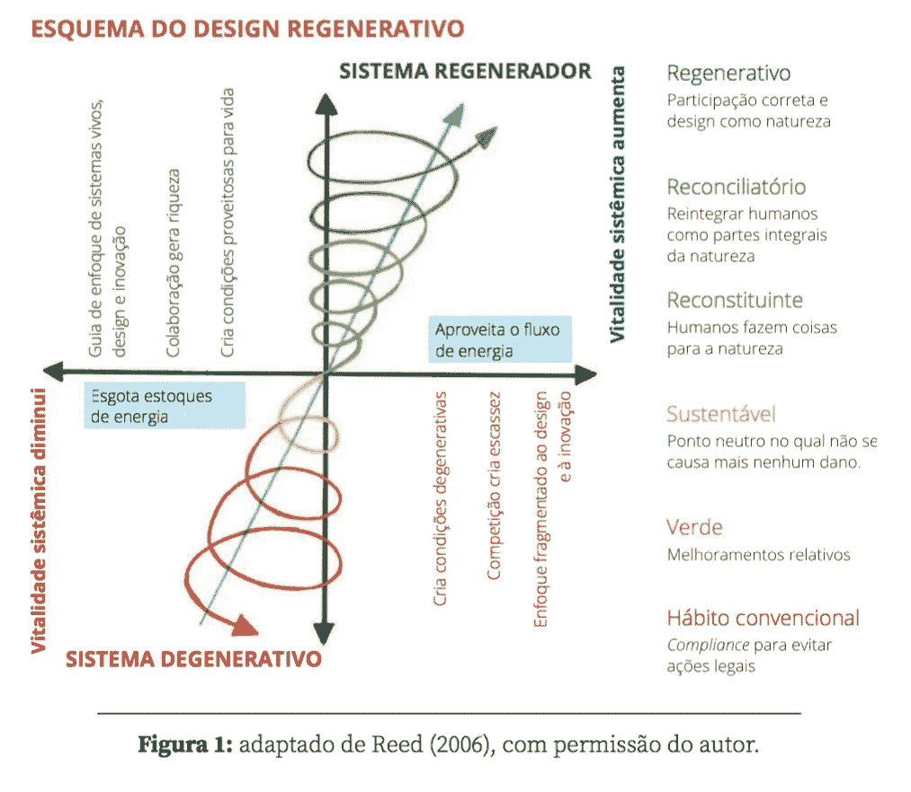

# 可持续发展是不够的:我们需要再生作物

> 原文：<https://medium.com/hackernoon/sustentabilidade-n%C3%A3o-%C3%A9-o-bastante-precisamos-de-culturas-regenerativas-e2d2e3f3ff98>

Imagem: [Pixabay](https://pixabay.com/photos/sunset-dawn-nature-mountains-3325080/)

## (English/Original version of this excerpt [here](/insurge-intelligence/sustainability-is-not-enough-we-need-regenerative-cultures-4abb3c78e68b) )

可持续性本身并不是一个合适的目标。可持续性这个词本身是不恰当的,因为它没有告诉我们我们真正想要维持的是什么。2005 年,经过两年的可持续性设计博士论文工作,我开始意识到我们真正试图维持的是健康,放纵和适应性的潜在标准,使这个星球处于一个条件下,整个生命可以蓬勃发展。可持续性设计最终是人类和行星健康的设计(Wahl,2006b)。

再生的人类文化是健康的,有弹性和适应性的;照顾地球和生命,意识到这是为全人类创造繁荣未来的可靠途径。韧性的概念与健康密切相关,它描述了恢复基本生活功能的能力,以及对任何类型的暂时性崩溃或危机的反应。当我们从系统的角度来看待可持续性时,我们试图维持连接和加强整个系统的标准。可持续性首先涉及从地方到区域和全球的不同规模的健康和系统性复原力。

复杂性科学告诉我们,作为一个复杂而动态的生态 - 社会问题的参与者,受到某些生物物理限制,我们的目标应该是适当的参与,而不是预测和控制(Goodwin,1999a)。学习正确参与的最好方法是更多地关注系统互动和关系,以支持整个系统的恢复力和健康,在多个尺度上促进多样性和冗余性,并通过关注系统中连接和信息流的质量来促进积极的产生。

## **使用预防原则(T3)**

面对动力的复杂性和“不知道”时,指导审慎行动的一项建议是将预防原则作为一个参考框架,旨在尽可能避免将来对环境和人类健康产生负面影响的行动。从 1982 年的联合国《世界自然宪章》,到 1987 年的《蒙特利尔健康议定书》,到 1992 年的《里约宣言》,再到 2012 年的《京都议定书》和里约+20,我们承诺多次应用预防原则。

关于预防原则的 Wingspread 共识声明指出:“当一项活动可能对人类健康造成危害时,即使没有科学地确定因果关系,也应采取预防措施”(Wingspread Declaration,1998)。该原则表明,证明某一特定行动无害的责任在于提出和实施行动的人,尽管习惯允许所有(尚未)证明其潜在有害影响的行动在未经审查的情况下继续运作。简而言之,预防原则可以概括为:面对不确定性时要小心。这不是我们所做的。(T0)

尽管联合国高级别小组和许多国家政府一再将预防原则视为指导行动的明智方式,但日常生活表明,实施起来非常困难,因为总会有一定程度的不确定性。预防原则也有可能通过阻止高度有益的新技术来阻止创新,其借口是不能肯定地证明这些技术不会对人类健康或环境造成意外的有害副作用。

**为什么不鼓励设计师、技术人员、政治家和专业规划人员从积极的、维持生命的、恢复的和再生的潜力的角度来评估拟议的行动呢?(T2 )**

**为什么不将任何创新的实施规模限制在地方和区域层面,直到其积极影响得到明确证明?(T4 )**

为系统健康进行设计可能无法使我们摆脱意外的副作用和不确定性,但它确实为再生文化提供了尝试和错误的路线。我们迫切需要希波克拉底对设计、技术和规划的誓言:不要伤害或伤害!为了做出这种道德和操作的主张,我们需要在所有设计,技术和规划背后有一个健康的保留(健康产生者):我们需要 pr*为人类,生态系统和行星健康提供支持。通过这种方式,*我们可以更快地从不可持续的业务,从通常的业务,*转向恢复性和再生性*创新,这将支持向再生文化的过渡。我们会问自己:

**设计、技术、规划和政策决策如何积极支持人类、社区和环境的健康?**

我们需要回应这样一个事实,即在过去几个世纪和几千年中,人类活动对生态系统的健康运作造成了损害。资源的可用性正在下降,而需求却在增加,因为人口继续扩大,并通过不负责任的设计和无节制的消费生活方式侵蚀生态系统的功能。如果面对减少需求和消费的挑战,我们就有机会(或可能性)创造出一个像针孔一样小的文明。这种转变将意味着我们文明的物质资源基础从化石资源转变为可再生和可再生的生物资源,同时大幅提高生产力和资源循环利用。比尔·里德(Bill Reed)概述了创造真正再生文化所需的一些基本变化。

> 与其减少对环境的破坏,不如学习如何参与环境——以生态系统的健康作为设计的基础。从碎片化的世界观到综合系统的心理模型的转变是文化必须做的重要运动——以综合的方式描绘和理解生活系统的相互关系。基于本地的方法是实现这种理解的一种方式。作为设计师和股东,我们的角色是将我们的关系转变为一个创造互惠互利的完整系统的关系。(T1 )
> 
> 比尔·里德(Bill Reed)(2007:674)

里德将“整个系统思维”和“生命系统思维”的思维模式的转变称为基础,我们需要创造一种再生文化。在第 3 章,第 4 章和第 5 章中,我们将从视角和细节上分析这些必要的变化。它们与我们对可持续性概念的彻底重新定义携手并进。正如比尔·里德(Bill Reed)所说,“可持续性是朝着所有事物相互联系的功能意识的进步。商业、建筑、社会、地质和自然的系统实际上是一个相互关联的系统。这些系统是生命进化的共同参与者”(2007)。一旦我们改变了这种观点,我们可以将生活理解为“持续进化的过程,以实现有意义,更多样化和互利的关系。创建再生系统不仅仅是一种技术,经济,生态或社会变革:它必须与我们思考自己,彼此关系以及整个生活方式的根本变化齐头并进。

图 1 显示了不同的视角变化,因为我们从 bu*siness 到通常的 pa*ra 再生培养。再生作物的目标超越并包括可持续性。*信号重组 vi*在当地生态系统中重建健康的自我调节,而和解性指定*n 为明确人类参与生活过程和自然与文化的结合提供了额外的 p*支柱。再生设计创造了能够持续学习和变革的文化,以应对和预测不可避免的变化。再生作物为人类后代和整个生命保护和增加生物文化的丰富性。

**(A melhor tradução de ‘Restorative’ seria ‘Restaurativo’ em vez de ‘Reconstituinte’!!!!)**

“分离的历史”达到了它的效用极限,由此产生的世界观和行为的否定效应开始影响整个生活。当我们成为行星健康的威胁时,我们学会重新发现我们与所有生命的亲密关系。Bill Reed 对系统健康再生设计的愿景与 Patrick Geddes,Aldo Leopold,Lewis Mumford,Buckminster Fuller,Ian McHarg,E.F. Schumacher,John Todd,John Tillman Lyle,David Orr,Bill Mollison,David Holmgren 以及我们在系统健康背景下分析设计的许多其他人的开创性工作相一致。一种新的文化叙事出现了,能够产生和定义一种真正的人类文化。我们还不知道这种文化将如何具体表现的细节,我们也不知道我们将如何从目前的“危机世界”状态走向再生文化的繁荣未来。然而,这个未来的外观已经在我们中间。

在使用“旧历史”和“新历史”这两个术语时,我们冒着将这种文化转变视为一种历史替代另一种历史的风险。这种二元对立的分离本身就是“旧历史”的“分离叙事”的一部分。“新历史”并不是对当前主流世界观的完全否定。它包括这种观点,但不再将其视为唯一的观点,开放给多种形式的知识的有效性和必要性。拥抱不确定性和模糊性使我们重视我们对复杂性的正确参与的多种观点。这些观点不仅赋予分离的“古老历史”以价值和有效性,也赋予了与地球和宇宙统一的“祖先历史”。这些观点可以帮助我们在深刻的亲密,互惠和与整个生活的共融中找到人类的再生方式,使我们成为人类“新历史”的有意识的共同创造者。

鉴于个人、集体、社会、文化和生态痛苦的加剧,我们对得出结论、答案和解决方案的焦虑和紧迫感是可以理解的,但这种倾向是倾向于回答而不是深化问题,这是旧的分离历史的一部分。变革性文化创新的艺术在很大程度上与“不知道”和平相处,更深入地体验问题,确保我们提出正确的问题,关注我们的关系,以及我们如何不仅通过我们正在做的事情,而且通过我们存在的质量来创造一个世界。再生文化将来自于寻求新的生活方式,即与自己,社区和整个生活建立联系。创建再生作物的核心是邀请共同生活*。(T3 )*

…

[这是 Daniel C. Wahl 的[再生文化设计](https://www.bambualeditora.com/pre-venda-daniel-wahl)一书的子章节—[Bambual 编辑](https://www.bambualeditora.com/pre-venda-daniel-wahl)]