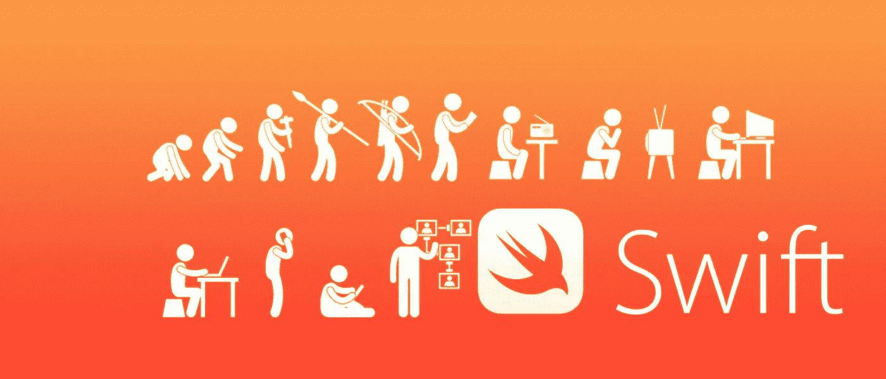

# Swift 5.0:有什么新功能，有什么变化，缺少什么，下一步是什么？

> 原文：<https://medium.com/hackernoon/swift-5-0-whats-new-whats-changed-and-whats-missing-65d3fbf46f4>

距离 swift 5 的最终分支还有一个多月，我们应该会很快看到它，因为它宣布将于今年年初发布。有人说它将在 4 月晚些时候到来，因为 Swift 4.2 使用了相同的方法；它的最终分支是 2018 年 4 月 20 日，它于 2018 年 9 月 17 日发布。

无论如何，我们急切地等待 swift 5.0，因为它将允许我们以一种漂亮的方式开发应用程序。

The improving swift

# ABI 稳定性

Swift 目前的首要任务之一是跨未来 Swift 版本的兼容性。其中的一个主要组成部分是 ABI 稳定性，这使得用不同版本的 Swift 编译的应用程序和库之间能够二进制兼容。

如果 Swift 成为 ABI 稳定版，Swift 将存在于 iOS 操作系统中，其 ABI 将与 Swift 的每个版本兼容。也就是说`App1`使用的是 Swift 5.0，而`App2`使用的是 Swift 5.3，他们都使用嵌入在操作系统中的 Swift ABI。

**我们会喜欢这个，因为**

*   包的大小将会减小
*   语言的变化会更小，更不频繁
*   需要较少的迁移工作
*   开发人员可以在 swift 中创建预编译框架(目前框架是在编译您的应用程序时编译的)

来源:[https://swift.org/abi-stability/](https://swift.org/abi-stability/)

# 结果类型

这是许多人期待已久的功能！`Result`类型迫使程序员在获得实际值之前显式处理失败和成功案例。

Swift 目前缺乏表达这种不可能性的能力。在相同的场景中使用`Result`可以得到更加优雅的代码:

现在，我们可以编写更简洁、更易读的代码，来约束可能返回的确切错误类型。

# `New BinaryInteger — isMultiple`

目前，测试一个值是否为倍数的最常见方法是使用余数运算符(`%`)检查余数为零:
`12 % 2 == 0 // returns true. 12 is a multiple of 2`

类似地，测试一个值是*不是*另一个值的倍数是通过检查一个不为零的余数来完成的:
`13 % 2 != 0 // returns true. 13 is not a multiple of 2`

这个代码存在许多问题，例如

因此，现在我们在 swift 5.0 中有了一些新的东西，这将让许多人松一口气。

Love it

# 在编译条件中支持“小于”运算符

在编译条件下引入新的“

例如，如果我们只想在 Swift 版本低于 4.2 时编译一段代码，现在我们必须编写以下代码:

通过引入对“

# 【

Counting the number of objects that pass a test has a wide range of uses in many domains. However, Swift currently doesn’t give its users a simple way to perform this operation. While the behavior can currently be approximated with a 【 and a 【 , this approach creates an intermediate array which it immediately discards. This is a bit wasteful.

To correctly avoid a potentially expensive intermediate array, you can use the Swift’s 【 subsystem:

However, using 【 comes with the downside of being forced to use an 【 block. Lastly, you could rely on an eminently unreadable 【 :

These three solutions lie on a spectrum between “easy to write, but include performance traps” to “performant, but require Swift arcana to write”.

**的支持，Swift 5.0** 将避免性能陷阱，并为用户提供一个简单的读写界面。Autocomplete 也应该很方便地呈现给他们。

# 字典— `compactMapValues`

我们有时需要同时变换和过滤一个`Dictionary`的值，而`Dictionary`目前还没有提供直接支持紧凑贴图值的操作。

Swift 5.0 现在推出了紧凑地图，这很棒，请参见以下内容:

生活越来越轻松了吧？

# 可选试试？

Swift 的`try?`语句目前很容易引入嵌套可选。用户很难推理嵌套选项，Swift 试图避免在其他常见情况下产生嵌套选项。

在 Swift 5 中，`try? someExpr()`将反映`foo?.someExpr()`的行为:

*   如果`someExpr()`产生一个非可选值，它将被包装在一个可选值中。
*   如果`someExpr()`产生一个`Optional`，则不增加额外的可选性。

这将导致`try?`表达式的类型发生以下变化:

# 我们错过了异步/等待模式—在 swift 5.0 中不再有

这是一个在其他流行的编程语言中使用的众所周知的解决方案——非常成功的有`C#`、`Python`、`Javascript`。这是我最想要的特性之一:(
它消除了回调地狱和异步 API 难以工作的问题。当执行多个操作时，错误处理、回调会产生复杂的控制流。

没有它们，swift 会怎样:

让我们看看异步等待模式会是什么样子:

# 结论

无论如何，我们在即将到来的版本中没有 async-await，但是有很多改进，我们可以从中受益。
还有很多其他的改进没有在文章中提到，比如字符串语言级别的支持，标准库的改进等等。

请对您了解到的改进进行评论，并请让我知道您对 swift 5.0 有何看法，以及您最喜欢此次更新中的什么功能:)