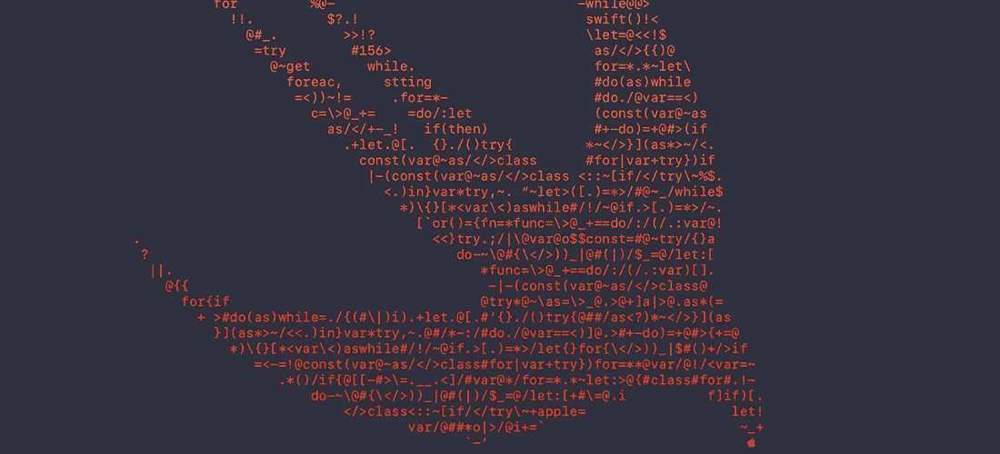
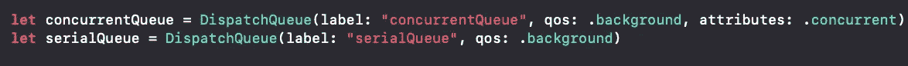
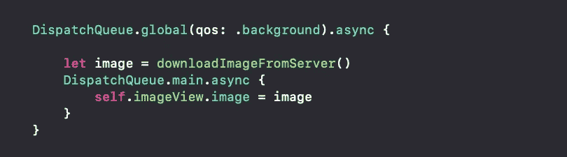
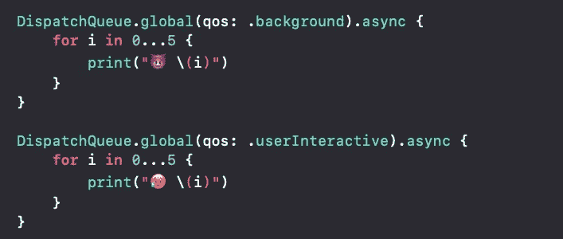
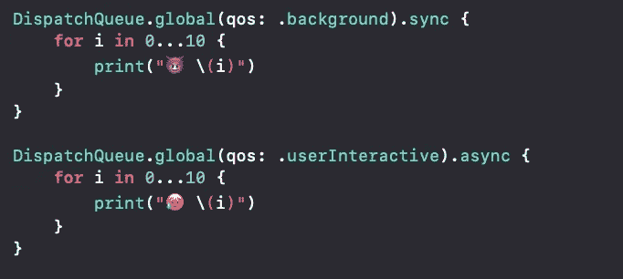

# 初学者使用 GCD 的快速多线程。

> 原文：<https://medium.com/hackernoon/swift-multi-threading-using-gcd-for-beginners-2581b7aa21cb>

# **简介:什么是大中央调度(GCD)**

> 据苹果:
> “GCD 提供并管理 FIFO 队列，你的应用可以以块对象的形式向其提交任务。提交到调度队列的工作在完全由系统管理的线程池中执行。不保证任务在哪个线程上执行。

换句话说，GCD 是 apple 提供的一个 API，允许您以一种平滑的方式管理并发操作，以避免您的应用程序冻结，并保持它始终响应用户。

# 队列类型:

在处理 GCD 时，有 3 种类型的队列:

## **1-主队列:**

这个队列具有最高的优先级，它运行在主线程上。所有的用户界面更新都应该在这个线程上完成，否则你的应用程序会出现滞后和奇怪的崩溃。你可以像这样简单地使用它:

## 2-全局队列:

根据 QOS(服务质量)，从最高优先级到最低优先级，该队列分为 4 种主要类型和一种默认类型:

1-用户互动:*工作几乎是即时的。类似于主线程。* 2-用户发起:工作**几乎是瞬间的**，比如**几秒钟或者更少。
**3-默认**:平时不用，类型会由系统推断
4-效用:工作需要几秒到几分钟。
5-背景:工作需要大量时间，例如**分钟或**小时。**

实用程序和后台线程都应该用于需要时间的繁重操作，以免阻塞主线程。
你可以简单地调用一个如下:

## 3-自定义队列:

自定义队列是您可以自己创建的队列，并提供您想要的任何 QOS 和属性:

# 一起使用队列:

通常在现实世界中，您经常需要一起使用这些队列。
比方说，你需要做一个繁重的操作，比如下载和图像，然后在 imageView 中显示这个图像。你按如下方式做:

正如你所注意到的，我们在后台线程中做了大量耗时的操作，然后使用主线程在 imageView 中显示图像。

# 异步与同步:

正如你在上面的例子中看到的，我们在每个队列后使用了单词 async。使用 GCD，您可以同步或异步地分派任务。
Sync 表示在同步操作完成之前不会启动其他任务，而 Async 则允许其他任务启动，即使它尚未完成。

让我们看看现实世界中的例子:

The Emojis are used to help distinguish between each thread.

注意，在上面的例子中，两个任务都是异步的，它们是同时执行的。然而，用户交互线程比后台线程有更高的执行优先级，这在前面讨论过。
现在让我们看看，如果第一个任务是同步，会发生什么:

正如您所看到的，尽管 userInteractive 线程具有更高的优先级，但它直到第一个同步任务完成后才被执行。

尽管上面的例子很简单，但它清楚地显示了一个程序如何处理同步和异步运行的队列，所以除非需要，否则您应该知道使用 sync，并且在大多数情况下使用 async 以避免在用户面前阻塞您的应用程序。

# 结论:

关于如何管理应用程序中的线程，还有很多需要了解的内容可以放在一篇文章中。但是作为初学者，重要的是要知道，你不应该异步地执行缓慢或昂贵的进程，你应该总是在低优先级线程上执行它们(例如:后台线程)，并且总是记住在主线程上进行任何 UI 更新。

# 关于 GCD 的一些重要参考资料:

*   [Ray Wenderlich](https://www.raywenderlich.com/5370-grand-central-dispatch-tutorial-for-swift-4-part-1-2) 线程教程。
*   [Appcoda](https://www.appcoda.com/grand-central-dispatch/) 关于并发的文章。
*   当然了..[苹果文档](https://developer.apple.com/documentation/dispatch)。

## **如果你有兴趣，请阅读我关于 swift 内存管理的文章:**

 [## Swift:通过示例避免内存泄漏

### 在 Swift 中，自动引用计数(ARC)用于管理 iOS 应用程序中的内存使用。每次你创造…

medium.com](/@BarekJaafar/swift-avoiding-memory-leaks-by-examples-f901883d96e5)