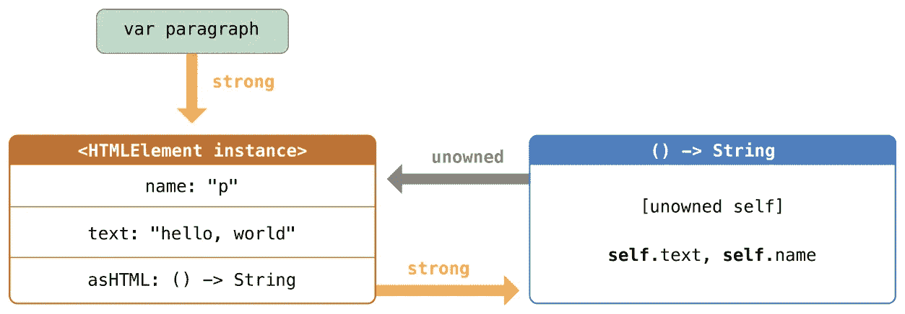

# Swift 弱 vs 无主

> 原文：<https://medium.com/hackernoon/swift-weak-vs-unowned-by-examples-ffcc7c25ecc8>

## 什么时候用弱，什么时候用无主，举例说明。

## 问题

在[之前的文章](https://hackernoon.com/swift-avoiding-memory-leaks-by-examples-f901883d96e5)中，我们讨论了如何使用自动引用计数(ARC)来管理 iOS 应用程序中的内存使用。然而，在某些情况下，由于保留周期，ARC 不能从内存中释放对象。

Retain Cycle 是这样的情况，当两个对象相互强烈引用并被保留时，使得 ARC 无法从内存中释放这些对象，并导致我们所说的“内存泄漏”。

## 解决办法

默认情况下，每当我们声明一个变量时，它都被认为是“强”，为了避免保留循环，我们应该将这些变量声明为“弱”或“无主的”。本文主要关注的不是处理内存管理，如果您不熟悉该主题，请阅读[上一篇文章。](https://hackernoon.com/swift-avoiding-memory-leaks-by-examples-f901883d96e5)

我们的重点将放在何时使用 weak 以及何时使用 unowned by real-world 示例更好。

# 弱小与无主

[根据苹果的文档:](https://docs.swift.org/swift-book/LanguageGuide/AutomaticReferenceCounting.html)

> 当闭包和它捕获的实例总是相互引用，并且总是同时被释放时，将闭包中的捕获定义为无主引用。
> 
> 相反，当捕获的引用可能在将来的某个时刻变成`nil`时，将捕获定义为弱引用。弱引用总是可选类型，当它们引用的实例被释放时，会自动变成`nil`。这使您能够检查它们在闭包体内的存在。

虚弱和无主的主要区别在于`weak`是可选的，而`unowned`是非可选的。
通过声明它`weak`，你可以处理这样的情况:在闭包里，它可能在某个时刻为零。如果你试图访问一个碰巧为零的`unowned`变量，将会使整个程序崩溃。所以只有当你确信当闭包在附近的时候变量总是在附近的时候，才使用`unowned`。

## **无主**

你可能之前已经听过很多了，但是当你真的应该确信当闭包在附近时变量总是在附近，所以你可以毫无顾虑地使用`unowned`？
让我们看看下面的例子:

在上面的例子中，闭包不可能比 ViewController 活得更长，在这种情况下，您可以放心地使用`unowned`。

## **弱**

现在在下面的例子中，让我们看看什么时候应该使用`weak`来避免崩溃:

在上面的例子中，你永远不能确定 ViewController 会比 closure 活得更久，因为网络调用响应可能在关闭控制器后发生，所以你应该明确地使用`weak`作为一个选项来避免崩溃。

如果我们可以在所有情况下使用`weak`，那么为什么要使用`unowned`并冒着应用崩溃的风险呢？根据苹果公司的说法，答案很简单:

> 如果捕获的引用永远不会变成`nil`，那么它应该总是被捕获为一个无主引用，而不是一个弱引用。

Unowned 速度更快，并且允许不变性和非可选性。

**不需要弱的就不要用。**

## 结论

为了避免内存泄漏，我们应该将变量声明为弱变量或无主变量，而不是默认的强变量实现。
然而，它们之间的关键区别在于，weak 是一个可选类型，而 unowned 不是，所以我们应该只在 100%确定闭包与变量具有相同的生存期时才使用 unowned，所以闭包只有在变量可达之前才可达*。*

## 参考

*   [苹果的文档](https://docs.swift.org/swift-book/LanguageGuide/AutomaticReferenceCounting.html)
*   [堆栈溢出](https://stackoverflow.com/questions/24320347/shall-we-always-use-unowned-self-inside-closure-in-swift)

阅读我以前的文章，通过例子来避免内存泄漏

 [## Swift:通过示例避免内存泄漏

### 在 Swift 中，自动引用计数(ARC)用于管理 iOS 应用程序中的内存使用。每次你创造…

hackernoon.com](https://hackernoon.com/swift-avoiding-memory-leaks-by-examples-f901883d96e5)