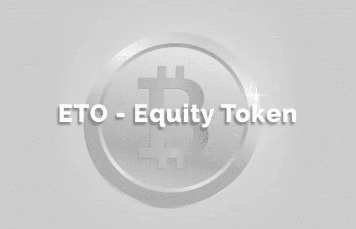
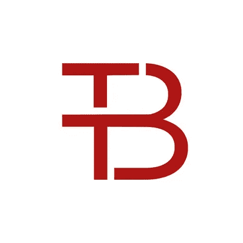
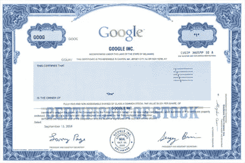

# 瑞士和列支敦士登改进了有利于 s to 的加密法规

> 原文：<https://medium.com/hackernoon/switzerland-and-liechtenstein-improve-their-crypto-friendly-regulations-to-favour-stos-b54c9337a5f6>

如今，令牌化证券是最热门的加密话题。在所有可能的象征性投资中——债务、实物资产或股票——最吸引人。尽管事实上债务令牌化才是“易得之果”，因为它实施起来相当简单，而且几乎没有监管约束。事实上，[第一笔欧盟债务令牌化最近在德国完成](https://hackernoon.com/the-first-sto-milestone-is-german-bitbond-issues-the-first-bafin-approved-security-token-bond-70925e61f2d)。

相反，由于监管限制的数量，股权的令牌化要复杂得多。

## **股权证券化的监管障碍**

可以理解的是，股权的令牌化对风险投资公司、投资银行家、商业天使和中小企业极具吸引力；所有人都对这可能带来的机会垂涎三尺。

尽管如此，尽管增加的流动性、可交易性以及低发行和转让成本经常被吹捧为股票令牌化的最大优势，但很少有人完全意识到仍然限制这些潜在优势的法律约束。

ThinkBlockTank

在最近由 Wardynski Partners 在华沙组织的一次[智库](http://thinkblocktank.org/)活动中，欧洲区块链专业律师中最杰出的人聚集在一起讨论最近的监管发展；例如，瑞士和列支敦士登在实现无摩擦的令牌化监管环境方面取得了进展。

围绕股权代币化的主要障碍仍然存在:(I)股份的格式，(ii)转让的方式和证明，(iii)股份和代币之间的联系，以及(iv)对基于 DLT 的证券代币注册的客观和主观要求。例如，当某个司法管辖区规定了股份的纸质格式、将股份输入公共机构持有的登记册的必要性、转让的书面形式要求或证明转让的公证认证时，此类监管约束显然[使令牌化的目的和益处](https://cointelegraph.com/news/why-tokenization-is-still-a-chimera-expert-take)无效。

## **瑞士解决方案**

在会上， [Stephan Meyer](https://www.linkedin.com/in/stephandmeyer/) ，一位来自苏黎世和楚格的 [MME 律师事务所](https://www.mme.ch/)的同事，已经在建立[以太坊基金会](https://ethereum.org/foundation)中发挥了重要作用，解释了在瑞士创建股票代币的法律和监管基础。这项工作是由最近与瑞士电信合作创建的一个合资令牌化平台完成的。

根据[瑞士债务法](https://www.admin.ch/opc/en/classified-compilation/19110009/201507010000/220.pdf)第 973c 条，无证书股份可以发行，发行人应保留一本记录股份所有权的账簿。由于瑞士法律没有规定其他要求，代表股票的代币可以使用区块链/DLT 基础设施进行注册和转让。举例来说， [Daura 平台](https://www.daura.ch/ui)被设置为在私有/许可的 [Hyperledger Fabric](https://www.hyperledger.org/) 区块链上运行，在该平台上注册无证书股票，并通过智能合约发行和管理相应的股权凭证。

股权转让以三方协议的形式进行，以避免书面形式，否则在瑞士也是合法要求的。预计从 2020 年起，瑞士将引入一种新的“DLT 右翼”。瑞士联邦委员会于 2019 年 3 月提出了几项[立法修正案](https://www.admin.ch/gov/en/start/documentation/media-releases/media-releases-federal-council.msg-id-74420.html)，以进一步促进区块链项目和具体的安全令牌。立法优化现在正处于正式磋商过程中。

此外，还有一些额外的优势，使瑞士成为一个非常适合发行股票的司法管辖区。直接一级市场发行不需要许可证和招股说明书，唯一的要求是一份非常简单的“民法招股说明书”，这意味着在发行人不忠实声明的情况下要承担民法责任。不过，从 2020 年开始，将需要一份简化的“监管”招股说明书。

此外，证券代币的直接一级市场发行者没有强制性的反洗钱义务需要遵守。最后，尽管集中交易确实需要二级市场许可证——比如目前提议的 DLT 交易机构许可证——点对点交易仍然不受监管；因此，也是完全分散的交易所。

## **德国并发症**

因此，人们可以将瑞士立法者灵活、直接和“轻松”的方法与德国立法者相应的意图进行对比。关于可以持有证券令牌的登记册的同一问题，德国立法者[在财政部 2019 年 3 月 7 日](https://www.bundesfinanzministerium.de/Content/DE/Standardartikel/Themen/Internationales_Finanzmarkt/2019-03-08-eckpunktelelektronische-wertpapiere.pdf;jsessionid=1930ACAE3C9C83C81521CD9F314626D6?__blob=publicationFile&v=5)发布的提案中，打算将区块链证券令牌登记册的所有权限制在政府当局或 MiFID 授权的中介机构。这违背了区块链的宗旨和性质。

> 如果有的话，争论应该集中在可用于此类注册管理机构的区块链的类型上，而不是将位于区块链的安全注册管理机构置于授权中介的直接监管之下，授权中介绝不比适当设立的区块链更值得信赖。

区块链本质上适合于发行和转移代币，因为它们是防篡改的，并且允许跟踪法定所有权。因此，区块链证券交易的发行、清算和结算应该是远程交易系统的主要应用和用途之一。虽然目前德国立法者似乎完全没有抓住要点，但希望他们将来会重新考虑这个问题。

## **目光远大的李奇登斯坦方法**

另一方面，列支敦士登更倾向于瑞士。

瓦杜兹[n gele 律师事务所](https://www.naegele.law/)的同事[Thomas n gele](https://www.linkedin.com/in/thomasnaegele)强调了新提议的[可信技术法](https://www.naegele.law/downloads/2018-10-23_Unofficial-Translation-of-the-Government-Consulting-Report-Blockchain-Act.pdf)的一些重要部分。

这项法律草案是一项全面的立法，涉及 DLT、代币及其法律处理。就股权代币而言，它还涉及瑞士法律没有明确处理的问题，例如善意购买权利和免除/解除债务人的义务。

这将通过 1926 年《81a 澄清个人和公司法(PGR)》以及包括以下内容的附加条款来实现:

*   对 PGR 境内允许非物质化股份存在近 100 年的原有规定的解释；
*   法律没有规定持有非证书权利的登记册的格式，但“可信技术”明确包括 DLTs
*   如果使用 DLT，非证书权利的转让仅在 DLT 上进行时有效；这通过法律排除了在区块链以外的“真实世界”质押或转让无证书权利与代表此类权利的基于区块链的令牌转让之间的潜在冲突；
*   任何在区块链获得无证书权利的人都应受到保护，即使卖方并不拥有潜在的“真实世界”权利；
*   向在 DLT 注册的债权人付款的债务人被解除义务。

列支敦士登的这项立法草案也是——至少到目前为止——欧洲最先进的立法草案之一，它提出了重要的问题和法律挑战，我们将在今后继续就这些问题和挑战进行辩论。

******************************************************************

特别感谢列支敦士登[n gele Law](https://www.naegele.law/)律师事务所 [Alexis Esneault](https://www.linkedin.com/in/alexis-esneault-0891bb45/) 在准备本文时给予的支持

# security tokens # tokens # bianconiandrea #区块链# crypto # think block tank # tokenization #瑞士#列支敦士登