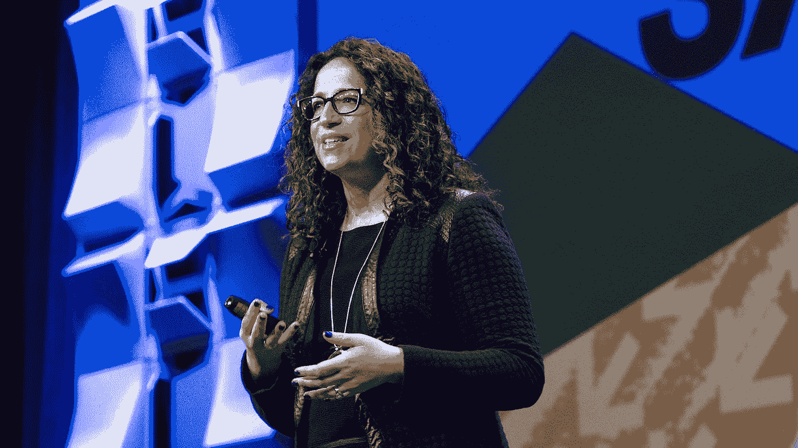
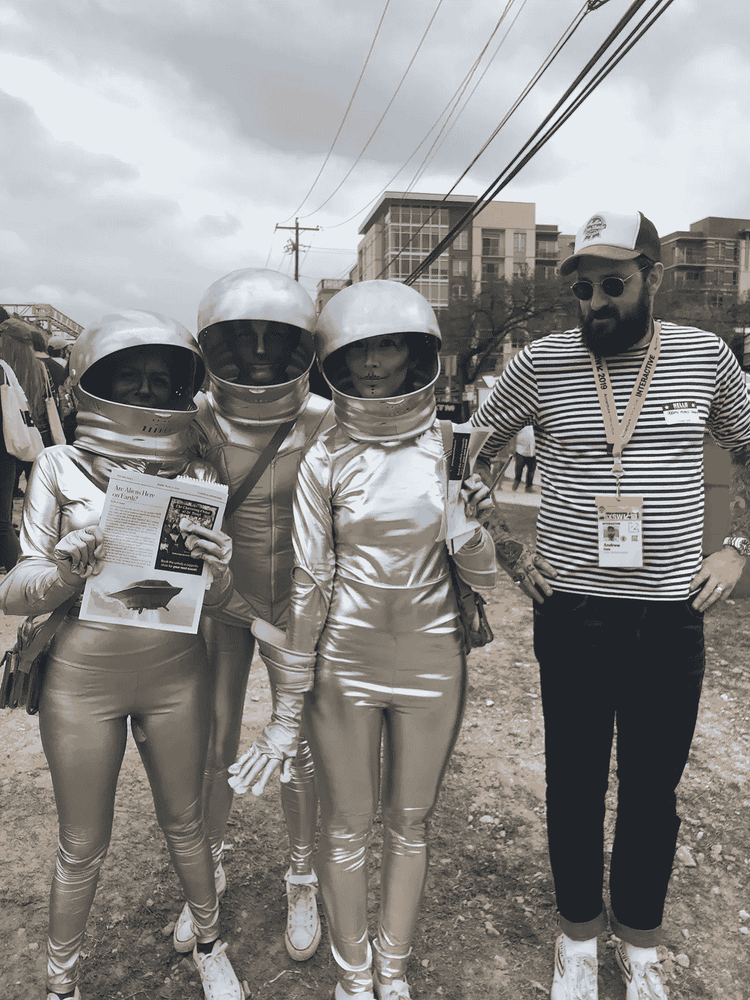
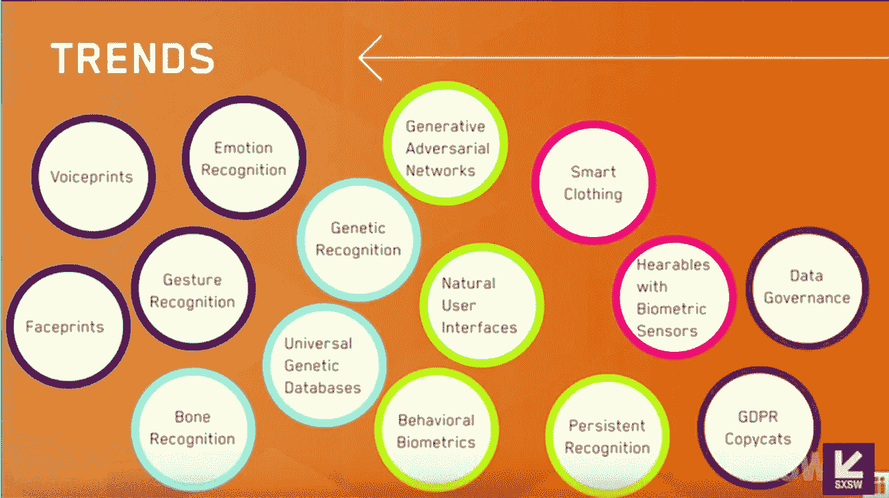
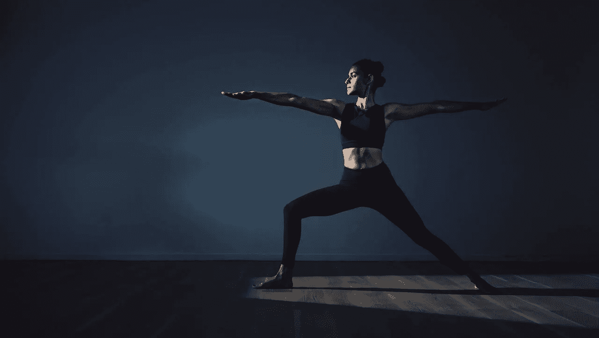
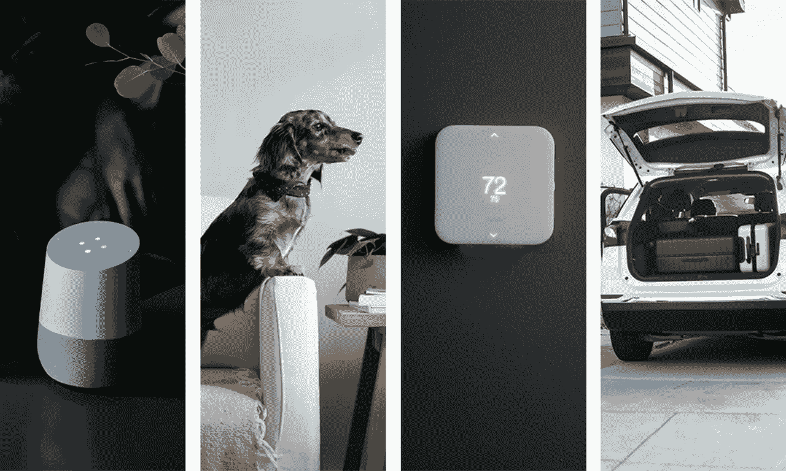
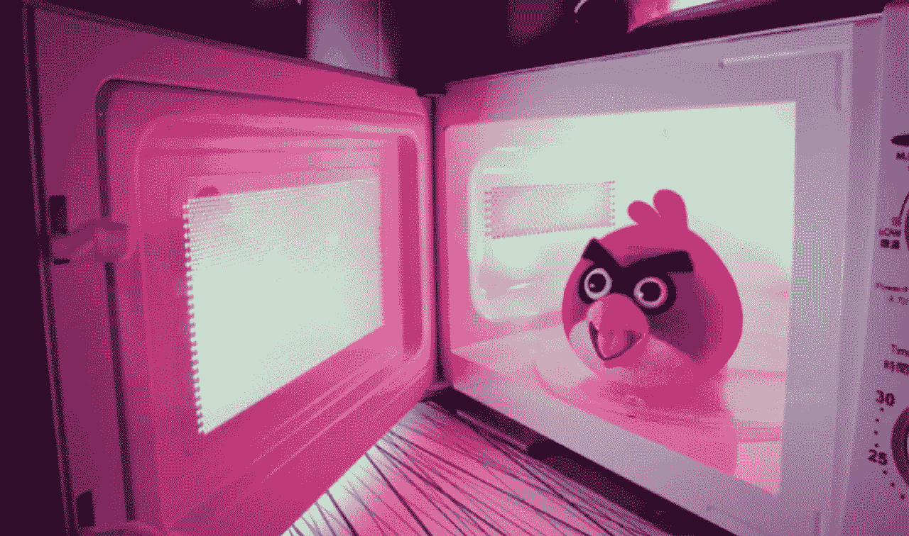
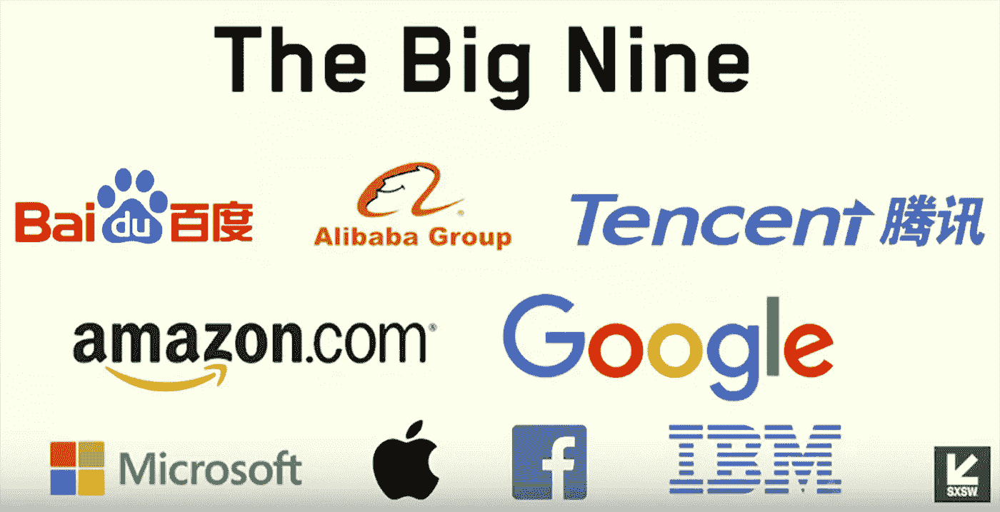

# SXSW 2019 上的新兴技术趋势

> 原文：<https://medium.com/hackernoon/sxsw-2019-emerging-tech-trends-a8a8d17ff14c>

## 我们参加了 NYU 斯特恩商学院战略远见教授艾米·韦伯关于 2019 年新兴技术趋势报告的精彩演讲。

安迪·伊娃·戴尔

这涵盖了该报告如何将 315 种当前技术趋势与 2034 年的未来情景联系起来，以及这些趋势发生的可能性。

我们还参加了 O'Reilly《设计 Web APIs》一书的作者 Brenda Jin 和 Saurabh Sahni 举办的关于构建 API(应用程序编程接口)以促进增长的研讨会；他们现在都在 Slack 工作。这涵盖了 API 的基础知识，包括真实世界中的例子和 Slacks 代码中的错误。该团队在整个研讨会上分发了他们的书。除了深入研究不同类型的 API 及其实现之外，它还涵盖了一些向大众推广 API 的技巧。

**“我们要去一个未来我们都快乐的地方，唯一的方法就是我们现在都做出更明智的决定”——艾米·韦伯**

在 SXSW 2019 期间，我们参加了 NYU 斯特恩商学院战略远见教授艾米·韦伯关于 2019 年新兴技术趋势报告的精彩演讲。在过去的两次 SXSW 活动中，她连续发表了关于技术趋势报告的演讲。2019 年新兴技术趋势报告概述；基于 315 个关键技术趋势之间的联系构建场景。艾米经历了报告中强调的 16 种趋势，分为认知服务(深蓝色)、基因组学(浅蓝色)、自然用户界面(浅绿色)、生物识别(黄色)、可穿戴设备(粉红色)和数据隐私(深绿色)；这些显示如下:

然后，她浏览了 16 种趋势中每一种趋势的几个真实工作实例。我认为其中最有趣的是生物识别和可穿戴设备。Amy 举了一个最近见诸媒体的例子，沃尔玛希望在购物车中安装生物传感器，以读取顾客的体温、心率、推购物车的速度和力度等。然后，沃尔玛可以确定任何给定顾客的情绪状态，无论他们是愤怒还是沮丧；因此，他们可以派一名店员来帮忙。在可穿戴设备领域；

**苹果公司正在研究生物瑜伽打底裤。知道自己是否正确地做了下犬动作有多好？**

[在此观看全文](https://www.youtube.com/watch?v=g7k5ceY2qkU)

来源:[可入库](https://www.wareable.com/smart-clothing/best-smart-clothing)

根据 315 种趋势之间的联系，该报告本身包含了对 2034 年的 48 种假设的未来情景。每个场景都包含一个基于灾难确定性和影响程度的行动矩阵；建议您的组织是否应该立即采取行动，保持警惕观察，通知战略或稍后再访。

然后，这些情景被分成三种可能的框架:“乐观”、“中性”和“灾难性”。然后报告预测每个框架成为现实的可能性。然后她回顾了报告中的几个场景。真正引起我想象力的是生物识别技术。以下是 2034 年这一趋势的三个框架和可能性:

**乐观(10%可能)**:数据收集是透明的，人们了解我们在何时何地如何被监控。这是密码的末日！不再有双因素认证！再也没有登机牌，实体信用卡，或者驾照！生物特征扫描是安全可靠的。科技丰富了我们的生活！隐私已死…但我们没事。

**中立(50%可能性)**:我们维持现状。整合随之而来。生物识别数据被锁定在少数几家技术提供商手中，我们的数据不具备互操作性，我们也是如此。很多漏洞，认证很烦人，我们以新的方式被黑客攻击

**灾难性的(40%可能)**:公司积极反对保护我们的生物识别数据。我们不知道我们的数据在哪里，也不知道谁拥有它。监管来得很快，碎片让位于受保护的生物数据区。沃尔玛的购物车不能跨州。出现了新的经济和社会阶级体系。富人购买高级服务来匿名化他们的生物数据。其他人都有他们的生物数据挖掘，提炼和产品化。专制国家创建通用基因数据库来监控他们的公民。

来源: [Vivint](https://www.vivint.com/resources/article/smart-home-trends-2019)

# **智能家居:谁说了算？**

我发现了乌托邦式乐观未来的想法，可惜这是三个框架中最不可能的！最可怕的场景着眼于我们未来的智能家居，这里又是框架和可能性:

**乐观(可能性为 0)**:我们的设备可以跨平台工作，并且真正具有互操作性。我们的家庭很容易与谷歌、亚马逊和苹果混在一起。它们帮助我们节省时间和精力。我们正被推向更好、更健康的生活方式。智能家居安全又好玩！

**中性(30%可能)**:我们继续这条路，没有大的变化。我们很快意识到我们不能像改变移动操作系统一样改变我们的家庭/办公室/学校操作系统(即使那也很难！)我们很沮丧，花了比我们想要的更多的钱，而且几乎没有选择。

**灾难性的(70%的可能性)**:你住在谷歌、亚马逊或苹果的家中，你所有的数据也是如此。你不明白决策是如何为你做出的。你的智能家居会做出你不会做出的决定。微波炉决定你应该节食，不让你吃爆米花。洗衣机决定你可以多穿一天牛仔裤。你的车库决定你应该步行去上班。

来源: [Reddit](https://www.reddit.com/r/MicrowavePics/comments/29gj0g/angry_bird_microwave/)

这是可怕的权利；但我不得不同意这份报告，如果世界科技巨头之间没有更多的合作，很难看到灾难性的未来；历史告诉我们这是极不可能的。

在未来，我们的生活很有可能被 9 大全球科技巨头(百度、阿里巴巴、腾讯、亚马逊、谷歌、微软、苹果、脸书和 IBM)所控制，而我们对此无能为力。

如果你和我一样被这篇报道迷住了；完整的报告可以从[这里查看或下载。](https://futuretodayinstitute.com/2019-tech-trends/)

当你抵达奥斯汀机场的时候，城市的标语会用“保持奥斯汀的怪异”来迎接你。

*原载于*[*www.tangent.co.uk*](https://www.tangent.co.uk/idea/sxsw-2019-emerging-tech-trends)*。*

*请点击掌声按钮将这篇文章推荐给你的朋友！*

*你也可以查看我们的* [*网站*](https://www.tangent.co.uk) *和* [*推特*](https://twitter.com/ThisIsTangent)*[*Linkedin*](https://www.linkedin.com/company/thisistangent/)*和*[*insta gram*](https://www.instagram.com/thisistangent/)*上的帖子。**

*别忘了通过我们的网站注册我们的时事通讯[，获取更多灵感。](https://www.tangent.co.uk/contact)*