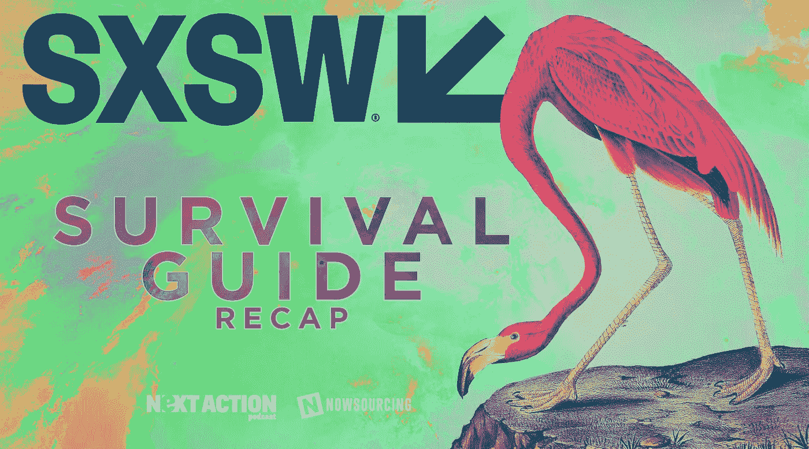
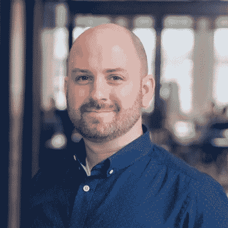

# SXSW 2019 上人们在谈论什么

> 原文：<https://medium.com/hackernoon/sxsw-may-be-over-but-now-is-the-time-to-start-prepping-for-next-year-fd125e24bb45>

## 今年在 SXSW 录制了 6 集播客。

SXSW 可能结束了，但现在是时候开始为明年做准备了。如果这是你的第一年，它可能看起来势不可挡，即使你已经经历过很多次，没有计划的去可能意味着错过很多机会。不要担心，[下一个行动播客](http://www.nextaction.cc/)有大量的提示和技巧来帮助你最大限度地利用明年在 SXSW 的时间。

## [SXSW 元老:从音乐人到 VC: Brian Penick](http://www.nextaction.cc/2019/02/20/sxsw-veteran-from-musician-to-vc/)

LinkedIn profile of Brian Penick, used with permission

SXSW 2019 标志着[Brian PE nick](http://whatisyourlegacy.vc)的第 12 年访问——但他是从 SXSW 的音乐方面开始的。作为一名音乐人，Penick 积累了十多年的技巧和诀窍，不仅可以生存，还可以在 SXSW 期间茁壮成长。我们讨论时间管理、战术技巧，当然，还有最好的就餐地点。

## 新闻和新技术:杰弗里·鲍尔斯

Jeff Powers Twitter bio pic — used with permission

这次聊天的主角是 Jeff Powers，他是 Geekazine 和 Geekazine Live 的所有者。从媒体的角度和 SXSW 记者的角度来看，我们从 Powers 那里获得了有趣的见解，因为他回忆了他参加的前五年。从休息室里保守得最好的秘密到拍摄视频内容的最佳地点，这场讨论有助于我们理解 SXSW 的媒体视角。

## [SXSW:情商如何胜出:韦斯利·福克纳](http://www.nextaction.cc/2019/03/03/sxsw-how-emotional-intelligence-wins-the-day/)

Wesley Faulkner LinkedIn bio — used with permission

从贸易展一直到独家的会后派对，有时 SXSW 的品牌会让个人黯然失色。在 SXSW 这样的活动中，人际关系非常重要，保持个人真实是关键。[韦斯利·福克纳](https://twitter.com/wesley83)通过强调真诚和真正兴奋在人际交往中的价值来解决这个问题。

## [SXSW:密码与社会影响:克里夫·梅西多](http://www.nextaction.cc/2019/03/06/sxsw-crypto-and-social-impact/)

Cleve Mesidor — used with permission

这是第一年在 SXSW 举办加密和区块链专题讲座，嘉宾 [Cleve Mesidor](http://www.mylogos.io) 是其中一名演讲者。她和我聊了聊 crypto 和区块链的社会影响，以及在 SXSW 的这个空间里应该寻找什么。

## [SXSW:找到合适的演讲者并激发持久的能量:Lynae Cook](http://www.nextaction.cc/2019/03/14/sxsw-spotting-the-right-speakers-and-sparking-outlasting-energy/)

Lynae Cook — used with permission

在 SXSW 的繁忙中，你在那里度过的每一分钟都是宝贵的。 [Lynae Cook](http://lynaecook.com) 和我一起讨论时间管理的艺术和建立适合你的时间表。她分享了她对如何专业地选择要参加的活动，如何优先考虑发言者，以及何时可以离开一个活动的见解。

## 安琪丽可·拉鲁

Angelique LaRue Twitter profile pic — used with permission

安琪丽可·拉鲁是 SXSW 规划大师和日程黑客。她成功地运作了一个最有帮助的 SXSW 规划小组，有 2000 多人。在我们的播客中，LaRue 详细介绍了拥有一个可靠的比赛计划的重要性，以及它如何帮助确保你参加正确的活动，遇见正确的人，明智地花费宝贵的时间。

**如果你想听更多下一期的动作播客—** [**点击这里订阅**](http://nextaction.cc)