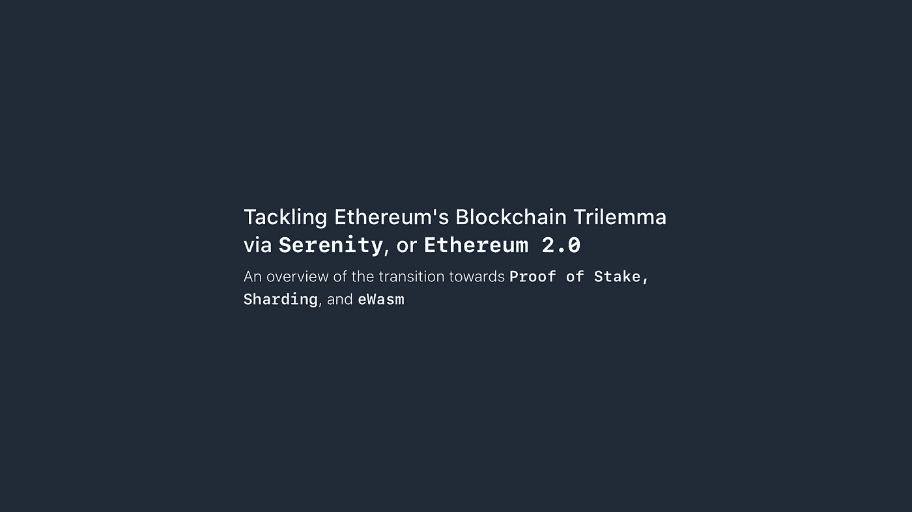

# 通过宁静号解决以太坊的区块链困境，以太坊 2.0

> 原文：<https://medium.com/hackernoon/tackling-ethereums-blockchain-trilemma-via-serenity-ethereum-2-0-1fb423a6b184>

## 概述即将向利益证明(Casper)、分片和以太坊风格的 WebAssembly (eWasm)过渡

*以下帖子是 2019 年 4 月写的一篇学术风格的文章。根据你阅读这篇文章的时间，以太坊的路线图可能已经发生了很大的变化。*

# **以太坊扩展问题介绍&区块链三难困境**

以太坊是一个去中心化的应用平台，运行应用程序没有任何欺诈、审查或第三方干扰的机会。以太坊为数以千计的分散式应用(dApps)提供动力，被誉为这个时代最具定义性的数字货币项目之一，在商业和非商业环境中都得到了广泛应用。然而，随着网络流量的持续增长，其可扩展性已经达到了一定的极限。可伸缩性通常可以描述为应用程序处理增加的流量负载的能力；对于诸如以太坊这样的加密项目，这通常指的是在给定的时间范围内网络可以处理的事务数量或吞吐量的限制。

以太坊团队背后有一个最大、最支持和最活跃的社区，他们一直试图解决业内称为区块链三难困境的问题。该术语由以太坊创始人 Vitalik Buterin 提出，认为在基本层面上，区块链只能实现以下三个特征中的两个:安全性、去中心化和可伸缩性。

以太坊路线图中即将发布的 Serenity 版本，也称为以太坊 2.0，包括该项目的三个主要更新，旨在实现上述属性之间的平衡。也就是说，该里程碑计划包括从工作共识系统证明到利害关系证明、分片的过渡，以及将现有的 EVM 执行引擎迁移到以太坊风格的 WebAssembly (eWasm)。下面的帖子深入探讨了这三个更新，并回顾了 Serenity 版本的当前状态和时间表。

# **利害关系的证明&卡斯珀·V2 协议**

将以太坊区块链转换为赌注证明(PoS)共识算法是备受期待的 Serenity 版本中的第一个重大更新。以太坊的当前实现利用了工作证明(PoW)共识过程，该过程奖励解决复杂数学难题的参与者，以便通过称为挖掘的过程来验证交易并生成新块。然而，采矿被批评为一种不可持续的做法，因为它的硬件和电力成本昂贵，而且集中化的风险很高。

股权证明系统使区块链能够在没有与采矿相关的非常高的硬件和电力成本的情况下运营，同时还降低了集中化的风险。在这样的系统中，“区块链通过一个过程附加并同意新的区块，在这个过程中，系统内持有硬币的任何人都可以参与，代理的影响力与它持有的硬币数量成正比”(Buterin 和 Griffith，2017)。

最初的计划是逐步将以太坊过渡到卡斯帕 FFG 协议的利益证明，这是一个混合区块链，利用工作证明和利益证明。这个最初的协议要求最低存款 1500 以太成为一个验证者。然而，卡斯帕·FFG 的计划已经被放弃，取而代之的是卡斯帕·V2，一个将以太坊迁移到被称为信标链的纯股权证明区块链的协议。信标链将需要最少 32 个以太的存款才能成为验证器，并作为分片的基础层(Dexter，2019)。

# **分片**

分片是 Serenity 版本中包含的第二个重大更新，旨在大幅提高以太坊区块链的总吞吐率。目前，以太坊区块链中的每个节点处理所有交易并存储整个状态——账户余额、合同代码和其他属性。虽然这提供了很大的防篡改安全性，但它极大地限制了可扩展性，因为这样的“区块链不能处理比单个节点更多的事务”(布特林*等人*，2016)。

以太坊的分片实现类似于传统数据库分片中的技术，“状态的不同部分由不同的节点存储，事务根据它们影响的分片定向到不同的节点，以便可以并行处理”(Buterin，2016)。事实上，通过分片进行扩展的根本动机是在许多节点之间划分验证责任。在所提出的系统中，仍然会有足够数量的节点来验证每个交易，以维持高水平的安全性，但是交易处理将在更小的节点集之间被分开。分片被高度视为急需的机制，以太坊可以通过它“扩展到应用程序的实际水平，同时仍保留其去中心化和安全性”(Curran，2019)。

# **以太坊风味网络大会(eWasm)**

eWasm，或以太坊风格的 WebAssembly，是 Serenity 中包含的第三个也是最后一个主要更新。为了理解 eWasm 背后的动机，认识以太坊区块链节点如何处理传入的事务是很重要的。

目前，以太坊区块链的系统状态是通过“虚拟状态机的正式模型，称为以太坊虚拟机(EVM)”来改变的(Wood，2019)。然而，当前的 EVM 与早期的规范相比几乎没有什么变化，并且在灵活性和性能方面已经达到了极限。具体来说，EVM“没有针对不同硬件平台上的速度进行优化，也没有针对可移植性进行优化”，这意味着它在智能合约开发的工具和语言支持方面受到限制(Beyer，2019)。

通过将现有引擎迁移到 WebAssembly，eWasm 将取代当前的 EVM，成为以太坊平台上的新执行引擎，web assembly 是一种针对虚拟机进行了明显优化的二进制格式。eWasm 可以被解释为“智能合约的运行时环境，目标是[是]可移植的[同时]运行代码几乎与本机代码一样快”(Signer，2018)。基于 wasm 的 EVM 将利用改进的硬件功能，理论上可以支持编译成 WebAssembly 的任何语言的智能合约开发，包括 Go、Rust、C、C++等(Beyer，2019)。最终，这些扩展的选项和功能将允许以太坊代码更快地执行。

# **当前状态&时间表**

以太坊最近在 2019 年 4 月初及时发布了 Testnet，允许网络用户测试其备受期待的 stake 升级证明(Isige，2019)，从而向 Serenity 迈进了一步。然而，尽管最近取得了成功，围绕以太坊 2.0 进展的延迟和模糊性已经导致一些批评者怀疑该项目的长期生存。事实上，项目的路线图已经见证了发布的延迟，优先级的改变，时间表的延长，甚至已经开始竞争项目的关键团队成员的离开。随着开发的推进，许多人对项目的当前状态感到疑惑。尽管预计将于 2021 年完成，但尚不清楚该版本将于何时上线(道尔顿，2019 年)。然而，Buterin 最近提供了保证，声称最近的治理问题没有推迟以太坊 2.0 的进展(Wall，2019)。

# **展望未来**

以太坊肯定有一个充满希望的未来——尽管有些模糊和不确定。以太坊团队面临着实现更高级别的可伸缩性的压力，因为更新的项目是用看似更先进的技术发布的。除了日益激烈的竞争，以太坊确实必须提高其可伸缩性，如果它要处理巨大的流量高峰，这将随着更多分散化的应用程序在其区块链上发布而发生。

应该注意的是，除了上面提到的解决方案，其他以太坊扩展解决方案也正在开发中。值得注意的项目包括 Plasma 和 Raiden，它们都通过在主以太坊网络之上提供一个额外的层来提供链外扩展解决方案——类似于比特币项目提议的闪电网络——能够处理大量交易。然而，严格来说，这些项目并不被认为是以太坊 2.0 路线图的一部分，因此不在本文的讨论范围之内。

最终，Serenity 版本中的更新旨在解决重要的扩展、共识和安全问题，并使网络超越其当前化身的限制。如果发布顺利且及时，以太坊可能会在可预见的未来保持其作为主流分散应用平台的地位，并平息竞争项目的反弹。然而，如果项目继续经历延迟和其他主要障碍，它很可能被现有的和新兴的竞争对手超越。

# 参考

Beyer，S. (2019) *EWASM(以太坊风味 WebAssembly)讲解*。可在:【https://www.mycryptopedia.com/ewasm/ (2019 年 4 月 16 日进入)。

Buterin，V. (2016) *以太坊平台评论:私人和财团区块链的机遇和挑战*。可在:[http://www . small ake . kr/WP-content/uploads/2016/06/314477721-ether eum-Platform-Review-Opportunities-and-Challenges-for-Private-and-Consortium-block chains . pdf](http://www.smallake.kr/wp-content/uploads/2016/06/314477721-Ethereum-Platform-Review-Opportunities-and-Challenges-for-Private-and-Consortium-Blockchains.pdf)(2019 年 4 月 16 日访问)。

Buterin，V. (2013) *以太坊白皮书:下一代智能合约&去中心化应用平台*。可在:[http://block chain lab . com/pdf/ether eum _ white _ paper-a _ next _ generation _ smart _ contract _ and _ decentralized _ application _ platform-vitalik-buter in . pdf](http://blockchainlab.com/pdf/Ethereum_white_paper-a_next_generation_smart_contract_and_decentralized_application_platform-vitalik-buterin.pdf)(2019 年 4 月 16 日访问)。

Buterin，v .和 Griffith，V. (2017) *Casper 友好的终结小工具*。可在:[https://arxiv.org/pdf/1710.09437.pdf](https://arxiv.org/pdf/1710.09437.pdf)(2019 年 4 月 16 日访问)。

布德林，V. *等* (2016) *关于分片区块链*。可在:【https://github.com/ethereum/wiki/wiki/Sharding-FAQ (2019 年 4 月 16 日访问)。

Curran，B. (2019) *什么是分片？以太坊扩展概念指南解释*。可在:[https://blockonomi.com/sharding/](https://blockonomi.com/sharding/)(2019 年 4 月 16 日访问)。

m . dalton(2019)“Vitalik buter in 说以太坊 2.0 如期而至”，*未摆脱*。可在:[https://unha shed . com/cryptocurrency-news/vitalik-buter in-says-ether eum-2-0-is-right-on-schedule/](https://unhashed.com/cryptocurrency-news/vitalik-buterin-says-ethereum-2-0-is-right-on-schedule/)(2019 年 4 月 16 日访问)。

德克斯特，S. (2019) *以太坊路线图更新*。可在:[https://www.mangoresearch.co/ethereum-roadmap-update/](https://www.mangoresearch.co/ethereum-roadmap-update/)(2019 年 4 月 16 日访问)。

Isige，J. (2019)“以太坊 2.0 测试网在整个加密市场复苏中上线”， *FXStreet* 。可在:[https://www . fxstreet . com/cryptocurrences/news/ether eum-20-testnet-goes-live-amid-recovery-cross-the-crypto-market-201904020942](https://www.fxstreet.com/cryptocurrencies/news/ethereum-20-testnet-goes-live-amid-recovery-across-the-crypto-market-201904020942)(2019 年 4 月 16 日访问)。

Ometoruwa，T. (2018) *解决区块链三难困境:去中心化、安全性&可扩展性*。可查阅:[https://www . coin bureau . com/analysis/solving-区块链-特里莱马/](https://www.coinbureau.com/analysis/solving-blockchain-trilemma/)(2019 年 4 月 16 日查阅)。

Signer，C. (2018) *以太坊智能合约的天然气成本分析*。可在:[https://www . research-collection . ethz . ch/bitstream/handle/20 . 500 . 11850/312914/TMeineOrdnerMaster-arbeitenhs 18 signer _ Christopher . pdf？sequence = 1&is allowed = y](https://www.research-collection.ethz.ch/bitstream/handle/20.500.11850/312914/TMeineOrdnerMaster-ArbeitenHS18Signer_Christopher.pdf?sequence=1&isAllowed=y)(2019 年 4 月 16 日访问)。

Wall，J. (2019) *以太坊 2.0 一天都不会延迟——会有什么变化？*可在:[https://www . investinblockschain . com/vitalik-ether eum-2-0-wont-delayed-single-day-whats-going-to-change/](https://www.investinblockchain.com/vitalik-ethereum-2-0-wont-delayed-single-day-whats-going-to-change/)(2019 年 4 月 16 日访问)。

Wood，G. (2019) *以太坊黄皮书:以太坊的正式规范，可编程的区块链*。可在:[https://ethereum.github.io/yellowpaper/paper.pdf](https://ethereum.github.io/yellowpaper/paper.pdf)(2019 年 4 月 16 日访问)。

# 去别处找我！

[**【Github】**](https://github.com/rishipr)**[**Dribbble**](https://dribbble.com/rishipr)**&**[**Behance**](https://behance.net/rishipr)**