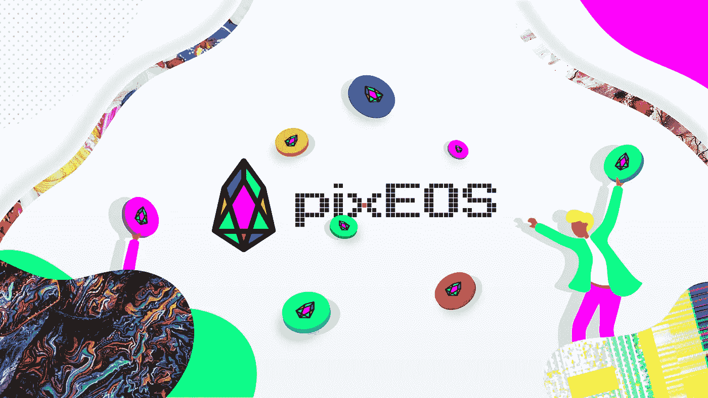

# 利用 pixEOS 智能经济

> 原文：<https://medium.com/hackernoon/taking-advantage-of-the-pixeos-smart-economy-910eb3c8747f>

随着 PIXEOS 代币上市在即， [pixEOS](http://pixeos.io) 团队正忙于工作。预计 PIXEOS 令牌将掌握在更广泛的加密用户手中，许多将在平台中建立价值的功能将按计划上线。许多人都熟悉加密术语“hodl”，意思是持有加密货币而不是出售。随着这些平台功能与 PIXEOS 智能经济的集成和增强，现在比以往任何时候都更有动力使用 pixEOS 令牌。

从一开始，我们的团队就专注于回馈构成我们基础的社区。我们通过 pixEOS 平台下的智能经济不断开展促销、竞赛和奖励参与者。这种智能经济背后的分配机制是赌注系统，该系统每天向赌注者提供 PIXEOS 令牌奖励，并根据整个平台的交易量每周向赌注者提供 EOS 奖励。随着平台的不断发展，每一个额外的方面都将成为支撑赌注系统的支柱，加强 pixEOS 利润分享网络的完整性。

赌注 PIXEOS 代币的机会让每个人都可以选择在他们拥有时被动赚取。当每天投入的 pixEOS 代币与现有的代币放在一起时，奖励会增加，因此将代币放在平台中可以让用户长期充分利用 PIXEOS 奖励系统。

pixEOS 代币的奖励只会随着更多平台元素的上线而增加，如稀有数字艺术、大 pixEOS 艺术画廊、拍卖行、艺术屋市场和 PIXEOS 游戏中心，2019 年将在那里部署 15 个以上的游戏。随着这些额外平台元素的整合，赌注系统将反过来提供更大的回报，让那些快速行动的人富裕起来。pixEOS 打桩系统的早期采用者将体验到先发优势，因为额外的公用事业促进了网络的价值。

通过继续构建 pixEOS 生态系统，该团队让我们的 PIXEOS Token hodling 社区有理由看到其令牌的价值。很快，一个充满活力的稀有数字艺术市场将上线，基本上由 PIXEOS 代币支持。它们将成为艺术家将稀有数字艺术放在 EOS 区块链上的系统的支柱，收藏家扩大稀有数字艺术选集的基础，以及游戏玩家进入娱乐标题和奖励世界的门户。

我们邀请您为艺术家、游戏玩家和收藏家利用 pixEOS 智能经济。加入我们，为 EOS 区块链上稀有数字艺术和游戏的互动利润分享市场铺平道路。

**pixEOS 官方链接:**

[**网站**](http://pixeos.io) **|** [**推特**](https://twitter.com/eos_pix) **|** [**电报**](https://t.me/PIXEOS)**|**[**Trybe**](https://trybe.one/members/pixeos/wall/)**|**[**脸书**](https://www.facebook.com/pixeos.io/)|[**insta gram**](https://www.instagram.com/pixeos.io/)**|**