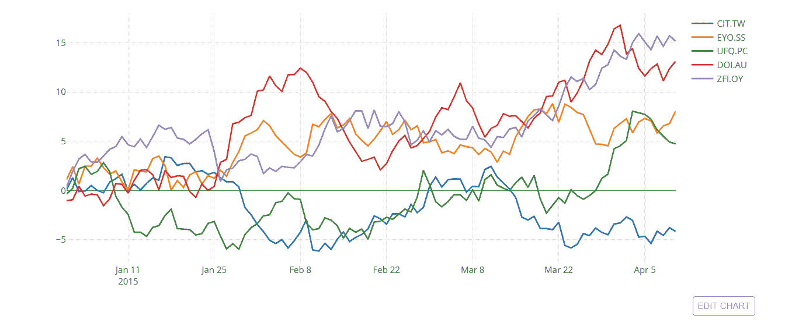
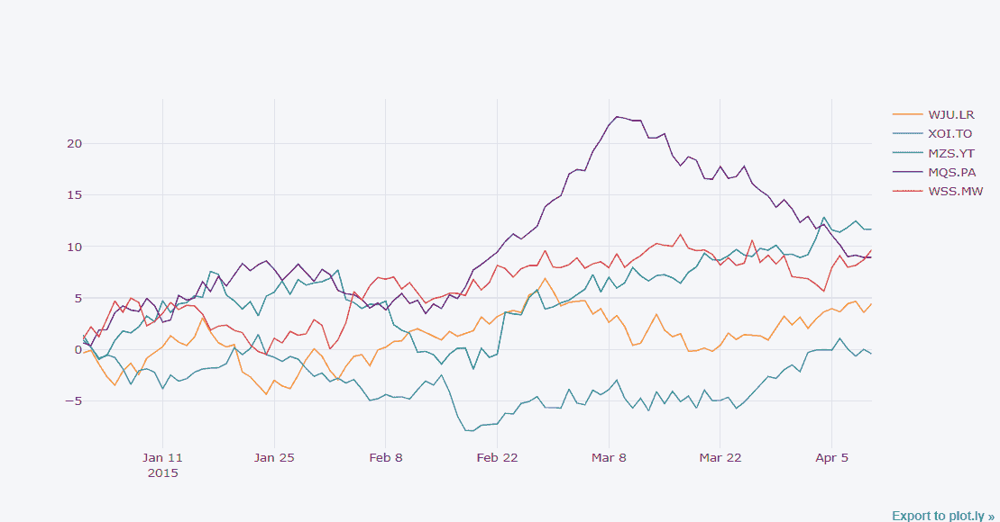
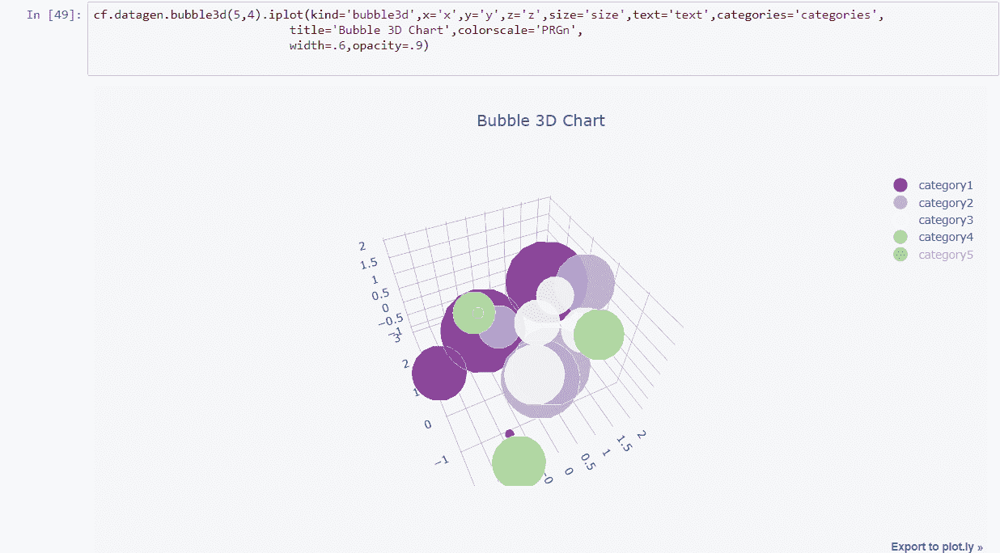
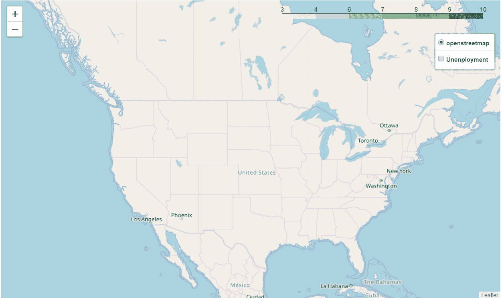
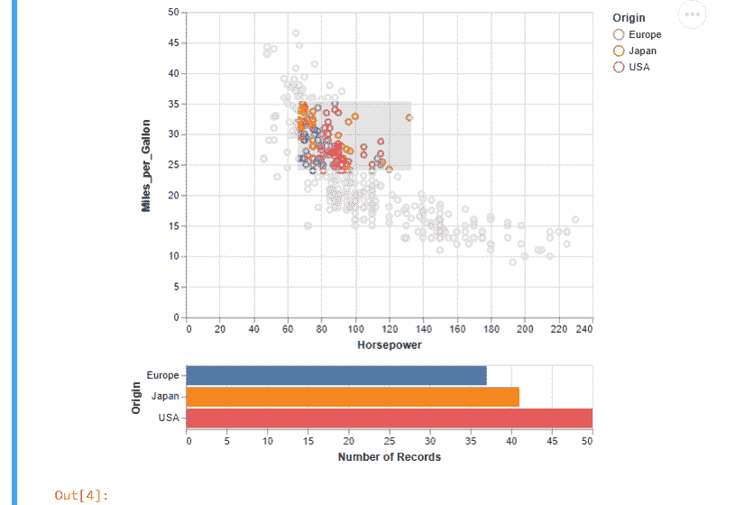
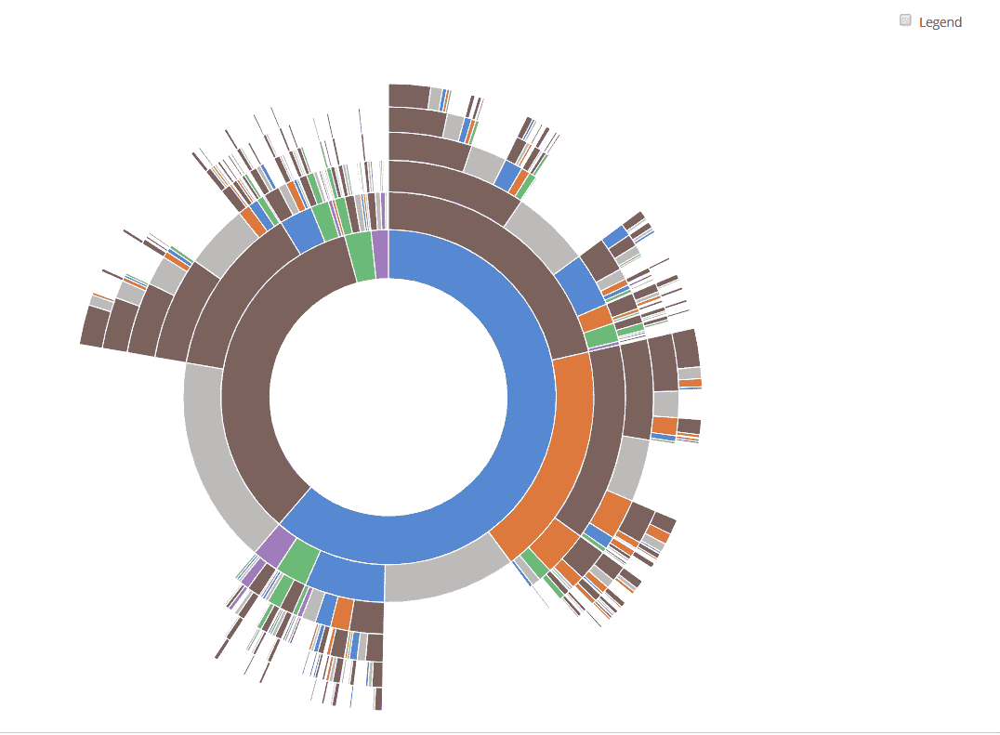
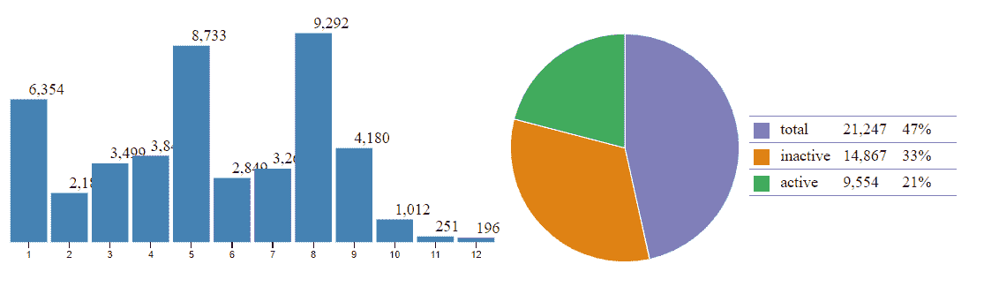

# 将数据可视化提升到另一个层次

> 原文：<https://medium.com/hackernoon/taking-data-visualization-to-another-level-4d1c47bb01a2>


Courtesy: [Pixabay](https://pixabay.com/illustrations/background-data-network-web-3228704/)

当你倾向于使用一个库一段时间，你就习惯了。但是，你需要每天进化和学习新的东西。如果你还在纠结于 Matplotlib(这很棒)、Seaborn(这也很棒)、Pandas(基本但容易可视化)和 Bokeh，你需要继续前进，尝试一些新的东西。python 中提供了许多令人惊叹的可视化库，这证明了它的通用性。在这里，我将讨论这些令人惊叹的图书馆:

*   ***阴谋地***
*   ***袖扣***

*   ****牛郎星+织女星****
*   ***D3.js(我的最佳选择)***

*如果你意识到并使用了上面提到的库，那么你就在进化的正确轨道上。它们可以帮助生成一些惊人的可视化效果，语法也不难。一般来说，我更喜欢 plotly+袖扣和 **D3.js.** 好了，让我们回到最基本的:*

## ****阴谋地****

*Plotly 是一个开源的、交互式的、基于浏览器的 python 图形库。Plotly 是一个库，允许您创建可以在仪表板或网站中使用的交互式绘图(您可以将它们保存为 html 文件或静态图像)。Plotly 建立在 plotly.js 之上，而 plotly . js 又建立在 D3.js 之上，它是一个高级图表库。plotly 提供了 30 多种图表类型，包括科学图表、统计图表、3D 图表、财务图表等。关于 plotly 最好的事情是你可以在 Jupyter 笔记本上使用它，也可以作为独立的 HTML 页面。你也可以在他们的网站上在线使用，但我更喜欢离线使用，你也可以将可视化保存为图像。使用它并让它工作非常简单。*

****—在 Jupyter 笔记本中使用的方法(离线)****

*首先，安装 plotly 库。*

```
*pip install plotly*
```

*然后打开 jupyter 笔记本，输入以下内容:*

```
*from plotly import __version__
from plotly.offline import download_plotlyjs, init_notebook_mode, plot, iplot
init_notebook_mode(connected=True)*
```

*我说，语法很简单？在 P *和 as* 中，您使用 *dataframe.plot()* ，在这里，您使用 *dataframe.iplot()。*这个****I****改变了整个可视化的定义。***

***只用一条线，我就生成了这个散点图。你可以随意定制。记得指定模式标记，否则你只会得到一些线簇。***

******

***Scatter plot generated using plotly***

> ***请注意，随着数据的增加，plotly 开始窒息。所以，只有当我的数据点少于 50 万时，我才会使用 plotly。***
> 
> ***在你的 Jupyter 笔记本上试试吧。***

## *****袖扣*****

***袖扣直接与熊猫数据框紧密相连。这种结合是惊人的，情节性的力量与熊猫的灵活性相结合。它比阴谋更有效。语法甚至比 plotly 更简单。有了 plotly 的 Python 库，你可以用 DataFrame 的系列和索引来描述数字，但是用袖扣你可以直接绘制出来。这里有一个例子:***

```
***df = cf.datagen.lines()

py.iplot([{
    'x': df.index,
    'y': df[col],
    'name': col
}  **for** col **in** df.columns])***
```

******

***With Plotly***

```
***df.iplot(kind='scatter')***
```

******

***With Cufflinks***

***袖扣让设计东西变得容易多了。你也可以用袖扣制作出令人惊叹的 3D 图表。我只用了几行代码就生成了这个 3D。***

******

***3D chart with Cufflinks***

***你可以在你的 Jupyter 笔记本上尝试一下。***

*****—快速破解:*****

***在配置中设置:***

> ***c.notebook app . iopub _ data _ rate _ limit = 1.0e 10***

***通过以下方式导入它:***

```
***import plotly.graph_objs as go
import plotly.plotly as py
import cufflinks as cf
from plotly.offline import iplot, init_notebook_mode
cf.go_offline()
# Set global theme
cf.set_config_file(world_readable=True, theme=’pearl’, offline=True)
init_notebook_mode()***
```

***它可以在线工作。***

***接下来，我要谈谈另一个令人惊叹的 Viz 库。***

## *****叶子*****

***follow 构建在 Python 生态系统的数据优势和 fleet . js 库的映射优势之上。您可以在 python 中操作您的数据，然后通过 leav 在传单地图中可视化它。Folium 正在成为一个绘制空间数据的惊人的库。您还可以使用 follow 生成热图和 choropleth 图。让我们来了解一下叶子:***

1.  ***地图被定义为*的叶子。贴图*对象，在*叶子上添加其他叶子对象。可以做地图*来改善地图的渲染***
2.  **你可以使用不同的地图分块来绘制由 leav 绘制的地图，例如 MapBox、OpenStreetMap 和其他几个分块，为此你可以访问[这个 github repo 文件夹](https://github.com/python-visualization/folium/tree/master/folium/templates/tiles)或[这个文档页面](http://python-visualization.github.io/folium/docs-v0.5.0/modules.html)。**
3.  **您也可以选择不同的地图投影。很多预测都是可行的。**

**让我们用美国失业的地理信息生成一个 Choropleth 图。以下是片段:**

```
**map = folium.Map([43, -100], zoom_start=4)

choropleth = folium.Choropleth(
    geo_data=us_states,
    data=state_data,
    columns=['State', 'Unemployment'],
    key_on='feature.id',
    fill_color='YlGn',
    name='Unenployment',
    show=**False**,
).add_to(m)

*# The underlying GeoJson and StepColormap objects are reachable*
print(type(choropleth.geojson))
print(type(choropleth.color_scale))

folium.LayerControl(collapsed=**False**).add_to(m)

map.save(os.path.join('results', 'GeoChoro.html'))

map**
```

**这只是一个基本的，你可以添加标记，弹出窗口和更多。这是它看起来的样子。**

****

**Map with leaflet and folium**

## ****牛郎星+织女星****

**Altair 是一个声明式统计可视化库，它基于 Vega 和 Vega-Lite。Altair 使您能够使用强大而简洁的可视化语法快速构建各种各样的统计可视化。如果你用的是 Jupyter Notebook，你需要按照下面的方法安装。它还包括一些示例织女星数据集。**

```
**pip install -U altair vega_datasets notebook vega**
```

**Altair 的主要依赖项是 Vega，为了使绘图在屏幕上可见，您需要安装它，并且还需要为每个新会话运行该命令。**

```
**alt.renderers.enable(‘notebook’)**
```

**Altair 中的数据是围绕熊猫数据框架建立的。统计可视化的一个定义性特征是它从整齐的数据框架开始。您也可以将绘图保存为图像，或者在 vega 编辑器中打开它以获得更多选项。这肯定不是最好的，但为了创作者的努力，绝对值得一试。**

**这里有一个例子，我用的是汽车数据集。**

```
**import altair as alt
from vega_datasets import datasource = data.cars()brush = alt.selection(type='interval')points = alt.Chart().mark_point().encode(
    x='Horsepower:Q',
    y='Miles_per_Gallon:Q',
    color=alt.condition(brush, 'Origin:N', alt.value('lightgray'))
).add_selection(
    brush
)bars = alt.Chart().mark_bar().encode(
    y='Origin:N',
    color='Origin:N',
    x='count(Origin):Q'
).transform_filter(
    brush
)alt.vconcat(points, bars, data=source)**
```

****

**Scatter plot and Histogram with Altair and Vega**

> **你可以在你自己的笔记本上试试，如果你在哪里卡住了，告诉我！**

## ****D3.js(数据驱动文档)****

****D3.js** 是一个 JavaScript 库，用于基于数据操作文档。您可以使用 HTML、SVG 和 CSS 赋予数据以生命。D3 不需要你把自己绑在任何专有的框架上，因为现代浏览器有 D3 需要的所有东西，它还被用于组合强大的可视化组件和用于 DOM 操作的数据驱动方法。**

**D3.js 是市场上最好的数据可视化库。我更喜欢几乎每次都用。你可以在 python 和 r 中使用它。最初，它与 JavaScript 一起工作，这变得非常困难，因为 JS 有广泛的功能，需要大量的学习和经验，但如果你是 JS 专业人员，那么你不需要再做任何考虑。虽然， *Python* 和 *R* 让它变得简单了一点，就一点点！但是你可以从这个图书馆得到最好的东西。**

**D3py 有三个主要依赖项:**

1.  **Numpy**
2.  **熊猫**
3.  **网络 x**

**我建议你配合 JavaScript 或者 R 使用，不要配合 python 使用，因为版本已经过时了，最后一次更新是在 2016 年。不过，它只是 D3.js 的一个瘦 python 包装器。**

**r 有一个用于 D3 可视化的接口。使用 **r2d3** ，您可以将数据从 R 可视化绑定到 d3 可视化。用 **r2d3** 创建的 D3 可视化效果就像 RStudio 中的 R plots、R Markdown 文档和闪亮的应用程序一样。您可以从 CRAN 安装 **r2d3** 包，如下所示:**

```
**install.packages(“r2d3”)**
```

**你可以用这个做一些令人惊奇的可视化，让我在这里给你看几个。**

****

**Sequences Sunburst — [Kerry Rodden](https://bl.ocks.org/kerryrodden)’s Block (Source)**

****

**Activity Status of an Year — Kunal Dhariwal (Me, lol)**

**从基础到高端，你可以用 D3.js 构建任何东西，别忘了尝试一下。**

> **如果您遇到任何错误或需要任何帮助，您可以随时在 LinkedIn 上发表评论或 ping 我。**
> 
> ****领英**:[https://bit.ly/2u4YPoF](https://bit.ly/2u4YPoF)**
> 
> ****Github**:[https://bit.ly/2SQV7ss](https://bit.ly/2SQV7ss)**

*****附:特别感谢那些了不起的库的创造者和贡献者。*****

> **我希望这有助于增强您的知识库:)**
> 
> **关注我了解更多！**
> 
> **感谢您的阅读和宝贵的时间！**