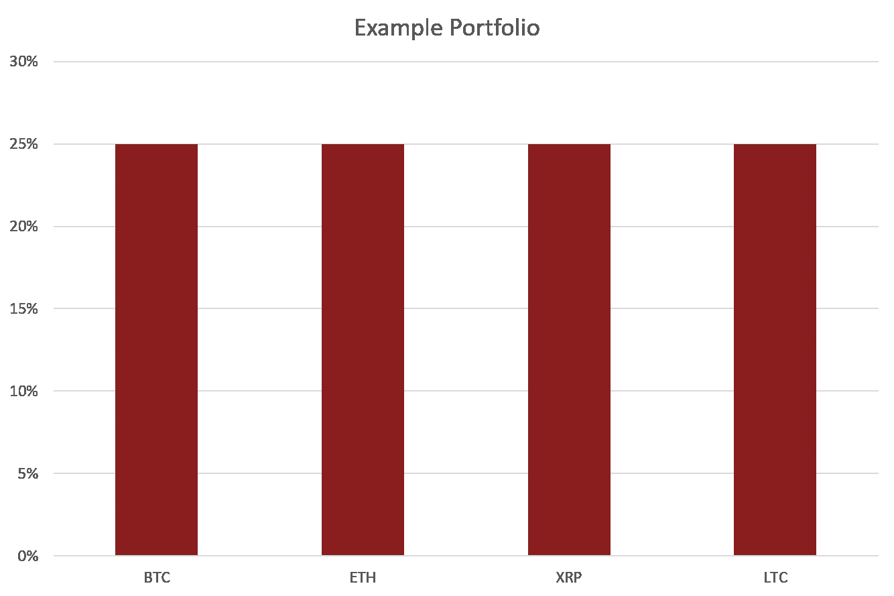
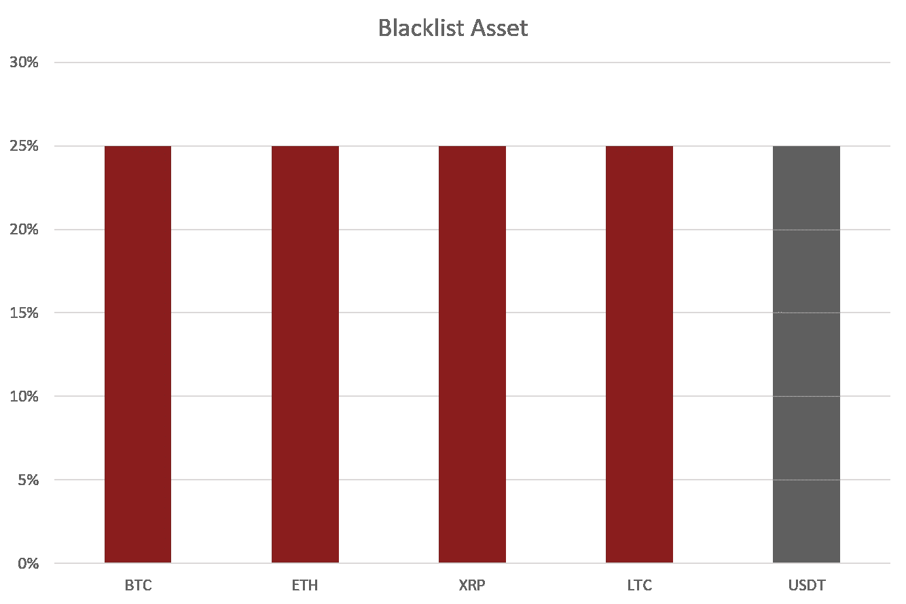
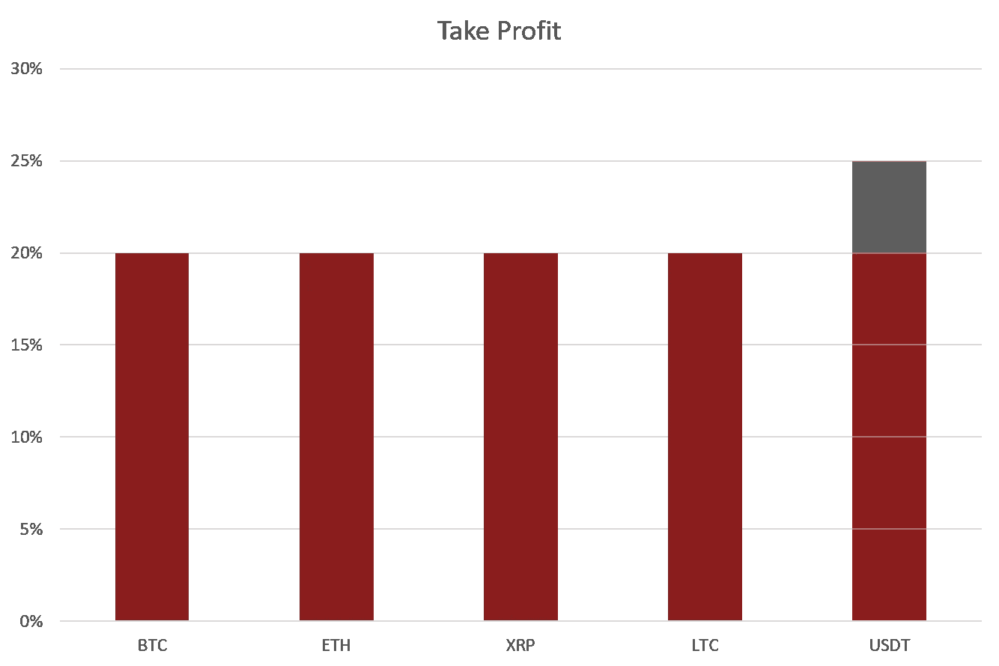

# 获利—加密投资组合策略

> 原文：<https://medium.com/hackernoon/taking-profit-crypto-portfolio-strategies-f3caf515aa79>

> 从你的加密投资组合中获利的简单方法。

加密市场开始再次显示出生机，我们可以感觉到预期的建立。在我们知道之前，人们会寻找简单的方法从他们的投资组合中获利。为了迎接这一时刻，我们先发制人地写了一篇文章，简要介绍最简单的获利方法。

在整篇文章中，我们将从之前的一篇讨论如何通过黑名单积累资产的博客文章中获得灵感。你可以在这里找到整篇文章:

 [## 加密策略:通过黑名单积累

### 通过仅指定一部分资产列入黑名单，这将仅从重新平衡中移除该金额…

blog.shrimpy.io](https://blog.shrimpy.io/blog/crypto-strategy-accumulation-via-blacklist) 

为了完成获利策略，你需要遵循以下简单的步骤:

1.  拥有一个管理投资组合的账户。如果你还没有，在这里注册。别担心，这是免费的。
2.  将您想用于获利的资产列入黑名单。假设你想把利润换成美元。你可以把像 USDT 这样稳定的硬币列入黑名单。
3.  将您希望获得的利润百分比分配为 USDT 的百分比。在本例中，我们将使用 20%。因此，我们整个投资组合的 20%将作为利润进入 USDT。
4.  重新平衡你的投资组合，分配指定的百分比。这将交易到已列入黑名单的资产，并将用于获利回吐。
5.  从你的投资组合中移除获利资产。该资产应保留在黑名单中，但必须从您的投资组合中删除。否则，后续的再平衡将导致黑名单上的资产持续获利。
6.  每次你想获利时，重复步骤 2-5。

## 获利回吐的直观表现

让我们假设市场一直在上涨，你想从你的投资组合中获利。如下图所示，你的投资组合中有四种不同的资产。

Our example portfolio with 4 different assets.

由于我们希望将我们投资组合的 20%作为利润，我们将在 USDT 将我们投资组合价值的 25%列入黑名单。这将足以覆盖你投资组合的 20%，将交易到 USDT。

Enter a blacklist for 25% USDT.

一旦进入黑名单，我们将在我们的投资组合中增加 20%的 USDT。添加后，选择重新平衡。再平衡完成后，你将有 20%的投资组合在 USDT 获利。结果将如下图所示。

Profit has been taken in USDT.

在你再次重新平衡之前，把 USDT 从你的分配中删除，以防止 Shrimpy 购买更多。如果你不取消分配，Shrimpy 将购买更多的 USDT，因为我们在 USDT 的投资组合中列入了 25%的黑名单，但也分配了 20%用于获利回吐。Shrimpy 认为这 25%不属于你的投资组合，所以它会继续买入，直到你拥有 25% + 20%的 USDT。

## 结论

对于虾米用户来说，获利是一个简单的过程。Shrimpy 可以快速调整投资组合分配以获利，然后迅速返回执行您的策略，而不是在交易所手动执行交易以完美分配您的投资组合并获利。没有挣扎，没有问题。享受生活，同时让 Shrimpy 管理您的投资组合。

## 关于虾皮

Shrimpy 是一个自动化的加密交易&投资组合管理工具，让用户自动化他们的策略。

Shrimpy 还为希望将可伸缩的交易所交易功能集成到其应用程序中的开发人员提供交易 API。

不要忘记在[推特](https://twitter.com/ShrimpyApp)和[脸书](https://www.facebook.com/ShrimpyApp)上关注我们的更新，并在[电报](https://t.me/ShrimpyGroup)、[不和谐](https://discord.gg/gXyy95y)、& [Reddit](https://www.reddit.com/r/ShrimpyApp/) 上向我们令人惊叹的活跃社区提问。

最初发布于 [blog.shrimpy.io](https://blog.shrimpy.io/blog/taking-profit-crypto-portfolio-strategies)