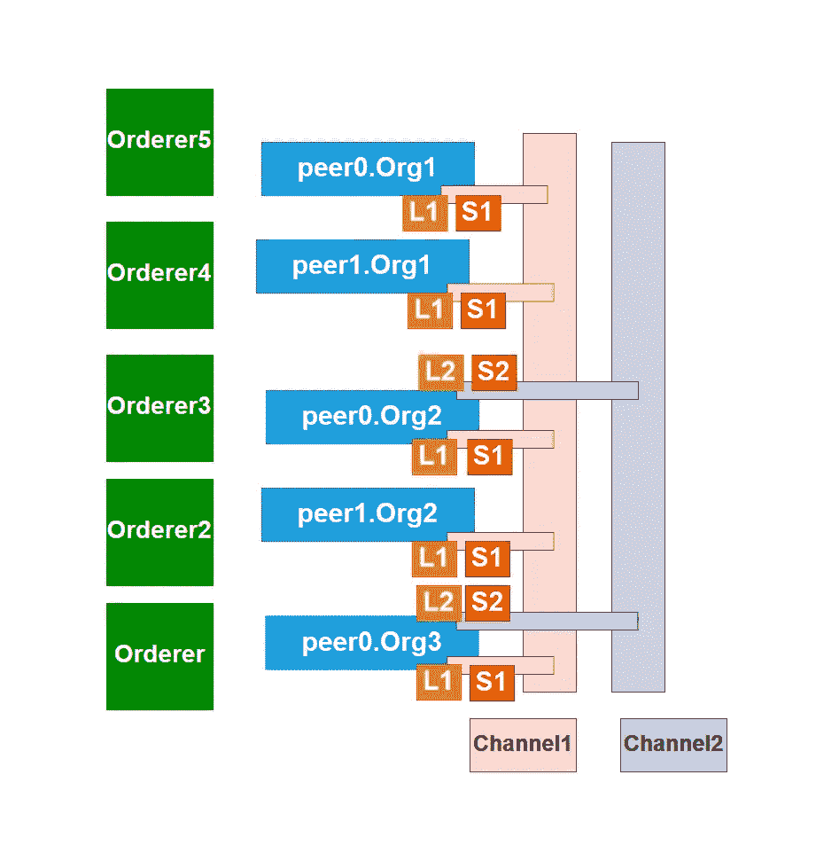

# 体验 Hyperledger Fabric v1.4 网络的所有功能

> 原文：<https://medium.com/hackernoon/taste-all-the-features-of-hyperledger-fabric-v1-4-4275fd9b9d8e>

## 使用 CouchDB & Raft 订购服务的不同参与组织的多渠道最低配置。



System Architecture

# 概观

本文涵盖了最低配置的 [Hyperledger Fabric v1.4](https://hyperledger-fabric.readthedocs.io/en/release-1.4/) 网络的所有功能，这是[构建您的第一个网络](https://hyperledger-fabric.readthedocs.io/en/release-1.4/build_network.html)的“下一步”。在本文中，我们展示了一个具有三个组织的网络，其中两个组织具有多对等体和两个不同渠道的设置，每个渠道具有不同的参与组织，通过使用 CouchDB 作为分类帐数据库，使用 Raft 订购服务建立。

我们假设你知道 Hyperledger Fabric v1.4 的所有[关键概念](https://hyperledger-fabric.readthedocs.io/en/release-1.4/key_concepts.html)，并且对[构建你的第一个网络](https://hyperledger-fabric.readthedocs.io/en/release-1.4/build_network.html)有很好的了解。

这是一篇快速文章，以最低配置涵盖了 [Hyperledger Fabric v1.4](https://hyperledger-fabric.readthedocs.io/en/release-1.4/) 网络的所有功能。

# 系统结构

这里我们有三个组织，分别是 Org1、Org2 和 Org3，其中 Org1 和 Org2 有两个同级组织。有两个通道，即通道 1 和通道 2。


System Architecture

在这里，信道 1 包含所有对等方和所有组织，信道 2 包含对等方 0。通过使用 raft 订购服务，我们可以使用多个订购者，因此我们将使用五个订购者。L1 是由智能联系人 S1 调用的渠道 1 的分类帐，L2 是由智能联系人 S2 调用的渠道 2 的分类帐。

# 第一步

首先，准备好[先决条件](https://hyperledger-fabric.readthedocs.io/en/release-1.4/prereqs.html)之后你还需要安装样本、二进制文件和 Docker 镜像。我假设您现在位于主目录中，并运行以下命令:

```
curl -sSL http://bit.ly/2ysbOFE | bash -s
```

完成后，您将看到目录“fabric-samples ”,所需的 docker 图像也已经下载。

**注意:**样本、二进制文件可能会改变，所以你需要根据这些改变来编辑你的一些文件。

# 第二步

首先你需要在 **home/fabric-samples** 下创建一个名为 **mynetwork** 的新目录，然后需要进入那个目录。从现在开始，我们将从**home/fabric-samples/my network**目录运行所有命令。

```
cd fabric-samples
mkdir mynetwork
cd mynetwork
```

要停止和删除所有以前的 docker 容器、docker 卷、docker 网络、脚本创建的文件，我们需要运行这些命令:

```
#STOP AND DELETE THE DOCKER CONTAINERS
docker ps -aq | xargs -n 1 docker stop
docker ps -aq | xargs -n 1 docker rm -v#DELETE THE OLD DOCKER VOLUMES
docker volume prune -f#DELETE OLD DOCKER NETWORKS
docker network prune -f#Remove all stopped containers
docker container prune -f#Remove All Unused Objects
docker system prune -f
docker system prune --volumes -f#DELETE SCRIPT-CREATED FILES
rm -rf channel-artifacts/*.block channel-artifacts/*.tx crypto-config#DELETE un-tagged images
docker rmi -f $(docker images | awk '($1 ~ /dev-peer.*/) {print $3}')#if you get error in future you may also need to remove docker images using the commands given below:
#docker rm -f $(docker ps -aq)
#docker rmi -f $(docker images -q)
```

我们所有的二进制文件都存放在 bin 目录中。首先，我们需要创建如下所示的 **crypto-config.yaml** 文件:

我们必须运行 cryptogen 工具，它将在 **crypto-config** 文件夹中创建所有必要的证书和密钥。

```
../bin/cryptogen generate --config=./crypto-config.yaml
```

# 第三步

首先我们需要创建一个名为 **channel-artifacts** 的目录，在那里我们存储脚本创建的文件，比如' _ '。阻止'或' _ '。tx '

然后我们需要在托管所有业务网络的**home/fabric-samples/my network**目录下创建 **configtx.yaml** 文件。

我们需要在**home/fabric-samples/my network**目录中创建一个名为 **channel-artifacts** 的新目录，然后我们需要告诉 configtxgentool 在我们当前的工作目录中查找 **configtx.yaml** 文件:

```
export FABRIC_CFG_PATH=$PWD
```

最后，我们需要调用 configtxgen 工具来为 Raft 订购服务创建订购者起源块。它将在**通道工件**目录下创建 genesis.block。

```
../bin/configtxgen -profile SampleMultiNodeEtcdRaft -channelID byfn-sys-channel -outputBlock ./channel-artifacts/genesis.block
```

# 第四步

在这一步中，我们将创建所有的渠道事务工件。所以我们需要定义一些环境变量。

```
export CHANNEL_ONE_NAME=channel1export CHANNEL_ONE_PROFILE=Channel1export CHANNEL_TWO_NAME=channel2export CHANNEL_TWO_PROFILE=Channel2
```

现在我们需要创建渠道交易构件，这将创建' **_。**通道-工件目录**中的 tx** 文件以及包含通道定义的文件。分别给出通道 1 和通道 2 的命令:

```
../bin/configtxgen -profile ${CHANNEL_ONE_PROFILE} -outputCreateChannelTx ./channel-artifacts/${CHANNEL_ONE_NAME}.tx -channelID $CHANNEL_ONE_NAME../bin/configtxgen -profile ${CHANNEL_TWO_PROFILE} -outputCreateChannelTx ./channel-artifacts/${CHANNEL_TWO_NAME}.tx -channelID $CHANNEL_TWO_NAME
```

是时候为渠道 1 定义锚定对等点了，渠道 1 由三个组织组成。

```
../bin/configtxgen -profile ${CHANNEL_ONE_PROFILE} -outputAnchorPeersUpdate ./channel-artifacts/Org1MSPanchors_${CHANNEL_ONE_NAME}.tx -channelID $CHANNEL_ONE_NAME -asOrg Org1MSP../bin/configtxgen -profile ${CHANNEL_ONE_PROFILE} -outputAnchorPeersUpdate ./channel-artifacts/Org2MSPanchors_${CHANNEL_ONE_NAME}.tx -channelID $CHANNEL_ONE_NAME -asOrg Org2MSP../bin/configtxgen -profile ${CHANNEL_ONE_PROFILE} -outputAnchorPeersUpdate ./channel-artifacts/Org3MSPanchors_${CHANNEL_ONE_NAME}.tx -channelID $CHANNEL_ONE_NAME -asOrg Org3MSP
```

之后，我们需要为渠道 2 定义锚定对等点，包括两个组织。

```
../bin/configtxgen -profile ${CHANNEL_TWO_PROFILE} -outputAnchorPeersUpdate ./channel-artifacts/Org2MSPanchors_${CHANNEL_TWO_NAME}.tx -channelID $CHANNEL_TWO_NAME -asOrg Org2MSP../bin/configtxgen -profile ${CHANNEL_TWO_PROFILE} -outputAnchorPeersUpdate ./channel-artifacts/Org3MSPanchors_${CHANNEL_TWO_NAME}.tx -channelID $CHANNEL_TWO_NAME -asOrg Org3MSP
```

# 第五步

我们需要在**home/fabric-samples/my network**目录中创建一个名为 **base** 的目录。在 **base** 中，我们需要创建两个文件，分别命名为**docker-compose-base . YAML**&**peer-base . YAML .**

**docker-compose-base . YAML**文件如下:

**peer-base.yaml** 文件给出如下:

现在我们需要在**home/fabric-samples/my network**目录下创建一个名为**docker-compose-CLI . YAML**的文件。

Hyperledger Fabric network 部署在 Docker 容器中，因此我们需要编写这些文件。

我们将使用 CouchDB 存储我们的分类帐，所以我们需要创建**docker-compose-couch . YAML**文件。

由于我们正在使用 Raft 订购服务，我们需要创建**docker-compose-etc draft 2 . YAML**文件。

我们还需要创造。环境文件。

最后，我们完成了所有文件的编写，现在可以使用以下命令启动网络了:

```
docker-compose -f docker-compose-cli.yaml -f docker-compose-couch.yaml -f docker-compose-etcdraft2.yaml up -d
```

# 第六步

现在，我们可以创建自己的频道，并向频道添加对等点。为此，我们需要进入 CLI 容器。

```
docker exec -it cli bash
```

进入 CLI 容器后，我们需要添加**通道 1** 。

```
#environment variable for peer0.org1
[CORE_PEER_MSPCONFIGPATH=/opt/gopath/src/github.com/hyperledger/fabric/peer/crypto/peerOrganizations/org1.example.com/users/Admin@org1.example.com](mailto:CORE_PEER_MSPCONFIGPATH=/opt/gopath/src/github.com/hyperledger/fabric/peer/crypto/peerOrganizations/org1.example.com/users/Admin@org1.example.com)/msp
CORE_PEER_ADDRESS=peer0.org1.example.com:7051
CORE_PEER_LOCALMSPID="Org1MSP"
CORE_PEER_TLS_ROOTCERT_FILE=/opt/gopath/src/github.com/hyperledger/fabric/peer/crypto/peerOrganizations/org1.example.com/peers/peer0.org1.example.com/tls/ca.crt#export channel name
export CHANNEL_NAME=channel1#creation of channel1
peer channel create -o orderer.example.com:7050 -c $CHANNEL_NAME -f ./channel-artifacts/channel1.tx --tls --cafile /opt/gopath/src/github.com/hyperledger/fabric/peer/crypto/ordererOrganizations/example.com/orderers/orderer.example.com/msp/tlscacerts/tlsca.example.com-cert.pem
```

现在我们需要加入**频道 1** 的所有同行。

```
#Now let’s join peer0.org1.example.com to the channel.peer channel join -b channel1.block#Rather than join every peer, we will simply join peer1.org1.example.com in our channel.
[CORE_PEER_MSPCONFIGPATH=/opt/gopath/src/github.com/hyperledger/fabric/peer/crypto/peerOrganizations/org1.example.com/users/Admin@org1.example.com](mailto:CORE_PEER_MSPCONFIGPATH=/opt/gopath/src/github.com/hyperledger/fabric/peer/crypto/peerOrganizations/org1.example.com/users/Admin@org1.example.com)/msp CORE_PEER_ADDRESS=peer1.org1.example.com:8051 CORE_PEER_LOCALMSPID="Org1MSP" CORE_PEER_TLS_ROOTCERT_FILE=/opt/gopath/src/github.com/hyperledger/fabric/peer/crypto/peerOrganizations/org1.example.com/peers/peer1.org1.example.com/tls/ca.crt peer channel join -b channel1.block#Rather than join every peer, we will simply join peer0.org2.example.com so that we can properly update the anchor peer definitions in our channel.[CORE_PEER_MSPCONFIGPATH=/opt/gopath/src/github.com/hyperledger/fabric/peer/crypto/peerOrganizations/org2.example.com/users/Admin@org2.example.com](mailto:CORE_PEER_MSPCONFIGPATH=/opt/gopath/src/github.com/hyperledger/fabric/peer/crypto/peerOrganizations/org2.example.com/users/Admin@org2.example.com)/msp CORE_PEER_ADDRESS=peer0.org2.example.com:9051 CORE_PEER_LOCALMSPID="Org2MSP" CORE_PEER_TLS_ROOTCERT_FILE=/opt/gopath/src/github.com/hyperledger/fabric/peer/crypto/peerOrganizations/org2.example.com/peers/peer0.org2.example.com/tls/ca.crt peer channel join -b channel1.block#Rather than join every peer, we will simply join peer1.org2.example.com in our channel.
[CORE_PEER_MSPCONFIGPATH=/opt/gopath/src/github.com/hyperledger/fabric/peer/crypto/peerOrganizations/org2.example.com/users/Admin@org2.example.com](mailto:CORE_PEER_MSPCONFIGPATH=/opt/gopath/src/github.com/hyperledger/fabric/peer/crypto/peerOrganizations/org2.example.com/users/Admin@org2.example.com)/msp CORE_PEER_ADDRESS=peer1.org2.example.com:10051 CORE_PEER_LOCALMSPID="Org2MSP" CORE_PEER_TLS_ROOTCERT_FILE=/opt/gopath/src/github.com/hyperledger/fabric/peer/crypto/peerOrganizations/org2.example.com/peers/peer1.org2.example.com/tls/ca.crt peer channel join -b channel1.block#Rather than join every peer, we will simply join peer0.org3.example.com so that we can properly update the anchor peer definitions in our channel.[CORE_PEER_MSPCONFIGPATH=/opt/gopath/src/github.com/hyperledger/fabric/peer/crypto/peerOrganizations/org3.example.com/users/Admin@org3.example.com](mailto:CORE_PEER_MSPCONFIGPATH=/opt/gopath/src/github.com/hyperledger/fabric/peer/crypto/peerOrganizations/org3.example.com/users/Admin@org3.example.com)/msp CORE_PEER_ADDRESS=peer0.org3.example.com:11051 CORE_PEER_LOCALMSPID="Org3MSP" CORE_PEER_TLS_ROOTCERT_FILE=/opt/gopath/src/github.com/hyperledger/fabric/peer/crypto/peerOrganizations/org3.example.com/peers/peer0.org3.example.com/tls/ca.crt peer channel join -b channel1.block
```

现在我们需要更新频道定义来定义**频道 1** 的锚节点。

```
#Update the channel definition to define the anchor peer for Org1 as peer0.org1.example.com:[CORE_PEER_MSPCONFIGPATH=/opt/gopath/src/github.com/hyperledger/fabric/peer/crypto/peerOrganizations/org1.example.com/users/Admin@org1.example.com](mailto:CORE_PEER_MSPCONFIGPATH=/opt/gopath/src/github.com/hyperledger/fabric/peer/crypto/peerOrganizations/org1.example.com/users/Admin@org1.example.com)/msp CORE_PEER_ADDRESS=peer0.org1.example.com:7051 CORE_PEER_LOCALMSPID="Org1MSP" CORE_PEER_TLS_ROOTCERT_FILE=/opt/gopath/src/github.com/hyperledger/fabric/peer/crypto/peerOrganizations/org1.example.com/peers/peer0.org1.example.com/tls/ca.crt peer channel update -o orderer.example.com:7050 -c $CHANNEL_NAME -f ./channel-artifacts/Org1MSPanchors_channel1.tx --tls --cafile /opt/gopath/src/github.com/hyperledger/fabric/peer/crypto/ordererOrganizations/example.com/orderers/orderer.example.com/msp/tlscacerts/tlsca.example.com-cert.pem#Now update the channel definition to define the anchor peer for Org2 as peer0.org2.example.com.[CORE_PEER_MSPCONFIGPATH=/opt/gopath/src/github.com/hyperledger/fabric/peer/crypto/peerOrganizations/org2.example.com/users/Admin@org2.example.com](mailto:CORE_PEER_MSPCONFIGPATH=/opt/gopath/src/github.com/hyperledger/fabric/peer/crypto/peerOrganizations/org2.example.com/users/Admin@org2.example.com)/msp CORE_PEER_ADDRESS=peer0.org2.example.com:9051 CORE_PEER_LOCALMSPID="Org2MSP" CORE_PEER_TLS_ROOTCERT_FILE=/opt/gopath/src/github.com/hyperledger/fabric/peer/crypto/peerOrganizations/org2.example.com/peers/peer0.org2.example.com/tls/ca.crt peer channel update -o orderer.example.com:7050 -c $CHANNEL_NAME -f ./channel-artifacts/Org2MSPanchors_channel1.tx --tls --cafile /opt/gopath/src/github.com/hyperledger/fabric/peer/crypto/ordererOrganizations/example.com/orderers/orderer.example.com/msp/tlscacerts/tlsca.example.com-cert.pem#Now update the channel definition to define the anchor peer for Org3 as peer0.org3.example.com.[CORE_PEER_MSPCONFIGPATH=/opt/gopath/src/github.com/hyperledger/fabric/peer/crypto/peerOrganizations/org3.example.com/users/Admin@org3.example.com](mailto:CORE_PEER_MSPCONFIGPATH=/opt/gopath/src/github.com/hyperledger/fabric/peer/crypto/peerOrganizations/org3.example.com/users/Admin@org3.example.com)/msp CORE_PEER_ADDRESS=peer0.org3.example.com:11051 CORE_PEER_LOCALMSPID="Org3MSP" CORE_PEER_TLS_ROOTCERT_FILE=/opt/gopath/src/github.com/hyperledger/fabric/peer/crypto/peerOrganizations/org3.example.com/peers/peer0.org3.example.com/tls/ca.crt peer channel update -o orderer.example.com:7050 -c $CHANNEL_NAME -f ./channel-artifacts/Org3MSPanchors_channel1.tx --tls --cafile /opt/gopath/src/github.com/hyperledger/fabric/peer/crypto/ordererOrganizations/example.com/orderers/orderer.example.com/msp/tlscacerts/tlsca.example.com-cert.pem
```

我们需要对**通道 2** 和遵循相同的程序。所有命令如下所示:

```
#environment variable for peer0.org2
[CORE_PEER_MSPCONFIGPATH=/opt/gopath/src/github.com/hyperledger/fabric/peer/crypto/peerOrganizations/org2.example.com/users/Admin@org2.example.com](mailto:CORE_PEER_MSPCONFIGPATH=/opt/gopath/src/github.com/hyperledger/fabric/peer/crypto/peerOrganizations/org2.example.com/users/Admin@org2.example.com)/msp
CORE_PEER_ADDRESS=peer0.org2.example.com:9051
CORE_PEER_LOCALMSPID="Org2MSP"
CORE_PEER_TLS_ROOTCERT_FILE=/opt/gopath/src/github.com/hyperledger/fabric/peer/crypto/peerOrganizations/org2.example.com/peers/peer0.org2.example.com/tls/ca.crt#export channel name
export CHANNEL_NAME=channel2#creation of channel2
peer channel create -o orderer.example.com:7050 -c $CHANNEL_NAME -f ./channel-artifacts/channel2.tx --tls --cafile /opt/gopath/src/github.com/hyperledger/fabric/peer/crypto/ordererOrganizations/example.com/orderers/orderer.example.com/msp/tlscacerts/tlsca.example.com-cert.pem#Now let’s join peer0.org1.example.com to the channel.peer channel join -b channel2.block#Rather than join every peer, we will simply join peer0.org3.example.com so that we can properly update the anchor peer definitions in our channel.[CORE_PEER_MSPCONFIGPATH=/opt/gopath/src/github.com/hyperledger/fabric/peer/crypto/peerOrganizations/org3.example.com/users/Admin@org3.example.com](mailto:CORE_PEER_MSPCONFIGPATH=/opt/gopath/src/github.com/hyperledger/fabric/peer/crypto/peerOrganizations/org3.example.com/users/Admin@org3.example.com)/msp CORE_PEER_ADDRESS=peer0.org3.example.com:11051 CORE_PEER_LOCALMSPID="Org3MSP" CORE_PEER_TLS_ROOTCERT_FILE=/opt/gopath/src/github.com/hyperledger/fabric/peer/crypto/peerOrganizations/org3.example.com/peers/peer0.org3.example.com/tls/ca.crt peer channel join -b channel2.block#Now update the channel definition to define the anchor peer for Org2 as peer0.org2.example.com.[CORE_PEER_MSPCONFIGPATH=/opt/gopath/src/github.com/hyperledger/fabric/peer/crypto/peerOrganizations/org2.example.com/users/Admin@org2.example.com](mailto:CORE_PEER_MSPCONFIGPATH=/opt/gopath/src/github.com/hyperledger/fabric/peer/crypto/peerOrganizations/org2.example.com/users/Admin@org2.example.com)/msp CORE_PEER_ADDRESS=peer0.org2.example.com:7051 CORE_PEER_LOCALMSPID="Org2MSP" CORE_PEER_TLS_ROOTCERT_FILE=/opt/gopath/src/github.com/hyperledger/fabric/peer/crypto/peerOrganizations/org2.example.com/peers/peer0.org2.example.com/tls/ca.crt peer channel update -o orderer.example.com:7050 -c $CHANNEL_NAME -f ./channel-artifacts/Org2MSPanchors_channel2.tx --tls --cafile /opt/gopath/src/github.com/hyperledger/fabric/peer/crypto/ordererOrganizations/example.com/orderers/orderer.example.com/msp/tlscacerts/tlsca.example.com-cert.pem#Now update the channel definition to define the anchor peer for Org3 as peer0.org3.example.com.[CORE_PEER_MSPCONFIGPATH=/opt/gopath/src/github.com/hyperledger/fabric/peer/crypto/peerOrganizations/org3.example.com/users/Admin@org3.example.com](mailto:CORE_PEER_MSPCONFIGPATH=/opt/gopath/src/github.com/hyperledger/fabric/peer/crypto/peerOrganizations/org3.example.com/users/Admin@org3.example.com)/msp CORE_PEER_ADDRESS=peer0.org3.example.com:7051 CORE_PEER_LOCALMSPID="Org3MSP" CORE_PEER_TLS_ROOTCERT_FILE=/opt/gopath/src/github.com/hyperledger/fabric/peer/crypto/peerOrganizations/org3.example.com/peers/peer0.org3.example.com/tls/ca.crt peer channel update -o orderer.example.com:7050 -c $CHANNEL_NAME -f ./channel-artifacts/Org3MSPanchors_channel2.tx --tls --cafile /opt/gopath/src/github.com/hyperledger/fabric/peer/crypto/ordererOrganizations/example.com/orderers/orderer.example.com/msp/tlscacerts/tlsca.example.com-cert.pem
```

# 第六步

我们将在两个渠道中安装两个不同的智能合约。

我们将在**通道 1** 中安装智能合约' **mycc** ' (S1)，并将针对每个对等体发出安装命令。通过使用 go 语言，智能合同被写在**home/fabric-samples/chain code/chain code _ example 02**目录下。

```
#Applications interact with the blockchain ledger through chaincode. As such we need to install the chaincode on every peer that will execute and endorse our transactions, and then instantiate the chaincode on the channel.
#Modify the following four environment variables to issue the install command against peer0 in Org1:
[CORE_PEER_MSPCONFIGPATH=/opt/gopath/src/github.com/hyperledger/fabric/peer/crypto/peerOrganizations/org1.example.com/users/Admin@org1.example.com](mailto:CORE_PEER_MSPCONFIGPATH=/opt/gopath/src/github.com/hyperledger/fabric/peer/crypto/peerOrganizations/org1.example.com/users/Admin@org1.example.com)/msp
CORE_PEER_ADDRESS=peer0.org1.example.com:7051
CORE_PEER_LOCALMSPID="Org1MSP"
CORE_PEER_TLS_ROOTCERT_FILE=/opt/gopath/src/github.com/hyperledger/fabric/peer/crypto/peerOrganizations/org1.example.com/peers/peer0.org1.example.com/tls/ca.crt# this installs the Go chaincode. For go chaincode -p takes the relative path from $GOPATH/src
peer chaincode install -n mycc -v 1.0 -p github.com/chaincode/chaincode_example02/go/#Modify the following four environment variables to issue the install command against peer1 in Org1:
[CORE_PEER_MSPCONFIGPATH=/opt/gopath/src/github.com/hyperledger/fabric/peer/crypto/peerOrganizations/org1.example.com/users/Admin@org1.example.com](mailto:CORE_PEER_MSPCONFIGPATH=/opt/gopath/src/github.com/hyperledger/fabric/peer/crypto/peerOrganizations/org1.example.com/users/Admin@org1.example.com)/msp
CORE_PEER_ADDRESS=peer1.org1.example.com:8051
CORE_PEER_LOCALMSPID="Org1MSP"
CORE_PEER_TLS_ROOTCERT_FILE=/opt/gopath/src/github.com/hyperledger/fabric/peer/crypto/peerOrganizations/org1.example.com/peers/peer1.org1.example.com/tls/ca.crt#Now install the sample Go chaincode onto a peer1 in Org1
peer chaincode install -n mycc -v 1.0 -p  github.com/chaincode/chaincode_example02/go/#Modify the following four environment variables to issue the install command against peer0 in Org2:[CORE_PEER_MSPCONFIGPATH=/opt/gopath/src/github.com/hyperledger/fabric/peer/crypto/peerOrganizations/org2.example.com/users/Admin@org2.example.com](mailto:CORE_PEER_MSPCONFIGPATH=/opt/gopath/src/github.com/hyperledger/fabric/peer/crypto/peerOrganizations/org2.example.com/users/Admin@org2.example.com)/msp
CORE_PEER_ADDRESS=peer0.org2.example.com:9051
CORE_PEER_LOCALMSPID="Org2MSP"
CORE_PEER_TLS_ROOTCERT_FILE=/opt/gopath/src/github.com/hyperledger/fabric/peer/crypto/peerOrganizations/org2.example.com/peers/peer0.org2.example.com/tls/ca.crt#Now install the sample Go chaincode onto a peer0 in Org2
peer chaincode install -n mycc -v 1.0 -p  github.com/chaincode/chaincode_example02/go/#Modify the following four environment variables to issue the install command against peer1 in Org2:[CORE_PEER_MSPCONFIGPATH=/opt/gopath/src/github.com/hyperledger/fabric/peer/crypto/peerOrganizations/org2.example.com/users/Admin@org2.example.com](mailto:CORE_PEER_MSPCONFIGPATH=/opt/gopath/src/github.com/hyperledger/fabric/peer/crypto/peerOrganizations/org2.example.com/users/Admin@org2.example.com)/msp
CORE_PEER_ADDRESS=peer1.org2.example.com:10051
CORE_PEER_LOCALMSPID="Org2MSP"
CORE_PEER_TLS_ROOTCERT_FILE=/opt/gopath/src/github.com/hyperledger/fabric/peer/crypto/peerOrganizations/org2.example.com/peers/peer1.org2.example.com/tls/ca.crt#17\. Now install the sample Go chaincode onto a peer1 in Org2.peer chaincode install -n mycc -v 1.0 -p  github.com/chaincode/chaincode_example02/go/#Modify the following four environment variables to issue the install command against peer0 in Org3:[CORE_PEER_MSPCONFIGPATH=/opt/gopath/src/github.com/hyperledger/fabric/peer/crypto/peerOrganizations/org3.example.com/users/Admin@org3.example.com](mailto:CORE_PEER_MSPCONFIGPATH=/opt/gopath/src/github.com/hyperledger/fabric/peer/crypto/peerOrganizations/org3.example.com/users/Admin@org3.example.com)/msp
CORE_PEER_ADDRESS=peer0.org3.example.com:11051
CORE_PEER_LOCALMSPID="Org3MSP"
CORE_PEER_TLS_ROOTCERT_FILE=/opt/gopath/src/github.com/hyperledger/fabric/peer/crypto/peerOrganizations/org3.example.com/peers/peer0.org3.example.com/tls/ca.crt#17.1 Now install the Go chaincode onto a peer0 in Org3.peer chaincode install -n mycc -v 1.0 -p  github.com/chaincode/chaincode_example02/go/
```

我们将在**频道 2** 中安装智能合约'**弹珠** ' (S2)，并将针对每个对等体发出安装命令。通过使用 go 语言，智能合同被写在**home/fabric-samples/chain code/marbles 02**目录下。

```
#Modify the following four environment variables to issue the install command against peer0 in Org2:[CORE_PEER_MSPCONFIGPATH=/opt/gopath/src/github.com/hyperledger/fabric/peer/crypto/peerOrganizations/org2.example.com/users/Admin@org2.example.com](mailto:CORE_PEER_MSPCONFIGPATH=/opt/gopath/src/github.com/hyperledger/fabric/peer/crypto/peerOrganizations/org2.example.com/users/Admin@org2.example.com)/msp
CORE_PEER_ADDRESS=peer0.org2.example.com:9051
CORE_PEER_LOCALMSPID="Org2MSP"
CORE_PEER_TLS_ROOTCERT_FILE=/opt/gopath/src/github.com/hyperledger/fabric/peer/crypto/peerOrganizations/org2.example.com/peers/peer0.org2.example.com/tls/ca.crt#Now install the sample Go chaincode onto a peer0 in Org2
peer chaincode install -n marbles -v 1.0 -p github.com/chaincode/marbles02/go#Modify the following four environment variables to issue the install command against peer0 in Org3:[CORE_PEER_MSPCONFIGPATH=/opt/gopath/src/github.com/hyperledger/fabric/peer/crypto/peerOrganizations/org3.example.com/users/Admin@org3.example.com](mailto:CORE_PEER_MSPCONFIGPATH=/opt/gopath/src/github.com/hyperledger/fabric/peer/crypto/peerOrganizations/org3.example.com/users/Admin@org3.example.com)/msp
CORE_PEER_ADDRESS=peer0.org3.example.com:11051
CORE_PEER_LOCALMSPID="Org3MSP"
CORE_PEER_TLS_ROOTCERT_FILE=/opt/gopath/src/github.com/hyperledger/fabric/peer/crypto/peerOrganizations/org3.example.com/peers/peer0.org3.example.com/tls/ca.crt#Now install the Go chaincode onto a peer0 in Org3.peer chaincode install -n marbles -v 1.0 -p github.com/chaincode/marbles02/go
```

安装后，我们需要实例化我们的链码。

要实例化**通道 1** 中的链码**‘mycc’**(S1 ),我们需要使用以下命令:

```
#environment variable for peer0.org1
[CORE_PEER_MSPCONFIGPATH=/opt/gopath/src/github.com/hyperledger/fabric/peer/crypto/peerOrganizations/org1.example.com/users/Admin@org1.example.com](mailto:CORE_PEER_MSPCONFIGPATH=/opt/gopath/src/github.com/hyperledger/fabric/peer/crypto/peerOrganizations/org1.example.com/users/Admin@org1.example.com)/msp
CORE_PEER_ADDRESS=peer0.org1.example.com:7051
CORE_PEER_LOCALMSPID="Org1MSP"
CORE_PEER_TLS_ROOTCERT_FILE=/opt/gopath/src/github.com/hyperledger/fabric/peer/crypto/peerOrganizations/org1.example.com/peers/peer0.org1.example.com/tls/ca.crt#export channel name
export CHANNEL_NAME=channel1#instantiate
peer chaincode instantiate -o orderer.example.com:7050 --tls --cafile /opt/gopath/src/github.com/hyperledger/fabric/peer/crypto/ordererOrganizations/example.com/orderers/orderer.example.com/msp/tlscacerts/tlsca.example.com-cert.pem -C $CHANNEL_NAME -n mycc -v 1.0 -c '{"Args":["init","a", "100", "b","200"]}' -P "OR ('Org1MSP.peer', 'Org2MSP.peer', 'Org3MSP.peer')"
```

要实例化**通道 2** 中的链码**‘弹珠’**(S2)，我们需要使用以下命令:

```
#environment variable for peer0.org2
[CORE_PEER_MSPCONFIGPATH=/opt/gopath/src/github.com/hyperledger/fabric/peer/crypto/peerOrganizations/org2.example.com/users/Admin@org2.example.com](mailto:CORE_PEER_MSPCONFIGPATH=/opt/gopath/src/github.com/hyperledger/fabric/peer/crypto/peerOrganizations/org2.example.com/users/Admin@org2.example.com)/msp
CORE_PEER_ADDRESS=peer0.org2.example.com:9051
CORE_PEER_LOCALMSPID="Org2MSP"
CORE_PEER_TLS_ROOTCERT_FILE=/opt/gopath/src/github.com/hyperledger/fabric/peer/crypto/peerOrganizations/org2.example.com/peers/peer0.org2.example.com/tls/ca.crt#export channel name
export CHANNEL_NAME=channel2#instantiate
peer chaincode instantiate -o orderer.example.com:7050 --tls --cafile /opt/gopath/src/github.com/hyperledger/fabric/peer/crypto/ordererOrganizations/example.com/orderers/orderer.example.com/msp/tlscacerts/tlsca.example.com-cert.pem -C $CHANNEL_NAME -n marbles -v 1.0 -c '{"Args":["init"]}' -P "OR ('Org2MSP.peer','Org3MSP.peer')"
```

# 第七步

我们完成了所有的配置设置，现在我们准备使用我们的网络。

首先，我们通过使用以下命令尝试使用**通道 1** :

```
#environmental variable for peer0.org1
[CORE_PEER_MSPCONFIGPATH=/opt/gopath/src/github.com/hyperledger/fabric/peer/crypto/peerOrganizations/org1.example.com/users/Admin@org1.example.com](mailto:CORE_PEER_MSPCONFIGPATH=/opt/gopath/src/github.com/hyperledger/fabric/peer/crypto/peerOrganizations/org1.example.com/users/Admin@org1.example.com)/msp
CORE_PEER_ADDRESS=peer0.org1.example.com:7051
CORE_PEER_LOCALMSPID="Org1MSP"
CORE_PEER_TLS_ROOTCERT_FILE=/opt/gopath/src/github.com/hyperledger/fabric/peer/crypto/peerOrganizations/org1.example.com/peers/peer0.org1.example.com/tls/ca.crt#export channel name
export CHANNEL_NAME=channel1#query
peer chaincode query -C $CHANNEL_NAME -n mycc -c '{"Args":["query","a"]}'
peer chaincode query -C $CHANNEL_NAME -n mycc -c '{"Args":["query","b"]}'#invoking
peer chaincode invoke -o orderer.example.com:7050 --tls true --cafile /opt/gopath/src/github.com/hyperledger/fabric/peer/crypto/ordererOrganizations/example.com/orderers/orderer.example.com/msp/tlscacerts/tlsca.example.com-cert.pem -C $CHANNEL_NAME -n mycc --peerAddresses peer0.org1.example.com:7051 --tlsRootCertFiles /opt/gopath/src/github.com/hyperledger/fabric/peer/crypto/peerOrganizations/org1.example.com/peers/peer0.org1.example.com/tls/ca.crt  -c '{"Args":["invoke","a","b","10"]}'#environmental variable for peer0.org2
[CORE_PEER_MSPCONFIGPATH=/opt/gopath/src/github.com/hyperledger/fabric/peer/crypto/peerOrganizations/org2.example.com/users/Admin@org2.example.com](mailto:CORE_PEER_MSPCONFIGPATH=/opt/gopath/src/github.com/hyperledger/fabric/peer/crypto/peerOrganizations/org2.example.com/users/Admin@org2.example.com)/msp
CORE_PEER_ADDRESS=peer0.org2.example.com:9051
CORE_PEER_LOCALMSPID="Org2MSP"
CORE_PEER_TLS_ROOTCERT_FILE=/opt/gopath/src/github.com/hyperledger/fabric/peer/crypto/peerOrganizations/org2.example.com/peers/peer0.org2.example.com/tls/ca.crt#export channel name
export CHANNEL_NAME=channel1#query
peer chaincode query -C $CHANNEL_NAME -n mycc -c '{"Args":["query","a"]}'
peer chaincode query -C $CHANNEL_NAME -n mycc -c '{"Args":["query","b"]}'
```

现在我们通过使用以下命令尝试使用**通道 2** :

```
#environmental variable for peer0.org2
[CORE_PEER_MSPCONFIGPATH=/opt/gopath/src/github.com/hyperledger/fabric/peer/crypto/peerOrganizations/org2.example.com/users/Admin@org2.example.com](mailto:CORE_PEER_MSPCONFIGPATH=/opt/gopath/src/github.com/hyperledger/fabric/peer/crypto/peerOrganizations/org2.example.com/users/Admin@org2.example.com)/msp
CORE_PEER_ADDRESS=peer0.org2.example.com:9051
CORE_PEER_LOCALMSPID="Org2MSP"
CORE_PEER_TLS_ROOTCERT_FILE=/opt/gopath/src/github.com/hyperledger/fabric/peer/crypto/peerOrganizations/org2.example.com/peers/peer0.org2.example.com/tls/ca.crt#export channel name
export CHANNEL_NAME=channel2#invoking
peer chaincode invoke -o orderer.example.com:7050 --tls --cafile /opt/gopath/src/github.com/hyperledger/fabric/peer/crypto/ordererOrganizations/example.com/orderers/orderer.example.com/msp/tlscacerts/tlsca.example.com-cert.pem -C $CHANNEL_NAME -n marbles -c '{"Args":["initMarble","marble2","red","50","tom"]}'peer chaincode invoke -o orderer.example.com:7050 --tls --cafile /opt/gopath/src/github.com/hyperledger/fabric/peer/crypto/ordererOrganizations/example.com/orderers/orderer.example.com/msp/tlscacerts/tlsca.example.com-cert.pem -C $CHANNEL_NAME -n marbles -c '{"Args":["initMarble","marble1","blue","35","tom"]}'peer chaincode invoke -o orderer.example.com:7050 --tls --cafile /opt/gopath/src/github.com/hyperledger/fabric/peer/crypto/ordererOrganizations/example.com/orderers/orderer.example.com/msp/tlscacerts/tlsca.example.com-cert.pem -C $CHANNEL_NAME -n marbles -c '{"Args":["initMarble","marble3","blue","70","tom"]}'peer chaincode invoke -o orderer.example.com:7050 --tls --cafile /opt/gopath/src/github.com/hyperledger/fabric/peer/crypto/ordererOrganizations/example.com/orderers/orderer.example.com/msp/tlscacerts/tlsca.example.com-cert.pem -C $CHANNEL_NAME -n marbles -c '{"Args":["transferMarble","marble2","jerry"]}'peer chaincode invoke -o orderer.example.com:7050 --tls --cafile /opt/gopath/src/github.com/hyperledger/fabric/peer/crypto/ordererOrganizations/example.com/orderers/orderer.example.com/msp/tlscacerts/tlsca.example.com-cert.pem -C $CHANNEL_NAME -n marbles -c '{"Args":["transferMarblesBasedOnColor","blue","jerry"]}'#environmental variable for peer0.org3
[CORE_PEER_MSPCONFIGPATH=/opt/gopath/src/github.com/hyperledger/fabric/peer/crypto/peerOrganizations/org3.example.com/users/Admin@org3.example.com](mailto:CORE_PEER_MSPCONFIGPATH=/opt/gopath/src/github.com/hyperledger/fabric/peer/crypto/peerOrganizations/org3.example.com/users/Admin@org3.example.com)/msp
CORE_PEER_ADDRESS=peer0.org3.example.com:11051
CORE_PEER_LOCALMSPID="Org3MSP"
CORE_PEER_TLS_ROOTCERT_FILE=/opt/gopath/src/github.com/hyperledger/fabric/peer/crypto/peerOrganizations/org3.example.com/peers/peer0.org3.example.com/tls/ca.crt#export channel name
export CHANNEL_NAME=channel2#invoking & query
peer chaincode query -C $CHANNEL_NAME -n marbles -c '{"Args":["readMarble","marble2"]}'peer chaincode query -C $CHANNEL_NAME -n marbles -c '{"Args":["getHistoryForMarble","marble1"]}'peer chaincode query -C $CHANNEL_NAME -n marbles -c '{"Args":["queryMarblesByOwner","jerry"]}'peer chaincode invoke -o orderer.example.com:7050 --tls --cafile /opt/gopath/src/github.com/hyperledger/fabric/peer/crypto/ordererOrganizations/example.com/orderers/orderer.example.com/msp/tlscacerts/tlsca.example.com-cert.pem -C $CHANNEL_NAME -n marbles -c '{"Args":["delete","marble1"]}' 
```

# 第八步

完成后，最好使用以下命令清除所有设置:

```
#STOP AND DELETE THE DOCKER CONTAINERS
docker ps -aq | xargs -n 1 docker stop
docker ps -aq | xargs -n 1 docker rm -v#DELETE THE OLD DOCKER VOLUMES
docker volume prune -f
#DELETE OLD DOCKER NETWORKS
docker network prune -f#Remove all stopped containers
docker container prune -f
#Remove All Unused Objects
docker system prune -f
docker system prune --volumes -f#DELETE SCRIPT-CREATED FILES
rm -rf channel-artifacts/*.block channel-artifacts/*.tx crypto-config#if you get error in future you may also need to remove docker images using the commands given below:
#docker rm -f $(docker ps -aq)
#docker rmi -f $(docker images -q)
```

# 总结:

在本文中，我们将重点介绍在最低配置下 [Hyperledger Fabric v1.4](https://hyperledger-fabric.readthedocs.io/en/release-1.4/) 网络的所有功能。我们希望这对你很有帮助，如果你将面临一些问题，请[排除](https://hyperledger-fabric.readthedocs.io/en/release-1.4/build_network.html#troubleshooting)那些。