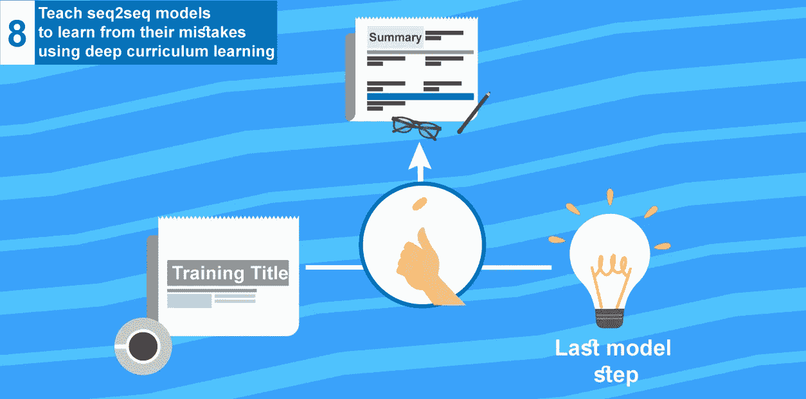
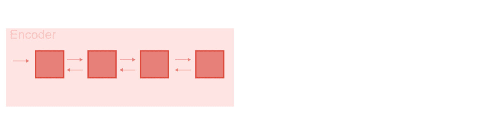
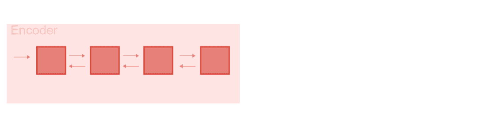
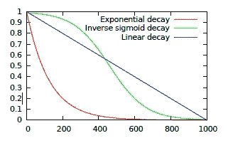

# 使用深度课程学习，教导 seq2seq 模型从错误中学习(教程 8)

> 原文：<https://medium.com/hackernoon/teach-seq2seq-models-to-learn-from-their-mistakes-using-deep-curriculum-learning-tutorial-8-a730a387754>

scheduled sampling to help seq2seq model learn from its mistakes

本教程是一系列教程中的第八篇，将帮助您使用 tensorflow 构建一个抽象的文本摘要器。

今天我们将使用**课程学习**来解决 [**亚斯特克**](https://hackernoon.com/tutorial-3-what-is-seq2seq-for-text-summarization-and-why-68ebaa644db0#scheduled-sampling-soft-scheduled-sampling-and-end2endbackprop) **，我已经将其修改为在 google colab 上运行(** [**我的代码**](http://bit.ly/2HZP6aB) **)**

# 0.关于系列

这是一系列教程，可以帮助你在多种方法中使用 tensorflow 构建一个抽象的文本摘要器，我们称之为抽象，因为我们教导神经网络生成单词，而不仅仅是复制单词

到目前为止我们已经讨论过了(这个系列的代码可以在[这里](https://github.com/theamrzaki/text_summurization_abstractive_methods)找到)

0.[深度学习免费生态系统概述](https://hackernoon.com/begin-your-deep-learning-project-for-free-free-gpu-processing-free-storage-free-easy-upload-b4dba18abebc)(如何使用 google colab 和 google drive)

1.  [文本摘要任务的概述以及用于该任务的不同技术](https://hackernoon.com/text-summarizer-using-deep-learning-made-easy-490880df6cd)
2.  [使用的数据以及如何表示我们的任务](https://hackernoon.com/abstractive-text-summarization-tutorial-2-text-representation-made-very-easy-ef4511a1a46)(本教程的先决条件)
3.  [什么是 seq2seq 文本摘要，为什么](https://hackernoon.com/tutorial-3-what-is-seq2seq-for-text-summarization-and-why-68ebaa644db0)
4.  [多层双向 LSTM/GRU](/@theamrzaki/multilayer-bidirectional-lstm-gru-for-text-summarization-made-easy-tutorial-4-a63db108b44f)
5.  [光束搜索&注意文本摘要](/@theamrzaki/beam-search-attention-for-text-summarization-made-easy-tutorial-5-3b7186df7086)
6.  [建立 seq2seq 模型，注意&波束搜索](https://hackernoon.com/build-an-abstractive-text-summarizer-in-94-lines-of-tensorflow-tutorial-6-f0e1b4d88b55)
7.  [用于文本摘要的抽象&提取方法的组合](http://bit.ly/2EhcRIZ)

EazyMind free Ai-As-a-service for text summarization

实际上，你可以通过 [eazymind](http://bit.ly/2VxhPqU) 尝试使用这些系列的输出生成你自己的摘要，看看你最终能够构建什么。您还可以通过简单的 API 调用，以及通过一个 [python 包](http://bit.ly/2Ef5XnS)来调用它，这样就可以轻松地将文本摘要集成到您的应用程序中，而无需设置 tensorflow 环境。你可以免费[注册](http://bit.ly/2VxhPqU)，免费享受使用这个 API 的乐趣。

我们开始吧！

# 1.暴露偏差问题

模型从来没有上升到依赖自己。

seq2seq 模型被训练为依赖于:

1.  解码器前一节点的输出，因此取决于前一状态的输出
2.  和输入摘要

问题出现在推理(测试)步骤中，其中没有向模型提供输入概要。它只取决于:

1.  前一节点的输出(前一 lstm 解码器步骤)

这导致了模型的训练方式和推理(测试)方式之间的差异。这个问题叫做 ***曝光偏差。***

# 2.暴露偏差问题会如何影响我们的模型？

在推断(测试)阶段，正如我们刚才所说，模型只依赖于前一步，这意味着它完全依赖于它自己。

当模型在 **(t-1)** 中产生不良输出时(即前一时间步产生不良输出)，问题实际上出现了。这实际上会影响所有即将到来的序列。它会把模型带到一个完全不同的状态空间，从它在训练阶段看到和训练的地方，所以它根本不知道该做什么。这只会导致累积的不良输出决策。

# 3.让我们通过课程学习来解决它

google research 的[Ben gio et al](https://arxiv.org/abs/1506.03099)提出了一个解决这个问题的方案，将模型的依赖性从完全依赖于提供给它的基本事实逐渐改变为依赖于它自己(即，仅依赖于解码器中从先前时间步骤生成的先前令牌)。

通过时间使学习路径变得困难的概念(即，使模型仅依赖于它本身)被称为课程学习。

他们实现这一点的技术真是天才。他们称之为‘预定抽样’。

他们建立了一个简单的采样机制，随机选择(在训练期间)从哪里采样。要么:

1.  地面实况(**与概率 ei** ) (i 代表批次号)
2.  模型本身(**用概率(1-ei)** )

所以让我们抛硬币决定。

如果是正面(**带概率 ei** )→那么我们用地面真相汇总。

如果是 tails ( **概率为(1-ei)** )→我们使用前一时间步的输出。

coin animation borrowed from google search results

凭直觉，我们可以有一个更好的方法。不仅仅是有一个常数 **e** ，它也可以是可变的，就像在培训的开始，我们**可以倾向于使用基础事实总结。**在训练结束时**，我们可以倾向于使用模型本身的输出**，因为模型会学到更多。所以我们**安排 e** (概率)的衰减。

Borrowed from [bengio et ai](https://arxiv.org/abs/1506.03099) from google research

e 本身的衰减可以是迭代次数的函数。

**定期抽样一词由此而来。**

# 4.在 Tensorflow 中执行**定时采样**

[亚斯特克](https://github.com/yaserkl/RLSeq2Seq#scheduled-sampling-soft-scheduled-sampling-and-end2endbackprop)在 tensorflow 中建立了一个很棒的库，使你能够实现多篇关于文本摘要的论文，其中一篇是([用递归神经网络进行序列预测的预定采样](https://arxiv.org/abs/1506.03099))，我已经将其修改为在 google colab 上运行([我的代码](http://bit.ly/2HZP6aB))。

可以通过修改标志来调整库以实现多篇论文，这里(在[我的代码](http://bit.ly/2HZP6aB) jupyter notebook 中)我已经修改了所需的标志，并且还启用了一个名为 intradecoder 的解码器版本(以限制单词重复)，所以您只需运行示例(使用设置的标志)。

我们处理 [CNN /每日新闻](https://github.com/abisee/cnn-dailymail)的新闻数据。它是这个任务广泛使用的数据集，或者你可以直接从[我的 google drive](https://drive.google.com/open?id=15c2wPpL4MGCooDx8Y1dw9M0o05P-EJto) 复制数据集，到你自己的 google drive(不需要下载然后上传)，无缝连接到你的 google colab ( [更多关于这个](https://hackernoon.com/text-summarizer-using-deep-learning-made-easy-490880df6cd?source=post_stats_page---------------------------))。

下一次，我们将通过强化学习与深度学习的结合来解决暴露问题，以解决 seq2seq 遭受的另一个问题。

> 我真心希望你喜欢阅读这篇教程，我希望我已经把这些概念讲清楚了。这一系列教程的所有代码都可以在[这里](https://github.com/theamrzaki/text_summurization_abstractive_methods)找到。您可以简单地使用 google colab 来运行它，请查看教程和代码并告诉我您对它的看法，不要忘记尝试免费的文本摘要生成 [eazymind](http://bit.ly/2VxhPqU) ，希望再次见到您。