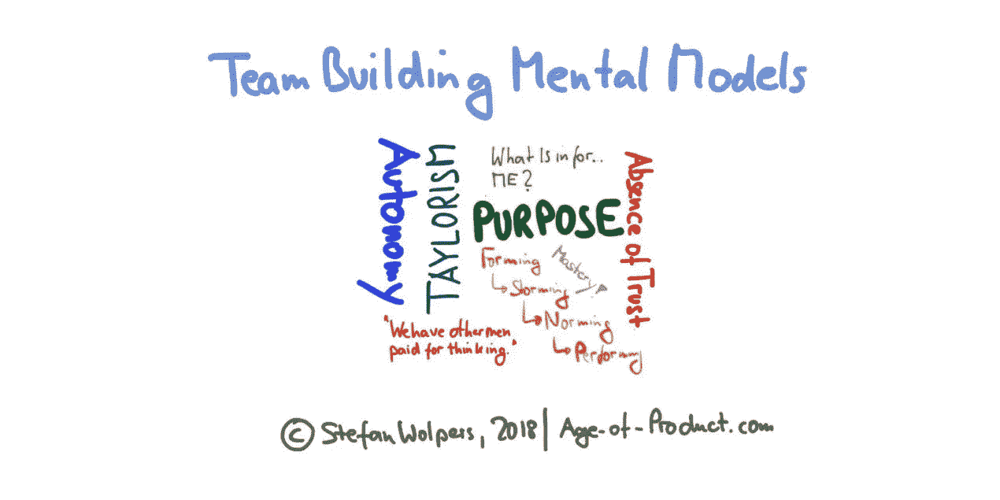
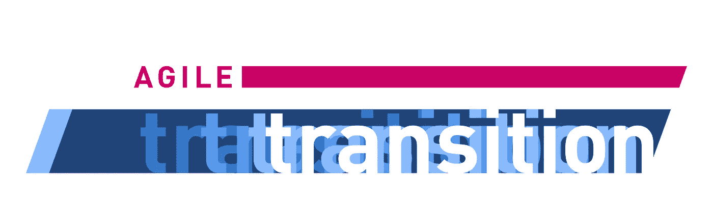

# 团队建设心智模型

> 原文：<https://medium.com/hackernoon/team-building-mental-models-1f431ae29361>

# TL；博士:团队建设心智模型

团队建设一直是一个挑战，不仅仅是因为敏捷框架的出现以及随之而来的对自组织、参与和实现有价值目标的强调。这篇文章涵盖了四个团队建设心智模型——或概念——已经被证明对理解创建敏捷团队的背景是有用的:从泰勒主义到塔克曼到伦乔尼到丹·平克。

# 团队建设挑战

变得敏捷的目的一直是商业方面的一种手段，例如，比竞争对手学得更快，从而保持竞争优势。或者是能够及早发现商机，然后抓住这个机会。

在操作层面，这意味着克服预测性计划谬误，因为不可能用甘特图式的计划来应对复杂性。它还需要摒弃工业范式的命令和控制思维模式，接受经验主义，从而接受自组织团队的力量、自下而上的智慧和组织中每个成员的创造力，可能会转变为一个团队的团队，正如麦克里斯特尔所说的那样。

团队建设总是很棘手:从组织军队到让农场工人组装 T 型车，再到应用新的敏捷框架，比如 XP 或 Scrum。

此外，核心问题一直都是一样的:在当今高节奏的技术驱动型经济中，你如何设法从一群纯粹的个人——或多或少渴望不要踩到彼此的脚趾——转变为所需的协作水平？你如何创建一个真正的团队——而不仅仅是一群碰巧在同一时间同一地点的人——在这个团队中，团队成功超越了任何个人抱负？

(有 55 秒？[观看优秀团队的行动](https://youtu.be/aHSUp7msCIE)。)

有几十种模型和概念试图在概念层面上解释团队建设——或者团队建设的缺失。根据我的经验，在敏捷环境中创建自组织团队的背景下，以下四个团队建设心智模型被证明是有用的。

# 敏捷过渡——来自战壕的手册

最新版的 249 页的《[敏捷过渡——来自战壕的实践手册](https://age-of-product.com/download-agile-transition-hands-guide-trenches/)》就在这里，而且是免费的:

## 团队建设心智模型(1):科学管理

弗雷德里克·温斯洛·泰勒的“科学管理”模型——一种源于 19 世纪 80 年代的理论，其基础是将科学方法应用于主要在制造业中的工作流程管理——采用了一种简单的团队建设方法:在工人层面，不需要团队建设，因为工人只不过是机器中可互换的齿轮。

管理层负责分析手头的问题，创造性地寻找问题的解决方案，优化流程和系统，并监督工人执行他们的订单。管理者推动(工业)系统的效率。

另一方的工作人员不能被信任有创造性或在系统级做出任何有意义的贡献。此外，如果在想要的行为中没有适当的金钱奖励激励，而在不想要的行为中没有适当的惩罚激励，工人天生就没有生产力。在泰勒主义的心理模型中，作为一个工作者参与到一个结果中——从而超越了预先定义的规范——构成了不受欢迎的行为，因此也是应受惩罚的行为。(我很想说“冒犯”。)

我最喜欢引用泰勒作品中的话:

*   “我欣赏你的力量和机械能力。我们还有其他人为思考付费。”
*   “[一个劳动者]将是如此愚蠢和冷漠，以至于他在精神构成上比任何其他类型的人都更像牛……他是如此愚蠢，以至于“百分比”这个词对他来说毫无意义，因此他必须由一个比他更聪明的人训练成按照这门科学的规律工作的习惯，然后他才能成功。”

引用自 Stan McChrystal 的“ [Team of Teams](https://www.amazon.com/Team-Teams-Rules-Engagement-Complex/dp/1591847486/ref=sr_1_1) ”第 42-43 页。

其他来源:[科学管理](https://en.wikipedia.org/wiki/Scientific_management)。

## 团队建设心理模型(2):形成，风暴，规范，执行布鲁斯塔克曼(1965)

布鲁斯·塔克曼进行了小群体动力学的研究。他在 1965 年发表的关于“小群体中的[发展顺序](https://web.archive.org/web/20151129012409/http://openvce.net/sites/default/files/Tuckman1965DevelopmentalSequence.pdf)的论文定义了他的一个理论，这个理论今天被称为塔克曼模型或者“形成、风暴、规范、执行”模型。

本文描述了每个团队都要经历的四个主要阶段:

1.  **形成**:这个阶段通过有目的地选择团队成员和促进团队识别机会、挑战和团队目标，为未来团队的成功奠定基础。领导的任务是协调行为。
2.  **风暴**:在这个阶段，团队需要通过定义团队内部的社会结构来解决现有的冲突和紧张，从而获得彼此之间的信任。(不管有没有正式的结构，总会有等级之分。领导的任务是指导行为，促进信任的建立，并在总体上平息局势。
3.  **规范**:在这个阶段，团队成员开始接受其他成员，回到团队的目标，继续前进。可能会有一种防止进一步冲突发生的趋势，从而限制了有争议观点的交流。领导层需要考虑到这一点。
4.  **执行**:在这个阶段，随着规范和角色的确立，团队专注于实现团队目标。在领导方面，授权行为是必需的:从获得团队成员的定期反馈，到鼓励新的领导者站出来与团队成员互动。

来源:[维基百科](https://en.wikipedia.org/wiki/Tuckman%27s_stages_of_group_development)。

## 团队建设心智模型(3):帕特里克·兰西奥尼的“团队的五大功能障碍”(2002)

帕特里克·兰西奥尼的书《团队的五种功能障碍》以商业寓言的形式分析了工作团队面临的挑战，并提供了一个连贯的心智模型，说明表现不佳的工作团队的原因可能是什么。

他确定了相互依存的五个层次:

*   **缺乏信任**:“在建立团队的背景下，信任是团队成员之间的一种信心，即他们的同事的意图是好的，没有理由在团队中保护或小心翼翼。[信任]要求团队成员让自己容易受到他人的攻击，并确信他们各自的弱点不会被用来对付他们。”(引用:第 195/196 页。)
*   **对冲突的恐惧**:“所有伟大的关系，那些长久的关系，都需要富有成效的冲突才能成长。意识形态冲突仅限于观念和想法，避免以人格为中心的卑鄙攻击。”(引用:p 202。)
*   **缺乏承诺**:“在团队中，承诺是两件事的函数:明确性和认同。伟大的团队会做出清晰而及时的决策，并在团队每个成员的完全认同下向前推进，即使是那些投票反对决策的人。他们明白，通情达理的人不需要为了支持一项决定而随心所欲，只需要知道他们的意见已经被听取和考虑。只有当每个人都把他们的意见和观点放在桌面上时，团队才能自信地做出决定，因为他们知道这是利用了整个团队的集体智慧。”(引用:第 207/208 页。)
*   **逃避责任**:“然而，在团队合作的背景下，[责任]特指团队成员愿意就可能伤害团队的表现或行为向他们的同事提出批评。如果团队成员没有对他们的贡献负责，他们更有可能将注意力转向自己的需求，以及自己或所在部门的进步。”(引用:第 213/215 页。)
*   **对结果的忽视**:“尽管所有人都有自我保护的天生倾向，但一个职能团队必须让团队的集体结果对每个人来说都比个体成员的目标更重要。成功(在团队建设中)不是掌握微妙、复杂的理论，而是以非凡的纪律和毅力接受常识。”(引用:第 216/220 页。)

引用自“[一个团队的五大功能障碍](https://www.amazon.com/Five-Dysfunctions-Team-Leadership-Fable/dp/0787960756/ref=sr_1_5)”

## 团队建设心智模型(4):丹·平克的《自主、掌握、目标》

丹·平克的“自主、掌握、目标”模型来自他的书《驱动力:关于什么激励我们的惊人真相》他的概念基于知识工作时代的三个个人动机:

1.  自主是引导我们自己生活的冲动。
2.  精通是在重要的事情上越做越好的愿望。
3.  目标是渴望做我们所做的事，为比我们自己更伟大的事情服务。

Pink 指出了这样一个事实，即在知识产业中，经济奖励并没有起到预期的作用。一旦你不再考虑挣足够的钱过上体面生活的问题，自主就比另一份奖金更受欢迎。(“当你想要遵从时，管理是很棒的。但如果你想要参与，自我指导效果更好。”)

这种方法特别有说服力，因为我们喜欢得到更好的东西。(例如，对于绝大多数业余音乐家来说，没有经济激励让他们在周末练习乐器。此外，为什么一个高技能的人会连续投入数小时为一个开源软件项目做贡献，却最终免费赠送？)

最后，蓬勃发展的组织——无论是盈利性的还是非盈利性的——都设法保持了利润或利益的稳定。用丹·平克的话说:人类是“目的最大化者”

来源:📺驱动力:[激励我们的惊人真相](https://www.youtube.com/watch?v=u6XAPnuFjJc)。

# 团队建设心智模型—结论

上面介绍的团队建设心智模型没有一个能提供创建优秀敏捷团队的方法。然而，所有模型都有助于更好地理解定义群体和组织中的社会动态并激励人类参与变革的因素。然后，我们可以从那里开始，例如，使用解放结构来促进向敏捷组织的有意义的转变。

你在日常工作中运用了哪些团队建设心智模式？请在评论中与我们分享。

# 📺在 Youtube 上加入 1050 多名敏捷同行

现已在 Youtube 产品年龄频道上发布:

*   🛑 [冲刺复习反模式](https://www.youtube.com/watch?v=L7OxBy724w4)
*   [Scrum 大师反模式](https://www.youtube.com/watch?v=vZUU9AIZVyQ)。
*   Scrum Sprint 反模式。

# ✋不要错过:加入 4500 多人的“动手敏捷”Slack 社区

我邀请你加入[“手把手的敏捷”Slack 社区](https://goo.gl/forms/LObbRtSF9vvxN3CL2)，享受来自世界各地的敏捷实践者的快速增长、充满活力的社区带来的好处。

如果你现在想加入，你现在所要做的就是[通过这个谷歌表格](https://goo.gl/forms/LObbRtSF9vvxN3CL2)提供你的凭证，我会帮你注册。对了，**免费的。**

# 🎓你还想这样多读书吗？

好吧，那么:

*   📰*加入 20138 位同行，* [*报名我的每周简讯*](https://age-of-product.com/subscribe/?ref=Food4ThoughtMedium)
*   🐦*关注我的* [*推特*](https://twitter.com/stefanw) *并订阅我的博客* [*产品时代*](https://age-of-product.com)
*   💬*或者，免费加入* [*Slack 团队【动手敏捷】的 4500 多名同行。*](https://goo.gl/forms/XIsABn0fLn9O0hqg2)

《团队建设心智模型》最早发表于 Age-of-Product.com。