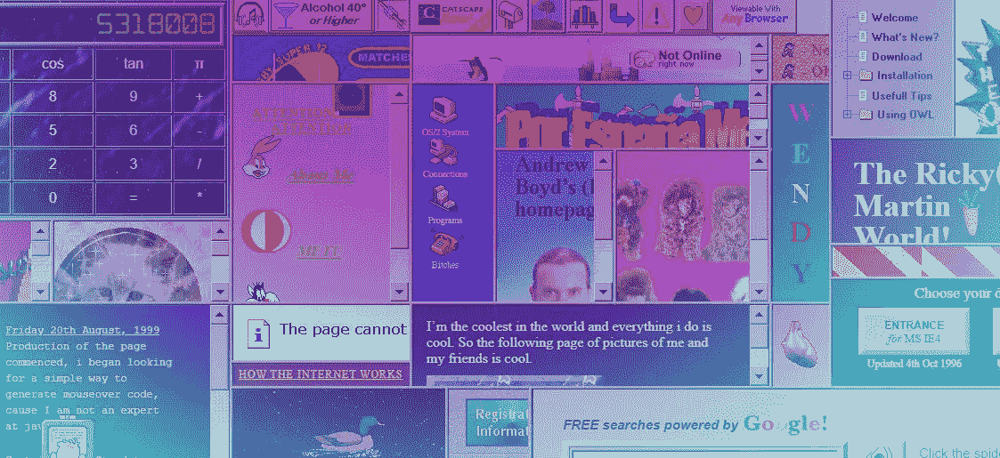
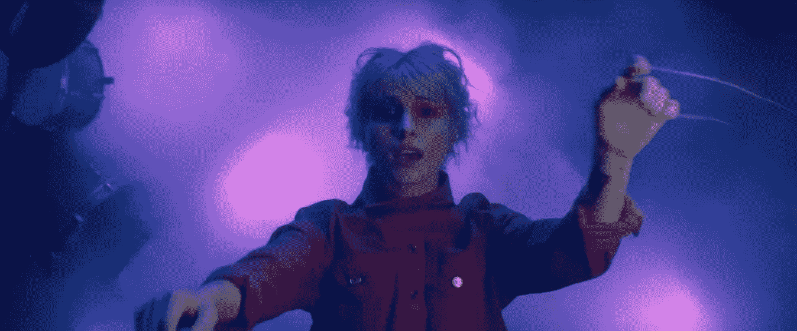
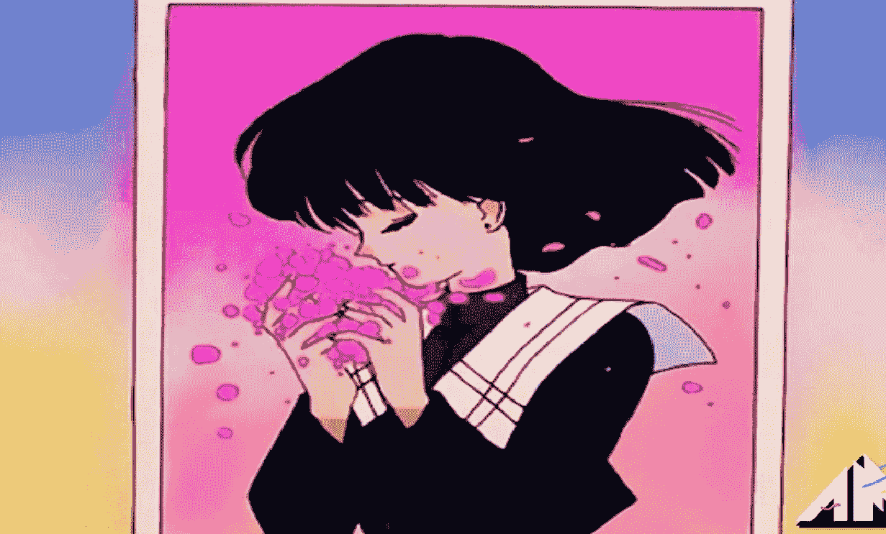
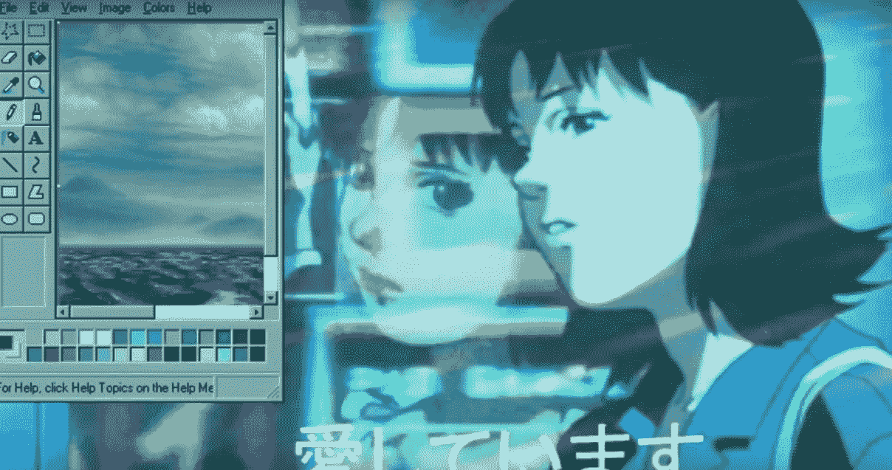
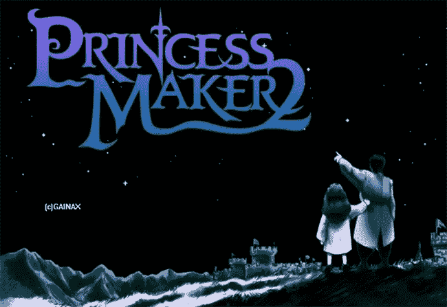

# 在颠覆性技术的时代，我仍然没有归属感

> 原文：<https://medium.com/hackernoon/tech-disruption-outsiders-cdd3106eeb02>

## 对于那些除了 Angelfire 之外的成年人来说，我们的开创性贡献在纸面上并不重要

I feel like Paramore [gets my feels](https://www.youtube.com/watch?v=eFOY6KJlFEg&feature=youtu.be&t=32), and that is the most ‘old millennial’ thing I’ve ever said in my life.

我们是无可救药的呆头呆脑，在嵌入式聊天室、有足够多的动画 gif 的网站和 T2 尼奥宠物编码中找到了避难所。

互联网是新的，奇怪的，充满了 P2P 文件共享软件，花了几个世纪才找到一首你喜欢的歌…希望它不会被误标为[绿日制作的](https://lyrics.az/green-day/-/paranoia.html)，而不是[哈维·丹吉尔。](https://www.youtube.com/watch?v=wYsMjEeEg4g)

我们在挑战界限、伪造 [Neopets](http://neopets.com) 登录页面、在 Windows 95 机器上运行 [MMORPG 私人服务器](https://topg.org/ragnarok-private-servers/)以及在父母打电话把我们踢出拨号调制解调器时探索流氓互联网的过程中长大。

如果你认为只有我做了这些事，那你就错了。有一种书呆子亚文化，它是存在的，但我们只是不谈论它。

我们没有谈论它，因为我怀疑我们太年轻了，不能在这个时候利用一份职业，但是足够大了，可以知道我们正在使用的力量。

我们中的许多人在高中时学习了技术课程，在那里平面设计不仅在 Photoshop 中完成，而且在 Paint Shop Pro 中完成，Image Ready 是“网络图形”的冠军。

后来我们上了大学。

后来，我们不得不学习新的技术技能，以克服 2008 年衰退的持久损害，那些人花了数年时间学习废话，并通过 bootstrap 学习 [responsive，通过](https://getbootstrap.com/) [InVision App](https://www.invisionapp.com/) 学习 UI 设计。

我们很多人都忘记了科技。

有太多的新职位，我们中的许多人仍然不明白为什么前端开发不仅仅需要 HTML、CSS、JS 和 PHP。

尽管跟上了我的技能，但还是有点被遗忘的感觉。

尤其是当我坐在这里，试图量化我在求职或面试中的全部技能时。

# 我知道我是一个先驱，但是用关于死亡语言的轶事来证明它是行不通的

我可以展示的是我的投资组合很糟糕，但是当 22 岁的营销总监问我(一个 31 岁的人)为什么我认为我是 T2 的高级 XYZ 角色的材料时，很难从一开始就证明我在这里…

…当我这样的人还是孩子的时候，一切都结束了。

我们可能通过 Myspace 和来自 [Furcadia](https://en.wikipedia.org/wiki/Furcadia) 的叫做 Dragon Speak 的后端框架来学习编码。

即使像我这样的人从[通过咖啡杯](https://www.coffeecup.com/help/articles/creating-a-new-image-map/)获取图像地图开始就一直在埋头苦干，但还是存在脱节。

这项技术并不完美，但我这一代迷失的科技怪人喜欢探索它。

对于我们这些不断学习我们的交易的人来说，我们知道的部分永远不会适用，这让我们无法以有意义的方式谈论它。

即使有人认为招聘流程已经崩溃，我仍然会查看工作列表。

因为每当我在一家我喜欢为之工作的公司看到一个反映我知识广度的角色时，我内心的小小刺痛足以给我希望。

希望找到一个归属的地方。

希望能找到一个让我的创造性贡献有成长空间的地方。

希望被别人认出来，即使我尖叫着说[是](/@kiraIeigh/you-arent-allowed-to-be-yourself-but-you-better-stand-out-e55555a073a4)中的异类。

我们都希望自己的技能得到认可。

但是我们这些古怪的 J-Rock 粉丝，他们为 Dir En Grey 制作了粉丝页面，了解了所有关于 DNS 的事情，甚至没有语言来理解我们当时所知道的。

我们该如何开始谈论这一切？

# 美国 90 年代的孩子太年轻，不能利用网络，但我们也足够大，知道网络曾经是什么

Photo by [Giu Vicente](https://unsplash.com/photos/FMArg2k3qOU?utm_source=unsplash&utm_medium=referral&utm_content=creditCopyText) on [Unsplash](https://unsplash.com/search/photos/tech?utm_source=unsplash&utm_medium=referral&utm_content=creditCopyText)

我看着创意总监的角色，觉得自己不够资格，即使我知道我 5 年的“技术工作”经验在技术上更像是 17 年。

因为我从来没有停止过做网站，设计图形，或者探索技术。

我说 10-15，因为这是某种奇怪的中间值。

现在，年轻人制作自己的游戏或应用程序是有意义的。

我在我的 Windows 95 电脑上运行一个 300 用户的 MMORPG，然后把它卖给一群人赚钱，这真令人吃惊。

为我现在已经不存在的艺术生涯在社交上有机地增加我的粉丝，在每个可用的平台上从 3-4k，只是让眉毛上扬。

从那以后你做了什么？有人问我这个问题。很多。

下面是我在 2008 年经济衰退后做的一系列失败的创业公司，因为我知道自己的价值，几年来一直拿不到足够的报酬，后来独自创业。

我有一大堆给数字机构和小型创业公司的白标作品，不能给任何人看。

我尊重客户的意愿，让我成为他们的王牌，但是...

…我是技术界的幽灵。

我的技能静静地藏在我的脑海里。

我不知道如何谈论他们所有人，甚至其中的一些人，因为他们是什么的真正广度。

# 旧的网络造就了多面手，我怀疑，还有一大群人找不到出路

[https://youtu.be/nuOoYF-Fg_Q](https://youtu.be/nuOoYF-Fg_Q) This is probably the most 90s kid techy-anime-nerd image I’ve ever seen.

每个人都在谈论那些什么都懂，但什么都不精通的人。

我很确定很多 90 后的孩子掌握了一大堆*的狗屎，但是没有人想要多面手……除非他们愿意付 1 个人的钱来做 6 个人的工作。*

这些工作报酬很低，听 22 岁的营销总监告诉我们需要付出代价是荒谬的。

我们中那些保持技能的人比那些付钱给几个不差的有影响力的人来传播病毒的人更了解“增长黑客”。

我们通过 mIRC 和新闻组分发增加了我们的 MMORPG 用户群、电子邮件列表和博客订户。

想象一下，现在你是一个初创公司的创始人，你可以很简单地跑进每一个可用的社区，以劳动密集型的方式“增长黑客”。

几乎没有人想这么做，因为这很难，而且需要时间。

如果看起来我是咸的，那是准确的。但更有可能的是，我还不知道如何解释这一切。

在某种程度上，我觉得这不算数。

这可能只是因为每个人，在任何年龄，都认为自己是天才，没有什么新的东西需要学习，因为他们声称的职称。

我也不太尊重等级制度，因为在我生命的大部分时间里，我既是“年轻的新贵”，也是“资历过高的老古董”。

这也可能是另一个对我不利的标志。

但两者兼而有之的感觉非常令人窒息，我知道我两者都不是。

# 多亏了我工作的广度，以及我从十几岁开始就培养的技能，我相当稳固

[https://youtu.be/Qm509gYHAe0](https://youtu.be/Qm509gYHAe0)

我的[小公司](mailto: kirakiraleighleigh@gmail.com)有很多工作要做。即使我没有，我也要等一会儿，然后有人会突然出现在我的收件箱里。

我的其他代理朋友带着怀疑的语气问我，我是如何不花一分钱就获得线索的，好像这是一个魔术。

不，这只是我十二岁和大学生时学到的东西。

我觉得这么说有点傻。

我有足够的技能来适应客户需要的几乎任何东西，而且我每天都在学习。

不利的一面是，我是一个多面手，而专家更受尊重。

这样做的好处是，我几乎永远不会长期没有合同工作。

自从网络变得不可思议以来，我就一直在这里。我不会很快放弃我的网络冒险。

# 我觉得我们奇怪的 90 后孩子在任何时候都太年轻而不知道任何事情，又太老而不相关

[https://www.youtube.com/watch?v=_JnImelDD0k](https://www.youtube.com/watch?v=_JnImelDD0k)

我用搜索引擎优化专家所说的做*而不是*工作的技术，粉碎了[谷歌的首页](https://voices.thereisno.design/2019/04/08/myths-about-seo-debunked-by-your-resident-weeb-marketer/)，找到了第三名(竞争对手现在正试图超越我)。

这些专家中有很多都比我年轻，向他们解释我认为他们应该已经知道的事情感觉很奇怪。

那个 LSI 在 2019 年真的没有被证明有效。

不管谷歌怎么说，社交信号是有效的。

谷歌像一个网站一样抓取 Twitter，它有理由创建反向链接。

显而易见，如果我做 ***而不是*** 与[有影响力的人](https://code.likeagirl.io/want-to-hire-an-influencer-you-better-read-this-first-c394f74891a1)一起工作，并且我**像服用兴奋剂的脚本小子一样**分发我的文章(我用手做，不吸毒，谢谢)，那我正在做他们没有做的事情。

可能是因为我是其中一员的这一代迷失的“互联网叛逆者”没有 SaaS 的产品来识别高权威的、充斥着断链的网站(感觉很卑鄙，tbh)。

我们乐于与陌生人和成长中的社区建立联系；我们都是从那里开始的。

从聊天室——和死亡杂志——到私人服务器；我们知道如何艰难地扩大用户群。

如果你变得忠诚，你就赢了。如果你获得了朋友，那就更好了。

许多创业营销总监忘记了这一点，并认为对于难以置信的饱和互联网有简单的解决方案。

他们认为，如果他们遵循最佳实践，就会超越那些在我又小又笨的时候聪明的大男孩。

面对他们旺盛和错位的乐观，这让我觉得自己真他妈的老了。

我曾有成年男子告诉我，他们是高层，有 15 年的工作经验，以防止按商定的比率(奇怪的弹性，但没问题)支付我的工作(他们对此很满意)。

从 Photoshop 第一次蹿红开始，我就深深地投入到了这个领域；我在技术上也有那种经验。

但显然我一无所知，像琼恩·雪诺一样。我没有经验。

这真的很奇怪，让我觉得自己既愚蠢又聪明。

# 在颠覆性技术的时代，我仍然没有归属感

我是互联网似乎已经遗忘的一个非常古怪的小亚文化的一部分。

我很清楚这一点。

我怀疑这是因为在我的一生中，我同时是“资历过高的老骗子”和“一无所知的年轻暴发户”。

感觉很孤立。我不太确定我为什么要写这篇文章，不太确定，除了说这感觉很孤立。

或者可能是因为我觉得自己年轻，没有经验，但又老了，与世隔绝，而这两件事都不是真的。

也许我写这篇文章是为了分享一个我不常看到的故事，一个关于夹在中间的先锋一代的故事。

这一代人很难向成年人解释，我们的亚文化无意中帮助建立的系统现在已经变得完善和无处不在。

或者可能，只是可能，我写这篇文章是因为我想对我仍然热爱的怪异技术大声疾呼。

无论如何，我希望你能比现在更理解我和喜欢我的人。

也许你看到的不仅仅是一个肩膀上带着芯片的老千禧一代。

# 也许你会看到一位被互联网遗忘的先锋，她想讲述自己的故事，并得到认可

现在，我要去玩[公主制造者 2](https://princessmaker.fandom.com/wiki/Princess_Maker_2) ，看看我是否能把它拆开来做我自己的 RPG /约会 sim 混合。

(Fair warning this game is weird, questionable and problematic as heck)

技术过去是，现在仍然是像我这样的人的游乐场。

请永远不要忘记我们从哪里来。

太奇妙了，太，太，太诡异了。

基拉·利是一名[刻薄的](http://www.medium.com/there-is-no-design)营销呆子、作家和[艺术家](http://its basically all gone, better REBUILD IT)。看到她的作品[在这里](http://www.thereisno.design)和[给她发消息](https://www.linkedin.com/in/kirakiraleighleigh/)如果你想[和她的 amazeballs 团队一起](mailto: frontdesk@thereisno.design)工作。

特别感谢 [**雷纳托·p·多斯桑托斯**](https://www.linkedin.com/in/renatopdossantos/) 对他的持续支持**。**