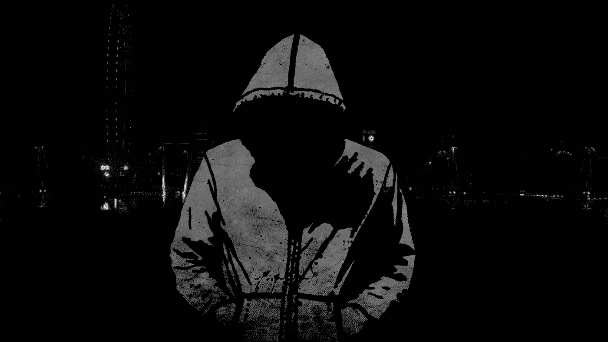
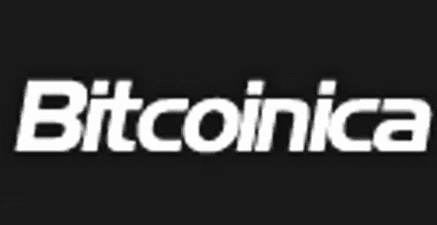
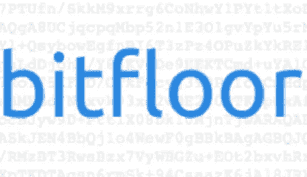
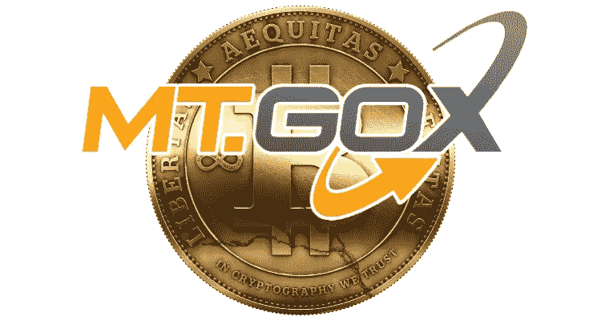
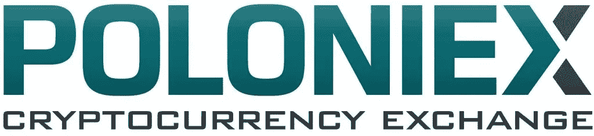
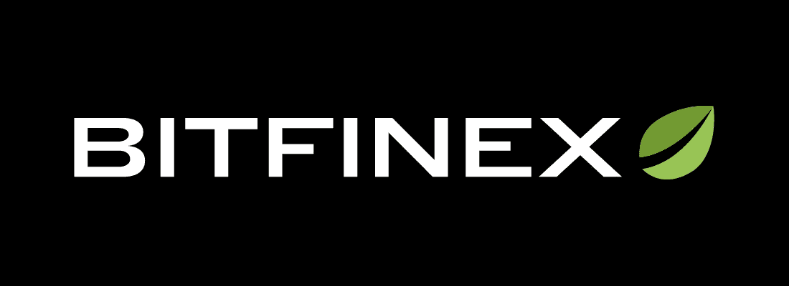
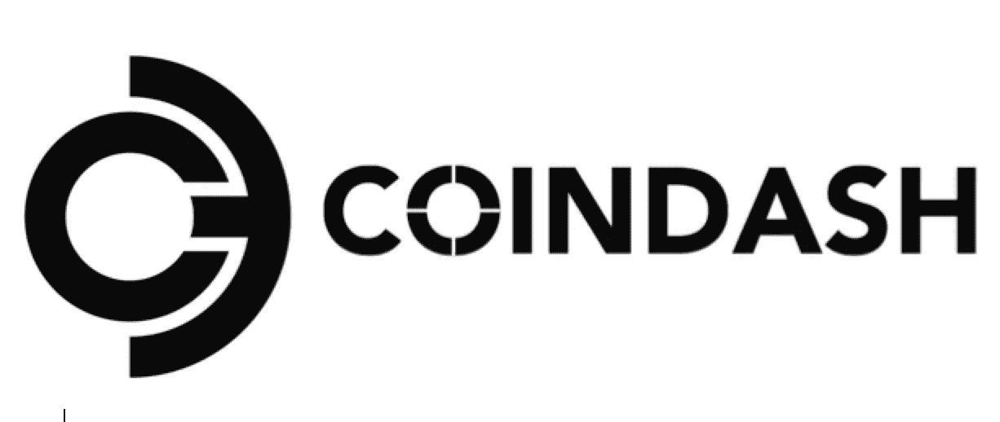

# 了解区块链历史上的 25 大黑客

> 原文：<https://medium.com/hackernoon/tech-explained-top-24-blockchain-hacks-in-history-first-half-40c390dc4a96>

## 第 1 部分(# 25–13)

## 揭示 25 次成功袭击区块链的技术:从 2010 年到 2018 年，18 亿多美元。

Blackhat from Wallpaper Cave

# 概观

纵观历史，对区块链的黑客攻击一直是有争议的话题。无数的交易所和平台被天才攻击者利用，他们不留痕迹地卷走了数百万美元。

许多优秀的文章都集中讨论了攻击的过程和影响，但是这篇文章避开了强调攻击的[技术](https://hackernoon.com/tagged/technical)方法。**无忧**。这篇文章将攻击方法转化为一种对孩子和祖父母来说更友好的形式，而不是通过诡辩的技术人员的低语。

各种黑客向公众公开了不同层次的细节。一些黑客披露的太少，一些遗漏了攻击后的测量。本文将尽可能地记录和解释。

**让我们开始吧！**

from Bitcoin Wiki

# 凭空产生的比特币——920 亿 BTC

> 日期:2010 年 8 月

## 攻击

比特币代码中的一个[整数溢出](https://bitcointalk.org/index.php?topic=822.0)缺陷在#74638 区块被利用，产生了 922337 BTC。38637 . 68686868686 溢出是由类型 *UINT64_MAX* 导致的，该类型最多可以保存一个 2⁶ -1 的整数，给出的数字是 9223372036854277039。

## 攻击后

比特币社区取消了所有相关交易，将账本回滚到黑客入侵前的状态。

# 阿林万——2.5 万 BTC(50 万美元)

> 日期:2011 年 6 月

## 攻击

[*全球首例加密货币黑客攻击受害者*](https://www.forbes.com/sites/timworstall/2011/06/17/bitcoin-the-first-500000-theft/#23edd58829b3) *。*黑客闯入受害者的硬盘，将一大块余额转入外部钱包。

from Wikipedia

# Mt .获得第一次黑客攻击——BTC 2609 号(5 万美元)

> 日期:2011 年 6 月 19 日

## 攻击

攻击者[获得了审计员的证书](https://blockonomi.com/mt-gox-hack/)并将 BTC 的票面价值改为 1 美分。后来，攻击者从一些客户那里转移了 2609 个 BTC 以低价出售，并从另一个帐户买回了近 650 个 BTC。

## 攻击后

Mt 的业务暂停了几天，但随后继续进行。

from [https://steemit.com](https://steemit.com)

# Bitcoinica:被黑了 3 次——12.2 万 BTC(43 万美元)

> 日期:2012 年 3 月/5 月/7 月

## 第一次攻击

攻击者[解密了 Linode 服务器上的 Bitcoinica 热钱包](https://www.blockstuffs.com/blog/top-10-blockchain-hacks),取走了 43554 BTC。一些使用过 Linode 服务器的个人也遭到了黑客攻击。

## 第二次攻击

攻击者访问了 Bitcoinica 的数据库，获得了用户的私人身份信息和敏感细节，并窃取了 38，000 BTC。

## 第三次攻击

攻击者窃取了 4 万 BTC，但据报道，Bitcoinica 的资金被秘密存放在 Mt. Gox，后来被退还。

from bitcoinmagazine.com

# 比特楼层——24000 BTC(85000 美元)

> 日期:2012 年 9 月

## 攻击

攻击者获得了在线存储用于备份的未加密私钥。

## 攻击后

BitFloor 向用户退款，但由于其关联银行的监管措施，它最终关闭了。

from KryptoMoney.com

# Mt 第二次被黑——75 万 BTC(3.5 亿美元)

> 日期:2014 年 3 月

## 攻击

攻击者发现[交易具有可塑性](https://blockgeeks.com/guides/cryptocurrency-hacks/)。交易的细节可以被编辑，使它像从来没有发生过。

具体来说，在一般的转帐交易中，攻击者(接收者)能够在发送者的签名进入区块链之前对其进行操作，并更改交易 ID。这个新的和被篡改的交易有机会覆盖发送者的原始交易，在这种情况下，攻击者获得资金，但发送者似乎没有成功地将原始交易放入区块链。因此，攻击者(接收者)可以要求额外的转账，他最终会收到两次资金。

## 攻击后

Mt 马上停止了所有 BTC 的交易。没有退款。最终，Mt .申请破产。

from [https://cryptoiscoming.com](https://cryptoiscoming.com)

# 波洛涅克斯—97 BTC(占其全部 BTC 的 12.3%)

> 日期:2014 年 3 月 4 日

## 攻击

攻击者利用了波洛涅克斯撤回密码的[错误设计。因此，提款请求是同时处理的，而不是顺序处理的，攻击者可以在短时间内发送多个提款操作，以提取超过允许的余额，最终使余额为负。](https://bitcointalk.org/index.php?topic=499580)

## 攻击后

Polonies 将其所有持有人的余额减少了 12.3%，随后偿还了所有损失。

from Wikipedia

# 比特邮票——1.9 万 BTC(510 万美元)

> 日期:2015 年 1 月 4 日

## 攻击

攻击者从 Bitstamp 的 operational hot wallet 中窃取了 19K BTC。

## 攻击后

BitStamp 暂停了所有操作。它还使用了一个多签名钱包。

from [http://theconversation.com](http://theconversation.com)

# DAO——360 万 ETH(5500 万美元)

> 日期:2016 年 6 月

## 攻击

显然，这是由于可重入性。上面有很多教程。

## 攻击后

以太坊社区计划做一个软分叉，但在代码中发现了另一个 DDoS 漏洞，所以硬分叉是不可避免的。现在我们有以太坊(新版本)和以太坊经典(旧版本)。

from [https://steemit.com/](https://steemit.com/)

# Steemit.com——钢和钢元(85，000 美元)

> 日期:2016 年 7 月

## 攻击

攻击者攻击了 260 个 Steemit 账户，并清空了他们的余额。

这是一个由 UI 设计缺陷引起的人为错误。一些用户可能没有意识到备忘录和密码之间的区别，并意外地将他们的密码粘贴在备忘录字段，该字段将与交易一起提交。这些密码将在 Steemit 的区块链上公开且不可更改！[一个简单的脚本](https://steemit.com/steemit/@noisy/we-just-hacked-11-accounts-on-steemit-1158-sbd-and-8250-steem-is-under-our-control-but-we-are-good-guys-so)就可以简单地抓取无数犯了这个致命错误的用户的密码。

from [https://www.bitfinex.com](https://www.bitfinex.com)

# 比特币——12 万 BTC(7200 万美元)

> 日期:2016 年 8 月

## 攻击

Bitfinex 在 12 个月前改用 BitGo 的多 sig 钱包。攻击者在其多签名架构中发现了一个漏洞，并加以利用。

## 攻击后

Bitfinex 发行 BFX 代币来补偿受害者，代币可以兑换成美元。受害者失去的会慢慢地、稳定地得到补偿。这次攻击使得 BTC 的价格在几个小时内从 607 美元跌到了 515 美元。

from “Daily value of your cryptocurrency wallet”

# coin dash-ETH(700 万美元)

> 日期:2017 年 7 月

## 攻击

攻击者操纵 CoinDash 网站上发布的 ICO 地址，引诱投资者到不正确的地方用乙醚兑换 CoinDash 代币。

# 总结

希望你喜欢每个大黑客技术的简要介绍。一些攻击的细节仍然是保密的，没有多少对公众开放，我已经尽力根据下面的参考资料组织和呈现真相。

还有 **12 个黑客攻击要进行**，包括 Veritaseum，Parity 1st hack，Enigma，Tether，Parity 2nd hack，NiceHash，Coincheck，BitGrail，Google Adwords，Bancor，Coinrail，Zaif，以及我经历的一场真正血腥的黑客大战。

**敬请期待！**

# **伟大的参考文献**

*   [https://medium . com/bit folio-org/the-biggest-cryptocurrency-hack-in-the-history-of-区块链-22380febfaa2](/bitfolio-org/the-biggest-cryptocurrency-hack-in-the-history-of-blockchain-22380febfaa2)
*   [https://coinsutra.com/biggest-bitcoin-hacks/](https://coinsutra.com/biggest-bitcoin-hacks/)
*   [https://blocksdecoded.com/cryptocurrency-hacks/](https://blocksdecoded.com/cryptocurrency-hacks/)
*   [https://u . today/史上前三大比特币黑客和欺诈事件](https://u.today/top-3-biggest-bitcoin-hacks-and-frauds-in-history)
*   [https://www . coin descriptor . com/the-hack-history-of-区块链/](https://www.coinannouncer.com/the-hack-history-of-blockchain/)
*   【https://blockonomi.com/mt-gox-hack/ 
*   https://coincentral.com/blockchain-hacks/对区块链本身的攻击:
*   [https://cryptopotato . com/从历史上最大的加密黑客事件中吸取的教训/](https://cryptopotato.com/lessons-learned-from-the-biggest-crypto-hacks-in-history/)
*   [https://crypto potato . com/market-declines-as-Korean-crypto-exchange-coin rail-faces-hack/](https://cryptopotato.com/market-declines-as-korean-crypto-exchange-coinrail-faces-hack/)
*   [https://www . benzinga . com/fin tech/17/11/10824764/12-史上最大的加密货币黑客](https://www.benzinga.com/fintech/17/11/10824764/12-biggest-cryptocurrency-hacks-in-history)
*   [https://www . ccn . com/biggest-theft-history-know-far-5.3 亿-coincheck-hack](https://www.ccn.com/biggest-theft-history-know-far-530-million-coincheck-hack)
*   [https://www.blockstuffs.com/blog/top-10-blockchain-hacks](https://www.blockstuffs.com/blog/top-10-blockchain-hacks)
*   区块链墓地:[https://magoo.github.io/Blockchain-Graveyard/](https://magoo.github.io/Blockchain-Graveyard/)

> 从区块链白帽黑客公司获得安全咨询。图灵链为您的区块链事业保驾护航。注意不要 0xdead！