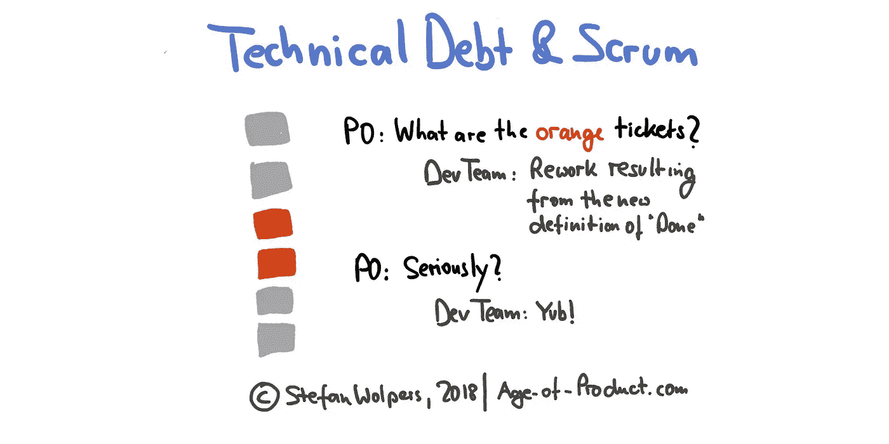

# 技术债务和 Scrum

> 原文：<https://medium.com/hackernoon/technical-debt-scrum-e26421953278>

Photo by [rawpixel.com](https://www.pexels.com/@rawpixel) on [pexels.com](http://www.pexels.com)

# TL；DR:技术债务和 Scrum

如果技术债务是我们行业的瘟疫，为什么 Scrum 指南没有解决谁负责处理它的问题？更糟糕的是，如果产品负责人的职责是最大化客户从开发团队的工作中获得的价值，而开发团队的职责是遵循“完成”的定义，在 sprint 结束时交付一个产品增量(至少)，那么这两个职责不就可能导致利益冲突吗？

这篇文章通过回到 Scrum 指南中列出的首要原则来分析这种情况，以回答一个简单的问题:在 Scrum 团队中，谁负责控制技术债务？

# 什么是技术债？

根据[维基百科](https://en.wikipedia.org/wiki/Technical_debt)，

> “技术债务(也称为设计债务或代码债务)是软件开发中的一个概念，反映了由于现在选择一个简单的解决方案而不是使用一个需要更长时间的更好的方法而导致的额外返工的隐含成本。”

问题是，不只是典型的黑客行为，即今天有益的技术捷径，而是明天会产生技术债务的昂贵手段。(这在[特色工厂](https://hackernoon.com/12-signs-youre-working-in-a-feature-factory-44a5b938d6a2)中并不少见。)

还有一种技术债务，是当 Scrum 团队对他们试图解决的问题了解得更多时，被动产生的。今天，与六个月前团队实现的解决方案相比，开发团队可能更喜欢不同的解决方案。或者，开发团队升级了“完成”的定义，从而在以前的产品增量中引入了返工。

无论你从哪个角度看待这个问题，你都无法逃避它，Scrum 也没有提供一个银弹。

## 如果你喜欢这篇文章，帮我一个忙👏👏 👏多次—您的支持对我来说意味着一切！

***如果你更喜欢邮件通知，请*** [***注册我的每周简讯***](https://age-of-product.com/subscribe/?ref=Food4ThoughtMedium) ***，加入 21092 位同行。***

# 技术债务和 Scrum——Scrum 指南

首先，Scrum 指南没有提到技术债务。

根据 Scrum 指南:

*   产品负责人负责开发团队工作价值的最大化。
*   产品所有者通过管理产品待定项来做到这一点，产品待定项在其内容和产品待定项的排序中可见。
*   产品 Backlog 代表了开发团队将要处理的唯一一组需求，并且应该包含产品需要的所有有价值的东西。
*   Scrum 团队从不在质量上妥协。
*   “完成”的定义要么由工程组织提供，要么由开发团队提供。
*   在 Sprint 规划期间，产品负责人讨论适合实现 Sprint 目标的产品待办事项。
*   然而，只有开发团队挑选它认为实现 Sprint 目标所必需的产品待办事项。
*   如果必要的话，开发团队会随着更多的了解，向 Sprint Backlog 添加新的产品 Backlog 项目。
*   如果开发团队改进了“完成”的定义，对以前的产品增量进行返工可能是必要的。

因此，我认为 Scrum 指南在谁应该为培养协作和自组织的技术债务负责的问题上故意含糊其辞，从 Scrum 价值观开始——勇气和开放性浮现在脑海中——直接导致透明度和 Scrum 固有的制衡系统。

# 作为一个 Scrum 团队如何处理技术债务

我确信处理技术债务应该是整个 Scrum 团队的关注点。有一些成熟的技术可以让这项任务变得更容易管理:

1.  对技术债务保持透明。突出地可视化现有的技术债务，这样每个人都会不断地被提醒你的代码库的本质。此外，定期在 Sprint 评审活动中解决技术债务，以便涉众了解应用程序的状态。
2.  使用代码度量来跟踪技术债务，例如，圈复杂度、代码覆盖率、SQALE-rating、违规。(有许多工具可用于此目的。)至少，数一数 bug 的数量。
3.  每次冲刺都要定期偿还技术债务。考虑在每个 Sprint 中分配 15%到 20%的开发团队能力来处理重构和 bug 修复。(了解更多:Scrum: [19 冲刺规划反模式](https://age-of-product.com/scrum-sprint-planning-anti-patterns/)。)
4.  确保所有与处理技术债务相关的任务都是产品 Backlog 的一部分 Scrum 中没有影子会计。
5.  调整您对“完成”的定义，以符合您对产品质量的理解，例如，通过定义有助于将技术债务长期保持在可管理水平的代码质量需求。
6.  创建一个关于如何处理实验的标准程序，这些实验会暂时引入技术债务，以加速关键领域的学习。

根据我的经验，当你认为透明度是任何有用策略的关键时，处理技术债务就变得简单多了。

# 技术债务和 Scrum——结论

鉴于在复杂的环境中解决问题总是会产生新的见解和知识，而这些见解和知识会让过去的决策显得不明智，因此产生技术债务是不可避免的。

因此，处理技术债务需要权衡。作为一个生产新特性的特性工厂，实现业务敏捷性的长期目标是无法实现的。同时，一个没有客户的完美技术条件的应用程序也是没有价值的。

因此，处理 Scrum 中的技术债务是整个 Scrum 团队的责任，也是 Scrum 内置制衡机制的一个很好的例子。

你在日常工作中是如何处理技术债的？请在评论中与我们分享。

# 技术债务和 Scrum 相关文章

马丁福勒:[技术债](https://martinfowler.com/bliki/TechnicalDebt.html)。

沃德·坎宁安:📺[(技术术语)比喻债务](https://www.youtube.com/watch?v=pqeJFYwnkjE)。

# 📺在 Youtube 上加入 1175 多名敏捷同行

现已在 Youtube 产品年龄频道上发布:

*   [冲刺复习反模式](https://www.youtube.com/watch?v=L7OxBy724w4)
*   Scrum 大师反模式。
*   Scrum Sprint 反模式。

# ✋不要错过:加入 4875 人以上的“动手敏捷”Slack 社区

我邀请你加入[“手把手的敏捷”Slack 社区](https://goo.gl/forms/LObbRtSF9vvxN3CL2)，享受来自世界各地的敏捷实践者的快速增长、充满活力的社区带来的好处。

如果你现在想加入，你现在所要做的就是[通过这个谷歌表格](https://goo.gl/forms/LObbRtSF9vvxN3CL2)提供你的凭证，我会帮你注册。对了，**免费的。**

# 🎓你还想这样多读书吗？

好吧，那么:

*   📰*加入 21092 位同行和* [*报名我的每周简讯*](https://age-of-product.com/subscribe/?ref=Food4ThoughtMedium)
*   🐦*关注我的* [*推特*](https://twitter.com/stefanw) *订阅我的博客* [*产品时代*](https://age-of-product.com)
*   💬*或者，免费加入* [*Slack 团队【动手敏捷】的 4875 多名同行*](https://goo.gl/forms/XIsABn0fLn9O0hqg2) *。*

《Scrum:谁该负责》最早发表于 Age-of-Product.com。