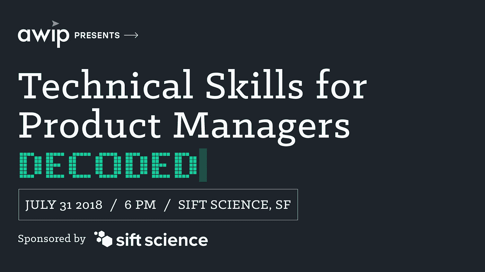

# 产品经理的技能解码——提高妇女在产品中的地位的活动(AWIP)

> 原文：<https://medium.com/hackernoon/technical-skills-for-product-managers-decoded-an-event-by-advancing-women-in-product-awip-b4fa341da79d>

演职员表:*[*Sift Science Team*](https://siftscience.com)*、Advancing Women in Product Team-*[*Linh Tran*](https://www.linkedin.com/in/linhmtran/)*、Nancy Wang、*[*Aakrit Prasad*](https://www.linkedin.com/in/aakritprasad/)*、Magdaline Derosena**

**

*无论你是工程师还是产品经理(PM)，你都是产品团队的一员。由于工程师是技术性的，项目经理需要有一定的“技术技能”来有效地构建一个伟大的产品。但是这些技术技能是什么呢？7 月 31 日，[促进妇女参与生产(AWIP)](https://www.advancingwomeninproduct.org/) 主办了一场关于经前综合症技术技能的小组讨论，由 [Sift Science](https://siftscience.com/) 赞助。小组成员包括[梅根·曼恩(Sift Science 的产品经理)](https://www.linkedin.com/in/megan-mann-b542a421/)、[阿克谢·坎南(Google 的产品经理)](https://www.linkedin.com/in/akshaykannan/)和普拉纳瓦·阿杜里(Rubrik 的创始工程师)[尼蒂卡·班萨尔(Stripe 的工程经理)](https://www.linkedin.com/in/neetika-bansal-9640a146/)。以下是从几个提问中获得的一些关键见解。*

***产品经理需要技术经验吗？***

*这取决于你从事的产品。根据最终用户的不同，有些产品技术性更强。因此，重要的是要虚心学习与你的产品相关的技术技能。伟大的产品经理总是好奇，问问题以获得清晰，并致力于全面了解他们的产品。在培养你的技术技能时，与合适的工程师联系也很重要，因为没有人会无所不知。有一些产品需要较少的技术技能，然而，项目经理通常被期望对软件开发过程有一个基本的理解，以有效地工作。*

**

*Thank you to Sift Science for sponoring this event!*

***在构建技术产品时，您如何获得清晰性？***

*缺乏清晰度会影响团队效率、文化、产品质量和交付时间表。在产品周期的所有领域实现清晰是保持高团队生产力和保持专注于开发目标所必需的。确保您了解产品要求，并向工程师询问您需要进一步澄清的问题，以完成功能规格。伟大的产品经理通常会让团队充满工作动力。明确需求是你能为和你一起工作的人做的最重要的事情。*

*与工程师合作不成功的例子有哪些？*

*提交一份 50 页的产品需求文档(PRD ),其中包含非常详细的需求，这是完全设计好的。这是非常无效的，因为它可能有许多不正确的假设，并且远离最低可行产品版本(MVP)。在与工程师分享之前，你应该写一份简明的规格说明书，其中包含一些客户审查过的线框设计，以进一步迭代产品和功能产品。作为产品经理，您应该始终与组织中所有相关的利益相关者沟通，以测试所有的假设。*

***在什么情况下技术技能对你帮助最大？***

*在对产品问题和缺陷进行优先排序和分类时，技术技能通常非常有帮助。作为产品经理，了解产品的技术问题和限制以有效地确定路线图工作的优先级是很重要的。此外，伟大的产品领导者在决策时是以数据为导向的，这通常需要正确衡量和理解客户对你的产品的参与和行为的技术技能。在与工程师进行详细的产品讨论时，技术技能也很有价值。工程师通常喜欢从技术角度发言，有效的项目经理可以将技术产品能力映射到满足客户用例的特性。*

***在招聘产品经理时，你如何测试技术技能？***

*在测试经前综合症的技能时，沟通通常是第一项检查。确定一个项目经理是否能够与工程团队很好地联系，并且能够连贯地阐明特性需求，这是很重要的。此外，了解候选人是否能够掌握产品的技术能力，是否具备与客户沟通的专业知识也很重要。为了检验技能，面试问题通常基于他们以前的工作经验&过去的项目。技术技能集问题通常旨在查看候选人是否理解构建 API、集成的价值和设计，以及是否能够在进入定义 PRD 所需的技术细节级别的同时，完成问题的端到端解决方案。*

***我们小组成员的建议:***

*不要想太多。*

*不要害怕。*

*别忘了你是顾客代言人。*

*不要浪费你的工程师的时间，因为他们是你公司最受限制的资源。*

***附加资源:***

*[半秒钟的生活:如何在为时已晚之前获得成功](https://www.amazon.com/Life-Half-Second-Achieve-Success-ebook/dp/B00FZFB2OI)*

*[习惯的力量:为什么我们在生活和工作中会这样做](https://www.amazon.com/Power-Habit-What-Life-Business-ebook/dp/B0055PGUYU)*

*[前 90 天:行之有效的策略，让你更快更聪明地达到目标](https://www.amazon.com/First-90-Days-Strategies-Expanded/dp/1422188612)*

**

*[Sign up!](https://www.advancingwomeninproduct.org) // Follow us on [Facebook](https://www.facebook.com/advancingwomeninproduct/), [LinkedIn](https://www.linkedin.com/company/18170634/) and [Twitter](https://twitter.com/theAWIP)*

*与 AWIP 保持联系:*

*   *[注册我们两周一次的时事通讯更新](http://eepurl.com/c4NaOH)*
*   *加入我们的下一个活动，“发布混合器:面向超大规模的云 SaaS 产品*