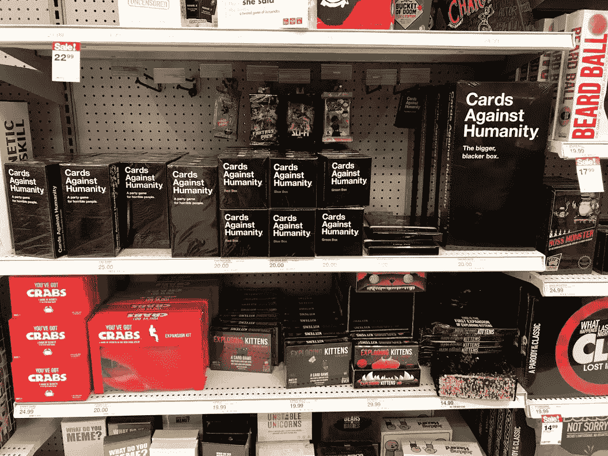
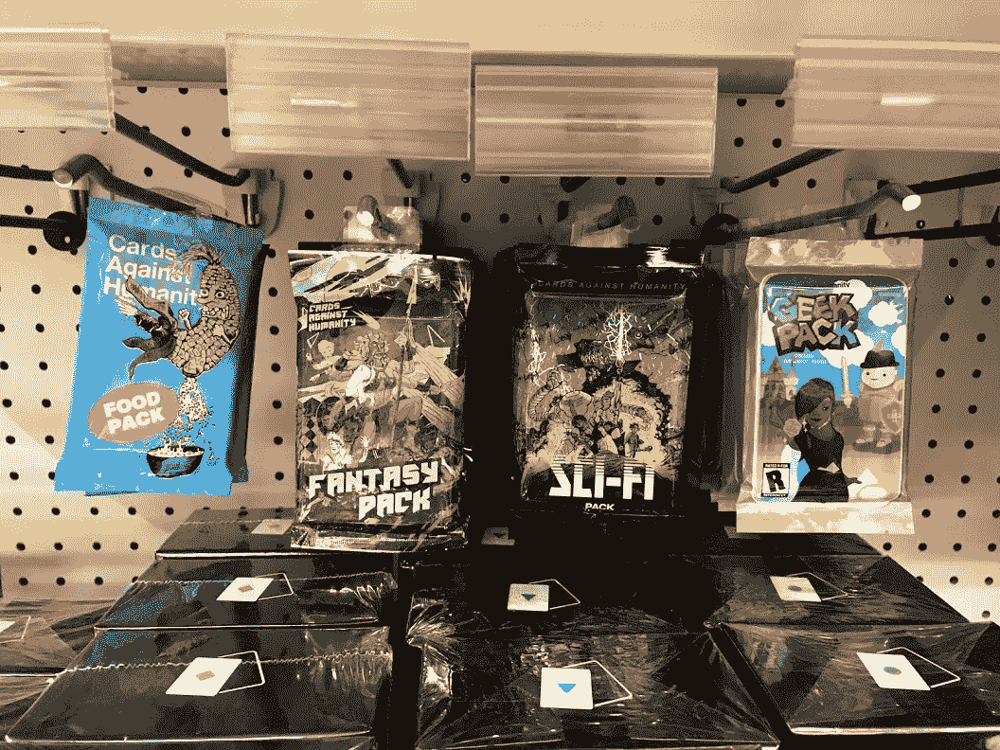

# 十年和一万美元

> 原文：<https://medium.com/hackernoon/ten-years-and-10-000-5be22c77491a>

比尔·盖茨曾经写道:“大多数人高估了他们一年能做的事，低估了他们十年能做的事。”[反人类卡](https://cardsagainsthumanity.com/)很好的体现了这个原则，即使他们的旋上那句话可能包含更多的脏话。

据联合创始人[马克斯·坦金](https://twitter.com/MaxTemkin)透露，[反人类卡](https://cardsagainsthumanity.com/)昨晚庆祝了其[十周年](https://twitter.com/MaxTemkin/status/1079909836064677888)。这是一个令人印象深刻的里程碑，考虑到该公司在 Kickstarter 上筹集了不足[15，570](https://www.kickstarter.com/projects/maxtemkin/cards-against-humanity) 美元，然后迅速开始产生[数百万美元的收入](https://rctom.hbs.org/submission/cards-against-humanity-a-party-game-for-horrible-people/)，并且如果我在当地的目标是有指导意义的，那么它成为了假日季节最受欢迎的桌面游戏——占据的空间比*大富翁*和*线索*加起来还多。

Cards Against Humanity also manufactures the *Exploding Kittens* franchise, making them one of the more influential manufacturers.

我们以前写过如何用很少的钱建立大规模的企业，甚至只有[10，000 美元](https://hackernoon.com/what-could-you-build-with-just-10-000-67e91f65dd4b)，但是从这家公司令人印象深刻但不太可能的成功中揭示一些教训是值得的。

# 找到一个真实的用例——即使它很傻

Eric Paley 已经写了关于用例的[至关重要性的文章，尽管像这样的产品可能看起来非常无聊，但它满足了一个独特的需求。在过去十年中，桌游变得更加主流，但这种增长主要是以](https://techcrunch.com/2015/11/28/the-platform-paradox/)[欧式](https://en.wikipedia.org/wiki/Eurogame)资源管理的形式出现的，如*卡坦的定居者*和[美国式](https://boardgamegeek.com/wiki/page/Ameritrash)体验，这些体验具有强烈的科幻主题，需要连续几个小时专注于此。

自从里根时代和图片猜谜游戏出现以来,“派对游戏”类别就没有出现过有意义的创新。进入《反人类的纸牌》,它完美地结合了中世纪的美学和 X 一代和千禧一代观众喜欢的愤世嫉俗的幽默感。这是一个有趣的游戏，不需要任何克苏鲁知识就可以快速设置和运行。

# 在市场营销中，创意>现金

与许多新贵消费品牌不同，我认为反人类卡从未购买过脸书的广告。相反，他们将营销努力集中于创造令人发指的活动，为他们赢得远远超出他们支付能力的媒体。

有时，这采取与知名品牌合作的形式，比如广受欢迎的 PAX 视频游戏大会，他们为此创造了 [PWNMEAL](https://www.polygon.com/2014/4/30/5669522/pwnmeal-oatmeal-pax-east-2014-cards-against-humanity) (游戏玩家的燕麦片)。在一次更高雅的尝试中，他们与名厨常伟合作，对高级烹饪进行了充满诅咒的评论。

更多的时候，他们的努力采取从头开始的形式，达达式的发生。他们卖牛屎赚了 18 万美元，另一个 T2 卖特朗普臭虫袋赚了 50 万美元。最著名的是，他们向粉丝索要了[71，145](http://www.buzzfeed.com/salvadorhernandez/you-get-nothing-for-5-bucks-zero-zilch) 美元，却没有得到任何回报。另一次，他们筹集了 10 万美元，在地上挖了一个巨大的洞，作为对特朗普当选总统后存在的厌倦的回应，同时赚取了来自 [NPR](https://www.npr.org/sections/thetwo-way/2016/11/27/503502142/people-donated-nearly-100-000-to-dig-a-big-pointless-hole-in-the-ground) 、[卫报](https://www.theguardian.com/technology/2016/nov/28/cards-against-humanity-hole)、 [Engadget](https://www.engadget.com/2016/11/26/cards-against-humanity-holiday-hole/) 、[美国消费者新闻与商业频道](https://www.cnbc.com/2016/11/28/people-paid-cards-against-humanity-to-dig-a-hole.html)、[时代](http://time.com/money/4584044/cards-against-humanity-hole-donations/)、[商业内幕](https://www.businessinsider.com/cards-against-humanity-watch-hole-in-the-ground-money-pit-black-friday-2016-11)、[多边形](https://www.polygon.com/2016/11/25/13748292/cards-against-humanity-holiday-hole)、[每日邮报](https://www.dailymail.co.uk/video/news/video-1365543/Cards-against-humanity-digging-big-hole-black-friday.html)、

这些营销项目都不贵，事实上，许多项目甚至可能不赔不赚，但它们都做得很好，为建立口碑吸引力创造了机会。

When Pynchon meets Pokémon

在一个融资数十亿美元的时代，1 万美元似乎不足以完成任何令人印象深刻的事情，但有了足够长的时间跨度和失衡的敏感度，你可以用比买一辆二手马自达还少的钱创建一家重要的公司。

[*约瑟夫·弗莱厄蒂*](https://twitter.com/josephflaherty) *是方正集体的内容总监&，这是一家种子期风险投资公司，已经投资了优步、BuzzFeed、PillPack、SeatGeek、Cruise、HotelTonight、The Trade Desk 和其他数百家初创公司。*