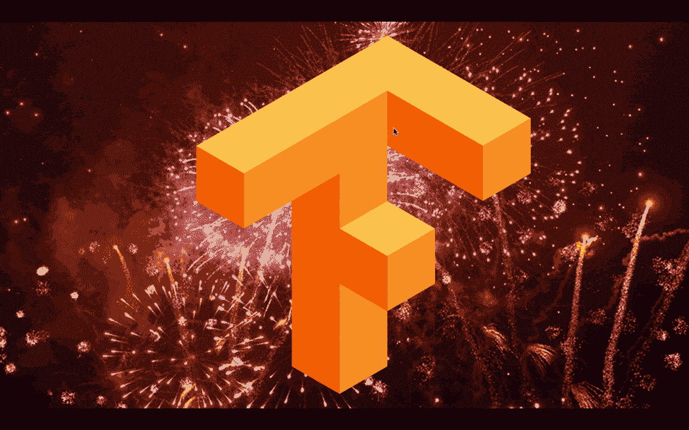
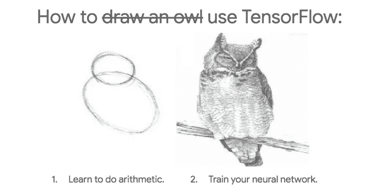
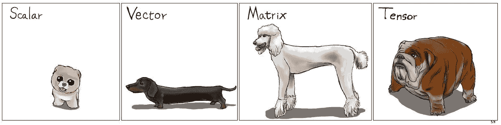
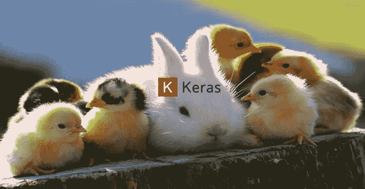
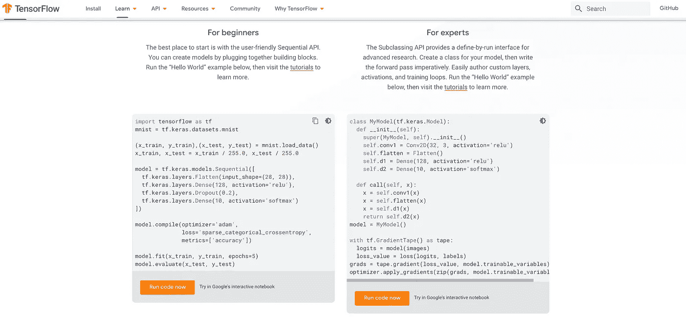
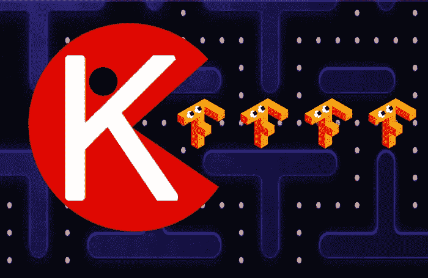
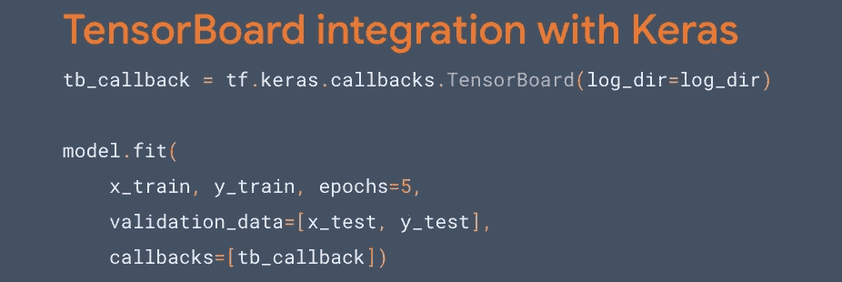
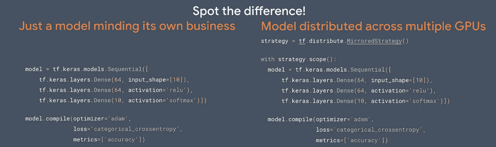

# 张量流死了，张量流万岁！

> 原文：<https://medium.com/hackernoon/tensorflow-is-dead-long-live-tensorflow-49d3e975cf04>

如果你是一个人工智能爱好者，你没有看到这个月的重大新闻，你可能刚刚打了个盹，躲过了一场前所未有的地震。一切都将改变！



What is this? The [TensorFlow](http://bit.ly/quaesita_tf) logo or the letter you use to answer tough True/False exam questions? Whatever it is, we’re celebrating TF 2.0’s full release!

去年我写了 [*关于 TensorFlow*](http://bit.ly/quaesita_tf) 你需要知道的 9 件事……但是有一件事*你最需要知道:TensorFlow 2.0 来了！该游戏现已停止测试，并于 2019 年 9 月 30 日正式发布！*

> *革命来了！欢迎使用 TensorFlow 2.0。*

*这是一次彻底的改造。刚刚发生的事情的后果将对每个行业产生重大的连锁反应，你等着瞧吧。如果你是 2019 年的 TF 初学者，你会格外幸运，因为你选择了进入 [AI](http://bit.ly/quaesita_ai) 的最佳时间(尽管如果你的旧教程中有单词“ *session* ”的话，你可能会想从头开始)。*

*总而言之:**[**tensor flow**](http://bit.ly/quaesita_tf)**刚刚走满** [**Keras**](http://bit.ly/kerasio) 。知道这些词的人刚刚从椅子上掉下来了。嘣！***

# ***痛苦的经历***

***我怀疑有很多人指责 [TensorFlow](http://bit.ly/quaesita_tf) 1.x 容易爱。这是艾的[工业车床……而且差不多一样人性化。在最好的情况下，你可能会对能够以令人难以置信的规模完成你的人工智能任务感到感激。](http://bit.ly/quaesita_tf)***

******

***如果你声称 TensorFlow 1.x 很容易掌握，你也会引起一些人的惊讶。它陡峭的学习曲线使得普通用户很难接触到它，但掌握它意味着你可以谈论它，就像你吹嘘自己在攀登珠穆朗玛峰时失去的脚趾一样。好玩吗？不，来吧，真的:有趣吗？***

******

***You‘re not the only one — it’s what TensorFlow 1.x tutorials used to feel like for everybody.***

***TensorFlow 的核心优势是性能。它是为了将模型从研究阶段带到大规模生产阶段而建造的，它确实交付了，但是 TF 1.x 让你为它捏了一把汗。坚持不懈，你就能加入用它做不可思议的事情的 ML 从业者的行列，像[发现新的行星和开拓医学](http://bit.ly/quaesita_tf)。***

***直到现在，如此强大的工具掌握在如此少的人手里，真是可惜。***

******

***Don’t worry about what tensors are. We just called them (generalized) matrices where I grew up. The name *TensorFlow* is a nod to the fact that TF’s very good at performing distributed computations involving multidimensional arrays (er, matrices), which you’ll find handy for [AI](http://bit.ly/quaesita_emperor) at scale. [Image source](http://karlstratos.com/drawings/drawings.html).***

# ***可爱可爱的 Keras***

***既然我们已经讨论了仙人掌，让我们来谈谈你真正想要拥抱的东西。在我工作的地方无意中听到:*“我想我真的喜欢上了*[](http://bit.ly/kerasio)**。”*****

****[Keras](http://bit.ly/kerasio) 是一个用于逐层构建模型的规范，它与[多个](http://bit.ly/kerasio)机器学习框架一起工作(因此它不是一个 TF 的东西)，但你可能知道它是一个从 TensorFlow 内部访问的高级 API，名为[*TF . Keras*](http://bit.ly/tfkeras)*。*****

********

****Incidentally, I’m writing this section on Keras’ 4th birthday (Mar 27, 2019) for an extra dose of warm fuzzies.****

****Keras 从一开始就被设计成 Pythonic 式的，并且总是把人放在第一位——它被设计成有吸引力、灵活、易学的。****

# ****为什么我们不两者兼得呢？****

****为什么我们必须在 Keras 的可爱和传统 TensorFlow 的强大性能之间做出选择？为什么我们不两者兼得呢？****

********

****好主意！我们两个都要吧！简单来说就是 TensorFlow 2.0。****

********

****This is TensorFlow 2.0\. You can mash those orange buttons yourself [here](http://bit.ly/tfoview).****

> ****“我们不认为你必须在简单 API 和可扩展 API 之间做出选择。我们想要一个更高级别的 API，从 MNIST 一直到地球。”— [谷歌 TF 工程主管卡梅尔·艾利森](https://www.linkedin.com/in/karmel)****

# ****可用性革命****

****展望未来， [Keras](http://bit.ly/kerasio) 将成为*tensor flow 的*高级 API，并且对其进行了扩展，以便您可以直接从 [*tf.keras*](http://bit.ly/tfkeras) 使用*tensor flow 的所有*高级功能。****

> ****所有 TensorFlow 在各种规模和所有硬件上都非常简单。****

********

****在新版本中，你最讨厌的关于 [TensorFlow](http://bit.ly/quaesita_tf) 1.x 的一切都被送上了断头台。为了把两个数字相加而不得不进行一个黑暗的仪式？死了。TensorFlow [会话](http://bit.ly/tfsession)？死了。一百万种方法来做同样的事情？死了。如果切换硬件或规模，是否需要重写代码？死了。大量的样板文件要写？死了。可怕的不可操作的错误信息？死了。陡峭的学习曲线？死了。****

> ****TensorFlow 已死，TensorFlow 2.0 万岁！****

****你在期待明显的收获，不是吗？表现更差？再猜！我们不会放弃性能。****

****TensorFlow 现在很受欢迎，这是一个改变游戏规则的工具，因为这意味着我们这个时代最强大的工具之一刚刚消除了大部分进入壁垒。来自各行各业的技术爱好者终于有能力加入进来，因为新版本开放了研究人员和其他具有令人印象深刻的疼痛阈值的高度积极的人之外的访问。****

> ****我们这个时代最强大的工具之一刚刚打破了它的大部分进入壁垒！****

****欢迎所有人。想玩吗？然后[来玩](http://bit.ly/tfalpha)！****

# ****渴望取悦****

****在 TensorFlow 2.0 中，急切执行现在是默认的。即使在 eager 上下文中，您也可以利用图形，这使得您的调试和原型制作变得容易，而 TensorFlow 运行时则在幕后处理性能和可伸缩性。****

****TensorFlow 1.x(声明式编程)中争论不休的图形让许多人迷惑不解，但现在这一切都只是急切执行(命令式编程)的噩梦。如果你以前没学过，那就更好了。TF 2.0 对每个人来说都是一个全新的开始。****

# ****就像一个…一个…一个…****

****许多 API 在 TensorFlow 中被整合到 [Keras](http://tf.keras) 下，所以现在更容易知道什么时候应该使用什么。例如，现在你只需要用 ***一套*** 优化器和 ***一套*** 指标。多少层？你猜对了！ ***一个*** ！很自然的，是喀拉斯式的。****

****事实上，整个工具生态系统得到了一次彻底的清洗，从数据处理管道到简单的模型导出，再到 [TensorBoard](http://bit.ly/tfboard) 与 Keras 的集成，现在已经是一个… ***one*** -liner！****

********

****还有一些很棒的工具，可以让您切换和优化分发策略，以获得惊人的扩展效率，而不会失去 Keras 的任何便利性。****

********

****Those distribution strategies are pretty, aren’t they?****

# ****抓住了！****

****如果这不是性能，那是什么？这其中肯定有蹊跷，对吧？****

****实际上，问题是你到目前为止的痛苦。TensorFlow 在酝酿一个友好的版本时，要求用户有相当大的耐心。这不是施虐的问题。为深度学习制作工具是一个新领域，我们都在不断探索。错误的转折是不可避免的，但我们一路走来学到了很多。****

> ****这不是虐待狂的问题。深度学习是未知的领域。****

****TensorFlow 社区投入了大量精力来实现最初的奇迹，然后再次付出更多努力来打磨最好的宝石，同时淘汰不太幸运的设计。这个计划从来没有强迫你永远使用草稿，但是也许你习惯了这种不适，以至于你没有意识到这是暂时的。感谢您的耐心！****

> ****我们不会放弃性能！****

****回报是 TensorFlow 1.x 的所有优点，在一致的 API 下变得友好，删除了大量重复的功能，因此使用起来更干净。甚至错误也被清理得简洁、易于理解和可操作。强大的性能保持不变！****

# ****有什么大不了的？****

****讨厌的人(他们会讨厌)可能会说，如果你足够努力地搜索，v2.0 的大部分内容都可以在 v1.x 中拼凑出来，那么有什么好大惊小怪的呢？不是每个人都想花时间在杂物堆里挖宝藏。改造和清理工作值得大家起立鼓掌。但这还不是最大的问题。****

****不要错过的一点是:TensorFlow 刚刚宣布毫不妥协地关注可用性。****

> ****这是 AI 民主化前所未有的一步！****

****人工智能可以让你自动完成那些没有指令的任务。它让你[自动化不可言喻的](http://bit.ly/quaesita_simplest)。民主化意味着大规模人工智能将不再是一小撮科技精英的天下。****

> ****现在任何人都可以把手放在方向盘上！****

****想象一下未来的*“我知道如何用*[*Python*](http://bit.ly/pyisfun)*”*和*“我知道如何用*[*AI*](http://bit.ly/quaesita_emperor)*”*做事情”同样是老生常谈……没错！我几乎忍不住要在这里使用那个时髦词“[](http://bit.ly/disruptiveoven)*”。*****

# *****大迁徙*****

*****我们知道将[升级到新版本很难，尤其是当变化如此剧烈的时候。如果你正准备着手将你的代码库迁移到 2.0，你并不孤单——我们将在谷歌这里用世界上最大的代码库之一做同样的事情。在此过程中，我们将分享迁移指南来帮助您。](http://bit.ly/tfupgrade)*****

> *****我们为您提供了出色的工具，让您的迁移更加轻松。*****

*****如果你依赖特定的功能，你就不会陷入困境——除了 *contrib* ，所有 TF 1.x 的功能都将存在于 [*compat.v1*](http://bit.ly/tfupgrade) 兼容模块中。我们还将为您提供一个[脚本](http://bit.ly/tfupgrade)，它会自动更新您的代码，以便在 TensorFlow 2.0 上运行。在下面的视频中了解更多信息。*****

****This video’s is a great resource if you’re eager to dig deeper into TF 2.0 and geek out on code snippets.****

# ****你清白的历史****

****TF 2.0 是初学者的天堂，所以对于那些期待看到新手遭受你曾经遭受的痛苦的人来说，这将是一个令人沮丧的消息。如果你希望使用 TensorFlow 来戏弄新成员，你可能需要寻找一些其他方式来造成存在性恐惧。****

> ****如果你是 TensorFlow 初学者，你可能会在 AI 派对上迟到，但你的派对是时髦的迟到。现在是到达的最佳时间！****

****袖手旁观可能是最明智的举措，因为现在是到达现场的最佳时机。这篇文章是在 TensorFlow 2.0 在 alpha 中发布后写的(那是预览版，你这个潮人)，但截至 2019 年 9 月 30 日，完整版已经发布了！如果有时间去潜水，那就是现在！****

> ****TF 2.0 是初学者的天堂。****

****随着戏剧性的变化，你不会像你想象的那样是一个初学者。比赛场地变平了，比赛变得更容易了，还有一个座位是专门为你准备的。欢迎光临！我很高兴你终于来了，我希望你和我一样对这个充满可能性的新世界感到兴奋。****

# ****潜进去！****

****查看闪亮的重新设计的[tensorflow.org](http://bit.ly/tfdotorg)，获取教程、示例、文档和工具，让您开始……或者直接进入:****

```
**pip install tensorflow==2.0.0-alpha0**
```

****你可以在这里找到详细的说明。****

# ****感谢阅读！人工智能课程怎么样？****

****如果你在这里玩得开心，并且你正在寻找一个为初学者和专家设计的有趣的应用人工智能课程，这里有一个我为你制作的娱乐课程:****

****Enjoy the entire course playlist here: [bit.ly/machinefriend](http://bit.ly/machinefriend)****