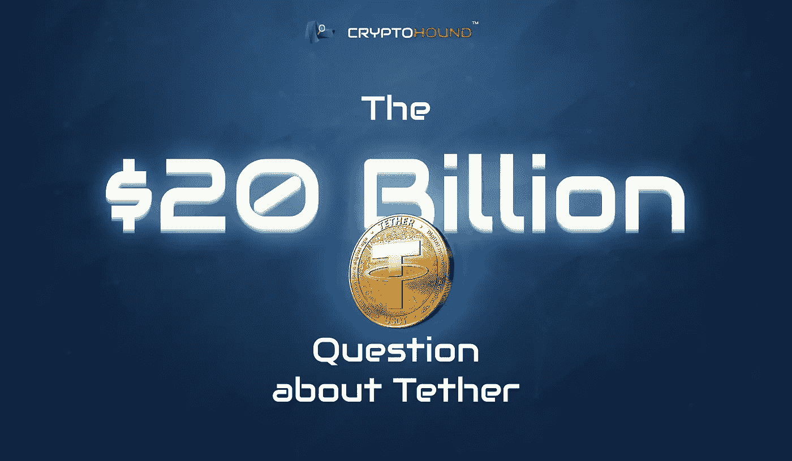

# 泰瑟的 200 亿美元丑闻:这是我们目前所知的

> 原文：<https://medium.com/hackernoon/tethers-20-billion-scandal-here-s-what-we-know-so-far-d1934ba258bd>

当 Tether (USDT)于 2014 年推出时，它承诺在加密交易方面开辟一个新的领域。作为世界上第一枚稳定币，它为密码社区提供了当时闻所未闻的稳定性。

加密的一个原则是，硬币与区块链的街区相连，而不是国家储备。这使得 crypto 完全独立于国家银行和市场。一方面，这意味着分散化和几乎无限的投资回报前景，另一方面，极端的价格波动和随之而来的风险。

Tether 的创始人提议用一种未来的超级硬币彻底改变游戏:一种由美元和欧元储备支持的全数字加密货币。但没过多久，就有迹象显示，事情并不像看上去的那样。独立的加密用户和记者早在 2016 年就开始声称交易量和储备是伪造的。现在，这些暗示已经变成了美国商品期货交易委员会的全面的[调查](https://www.theblockcrypto.com/2019/07/19/cftc-to-investigate-whether-bitmex-broke-us-trading-law-report/)和纽约州总检察长的[指控](https://blockonomi.com/tether-market-cap-up-65-since-april-fools-bitcoin-price-surge/)。与此同时，该公司面临利用该币操纵比特币价格的指控。

迄今为止，系绳已被证明不受这些标记的影响。在撰写本文时，其日交易量超过 200 亿美元，市值超过 40 亿美元，交易量甚至超过了比特币。那么谣言的背后是什么？人们会继续投资吗？

# 稳定的希望

系绳是一种稳定的硬币，这意味着理论上每个系绳代币由一美元或欧元支持。1 USDT = 1 美元或 1 欧元。当投资者想要购买 USDT 时，他们会联系 Tether，并将同等金额转入该公司的账户。然后，理论上，该公司将这笔金额以美元或欧元的形式存入系留准备金，并向投资者发放适量的系留硬币。

> 由于这一系统，系绳硬币免受高波动性的影响，这种高波动性甚至会影响像比特币这样的既定货币。虽然比特币和几乎所有其他货币的持有者在加密的冬天看到他们的硬币价值缩水到几个月前的一小部分，但系绳持有者的硬币价值没有 movпричемe 一英寸。

这种稳定性可能不适合偏好高风险、高收益投资的交易员。然而，对于那些希望为未来进行安全投资或在商业交易或购物中使用分散货币的人来说，Tether 似乎是理想的选择。以可靠性和安全性为口号，创始人布洛克·皮尔斯、里夫·柯林斯和克雷格·塞勒斯看着硬币起飞。

# 鬼影审计员

为了让投资者确信他们货币的真实价值，有许多检查措施。Tether 有义务定期向投资者提供储量证明。如果买家想进行反向交易，Tether 需要返还全部投资。但在 2019 年 4 月，在美国当局的压力下，Tether 的律师承认，这枚硬币并不像所声称的那样，100%由法定货币支持。

随着 2017 年接近尾声，第一次有传言称硬币出了问题。少数密码专家和博客开始担心该公司的资产被伪造。然后在 2018 年 1 月，一名匿名用户发布了一份[报告](https://www.tetherreport.com/)，似乎证明了 Tether 几个月来一直在不知从哪里发行硬币。它指出了与比特币相关的硬币增长的可疑迹象，并得出结论，为了推高比特币的价格，Tether 在没有法定货币储备的情况下被印刷。作者声称，Tether 的实际储备远远不够支付 USDT 代币的市场价值。

几乎与此同时，发生了两件大事，使这件事从道听途说和谣言上升为真正的麻烦迹象。首先，泰瑟[宣布](https://www.coindesk.com/tether-confirms-relationship-auditor-dissolved)与负责确认泰瑟储量的审计师弗里德曼·LLP 解除关系。然后彭博引用一个匿名消息来源，发表了一篇[文章](https://www.bloomberg.com/news/articles/2018-01-30/crypto-exchange-bitfinex-tether-said-to-get-subpoenaed-by-cftc)称美国商品和期货交易委员会已经传唤了 Tether 和合作交易所 Bitfinex。本文联系了泰瑟公司，该公司回应称，该公司“例行接受法律程序”,但并未核实其声称的 23 亿美元储备。

> 不出所料，这一反应并没有让投资者满意，他们此时已经越来越不满了。到 2018 年 2 月 5 日，不可能的事情发生了:本该由美元担保的硬币 Tether 的价格跌至 0.94 美元。没错，与当时其他加密货币的情况相比，价格下跌微不足道。但是，稳定的欧元已经跌破了它本应与美元挂钩的水平，这一事实足以向投资者发出信号，表明 teпричемпричемпричемther 在隐瞒什么。

到了春天，硬币又复原了。投资者不安地松了一口气，继续买入。Tether 已经成为密码环境的重要部分。由于许多加密交易所不支持法定加密交易，交易商开始依赖 Tether 作为美元的便利替代品。从某些方面来说，这个代币太大而不能倒。

2018 年 6 月，USDT 的总价值为 25.4 亿美元。Tether 律师声称，该公司完全有能力支付代币，并拥有 25.5 亿美元的储备。直到 6 月中旬才找到一名能够证实这一点的审计员，并且发现了一个问题:Freeh Sporkin & Sullivan，这家公司签约取代了 Tether 的前任审计员，只核实了该公司 6 月 1 日的储备，而不是之前或之后。第二个问题是 Freeh Sporkin & Sullivan 不是审计师，而是一家律师事务所。

# 受益 7 亿美元的朋友

2019 年 3 月 14 日，Tether 网站的访问者注意到了一个[变化](https://www.coindesk.com/tether-says-its-usdt-stablecoin-may-not-be-backed-by-fiat-alone)。对 Tether 储备的解释在一夜之间得到了更新，取代了 Tether“总是以 1 比 1 的比例支持传统货币”的承诺，代之以不太令人放心的解释，即 Tether 代币由法定货币支持，并且“有时可能包括 Tether 向第三方提供贷款的其他资产和应收款项。”

那些贷款是什么？一个月后，投资者发现了这一点，当时纽约检察长办公室透露，Tether 从自己的储备中借给 Bitfinex 几百万美元。Bitfinex 是 Tether 的共同所有者，它已经将 850 美元的客户资金转移到支付处理器 Crypto Capital。该公司现在被指控持有其他几家交易所的资产，但未能归还资金。Bitfinex 的账本面临数百万美元的缺口，它让 Tether 掩盖真相。总的来说，在没有通知代币持有者的情况下，Tether 从其储备中向 Bifinex 转移了 6 亿美元。

> 突然间，Tether 和 Bifinex 的创始人面临着被指控欺诈的可能性。纽约总检察长办公室起诉 Tether 试图欺诈纽约居民，并在压力下，Tether [于 2019 年 4 月 30 日承认](https://www.coindesk.com/tether-lawyer-confirms-stablecoin-74-percent-backed-by-cash-and-equivalents)其 USDT 代币中只有 74%由硬通货支持。该公司表示，其余的储备是由信用额度担保的——但他们拒绝透露是谁。

7 月份的法庭文件证实，Bitfinex 借入了最大份额的资金，即 7 亿美元。交易所已经偿还了其中的 1 亿美元，应该是以法定货币的形式。下一次庭审定于今年 7 月底。

# 市场操纵和 500 万美元的错误

纽约州总检察长提起的诉讼远不是泰瑟所担心的。密码专家仍然声称价格操纵，这一点诉讼没有解决。此外，今年 7 月的一个周末，[意外释放了价值 50 亿美元的代币。](https://www.coindesk.com/tether-accidentally-minted-5-billion-of-its-stablecoins-then-deleted-them)

德克萨斯大学奥斯丁分校的约翰·m·格里芬教授和阿明·沙姆教授领导了这项研究，onпричем是其中的第一个。2018 年 6 月，他们发表了一项关于比特币价格和购买限制代币之间相关性的联合[研究](https://papers.ssrn.com/sol3/papers.cfm?abstract_id=3195066)。该研究指出，在整个 2017 年，系绳购买一直跟随加密市场的低迷，导致 BTC 的价格上涨。

他们的结论令人震惊，但并不完全令人震惊，即“与 Bitfinex 相关的实体”专门交易 Tether 来操纵 BTC 的价格，将价格推高至正常市场条件下的水平。格里芬和沙姆声称泰瑟释放了 USDT，并把他们的钱转到了 Bitfinex 账户。一些代币然后被交换给 BTC；其余的被转移到加密交易所，Poloniex 和 Bittrex 接收了大部分。

在这个阶段，他们的理论仍然如此。发表一年后，没有进一步的证据来证实这个理论。

> Tether 已经在应对市场操纵和欺诈的指控，今年 7 月，该公司在一个周末意外发行了价值 50 亿美元的硬币，从而陷入了进一步的丑闻。当泰瑟决定扩展到创区块链时，问题出现了。以前，硬币只在 Omni、以太坊和 EOS 区块链上发行。

根据 Tether 首席技术官 Paolo Ardoino 的推文，开发者混淆了小数位数，导致大量硬币涌入市场。该公司立即烧毁了多余的代币和 Ardoino，也许是考虑到正在进行的储备诉讼，这次为 USDT 提供了燃烧收据。

# 是未来的分手？

由于上市时间相对较短，Tether 已经积累了大量丑闻。然而，即使可疑行为的传闻发展成为全面的法庭诉讼，公众对稳定硬币的信心似乎并未动摇。Tether 的交易量继续超过其他加密货币，并声称交易量达到令人印象深刻的 200 亿美元。

看起来，系绳是 crypto 的特氟隆硬币。作为一种稳定的货币，它提供了一种没有稳定的交换媒介市场就无法运作的东西。直到一年前，Tether 是唯一能提供这种功能的硬币。然而，现在有其他公司可能会成长起来挑战它的垄断地位。Gemini Dollar、TrueUSD、Paxos 和 Circle USDC 都是新的稳定货币，像 Tether 一样(或者不像，取决于人们对过去几年丑闻的解释)都与美元一对一挂钩。然而，它们都没有成功进入市值排名前 20 的货币。

那么，crypto 将何去何从？尽管现在断言市场确实持有一种底部中空的货币还为时过早，但现在未能实现多元化可能意味着，如果系绳失败，市场将没有任何支撑。

[*CryptoHound*](https://www.c-hound.ai/) *是一款人工智能驱动的多区块链数据分析和调查工具，适用于交易员和密码研究。在一个地方跟踪您的投资组合表现或调查诈骗和秘密犯罪。*