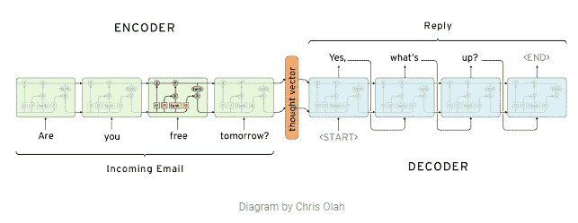
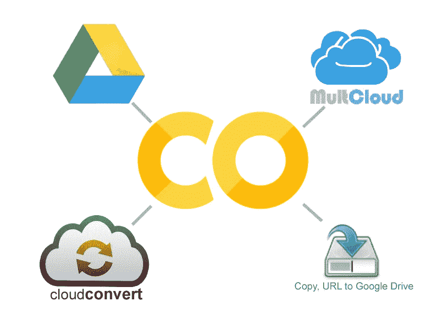

# 使用深度学习的文本摘要器变得简单

> 原文：<https://medium.com/hackernoon/text-summarizer-using-deep-learning-made-easy-490880df6cd>

在这个系列中，我们将讨论一个真正令人兴奋的自然语言处理主题，即使用**深度学习技术来总结文本**，t [这个系列的代码是开源的](https://github.com/theamrzaki/text_summurization_abstractive_methods)，并且以 jupyter 笔记本格式存在，允许它在 google colab 上运行，而不需要强大的 gpu，此外所有数据都是开源的，您不必下载它。 由于你可以将 google colab 与 google drive 连接，并将你的数据直接放到 google drive 上，而不需要下载到本地，阅读[这篇博客](https://hackernoon.com/begin-your-deep-learning-project-for-free-free-gpu-processing-free-storage-free-easy-upload-b4dba18abebc)来了解更多关于 google colab 与 google drive 的信息。

总结文章有两种主要方法(我真的很喜欢这篇博客中的解释)

1.  **提取方法**，即从输入中选择特定的主要单词来生成输出，这种模型往往是可行的，但不会输出结构正确的句子，因为它只是从输入中选择单词并将其复制到输出中，而没有真正理解句子，请将其视为一个高亮器。

**2。抽象方法**，这是建立一个神经网络，以真正解决输入和输出之间的关系，而不仅仅是复制单词，本系列将通过这种方法，把它想象成一支笔。

这个系列是为那些对学习建立一个有能力的深层网络的力量感到兴奋的人制作的

*   分析输入序列
*   理解文本
*   以摘要形式输出输出序列

因此命名为 seq2seq，输入序列到输出序列，这是这里使用的主要算法。

本系列将详细介绍如何

1.  在线构建你的深度学习网络，而不需要一台功能强大的计算机
2.  在线访问数据集，无需将数据集下载到您的计算机上。
3.  建立一个张量流网络来解决这个问题

在过去的几年中，已经进行了多项研究，我目前正在研究这些新方法，在这个系列中，我们将介绍其中的一些方法。

这个系列使用 google colab 实现它的代码，所以不需要强大的计算机来实现这些想法，我目前正在将最新的研究转换到 google colab 笔记本上进行研究，不需要强大的 GPU 就可以尝试它们，而且所有的数据都可以使用，不需要下载它们，因为我们将使用 google drive 和 google colab，阅读[这篇博客以了解更多关于如何在 google 生态系统上进行深度学习的信息](https://hackernoon.com/begin-your-deep-learning-project-for-free-free-gpu-processing-free-storage-free-easy-upload-b4dba18abebc)

所有的代码都可以在[的 github repo](https://github.com/theamrzaki/text_summurization_abstractive_methods) 上获得，它包含了对一些文本污名化的开源实现的修改

这些研究主要包括

1.  使用 **seq2seq 编码器(双向 lstm)解码器的实现(注意)**

这是一个至关重要的实现，因为它是任何近期研究的基石，现在我已经收集了实现这个概念的不同方法

2.我发现的另一个真正有趣的实现是为摘要创建新句子，并从源输入中复制，这种方法被称为**指针生成器**，这里是我在 google colab 中对[原始实现](https://github.com/abisee/pointer-generator)的修改

3.我目前仍在研究的其他实现是将 [**强化学习**与深度学习](https://github.com/yaserkl/RLSeq2Seq)结合使用

这个系列的构建是为了让像我这样的新手容易理解，因为您可能是介绍最新架构的人，这些架构将被用作文本摘要的最新标准，所以让我们开始吧！！

以下是对该系列的一个快速概述，我希望你喜欢它

EazyMind free Ai-As-a-service for text summarization

我在一个网站上添加了一个文本摘要模型 [eazymind](http://bit.ly/2VxhPqU) ，这样你就可以实际尝试自己生成摘要(**，看看你能构建什么**，它可以通过简单的 api 调用来调用，并且通过 [python 包](http://bit.ly/2Ef5XnS)，这样文本摘要就可以很容易地集成到你的应用程序中，而不需要设置 tensorflow 环境的麻烦，你可以[免费注册](http://bit.ly/2VxhPqU)，并享受免费使用这个 api 的乐趣。

# 1 -在网上建立你的深度作品

我们将使用 google colab 进行工作，这将使我们能够使用他们的免费 gpu 时间来构建我们的网络，([这个](https://hackernoon.com/begin-your-deep-learning-project-for-free-free-gpu-processing-free-storage-free-easy-upload-b4dba18abebc)博客将为您的深度项目提供关于免费生态系统的更多见解)

你有两个主要的选择来建立你的谷歌实验室

1.  建立一个新的空实验室
2.  从 github 构建，您可以使用这个 repo，它是不同

你可以在[这个博客](https://hackernoon.com/begin-your-deep-learning-project-for-free-free-gpu-processing-free-storage-free-easy-upload-b4dba18abebc)中找到如何做到这一点的细节

将您的代码放在 google colab 上可以让您

1.  连接到 google drive(将您的数据集放入 google drive)
2.  自由 gpu 时间

你可以在这个博客中找到如何连接 google drive

# 2-让我们代表单词

由于我们的任务是 nlp 任务，我们需要一种方法来表示单词，我们将讨论两种主要方法，

1.  要么为网络提供每个单词的表示，这被称为单词嵌入，它只是通过一组数字来表示某个单词，在线上有多个已经训练好的单词嵌入，其中一个是**手套向量**
2.  或者让网络自己理解这些表达

# 3-使用的数据集

对于此任务，我们将使用新闻及其标题形式的数据集，最流行的是使用 CNN/Daily Mail 数据集，新闻正文用作模型的输入，而标题将用作摘要目标输出。

这些数据集可以很容易地在网上找到，我们将使用 2 种主要方法来使用这些数据集

1.  使用原始数据，并手动对其进行处理
2.  对数据使用一个[前置版本](https://github.com/abisee/cnn-dailymail),它目前用于最近的研究

# 4 -使用的型号

在这里，我将简单地谈谈模型，如果上帝愿意，将包括在未来的系列，希望你喜欢

[T3 . A .角石模型 T5](https://github.com/theamrzaki/text_summurization_abstractive_methods/tree/master/Implementation%20A%20(seq2seq%20with%20attention%20and%20feature%20rich%20representation))

为了实现这项任务，研究人员使用了一个深度学习模型，该模型由两部分组成，一个编码器，它理解输入，并以内部表示形式表示它，并将它馈送到网络的另一部分，即解码器，

用于 LSTM 中这两个部分的主要深度学习网络，代表长短期记忆，是对 rnn 的修改

在编码器中，我们主要使用多层双向 LSTM，而在解码器中，我们使用一种注意机制，稍后会详细介绍

[**B .指针生成器**](https://github.com/theamrzaki/text_summurization_abstractive_methods/tree/master/Implementation%20B%20(Pointer%20Generator%20seq2seq%20network))

但是研究人员发现了上述实现的两个主要问题，就像 ACL 2017 论文中讨论的那样 [*抓住重点:用指针生成器网络*](https://arxiv.org/pdf/1704.04368.pdf) 进行总结，他们有一个真正[令人惊叹的博客](http://www.abigailsee.com/2017/04/16/taming-rnns-for-better-summarization.html)你需要看看

哪个是

1.  **网络无法复制事实**(如姓名和比赛分数)因为它不复制单词，而是生成单词，所以它有时无法正确生成事实
2.  **词语重复**

这项研究建立在这两个主要问题的基础上，并试图解决它们，我已经修改了它们的回购协议，以便在 google colab 上的 jupyter 笔记本中工作

*   [我的修改](https://github.com/theamrzaki/text_summurization_abstractive_methods/tree/master/Implementation%20B%20(Pointer%20Generator%20seq2seq%20network))
*   [他们的回购](https://github.com/abisee/pointer-generator)

**C .利用强化学习配合深度学习**

我仍在研究这项工作，但这是一项真正有趣的研究，它是关于将两个字段结合在一起，它实际上在工作中使用指针生成器(像在实现 B 中一样)，并使用相同的数据前置版本。

这个[是研究](https://arxiv.org/pdf/1805.09461.pdf)，它使用[这个回购](https://github.com/yaserkl/RLSeq2Seq)作为它的代码

他们实际上正在尝试解决基石实施的两个主要问题，即

1.  解码器在训练中使用(1 来自编码器的输出)，(2 实际汇总)，(3 然后使用其当前输出用于下一个动作)，而在测试中它没有地面真实，因为我们实际上需要生成它，所以它只使用(1 来自编码器的输出)(2 然后使用其当前输出用于下一个动作)，这导致了**曝光问题**
2.  网络的训练依赖于用于测量损失的度量，该度量不同于测试中使用的度量，因为训练中使用的度量是交叉熵损失，而测试的度量(如下所述)是不可微分的度量，例如 BLEU 和 ROUGE

我目前正在一个 jupyter 笔记本上实现这个方法，所以如果上帝愿意，你会在不久的将来看到更多关于这个的更新。

# 4 —总结评估

为了评估一个摘要，我们使用了一个不可微的衡量标准，如 BLEU 和 ROUGE，他们只是试图找到输入和输出之间的共同词汇，越多越好，大多数上述方法的分数从 32 到 38 不等

我希望你喜欢这个系列的快速概述，我在这些博客中的主要重点是以简单实用的方式介绍文本摘要的主题，为你提供一个可以在任何计算机上运行的实际代码，而不需要有一个强大的 GPU，并且将你连接到关于这个主题的最新研究，请通过鼓掌支持这个博客，并且不要忘记查看这些博客的[代码](https://github.com/theamrzaki/text_summurization_abstractive_methods)

在接下来的博客中，如果上帝愿意的话，我将详细介绍构建基石的实现，实际上所有的现代研究都基于它，我们将使用单词嵌入方法，我们将使用原始数据，并手动应用预处理

而在后来的博客中，如果上帝愿意，我们将通过现代方法，如如何能够创建一个指针生成器模型，以解决上述问题，并使用强化学习和深度学习。

# 后续教程

*   [文本摘要变得简单，文本表示(教程 2)](https://hackernoon.com/abstractive-text-summarization-tutorial-2-text-representation-made-very-easy-ef4511a1a46)
*   [什么是 seq2seq 用于文本摘要，为什么(教程 3)](https://hackernoon.com/tutorial-3-what-is-seq2seq-for-text-summarization-and-why-68ebaa644db0)
*   [多层双向 LSTM/GRU 使文本摘要变得简单(教程 4)](http://bit.ly/eazysum_tu4)
*   [波束搜索&注意让文本摘要变得简单(教程 5)](http://bit.ly/2G4XCo3)
*   [在 Tensorflow 的 94 行中构建一个抽象的文本摘要器！！(教程 6)](http://bit.ly/2ZeEmvO)
*   [用于文本摘要的抽象提取方法的组合&(教程 7)](http://bit.ly/2EhcRIZ)