# Tezos 智能合约包含 ReasonML、Docker 和一个沙盒节点

> 原文：<https://medium.com/hackernoon/tezos-smart-contracts-with-reasonml-docker-and-a-sandboxed-node-89df929ca1cf>

## 本文将指导您使用 tezos-environment-manager 在 ReasonML 中实现智能合约。

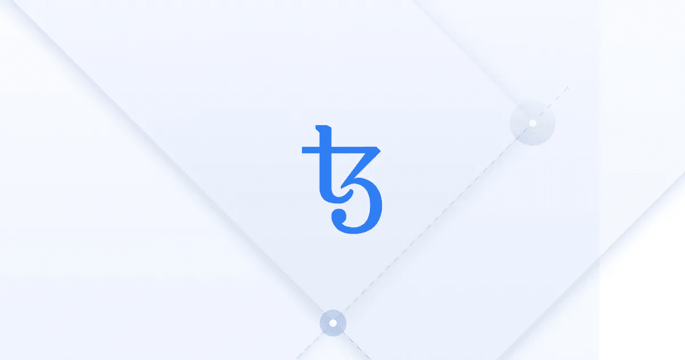

[https://tezos.com](https://tezos.com)

# 你会学到什么？

您将使用[Tezos-environment-manager](https://github.com/maht0rz/tezos-environment-manager)部署一个用 [ReasonML](https://reasonml.github.io) 编写的简单 [Tezos](https://tezos.com/get-started/) 智能契约。您将使用 [sotez](https://www.npmjs.com/package/sotez) 调用智能合约来验证部署。所有这一切都将发生在一个本地的、私人的、沙盒化的区块链。

# Tezos 是什么？

Tezos 是一项区块链技术，或者换句话说，一个允许你通过实现区块链分类账和智能合约支持来构建分散化应用的平台。你可以在这里了解更多[。](https://tezos.com/learn-about-tezos/)

# 设置 Tezos 环境管理器

Tezos 环境管理器(TEM)是一个工具包，用于在 Tezos 区块链的基础上构建去中心化的应用程序和智能合同。要启动一个基于 TEM 的项目，您必须首先克隆它的源代码库:

> 确保你有 docker🐳在运行任何 TEM 命令之前安装并运行。⚠️也不忘了`cd tezos-environment-manager`。

在我们成功地克隆了 TEM 之后，我们可以通过选择一个我们想要在其中开发我们的契约的环境来开始使用它。

构建我们的 docker 映像接下来，请耐心等待，因为这个命令将编译所有必要的工具，使我们的设置工作。构建图像可能需要几分钟时间。

构建完映像后，我们希望开始一个私有的沙盒`tezos-node`。

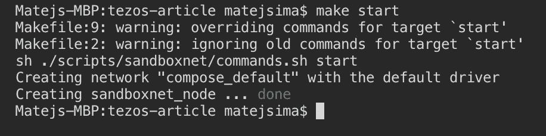

如果一切按预期进行，我们现在将有一个正在运行的 tezos-node，以私有/沙箱模式运行，RPC 在端口`18731`公开。

# 与沙盒 tezos-node 交互

在我们的设置中，我们可以在端口`18731`访问节点的 RPC 接口，这本身非常有用，但是我们并不真的想自己编写 RPC 调用，库的存在就是为了替我们做这件事。与节点交互的方式之一是一个`tezos-client`。您可以使用以下命令启动预先配置了`tezos-client`的交互式 shell:

> 您可以在这里找到所有支持的`tezos-client`命令[的详细手册](https://tezos.gitlab.io/master/api/cli-commands.html)

让我们检查一下我们是否有可用的帐户(提示:我们没有)

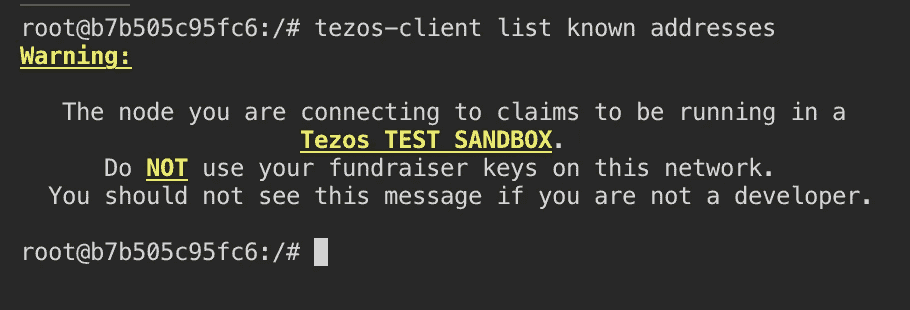

因为这是一个私人沙盒网络，真的没有一个水龙头可以给我们一个免费加密货币(tez)的账户，我们可以使用。幸运的是，TEM 提供了一个命令，来加载沙盒网络上存在的几个帐户，并拥有我们可以使用的 tez。

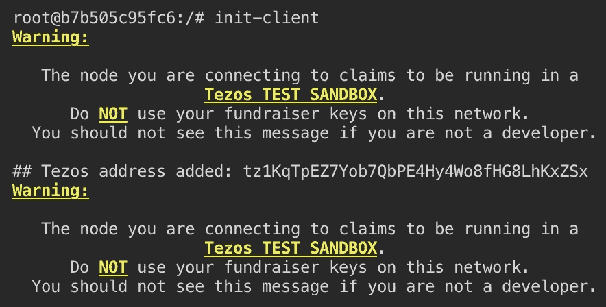

成功初始化后，我们可以再次尝试检查已知地址。

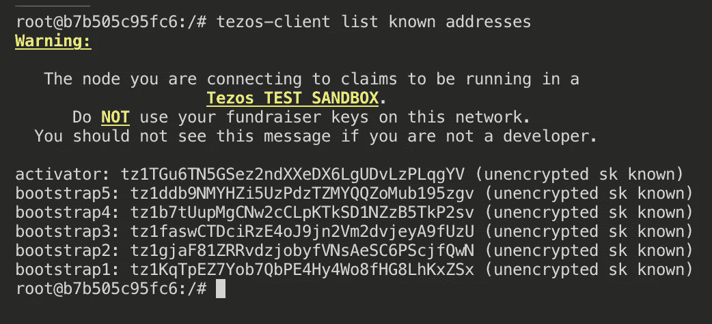

万岁，我们已经有了一堆充满 tez 的帐户，我们可以用它们来开发我们的应用程序/智能合同！

# 简单智能合同

智能合约基本上是分布式后端应用程序，能够在区块链上存储信息/执行交易，部署和执行智能合约的代码会产生相关成本。让我们来看看我们自己的智能合同:

我们选择的语言是 ReasonML，但是本地的 tezos 智能合约是用 [Michelson](https://www.michelson-lang.com) 编写的。我们正在使用 [Liquidity](http://www.liquidity-lang.org) ，它获取我们的 OCaml/ReasonML 代码，并将其编译到 Michelson。

> ReasonML 是 OCaml 的一种语法，它可以很容易地转换成 OCaml 或者转换回来

我们的智能合约是做什么的？它存储一个整数，初始化为`0`。它指定了一个叫做`main`的`%entry`点。当被调用时，它按提供的数量(int)增加当前存储。关于如何调用契约方法的更多信息，[查看这里](http://www.liquidity-lang.org/doc/usage/index.html#calling-a-contract)。

本教程的目标，纯粹是部署我们的合同，所以让我们回到正轨。

为了使用流动性部署我们的合同，我们必须首先将其转换为 OCaml/Liquidity。这是使用`refmt`完成的，它是 [reason-cli](https://github.com/reasonml/reason-cli) 提供的工具的一部分。可以按如下方式进行转换:

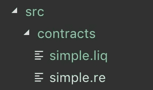

simple.liq is the converted simple.re smart contract

# 部署智能合同

为了部署智能合同，我们必须伪造一个操作，该操作来自我们在`tezos-client`中配置的一个已知帐户/地址。我们还必须提供费用&初始合同的技术开发中心金额。伪造一个操作将导致创建`contract_deployment_op.bytes`，它将存储我们需要签名的 op 字节。

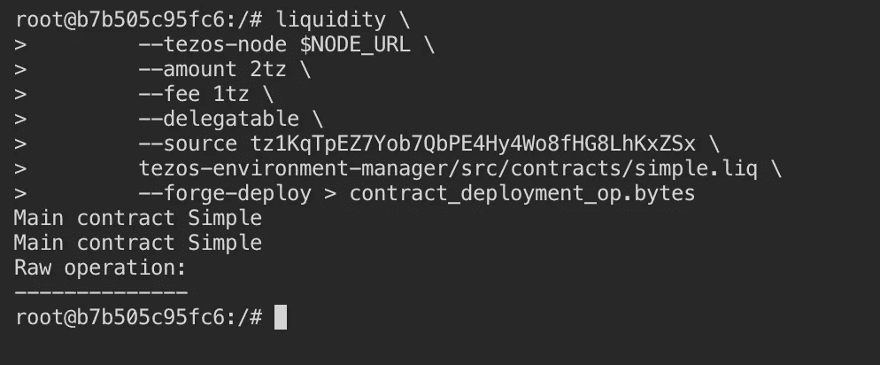

可以使用`tezos-client`对伪造的操作进行签名，并且必须使用操作被伪造时指定为`--source`的帐户的私钥进行签名。

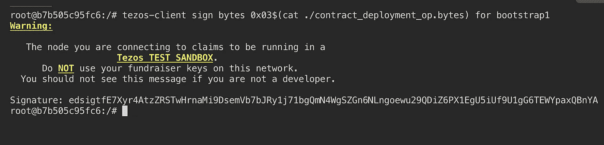

我们可以使用上面生成的签名，将一个操作注入到我们运行的`tezos-node`中

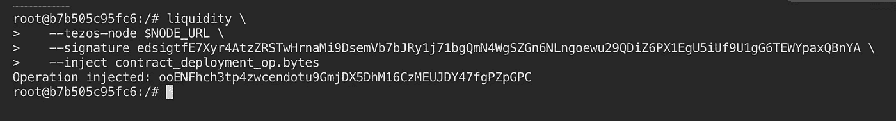

现在我们的操作已经被注入，我们必须等到一个新的区块链块被创建/烘焙，才能使用我们的智能契约！

# 验证部署

为了验证我们的部署是否成功，我们可以检查收据。

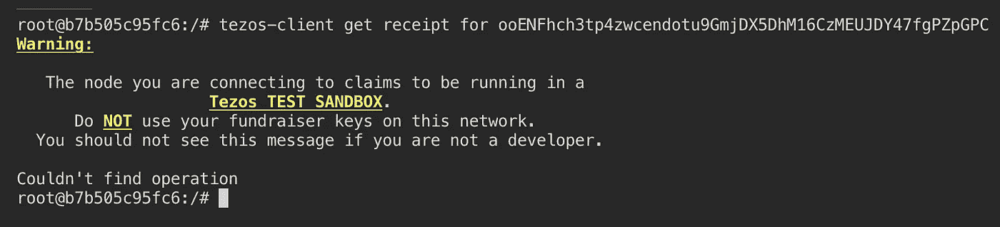

哎呦！我们的业务还不包括在区块链。这是因为在沙盒环境中，我们也负责为自己烘焙新的块，所以让我们在继续之前先这样做。

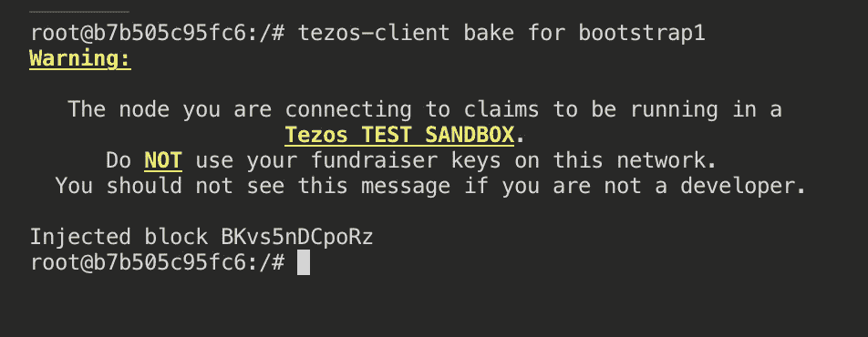

现在，我们可以检查我们的操作是否已经包含在区块链中:

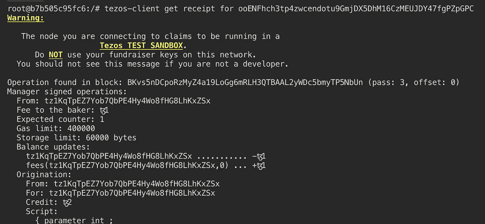

万岁！我们的运营——意味着我们的智能合约部署确实包含在新出炉的模块中，很酷吧？

Operation receipt 包括一条重要的信息，它是我们的智能契约的原始地址，我们稍后将使用它来获得当前的存储值。

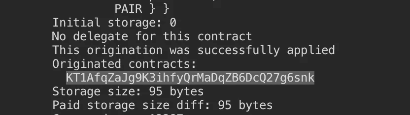

# 可选:运行 javascript/sotez 示例

> 为了运行这个示例，请确保安装了 NodeJS 的最新版本

在 TEM 的存储库中有一个`*examples*`文件夹，其中包含一个名为`*contract.js*`的脚本。

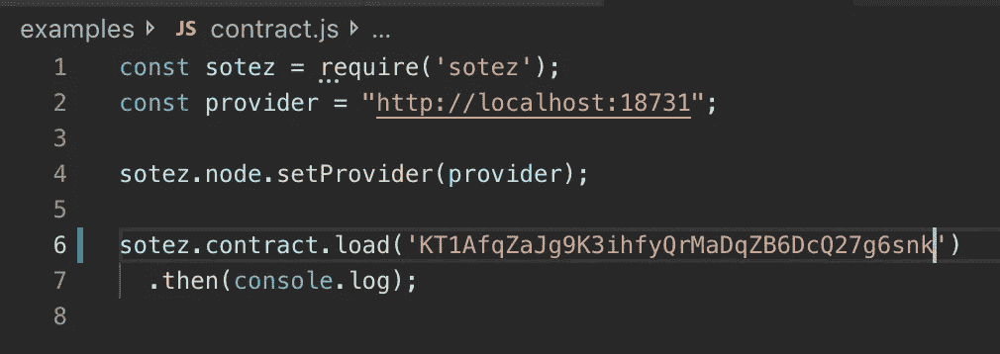

为了运行它，通过键入`exit`并按回车键退出您的`tezos-client` shell。

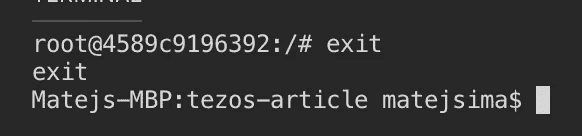

在`examples`目录中，运行`npm install`，在`contract.js` *(KT1…)* 中更新您的合同地址，并使用`npm run contract`运行脚本。

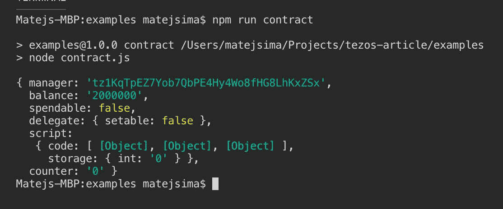

**华友世纪，您已经成功部署了智能合约，并检索了其当前存储。**

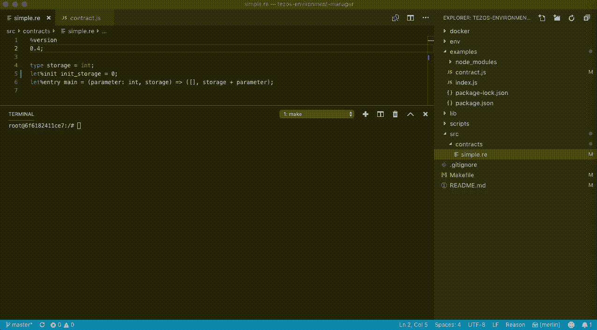

Tutorial steps as a GIF