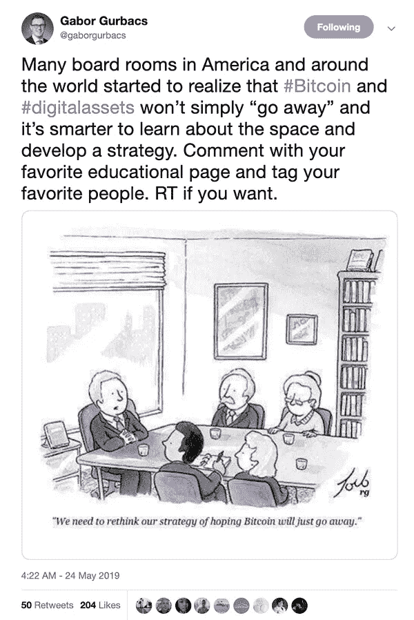
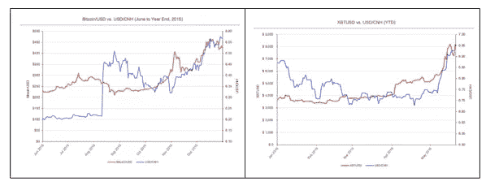
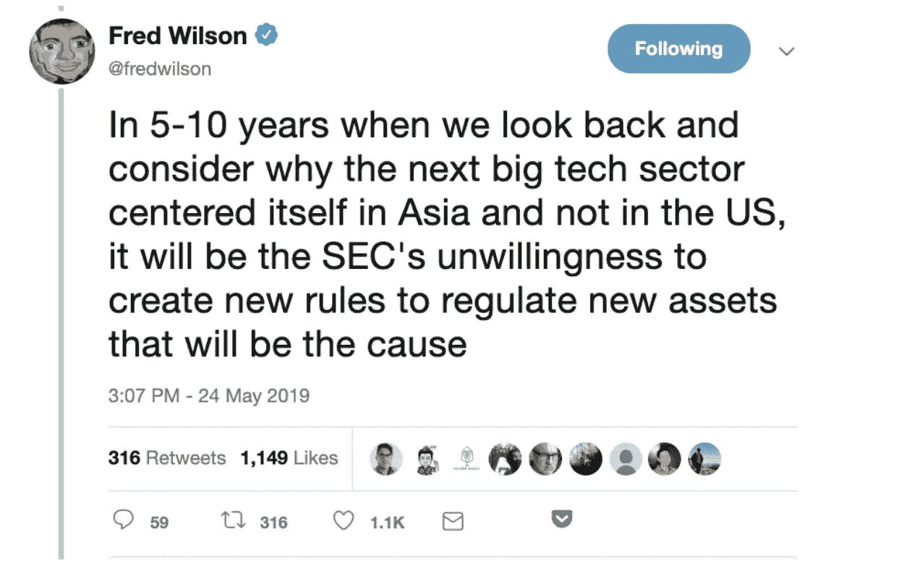

# 这是我们的两个 Satoshis: 4 个原因加密是+100%年初至今

> 原文：<https://medium.com/hackernoon/thats-our-two-satoshis-4-reasons-crypto-is-100-ytd-a0bd919333da>

本周密码市场发生了什么？

**比特币上周再度大涨 10%；+65% MTD；年初至今+135%**

大多数致力于区块链和数字资产事业的人都来自技术世界。对他们来说，这些回报可能看起来很正常。然而，Arca 团队来自传统的金融界。我们的职业生涯建立在看起来与 crypto 非常不同的风险状况上，在 crypto 中，10%的月度波动是异常值，更不用说每周波动，30%的年度波动是第 99 百分位。

因此，在我们深入了解加密领域的现状及其原因之前，我们知道这些数字对大多数投资者来说毫无意义。巨大的正回报和巨大的负回报一样让投资者害怕，因为人们的假设是，为了产生这些回报而必须承担的风险太高，以至于不值得进行认真的投资。

但重要的是，退后一步，记住这一资产类别很小。以美元计算，比特币的总财富不到 1500 亿美元，整个数字资产行业的总额不到 3000 亿美元——这些微不足道的数字是我们在 100%反弹后的情况。相比之下，苹果(AAPL)的市值为 8230 亿美元。因此，流入 crypto 的最少资金，或供应不足，都会让指针大幅移动。

当投资者考虑配置这个空间时(毫无疑问，他们都在考虑投资这个空间)，你必须问自己一个问题:你是想移动指针还是看着它移动？

# crypto 重整旗鼓的四个原因

***1)流入 crypto 是真实的。*** 我们已经讨论了几个月的积极背景，但为了节省时间，这里列出了对数字资产流入产生直接影响的现有公司:

*   忠诚
*   纳斯达克
*   纽约证券交易所
*   电子贸易，TD Ameritrade，eToro，RobinHood
*   国际商用机器公司
*   美国电话电报公司(American Telephone and Telegraph Company)
*   星巴克
*   JP 摩根
*   三星电子
*   脸谱网

这些庞然大物不仅仅影响投资流入——开发者和有才华的商业专业人士的流入正在加快创新的步伐。随着资金流入这一微小的资产类别，出现了一种“逢低买入”的心态，这种心态似乎永远不会再出现，因为需求太大，甚至不会出现哪怕是最小的下跌。虽然很少有人预计 crypto 会直线上涨，但仅凭需求大幅超过供给，就很难否认这种上涨趋势。

***2)全球股票&债券市场陷入死亡漩涡:*** 唯一的问题是，股票和公司债券市场似乎还不知道。尽管美国和中国之间的贸易战言论升级，反向收益率曲线(全球)，人民币快速贬值，[不稳定的杠杆贷款市场](https://www.axios.com/federal-reserve-warning-leveraged-loans-companies-468ae178-312b-4ce2-a410-1cd74b0366d2.html)，优柔寡断的美联储，以及疯狂丰富的公司估值，不知何故，标准普尔 500 指数比历史高点低不到 5%。

对我们的意见有所保留。像大多数从事 crypto 的人一样，全球市场的不稳定是我们来到这里的原因之一。为了获得非加密的观点，以下是从康托·菲茨杰拉德最近的客户笔记中收集的想法:

> 美国股市上涨的催化剂是什么？除了意外的货币政策逆转，我们认为全球股市持续反弹的催化剂不多。全球基本面持续疲软，鲜有亮点改变趋势。美国的数据非常好，减税的东风将在下半年开始消退。贸易战的逆风将持续到今年下半年。—2019 年 5 月 16 日
> 
> 老实说，我们现在能说的就是“得了吧”，鉴于全球经济增长明显放缓，在盈利增长持平(充其量)的背景下估值较高，以及贸易叙事正在瓦解，人们为什么要在这里持有股票风险呢？—2019 年 5 月 20 日
> 
> 我们认为，投资者应该认真考虑这样一种可能性，即始于沃尔克加息完成后的 35 年股市牛市可能已经结束。—2019 年 5 月 23 日

这种叙述本身可能不会让人联想到股票+10-15%而密码+100%的一年。但只有一小部分投资者需要在大坝决堤前从股票或公司债券中撤出一点资金，并将其中一部分投入加密领域。我们已经看到了裂缝。

谈到加密，中国比美国重要得多。 近十年来，海曼资本(Hayman Capital)的凯尔巴斯(Kyle Bass)一直在中国敲响警钟。他最近给投资者的报告详细描述了中国面临的货币问题。正如 Bass 所说:

> 还记得冰岛、爱尔兰和塞浦路斯像多米诺骨牌一样倒在欧洲银行业危机前沿的时候吗？主权债务失败的主要决定因素是每个国家都放任其银行部门增长到 GDP 的近 1，000%。经济道路上的一个小颠簸可能会削弱主权，迫使其干预并拯救银行储户。香港的处境就像冰岛、爱尔兰和塞浦路斯导致危机时一样岌岌可危。事实上，香港的银行体系是全球杠杆率最高的银行之一，杠杆率约为 GDP 的 850%(其中 GDP 的 280%直接借给了 mainland China)。
> 
> 如果你目前是一个储蓄者，你的储蓄或投资以 HKD 计价，你为什么不兑换成美元，赚取额外的回报，同时避免灾难性的货币贬值呢？投资者必须密切关注重要的平衡和失衡，避免听“其他人”告诉他们一切都会好起来。人们只需回顾一下历史上的重大错位，就能明白主权的设计者和保管者没有动机警告投资者风险。"

与此同时，Bitmex 的亚瑟·海斯(Arthur Hayes)对中国的问题进行了更深入的研究，但他并没有将重点放在美元作为避风港上，而是指出 BTC 实际上可能是许多中国公民选择的避风港:

> 中国人对实际发生的事情没有幻想。与美国人不同，普通中国人不信任政府。美国人热爱美国。在美国的一个城市里走一走，你会看到无数的人戴着美国国旗的随身用品。在中国的一个城市漫步，你更可能看到的是巴黎世家(Balenciaga)的手袋，而不是挥舞着中国国旗作为时尚宣言的人。自 20 世纪 80 年代初以来，中国多次让人民币贬值和升值。这一点没有被大众忽略。自 2017 年初以来，PBOC 一直保持人民币相对稳定。他们甚至采取措施收紧信贷条件。然而，贸易战改变了这一切，现在他们像 2008 年一样印钱。这种压力将围绕汇率形成，到某个时候，要么 PBOC 收紧信贷、放缓 GDP 增长，要么人民币贬值。中国资产持有人不傻。他们看到了不祥之兆，随着 CNY 最近向神奇的 7.00 攀升，比特币走出了低迷，翻了一倍多。

比特币的崛起紧随 2015 年人民币贬值之后，今天又是如此

美国投资者很难理解其他国家的资本管制会有多严格，但中国的资本外逃肯定有助于加密反弹。正如我们上周讨论的那样，加密实际上可能同时是一种风险资产和安全港。

**4) *知名度日益增长*。众所周知，沃伦·巴菲特避免购买许多当今最赚钱和最知名的技术平台(脸书、亚马逊、网飞、LinkedIn、谷歌、Twitter 等)的股票，因为他不知道如何对这些新业务进行估值。你不能使用传统的现金流模型，因为这些公司在早期没有收入甚至没有商业模式，更不用说利润了。但是随着这些科技巨头的成长，他们的商业计划也在发展。如今，对这些公司进行估值要容易得多，部分原因是现在每个投资者都敏锐地意识到了它们。**

同样，许多人放弃了数字资产，因为他们不能(或不愿意)考虑复杂的网络效应以及用户和开发者之间的财富再分配。但是参与其中的人不仅向新技术和价值创造敞开了他们的思想，而且他们很可能也向几个朋友和家人敞开了他们的思想。几乎每个加密爱好者都会成为非加密世界的福音传播者。

上周，三个 60 分钟片段中的两个增强了数字资产支持者的观点，并使尚未加入生态系统的人获得了更多的认识和采用。第一个[聚焦于通过传统的美国和外国银行进行的数千亿美元的猖獗洗钱活动，第二个](https://www.cbsnews.com/news/how-the-danske-bank-money-laundering-scheme-involving-230-billion-unraveled-60-minutes-2019-05-19/)[聚焦于比特币的兴起。这些本不应该是相关的，但它们完全交织在一起。两者都让人们意识到当前银行系统的问题，以及下一代的解决方案。](https://www.cbsnews.com/news/bitcoins-wild-ride-60-minutes-2019-05-19/)

Prime Trust(一家专注于数字资产的金融服务公司)的首席执行官斯科特·珀塞尔(Scott Purcell)在最近的一篇博客文章中完美地总结了这一点:

> 随着交易量的增加和消息的消化，与复苏相关的市场波动是可持续上涨的一部分吗？还是公然操纵市场和泡沫的迹象？我不知道。不管怎样，我认为这对区块链的未来很有好处。普遍的兴奋和良好的压力(更不用说关键行业参与者的利润)让风险资本源源不断地流入这一领域，这让企业家能够继续致力于令人兴奋的、改变行业的业务，目标是资本市场、房地产、医药和其他部门。
> 
> 因此，无论某人的个人退休帐户或储蓄帐户中的 BTC 或联邦储蓄银行的价值最终如何，细分资产、私人证券的交易和流动性，以及我们几乎无法想象的数据存储/访问服务的未来都将继续看好。在这方面，我们正处于一个变革时期的开端，这个时期只能与互联网或工业革命时期相提并论。

**知名大佬**

涨潮并不总是能托起所有的船，上周市场继续将“富人”和“穷人”分开，这一点就很明显。虽然比特币上周上涨了 9%，但排名前 100 位的数字资产之间存在广泛分歧。虽然前 100 名中有 39 名的表现优于比特币，但有 60 名没有——比特币的市场主导地位保持相对稳定，为 57%。虽然一些代币可能会莫名其妙地移动，但其他代币会根据真实信息移动，并允许市场中的显著差异:

*   在[消息](https://www.cryptoglobe.com/latest/2019/05/bitcoin-sv-surges-nearly-80-after-craig-wright-claims-receiving-copyrights-registration-for-bitcoin-whitepaper/)称克雷格·赖特对比特币白皮书和原始代码进行了版权注册之后，比特币 BSV(Satoshi Vision)在周二经历了一次巨大的飙升(+100%)。到周末，价格稳定在+67%，成为本周涨幅最大的股票之一。值得注意的是，版权局[回应](https://cointelegraph.com/news/copyright-registrations-do-not-recognize-craig-wright-as-satoshi-nakamoto)称他们不调查对假名作品的权利主张的有效性。
*   由 Bitfinex 创建的用于弥补系绳不足(以及为 Bitfinex 生态系统提供功能)的实用令牌 Unus Sed Leo (LEO)，[于周一以 1.00 美元/LEO 的价格上市](https://www.prnewswire.com/in/news-releases/unus-sed-leo-listing-on-bitfinex-following-completion-of-1bn-contribution-837115886.html)。自那以来，这种代币已经上涨了 48%，利奥和币安提供的现任 BNB 代币之间的关系也随之而来。
*   Litecoin 在本周后半周表现强劲，截至周末上涨了 22%。8 月份即将到来的减半为莱特币创造了一个更高的既定下限，因为矿商(任何 PoW-mined 硬币/代币的最大卖家)对卖方压力的控制力最大。随着采矿奖励从 25 LTC 降至 12.5 LTC，矿工可能会更加犹豫在这些水平出售，因为本周的低价(85.23 美元)将很快变得无利可图。同样值得注意的是，莱特币在加密货币领域的交易量一直排名前五，在过去几个月里吸引了很多关注。

**本周我们要读的内容**

[**脸书币变成全球币**](https://www.bbc.com/news/business-48383460?intlink_from_url=&link_location=live-reporting-story)

脸书正式宣布，到 2020 年第一季度，它将在 20 个国家建立全球硬币计划。FB 显然已经与美国财政部的官员会面，扎克伯格已经与英格兰银行行长会面，讨论可行性和风险。关于加密货币的技术如何工作以及它将如何被使用仍有许多问题[,但随着脸书试图实现这一巨大转变，世界在期待中等待着。](https://www.cbinsights.com/research/facebook-blockchain-cryptocurrency/)

[**6000%退货**](https://www.bloomberg.com/news/articles/2019-05-22/thiel-backed-crypto-startup-pays-out-6-567-return)

你没看错——上周 crypto 启动，Block。其中一家向最早的投资者支付了 660 万美元，投资者出资 10 万美元，回报率为 66567%。阻止。其中最著名的是 2018 年智能合约平台 EOS 的 ICO 融资 40 亿美元。EOS 平台在不到一年前推出，但被批评为没有像其他项目那样取得进展，但承诺在 6 月 1 日发布一个重要公告。

[**监管来了**](https://www.coindesk.com/beyond-kyc-global-regulators-appear-set-to-adopt-tough-new-rules-for-crypto-exchanges)

据内部消息称，如果客户从下个月开始将资金转出交易所，金融行动特别工作组(FATF)可能很快会要求提供更多信息。类似这样的要求在银行系统中已经存在:当客户转出资产时，银行必须向收款银行提供有关该客户和交易的信息。除了用户可以规避这些法规的所有潜在方法之外，像这样的规则给客户带来了不必要的负担，违背了加密的目的——无缝转移资金。

监管已经损害了加密业务

金融服务公司 Circle 从投资者那里筹集了 2 . 5 亿多美元，最近不得不做出一些改变。上周，Circle 旗下的美国交易所 Poloniex 宣布将 9 项资产退市，其中包括著名的预测市场项目 auger(REP)。几天后，首席执行官杰瑞米·阿莱尔宣布，Circle [已经裁员 10%](https://www.bloomberg.com/news/articles/2019-05-22/circle-cuts-10-of-staff-cites-restrictive-crypto-regulations?srnd=cryptocurrencies)。在这两种情况下都提到了监管问题和限制。许多人长期以来一直担心监管扼杀创新的可能性，Anthony Pompliano 可能总结得最好:*“这证实了我的假设——加密公司的领导层不会等待美国监管的明确。他们将继续建立自己的公司，并简单地确定加密友好的司法管辖区。可悲的是，我们正在迫使我们国家一些最优秀、最聪明的人把精力集中在其他地方建设，尽管美国仍然是他们想要的目的地。”联合广场投资公司的弗雷德·威尔逊重申了这一点:*

[**拓展消费方式**](https://about.att.com/story/2019/att_bitpay.html)

美国电话电报公司上周宣布，将允许客户通过 BitPay 应用程序以加密货币支付手机账单。作为第一家接受加密货币作为支付选项的美国主要移动运营商，美国电话电报公司表示*“我们有使用加密货币的客户，我们很高兴能够为他们提供一种用他们喜欢的方法支付账单的方式。”*随着我们继续看到越来越多的主流接受加密作为合法的支付方式，这让许多加密业内人士兴奋不已。

[**扬长避短**](https://www.tonysheng.com/improving-strengths-weaknesses)

这篇文章通过在技术世界和加密领域建立业务的视角，探索了发挥优势战胜劣势的策略。具体来说，协议需要将它们的优势与用例相匹配，而不是试图检查每个感知的盒子(安全性、可伸缩性、分散性)。比特币或以太坊等资产的“弱点”只是简单的权衡，有助于形成更强大的系统，为非常具体的用例服务，保证它们的持久性。

[**区块链游戏**](https://www.coindesk.com/makers-of-fortnite-team-up-with-cryptos-steam-competitor-to-boost-game-development)

加密游戏项目“深渊”已经与《堡垒之夜》的创作者 Epic Games 合作，以促进游戏开发。虽然具体细节没有公开，但基本前提是，使用 Epic Games 的虚幻引擎(一种游戏开发平台)为深渊构建游戏的开发者将获得有利条款。

***那就是我们的两只聪！***

*感谢大家的阅读！问题或意见，请告诉我们。*

**Arca 投资组合管理团队**

*杰夫·多尔曼，CFA——首席投资官
凯蒂·塔拉蒂——研究主管
哈桑·巴西里，CFA——项目经理/分析师
萨沙·弗莱斯曼——交易员*

*原载于*[*https://www . ar . ca*](https://www.ar.ca/blog/crypto-market-recap-05-27-19)*。*

***免责声明:*** *本评论仅作为一般信息提供，绝不作为投资建议、投资研究、研究报告或建议。对本评论中讨论的证券进行投资或采取任何其他行动的任何决定可能涉及本文未讨论的风险，此类决定不应仅基于本文包含的信息。*

*本沟通中的陈述可能包括前瞻性信息和/或可能基于各种假设。此处表达的前瞻性陈述和其他观点或意见是在本出版物发布之日做出的。实际的未来结果或事件可能与预期的有很大不同，并且不能保证任何特定的结果会发生。本文中的陈述可能会随时更改。Arca Funds 不承担更新或修改此处表达的任何声明或观点的任何义务。*

*在考虑本注释中包含的任何绩效信息时，应注意过去的绩效并不能保证将来的结果，也不能保证将来的结果会实现。此处提供的部分或全部信息可能是或基于观点陈述。此外，此处提供的某些信息可能基于第三方来源，这些信息虽然被认为是准确的，但尚未经过独立验证。Arca 基金和/或其某些分支机构和/或客户持有并且将来可能持有与本评论中讨论的证券相同或基本相似的证券的财务权益。对于此类金融权益的盈利能力，无论是现在、过去还是将来，都不做任何声明，Arca 基金和/或其客户可以随时出售此类金融权益。此处提供的信息无意也不应被解释为出售或购买任何证券的要约。本注释未经任何监管机构审核或批准，且在编制时未考虑可能收到本注释的个人的财务状况或目标。特定投资或策略的适当性将取决于投资者的个人情况和目标。*