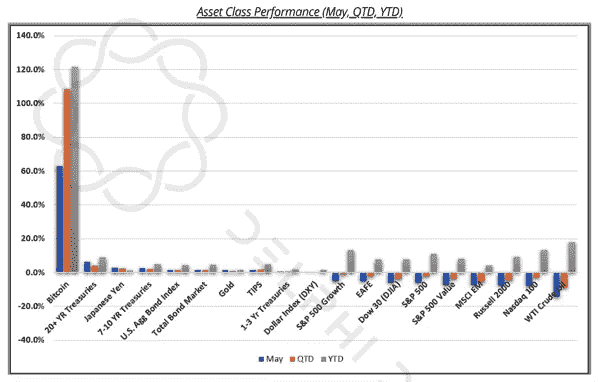
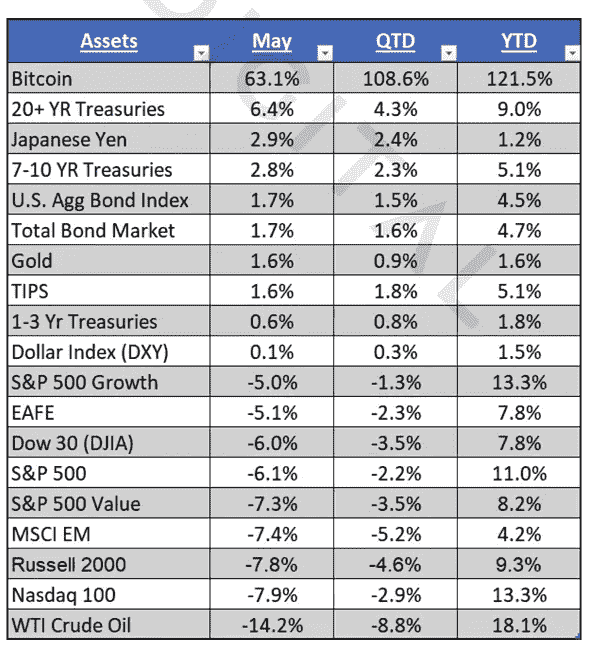
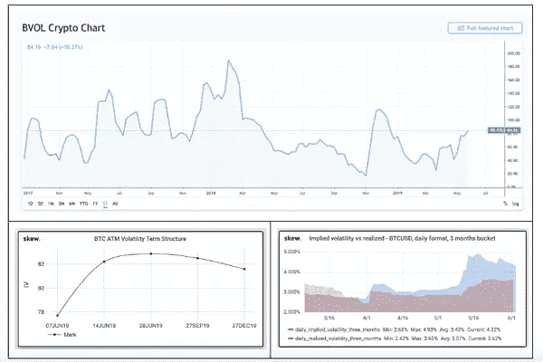

# 这是我们的两个 Satoshis:加密波动是一个角度的问题

> 原文：<https://medium.com/hackernoon/thats-our-two-satoshis-crypto-volatility-is-a-matter-of-perspective-ea67a78da530>

## 本周密码市场发生了什么？

**一个毫不夸张的加密牛市案例**

经常阅读《这是我们的两个 Satoshis》的读者知道，我们经常将高收益债券市场和股票市场进行比较，上周[我们对加密价格上涨的四个理由](https://www.ar.ca/blog/crypto-market-recap-05-27-19)之一是“*全球债务&股票市场正处于死亡螺旋*”。

我们的一位读者，一位在 AUM 拥有超过 10 亿美元资产的多家庭办公室经理，回复如下(转述):

> 我不认为看跌或中立股票是正确的。我希望我们能像熊市理论那样幸运，在更好的价格买入股票。在每个行业，我们都在见证指数级的突破。一项基础设施法案即将出台。工资在上涨。世界变得越来越富裕——他们想要可乐、iphones、李维斯和 Instagram。未来 5 年，40 亿人第一次上互联网，这显然不如前 40 亿有价值，但想想新的活力。航天工业将会爆炸式增长，将会产生数万亿美元的公司。顺便说一句——这也是对加密技术的看好。

首先，我们喜欢反馈；请继续。教育是一条双行道，还没有人是这个领域的专家。第二，这个 100%准确。虽然*“加密与其他资产类别完全不相关”*的叙述对于加密的资产配置决策非常重要，但这并不意味着我们在庆祝，也不期待股票的彻底崩盘。当然，这是可能的。风险高得令人难以置信，而且还在不断增加，许多加密倡导者对由债务、回购和央行道德风险支撑的股票市场失去了所有信心。但这不是基本情况，也没有必要验证加密命题。上周，第一季度美国国内生产总值(GDP)数据向下修正，但仍是 2015 年以来 1Q 最大的 GDP 数据，显示美国经济仍能抵御贸易和政治逆风。同样，2019 年第一季度收益同比增长+1.5%，这不是一个很大的数字，但肯定比大多数人的估计要好(共识是下降 4%)。

我们过去已经注意到，比特币可能既是一种风险资产，也是一种避风港。作为一种风险资产，上面的股票牛市案例也对比特币和其他数字资产非常有利。随着全球技术和基础设施的改善，数字原生和无边界资产将保持良好的出价。也就是说，不可能忽视避险方面，尤其是目前比特币刚刚经历了有史以来第四好的月份，上涨超过 60%，而石油下跌 14%，股票下跌 5-10%。在全球实验性货币和财政政策的背景下，比特币具有明确的价值主张。

毫不夸张地说，我们可能正在见证一种两全其美的资产类别。

**Asset Class Performance — Bitcoin’s Meteoric Rise is Literally off the Chart**

**Asset Class Performance — YTD**

来源:[德尔福数码](https://www.delphidigital.io/)

**波动性上升是一个视角问题**

比特币和大多数数字资产指数一样，年初至今已经上涨了 100%以上。但投资者知道要看风险调整后的回报，而不是名义回报。截至 5 月，BTC 的夏普比率年初至今为 3.20%，而标准普尔 500 为 0.66%。简单的数学告诉你，如果 BTC 相对于美国股票上涨了 10 倍以上，但夏普比率仅上涨了 5 倍，[波动性肯定很高](https://www.bloomberg.com/news/articles/2019-05-28/bitcoin-s-wild-ride-resumes-as-volatility-returns-with-vengeance?srnd=cryptocurrencies&utm_campaign=DAR%20Newsletter%20Campaign&utm_source=hs_email&utm_medium=email&utm_content=73122026&_hsenc=p2ANqtz-_iReKy5u__aEooHHHuK_t8rGl1QwMFduc47jFNyF_4HB3s8cGck2AGTR5K6O9Dx0MmafeLTPLosVHV1zpHCVF9Eu7IEw&_hsmi=73122026)。

这当然是真的。Bitmex 比特币波动性指数(BVOL)达到了年初至今的新高，隐含波动性远远超过了实际波动性。

**Bitcoin Volatility is Rising**

来源: [Bitmex](https://www.bitmex.com/app/index/.BVOL) ，[偏斜](https://www.sk3w.co/options)，[交易视图](https://www.tradingview.com/symbols/BVOL/?exchange=BITMEX)

同时，这里有一些有趣的数据:

*   在过去的 7 周里，比特币和整个加密市场每周都在上涨
*   自 1 月 13 日以来，比特币和整体加密市场还没有出现过两位数的周跌幅
*   自 1 月 13 日以来，比特币的周环比跌幅从未超过 3%
*   在过去的 22 周中，有 16 周的回报是积极的

对于交易者来说，加密非常不稳定。事实上，仅在过去一周，在一个交易日(周四)，比特币从 8700 美元上涨到 9000 美元，然后跌至 8200 美元以下，最终以 8500 美元收盘。交易员见证了 10%的日内波动。与此同时，净效应是 2%的日常下降。

视角很重要。

**代币发行变得越来越有趣**

另一种新的加密协议正在研发中。[algrand](/algorand/algorands-core-technology-in-a-nutshell-e2b824e03c77)和之前的许多协议一样，据称正在解决去中心化、可伸缩性、安全性和速度的问题，正如其他 20 多个过去的协议中的每一个都声称的那样。

我们不想对 Algorand 交易本身的优点发表意见(尽管我们鼓励您收听本周的基础层播客以了解更多信息)，但我们想强调一下代币产品的结构。新的 ALGO 代币将通过[荷兰拍卖程序](https://algorand.foundation/algo-auctions)提供，而不是通过更传统的 ICO 或 IEO 程序。对于一项众所周知难以估值的资产，这是一种创新的发行技术，因为没有简单的方法让投资者锁定一个“公允价值”价格。这也是一种牛市策略，利用高需求和低价格弹性。当谷歌在 2004 年首次公开募股时，使用了一种类似的荷兰拍卖程序来代替传统的资本市场承销，这被认为是一种冒险的策略，如果成功的话，可能会改变未来证券的发行方式。唉，这对谷歌来说是一个成功，但对未来证券的销售方式几乎没有改变，也没有削弱华尔街高昂的费用结构。但它确实让消费者而不是承销商来决定价格，并让那些最关心谷歌的人参与进来，而不仅仅是那些钱包最鼓、能接触到华尔街经纪商的人。同样，阿尔格兰德认为这是向最感兴趣的未来用户和投资者公平传播代币的最佳方式。

或许更有趣的是，与股票和债券不同，股票和债券有明确的硬上限，或者至少有以市值和合理使用收益为形式的隐性上限，代币发行没有上限。因此，阿尔格兰德最终筹集的资金很有可能会超过他们完成这个项目所需的资金。因此，Algorand 提出在发行一年后以发行价格的 90%(如果清算价格为 1 美元或更高)或低于发行价格 0.10 美元(如果低于 1 美元)回购代币。实际上，ALGOs 的买家有一个 1 年的看跌期权，但该看跌期权的价值是基于清算价格的。

这引入了一些有趣的博弈论动态。如果你想拥有看跌期权，你必须参与拍卖。但一些场外交易商一直在提供通过 SAFTs 发行的 ALGO SAFTs 代币权利，这些代币已经在去年的首次发行中发行，这些代币没有这些相同的卖出权利。但是，你可以购买新的算法，立即出售，并保留看跌期权 1 年(看跌期权不会在二次销售中流向新的买家)。这最终可能看起来类似于信用违约互换，其中“最便宜交付”的概念开始发挥作用(即，如果 ALGO 交易下跌，那些持有无看跌期权的代币的人可能能够推高代币价格，因为他们知道仍然持有看跌期权的人总会出价)。

不管结果如何，这是代币市场上又一个创新的融资选择，也是如此多的投资者涌入这一领域的部分原因。创新的融资结构和灵活的象征经济学对发行者和投资者来说都是福音。

# 著名的行动者和震撼者

对于那些不太了解数字资产领域发生的事情的人来说，过去的一周可能看起来波澜不惊——比特币本周收盘持平。然而，上周有两个决定性的方面:比特币周四的波动性，以及 altcoin 分化的继续。

*   EOS 上周重磅出击:Block。一家[宣布](https://www.coindesk.com/block-one-is-launching-a-social-media-platform-on-the-eos-blockchain)他们的社交媒体产品“Voice”，比特币基地·欧文[将](https://www.coindesk.com/coinbase-adds-eos-to-its-crypto-education-rewards-program) EOS 添加到他们的教育计划中，该计划向 EOS 中的用户付费以了解该项目，EOS 利益相关方[投票](https://cointelegraph.com/news/eos-holders-vote-to-reduce-the-annual-inflation-from-5-to-1)将通货膨胀费用减少 80%。这意味着什么？直到 6 月 1 日宣布之前，每周峰值为+24%，该项目稳定在+10%。许多人失望而归，寄希望于庞大的战争基金。一个人拥有的东西将被用于更重要的产品。尽管如此，产品仍在制造中——这是一种进步，而不是倒退。
*   Monacoin (MONA)经历了令人印象深刻的一周(+155%)，这让许多人摸不着头脑——MONA coin 是什么？我们可以得出的最好的比较是，它相当于日本的 doge coin——一个在空间早期创建的社区硬币——对许多人来说它没有用处，但热情的社区使这个项目保持活力。上周的举动可以归因于[传言](https://www.cryptopolitan.com/japans-native-cryptocurrency-monacoin-gains-more-than-80-with-rumors-of-listing/)MONA 将在 CoinCheck 上市——MONA 的一小步，日本社区的一大步。
*   像 Cosmos (ATOM)和 Ravencoin (RVN)这样的项目都出现了令人印象深刻的周涨幅(+40%，+36%)，但没有明显的消息。这里可以得出的主要关联是，这两个项目都是在臭名昭著的 2017 年牛市之后创建的。通过避开熊市的冲击，每个项目都获得了一张“白板”——不管市场情绪如何，一张白纸来证明它们的价值。随着市场情绪继续升温，看看在未来几周/几个月熊市中诞生的其他项目如何发展将是一件有趣的事情。

**本周我们要读的内容**

[Coinstar 根据需求将比特币加入信息亭](https://bitcoinist.com/bitcoin-demand-coinstar-expands-locations/)

那些发现在网上购买比特币很困难的人现在可能只需要走进当地的杂货店买一些 BTC。经过大量的消费者需求，Coinstar 现在可以在全美 2200 个地点购买 BTC。这些自助服务终端的技术由 Coinme 提供，coin me 是首家获得国家许可的比特币 ATM 提供商。获取数字资产是广泛采用和使用的障碍之一，Coinstar 正在让日常消费者更容易获得加密。你可以在 CoinATM 雷达上查看你附近是否有 BTC 的自动取款机。

[汇款市场入门和前景](/proofofcapital/remittance-market-primer-and-landscape-3213c2c81771)

区块链风险投资公司 Proof of Capital 发布了这份报告，涵盖了汇款市场和可能会取代现有公司的新技术公司。汇款占 5500 亿美元，平均交易仅为 200 美元；个人支付 6.94%的费用，每年总计 480 亿美元。随着移民人数超过人口增长，汇款额稳步增长，导致费用增加。每年通过这些系统交易的金额高达数十亿美元，用户还会为低效的服务支付如此高的费用吗？如果解决得当，无摩擦支付市场将远远超越汇款，有可能占领整个全球支付市场。

[Salesforce 为客户推出区块链产品](https://www.theblockcrypto.com/tiny/salesforce-rolls-out-blockchain-platform-for-data-sharing/)

Salesforce 上周宣布，它已经推出了一个区块链平台，为其客户建立自己的区块链总账提供即插即用的解决方案。该计划的目标是让机构更好地与客户共享数据。亚利桑那州立大学(Arizona State University)是其首批采用该技术的客户之一，该校将使用 ledger 技术来跟踪和共享学生记录。尽管许多密码爱好者反对像 Salesforce 这样的私有区块链，但对机构的好处是显而易见的，即减少后台职能和增加客户信任。完整的区块链产品将于 2020 年广泛上市。

[雅虎日本将推出加密交易平台](https://www.ccn.com/yahoo-japan-to-enter-the-crypto-trading-fray-with-nearing-taotao-launch)

上周，雅虎日本推出了其加密交易平台陶涛，之前名为 BitARG，去年据称以 1900 万美元收购。陶涛是雅虎日本旗下的品牌，已经获得了 FSA 的加密交换许可。作为一个密码友好的司法管辖区，日本是雅虎推出其交易所的完美市场，此外，雅虎日本品牌将为生态系统带来新的投资者。

[为对抗 SEC 而设立的加密系统辩护](https://finance.yahoo.com/news/kin-sets-5-million-defend-090047665.html)

正在因其 2017 年 ICO 接受 SEC 调查的消息应用 Kin 推出了一项旨在“在法庭上与 SEC 斗争”的法律基金。该基金在比特币基地的托管平台上维护，包含来自亲戚的 500 万美元。Kin 团队已经做出一致决定，正面对抗 SEC 的潜在执法行动，并在法庭上强制做出关于加密货币地位的法律决定。虽然我们无法预测 Kin 的法律战的结果，但数字资产的进一步法律澄清将改变游戏规则。

[终于！区块链的一个好用途……](https://cointelegraph.com/news/big-four-auditor-ey-provides-blockchain-solution-for-new-wine-traceability-platform)

安永的区块链产品在以太坊上运行，被用于鉴定从欧洲进口到亚洲的葡萄酒。酒店、餐厅、咖啡馆和消费者将使用电子商务平台。除了跟踪真实性，该平台还用于物流和支付。我们为此干杯！

***那是我们的两只聪！***

*感谢阅读的大家！问题或意见，请告诉我们。*

*在这里报名 Arca 简讯:*[*https://www.ar.ca/newsletter*](https://www.ar.ca/newsletter)*。我们的目标是成为资深投资者了解数字资产和区块链生态系统的综合资源。我们的使命是帮助投资者无缝过渡到一个新的数字动力经济。*

**Arca 投资组合管理团队**

*杰夫·多尔曼，CFA——首席投资官
凯蒂·塔拉蒂——研究主管
哈桑·巴西里，CFA——项目经理/分析师
萨莎·弗莱斯曼——交易员*

*原载于*[*https://www . ar . ca*](https://www.ar.ca/blog/crypto-market-recap-06-03-19)*。*

***免责声明:*** *本评论仅作为一般信息提供，绝不作为投资建议、投资研究、研究报告或建议。对本评论中讨论的证券进行投资或采取任何其他行动的任何决定可能涉及本文未讨论的风险，此类决定不应仅基于本文包含的信息。*

*本沟通中的陈述可能包括前瞻性信息和/或可能基于各种假设。此处表达的前瞻性陈述和其他观点或意见是在本出版物发布之日做出的。实际的未来结果或事件可能与预期的有很大不同，并且不能保证任何特定的结果会发生。本文中的陈述可能会随时更改。Arca Funds 不承担更新或修改此处表达的任何声明或观点的任何义务。*

*在考虑本注释中包含的任何绩效信息时，应注意过去的绩效并不能保证将来的结果，也不能保证将来的结果会实现。此处提供的部分或全部信息可能是或基于观点陈述。此外，此处提供的某些信息可能基于第三方来源，这些信息虽然被认为是准确的，但尚未经过独立验证。Arca 基金和/或其某些分支机构和/或客户持有并且将来可能持有与本评论中讨论的证券相同或基本相似的证券的财务权益。对于此类金融权益的盈利能力，无论是现在、过去还是将来，都不做任何声明，Arca 基金和/或其客户可以随时出售此类金融权益。此处提供的信息无意也不应被解释为出售或购买任何证券的要约。本注释未经任何监管机构审核或批准，且在编制时未考虑可能收到本注释的个人的财务状况或目标。特定投资或策略的适当性将取决于投资者的个人情况和目标。*