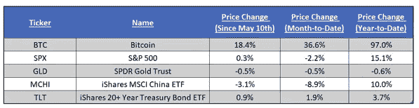
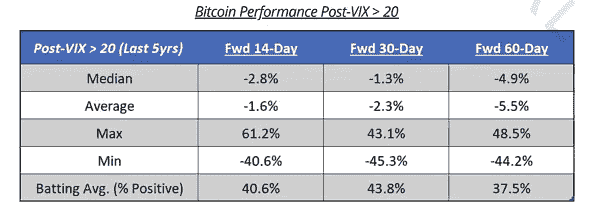
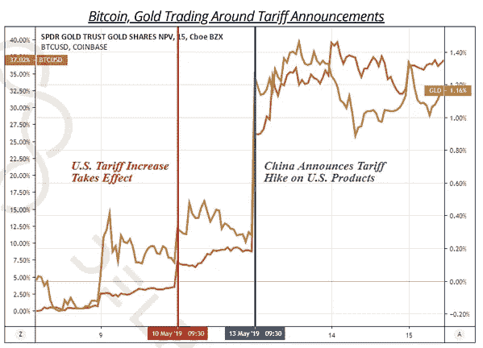
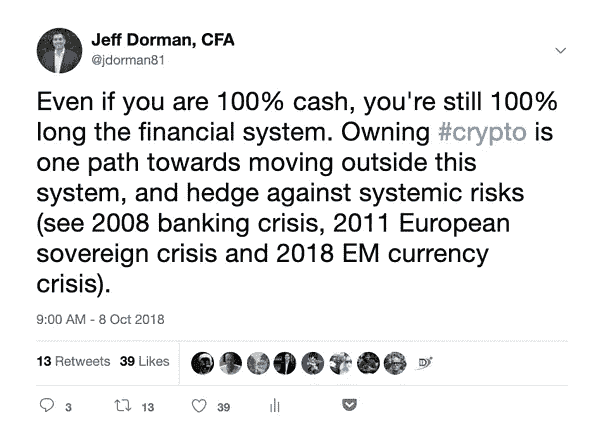
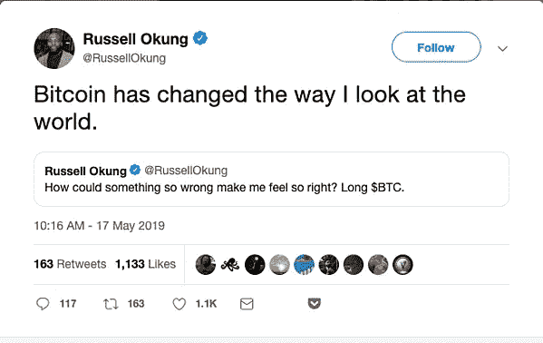

# 这就是我们的两个问题:比特币是风险资产还是避风港？

> 原文：<https://medium.com/hackernoon/thats-our-two-satoshis-is-bitcoin-a-risk-asset-and-a-safe-haven-7838856be526>

本周密码市场发生了什么？

**又一周的加密收益和股权损失**

标准普尔 500 周一下跌 2.4%，创下 1 月份以来的最大单日跌幅，此前特朗普提高了中国对价值 2000 亿美元的商品征收的关税，中国也对美国进口商品征收了 600 亿美元的关税。

亚洲股市同样下跌了近 4%。尽管全球股市在周末略有回升，收复了本周早些时候的部分失地，但周一的单日走势为“风险资产”与“安全港”的辩论定下了基调。毫不奇怪，黄金反弹，美国国债反弹(现在几乎回到 2019 年的低收益率)，VIX 飙升。

然而，令人惊讶的是，crypto 上周也出现上涨，比特币[的周环比上涨 14%，许多其他知名的数字货币和公用代币上涨 20%至 30%。](https://hackernoon.com/tagged/bitcoin)

**Bitcoin (and all of crypto) continue to outperform all asset classes**

**比特币是风险资产还是避风港？**

我们详细讨论了加密作为一种资产类别如何保持与所有其他资产类别完全不相关。这使得它成为一个伟大的投资组合多样化，降低整体投资组合风险，同时让投资者有机会获得超额回报。

也就是说，我们在过去看到过这种情况，crypto 在短时间内忽略了股票/利率的波动，而 crypto 社区则欢欣鼓舞，只能看到 crypto 最终在几周/几个月后迅速下跌。事实上，我们在 Delphi Digital 的朋友刚刚用一些及时和有见地的数据进一步证实了这一说法:

*“在过去的五年里，比特币在 VIX 飙升至 20 以上后的 30 天和 60 天内，平均下跌了约 2.3%和 5.5%”。*

*那么，比特币是风险资产还是避风港？答案实际上可能是两者都有。*

首先，让我们检查一下显而易见的。比特币和其他数字资产仍然没有像设计时那样得到广泛使用。[采用率正在上升](http://fortune.com/2019/05/13/bitcoin-comes-to-whole-foods-major-retailers-in-coup-for-digital-currency/)，但我们距离速度问题还有很长的路要走，当一些东西变成金钱，被频繁地消费/接收，价格稳定下来时，速度问题就会出现。

截至目前，包括比特币在内的所有数字资产仍然是投机性风险资产，如果今天有足够多的人对其进行投机，那么在未来的某一天，这些资产可能会成为价值储存手段或交易媒介。将比特币和其他数字资产视为“早期技术”有助于将今年迄今以及未来可能产生的巨大回报合理化和情境化。

毫无疑问，这些资产是风险资产。

不太明显的是，如果 crypto 在股市下跌时保持反弹，那么一些数字资产不仅与其他资产类别无关，而且现在还充当了全球市场本身的对冲。

当然，现在肯定地说这一点还为时过早，因为一波小的波动并不是对安全避风港的真正考验，市场目前也没有受到足够的压力来保证一场真正的“逃向优质资产”的反弹。但今年的秘密上涨在很大程度上可以追溯到美联储主席鲍威尔决定逆转路线的荒谬性、正在制造进一步政治不确定性和不稳定性的现代货币理论(MMT)以及世界各地腐败政府的行动。

在这种背景下，认为比特币上周的飙升是由进一步的政治干预引起的并非没有道理。同样，我们在 Delphi Digital 的朋友提供了支持这一观点的数据，显示黄金和比特币在上周关税消息后同时飙升。

Both Bitcoin and Gold spiked following Tariff announcements

当然会有人对这个观点泼水。但那些认为比特币波动太大，不能作为避风港，或参考 2018 年 70%跌幅的人，错过了更重要的一点。许多人搞不清“安全港”到底是什么。

避险投资不是永不贬值的资产；避险资产是一种在市场动荡时期有望保值或增值的投资。更确切地说，“安全港”被定义为“一个避难或安全的地方”。当利率上升时，美国国债会大幅贬值，但很少有人认为美国国债不是避风港。

同样，保护你的资产免受宏观因素和腐败、过度举债的政府的影响也是一种安全港。

就在我们说话的时候，比特币可能正在转变为一种避险投资。

**趋势是你的朋友**

进一步分析上周 crypto 的走势，尽管较大的周环比和 YTD 回报率再次表现非凡，但有充分的理由相信这种情况能够并将继续下去(尽管不是直线)。

正如我们在[的朋友 Bitooda](http://bitooda.io/) 最近在一份研究报告中所说:

> *空头已经输了，逢低买入，直到证明不是这样。在过去的反弹中，成交量的上升表明有新的资金投入，而不是简单的做空和动量追逐。这支持了情绪的变化*。

在这一点上，继前一周的大幅反弹之后，比特币上周没有浪费时间，它突破了 7000 美元，并在周一升至 8000 美元。大量其他加密资产也纷纷效仿，其中许多资产直到上周才开始上涨(例如，XRP 上涨 27%，XLM 上涨 37%)。事实上，这是自 4 月 1 日以来，BTC 股市第一周表现落后于其他市场。自然，我们确实看到了另一个 10%以上的周内下跌(周四深夜)，提醒我们这一资产类别仍然不适合心脏虚弱的人，需要积极管理，但这一抛售再次被迅速吞噬，市场整个周末都在向 8000 美元攀升。

每一次下跌都有人买入——趋势是你的朋友(除非它不是)。

**知名大佬**

在因[共识](https://www.coindesk.com/events/consensus-2019)而充满新闻的一周里，加密货币领域整体市值增长了+17%。如前所述，上周的不同之处在于，比特币最终跑输了市场，让个别项目成为焦点:

*   新经济运动(XEM)表现惊人，公布的回报令人瞠目结舌(+62%)。与其他领域一样，这种变化可以归因于“水涨船高”的心态，但也有一些孤立的基本面因素得到了充分展示:NEM 充分利用了上周的媒体闪电战，[宣布了他们的弹射升级进展，这是一个期待已久的核心协议 2.0。](https://hacked.com/nem-xem-surges-through-the-stratosphere-following-catapult-update/)
*   ChainLink 继续取得令人印象深刻的进展，上周收盘上涨 49%。在 Consensus 上，首席执行官谢尔盖·纳扎罗夫[宣布【ChainLink 将于 5 月 30 日在以太坊主网上发布。这个项目在营销方面一直很低调，因为 Sergey 注意到还没有任何东西可以营销。这个期待已久的 mainnet 将继续激起支持者的狂热，在不久的将来我们将会听到更多来自 Chainlink 团队的消息。](https://www.cryptoglobe.com/latest/2019/05/decentralized-oracle-network-chainlink-launching-on-ethereum-mainnet-on-may-30/)
*   Ripple (XRP)本周收盘上涨 27%，不过涨幅一度高达+52.5%。xRapid 产品，XRP 支持的跨境支付解决方案，[在阿根廷和巴西推出](https://dailyhodl.com/2019/05/19/ripple-reveals-expansion-of-xrp-powered-xrapid-amazon-files-crypto-patent-and-bitcoins-21-million-club-hits-new-record/)(加入墨西哥和菲律宾)。另外[注意](https://www.chepicap.com/en/news/9659/xrp-jumps-22-after-coinbase-news-and-etn-in-germany.html)比特币基地为纽约的客户提供了 XRP 交易(这有其自身的含义)，德国证券交易所 rsse Stuttgart 增加了 XRP 交易所交易票据(ETN)。

**本周我们要读的内容**

[使用 Crypto 购物的更多方式](http://fortune.com/2019/05/13/bitcoin-comes-to-whole-foods-major-retailers-in-coup-for-digital-currency/)

上周在 Consensus 发布的 Spedn 应用程序将允许用户在 Crate and Barrel、Nordstrom 和 Whole Foods 等零售商处使用加密货币购物。该项目由 Flexa 和 crypto-exchange Gemini 合作，使用现有的数字扫描系统，如 Apple Pay，用户可以扫描手机上的条形码来支付商品。Spedn 支持比特币、比特币现金、以太坊和双子星币(一个 stabletoken)。这是独一无二的，因为商家本身不需要做任何不同的事情来接受 crypto 作为支付方式——Flexa 充当中间人来实现无缝转换。

[Kik 案对密码监管意味着什么](https://a16z.com/2019/05/15/kik-and-the-sec-whats-going-on-and-what-does-it-mean-for-crypto/)

a16z 加密基金的 Katie Haun 分享了她对 Kik ICO 和 SEC 近期执法行动的看法。Haun 以前是美国证券交易委员会、联邦调查局和财政部的联邦检察官，他详细介绍了美国证券交易委员会决定采取执法行动、发布威尔斯通知以及探索 Kik 潜在结果的过程。

[信号与噪声——加密数据问题](http://research.circle.com/wp-content/uploads/2019/05/Consensus-2019-Signal-vs.-Noise.pdf)

这个来自 Circle Research 的演示，最初由 Ria Bhutoria 在上周的 Consensus 上演示，讨论了加密中普遍存在的数据问题。虽然许多人可能认为加密中的所有数据都是公开和免费的，但 Circle 讨论了开放数据的缺点，强调了数据可理解性、完整性和可访问性的问题。理解这个空间中的所有数据是可能阻止机构资本进入的主要挑战之一。

[微软的比特币工具](https://www.coindesk.com/microsoft-launches-decentralized-identity-tool-on-bitcoin-blockchain)

上周，微软在比特币[区块链](https://hackernoon.com/tagged/blockchain)上推出了去中心化身份工具。目标是允许用户共享他们的身份信息，例如证明私钥的所有权。这是向去中心化身份迈进的一大步，但更重要的是，微软选择投入资源来构建像这样基于比特币区块链的开源工具。

[驯服西部蛮荒的 Crypto](https://www.theblockcrypto.com/2019/05/13/jump-trading-galaxy-digital-and-many-other-traders-mull-instituting-crypto-market-white-list/)

上周，一个由 50 多名交易员组成的名为 CORA 的小组召开会议，讨论为场外交易市场创建一份“白名单”。当前的交易和场外交易领域缺乏任何针对 KYC、文档和交易结算的指导原则或标准化，这是市场早期性质的结果。该集团包括 Jump Trading、Galaxy Digital 和 DRW 的 Cumberland，旨在为该行业提供更多的专业性和标准化，这将有望吸引更多的传统华尔街集团来加密。

[加密所有权差异及其对价格的影响](https://www.bloomberg.com/news/articles/2019-05-15/just-376-people-found-to-own-a-third-of-all-ether-cryptocurrency)

Chainanalysis 上周的一项研究发现，376 人拥有现有以太坊供应的三分之一，448 人拥有所有比特币的 20%。除了所有权的巨大差异，这项研究还调查了这些“鲸鱼”是否对价格有任何影响。令人惊讶的是，他们发现这些钱包中的资产很少被转移到交易所，即使被转移，也只会引起少量的短期市场波动。

[钻入比特币兔子洞](https://www.cryptoglobe.com/latest/2018/06/the-5-stages-of-crypto-involvement/)

在上周的一条[推文中，洛杉矶充电器公司的 Russell Okung 和 NFL 球员协会的负责人要求用比特币支付。Crypto Twitter 遍布 Okung(我们建议查看所有评论),从那以后](https://twitter.com/RussellOkung/status/1128149326943834113)[他的 feed](https://twitter.com/RussellOkung) 包含了许多推文，向我们表明 Okung 已经掉进兔子洞了。

***这就是我们的两只聪！***

*感谢大家的阅读！问题或意见，请告诉我们。*

**Arca 投资组合管理团队**

*杰夫·多尔曼，CFA——首席投资官
凯蒂·塔拉蒂——研究主管
哈桑·巴西里，CFA——项目经理/分析师
萨沙·弗莱斯曼——交易员*

*原发布于*[*https://www . ar . ca*](https://www.ar.ca/blog/crypto-market-recap-05-20-19)*。*

***免责声明:*** *本评论仅作为一般信息提供，绝不作为投资建议、投资研究、研究报告或建议。对本评论中讨论的证券进行投资或采取任何其他行动的任何决定可能涉及本文未讨论的风险，此类决定不应仅基于本文包含的信息。*

*本沟通中的陈述可能包括前瞻性信息和/或可能基于各种假设。此处表达的前瞻性陈述和其他观点或意见是在本出版物发布之日做出的。实际的未来结果或事件可能与预期的有很大不同，并且不能保证任何特定的结果会发生。本文中的陈述可能会随时更改。Arca Funds 不承担更新或修改此处表达的任何声明或观点的任何义务。*

*在考虑本注释中包含的任何绩效信息时，应注意过去的绩效并不能保证将来的结果，也不能保证将来的结果会实现。此处提供的部分或全部信息可能是或基于观点陈述。此外，此处提供的某些信息可能基于第三方来源，这些信息虽然被认为是准确的，但尚未经过独立验证。Arca 基金和/或其某些分支机构和/或客户持有并且将来可能持有与本评论中讨论的证券相同或基本相似的证券的财务权益。对于此类金融权益的盈利能力，无论是现在、过去还是将来，都不做任何声明，Arca 基金和/或其客户可以随时出售此类金融权益。此处提供的信息无意也不应被解释为出售或购买任何证券的要约。本注释未经任何监管机构审核或批准，且在编制时未考虑可能收到本注释的个人的财务状况或目标。特定投资或策略的适当性将取决于投资者的个人情况和目标。*