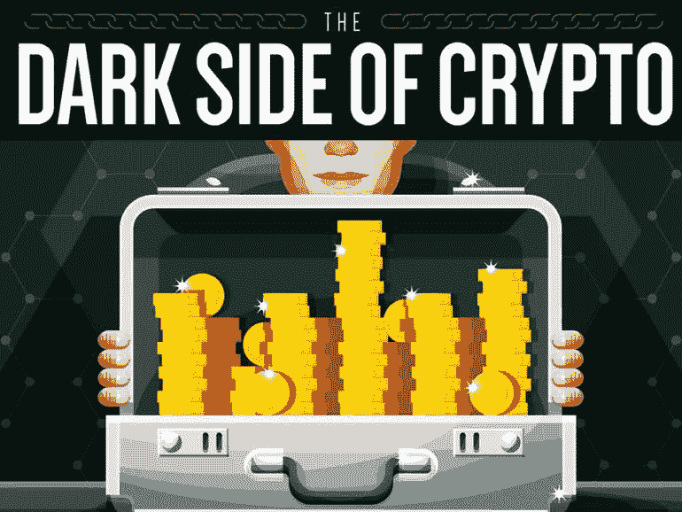

# 几乎无人知晓的加密货币 10 大黑暗秘密。

> 原文：<https://medium.com/hackernoon/the-10-dark-secrets-of-cryptocurrencies-that-almost-no-one-knows-about-ec284bed7e71>

虽然#加密货币和#区块链实际上可以拯救世界，但它仍然有一些初期问题，这些问题并不光彩，给它带来了坏名声，并带来了麻烦。

这里有 10 个几乎没人知道的黑暗秘密，但它们每天都会给 crypto 带来麻烦。它仍然是狂野的西部。

1.  在 2017 年成立的 902 个加密货币 ico 中，有 142 个在筹集任何资金前失败，276 个在筹集资金后失败。另有 113 个 ico 属于“半失败”类别，要么是因为各自的初创公司停止了在社交媒体上的交流，要么是社区缩小到几乎没有成功机会的地步。尽管筹集了超过 1.04 亿美元的资金，但把这些数字扔进垃圾堆，失败率上升到 59%..[加密货币 ico 的失败率极高](https://www.pcgamer.com/cryptocurrency-icos-have-a-spectacularly-high-failure-rate/)
2.  2017 年，902 只 ico 中只有 50 只获得了 5 倍或更高的回报。[所有 ICO 和代币的新闻、数据和分析](https://www.tokendata.io/)
3.  1600 枚硬币或代币中有 800 枚已经失效[失效硬币](https://deadcoins.com/)
4.  前 10 名硬币中的 7 个可能会在今年死去，但他们仍然误导他们的投资者说他们是一个伟大的硬币。[在市值最高的 10 种加密硬币中，你认为哪种最有可能失败，为什么？](https://www.quora.com/Of-the-top-10-crypto-coins-by-market-cap-which-do-you-believe-is-most-likely-to-fail-and-why)
5.  大多数市值数十亿的新硬币通过说它们具有如此高的可扩展性来吸引投资者的资金，然而，没有人注意到它们都以去中心化为代价，因此毫无用处(EOS，NEO，Ripple，Stellar，Dash，Tron 都是极度集中的)
6.  密码盗窃猖獗。2018 年有 6.73 亿美元在加密黑客攻击中被盗，每天有 900 万美元被盗。这是因为窃取密码比窃取银行资金容易得多，因为安全性还不成熟。
7.  新手投资者总是在牛市高潮时买入，因此几乎在最高点买入。几个星期后，市场崩溃了，所有人都损失了 70%的钱。新手永远不会像现在这样在市场下跌时买入。他们高买低卖。因此，对于每一个有经验的加密投资者，都有几个新手投资者被有经验的投资者获利。
8.  市场几乎完全被鲸鱼控制。他们拥有 40%的比特币，总计 700 亿美元。如果他们愿意，他们可以瞬间将比特币的市值从 1000 亿美元提高到 1 万亿美元。然而，他们会等待自然的市场周期，然后进行抽水。
9.  很难检测出有缺陷的一致性算法和集中化问题，例如 EOS、NEO、Ripple、Stellar、Dash、Tron 都非常集中。一个没有深厚的计算机科学背景和深厚的商业背景，没有大量消除个人偏见的培训的人，几乎没有机会发现欺骗投资者的硬币。
10.  密码充斥着部落主义。最差的是[r/比特币](http://reddit.com/r/bitcoin) subreddit。任何批评都会受到审查，指出比特币缺陷的用户会受到羞辱并被禁止。 [r/btc](https://www.reddit.com/r/btc) 类似，其他很多子街道也是。