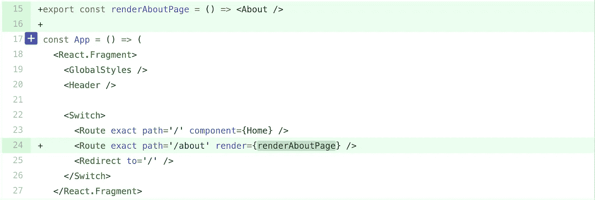
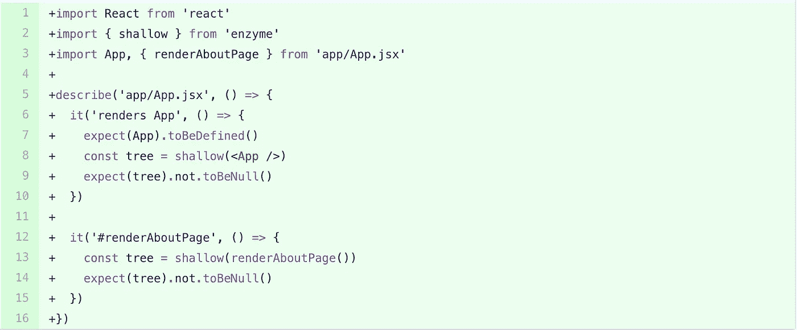
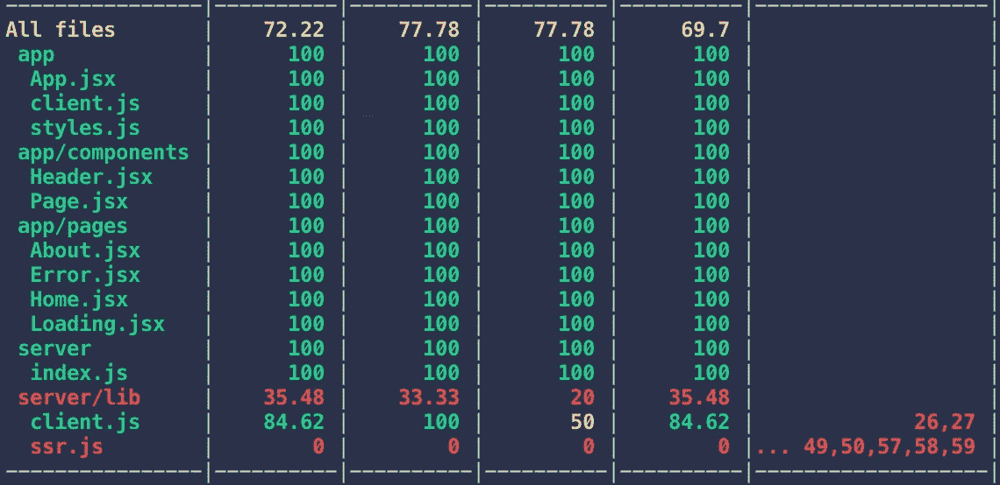
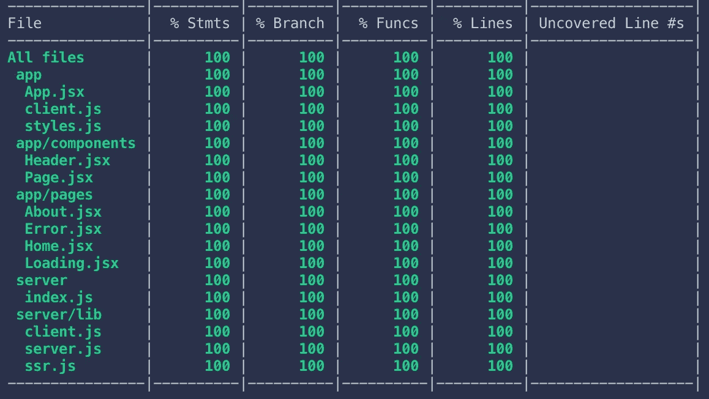

# 100%代码覆盖率的神话

> 原文：<https://medium.com/hackernoon/the-100-code-coverage-myth-900b83d20d3d>


Licensed from Adobe Stock Photo

现在互联网上有很多建议说 100%的覆盖率不是一个值得追求的目标。

我强烈反对。

通常，代码难以测试是需要重构的标志。

我明白了。几年前，我的测试很糟糕。我以为这只是会让我走得更慢的东西。

当我开始编码的时候，人们很少这么做。如果是的话，通常是一个独立的 QA 团队负责。几年前，虽然它成为一个真正的热门话题。面试开始期望候选人知道如何写测试，越来越多的组织自上而下地推动它作为一个质量倡议。

我总是努力做到最好，我决定走进面试时说“测试不是我的强项”不再是一个好的选择，所以我决定从那时起我要对我的所有测试进行 100%的覆盖。

当时，我真的不确定我能从中得到什么好处，或者真的有什么好处。

现在，我*老老实实*不回去了。当 100%覆盖率的代码库出现问题时，您的测试很可能会告诉您具体的位置和方式。

这并不是说单元测试就是你所需要的。它不是。但是在我看来，让代码未经测试也不是一个好的选择。

跟我回去吧，回到我也不相信测试覆盖的好处的时候。

# **第一部分:学习行话**

当时交易的工具是[摩卡](https://mochajs.org/)、[西农](https://sinonjs.org/)和[柴](https://www.chaijs.com/)的组合。Mocha 是测试者，sinon 提供了创建“模拟”和“间谍”的能力，而 chai 是一个断言库，因此您可以以人类语言友好的方式键入断言。


Is this a spy?

我根本不知道这意味着什么。在我变得有效率之前，首先要做的是学习语言。

所以，首先，到底是间谍还是骗子？

虽然我首先想到的是詹姆斯·邦德或者伊森·亨特。这绝对不是我们在这里谈论的，尽管这不是一个可怕的比喻。

在阅读了一些文档后，我最终了解到 spy 是一个被测试框架修改过的函数，它提供了关于它如何被使用的元信息。它暗中监视它。有点像人们如何通过苹果最近的 FaceTime Bug 来监视你。有点像詹姆斯·邦德。

模仿和间谍很相似，但是它被修改得更多。除了提供和跟踪特定函数的使用情况，它还改变了其行为，使其变得可预测。

我还了解到有几种测试。不限于最常见的三种:单元测试、集成测试和 E2E 测试。

当我们进行“单元测试”时，这意味着我们需要能够将代码分解成单独的单元。该特定单元之外的任何东西都是被嘲笑的对象，比如其他函数或整个模块。Jest 是我选择的单元测试工具。单元测试是唯一测量覆盖率的测试类型。

当我们进行集成测试时，我们是在测试我们的软件与其他软件的集成，例如通过 Kafka 传递我们的服务应该接收到的消息的测试，并且之后可以在数据库中找到其结果。在创建集成测试时，我也经常开玩笑。

E2E 测试有点像使用你的应用程序的机器人。你把它编程为在浏览器中加载站点，点击东西，并确保从用户的角度来看一切都按预期工作。在这方面，Cypress 是我最喜欢的工具，但是在我学习的时候它还不存在。Selenium 是当时的大玩家，老实说，这是一个足够大的领域，我很乐意让 QA 自动化工程师来处理这一部分。

有了新知识，现在是困难的部分:把它付诸实践。

我花了几个月的时间来确保我写的每一段代码都有测试覆盖率。起初，我承认，这很困难。我花了很多时间在 StackOverflow 上查找嘲讽和刺探的例子。到最后，我发现我对我的代码的信心大大提高了。

另一个好处是，当我的测试出现问题时，通常会告诉我确切的位置。当其他工程师对我的代码进行修改时，我可以更快地检查它。当重要的 API 改变时，人们通过失败的测试得到警告，要么快速更新它，要么重新考虑他们的改变。

不仅如此，我开始编写更好的代码。我了解到，通常如果有些东西很难测试，或者很难完全覆盖，这通常意味着我没有写好代码，它可以被重构，从而产生更易维护和更灵活的 API。为此，试图达到 100%的覆盖率鼓励我将匿名函数提取到命名函数中，并理解许多重构中的部分应用程序和依赖注入。

在完成集成测试之后，我甚至放弃了 GitFlow，转而进行基于主干的开发。几年前，我认为致力于 master 是一件疯狂的事情，现在，我每天都在一个由近 15 名工程师组成的团队中这样做。

[](https://hackernoon.com/i-have-a-confession-to-make-i-commit-to-master-6a804f334beb) [## 我要向你坦白…我向师父承诺。

### 我曾经鼓吹 Git Flow 来保持我的代码可发布、可回滚，并保持一个干净的历史。但现在不是了——

hackernoon.com](https://hackernoon.com/i-have-a-confession-to-make-i-commit-to-master-6a804f334beb) 

# 第 2 部分:以身作则

在我对我的新测试栈越来越有信心的时候，另一个工具被引入市场，许多人声称它使单元测试更加简单:Jest。

Jest 是由脸书首创的自动化测试框架。

Jest 做了一件非常棒的工作，将我以前使用的库浓缩到一个连贯的框架中，这个框架是一个测试运行器，以及一组用于模仿、监视和断言的 API。除了提供满足所有单元测试需求的单一库之外，Jest 在简化一些概念和模式以及强大而简单的模拟方面做得很好。

因为我认为 Jest 更容易使用和理解，所以我将继续使用 Jest 作为例子。

如果你只是和我一起写这篇文章，那很好——到目前为止你所读到的内容是独立的。然而，我一直在记录使用 Parcel with Streaming SSR 构建 React 应用程序的过程，本文将从上一部分停止的地方继续。

在我的上一篇文章(链接如下)中，我展示了如何用代码覆盖率设置 Jest，并说在下一篇文章中我将展示如何获得高达 100%的覆盖率。

[](https://hackernoon.com/enforcing-code-quality-for-node-js-c3b837d7ae17) [## 强制 Node.js 的代码质量

### 使用林挺、格式化和带有代码覆盖的单元测试来实施质量标准

hackernoon.com](https://hackernoon.com/enforcing-code-quality-for-node-js-c3b837d7ae17) 

我认为展示 100%覆盖率的最好方式是展示如何到达那里。在整个过程中，我们可能会发现几个地方的代码可以重构，以提高可测试性。因此，我将从我停止的地方继续，并使这个项目的覆盖率达到 100%，并展示要做什么样的重构，在哪里使用部分应用程序和依赖注入，以及当覆盖率难以达到时，在这个过程中要模仿什么。

那么…让我们开始吧。这是我将要做的项目:

[](https://github.com/patrickleet/streaming-ssr-react-styled-components) [## Patrick let/streaming-SSR-react-styled-组件

### 流式 ssr 反应风格组件与包裹。贡献给 Patrick let/streaming-SSR-react-styled-components…

github.com](https://github.com/patrickleet/streaming-ssr-react-styled-components) 

该项目在`app`文件夹中有一个 react 应用程序，以及一个包含 SSR 逻辑的`server`文件夹。让我们从应用程序测试开始。

## 应用测试

在[的上一篇文章](https://hackernoon.com/enforcing-code-quality-for-node-js-c3b837d7ae17)中，在配置 Jest 之后，我开始对一个简单的组件进行简单的测试。我有几个同样简单的 React 组件。

这也是功能组件真正强大的原因之一。函数比类更容易测试。它们没有状态，而是有输入和输出。给定输入 X，它们有输出 y。当有状态时，它可以存储在组件的外部。

新的 React Hooks API 在这方面很好，因为它鼓励创建功能组件，并且有一个容易模仿的机制来为组件提供状态。Redux 在测试方面提供了同样的好处。

让我们从敲出其余的简单组件开始。我们基本上只需要渲染它们，并检查一些重要的信息是否被渲染。

我通常将代码内嵌在文章中，但是这些测试中并没有什么新的东西，所以我决定链接到实际的提交，并且只展示一个完整的例子:

让我们看看“关于”页面:

```
import React from 'react'
import Helmet from 'react-helmet-async'
import Page from '../components/Page'const About = () => (
  <Page>
    <Helmet>
      <title>About Page</title>
    </Helmet> <div>This is the about page</div>
  </Page>
)export default About
```

这是测试:

```
import React from 'react'
import { shallow } from 'enzyme'
import About from 'app/pages/About.jsx'describe('app/pages/About.jsx', () => {
  it('renders About page', () => {
    expect(About).toBeDefined()
    const tree = shallow(<About />)
    expect(tree.find('Page')).toBeDefined()
    expect(
      tree
        .find('Helmet')
        .find('title')
        .text()
    ).toEqual('About Page')
    expect(tree.find('div').text()).toEqual('This is the about page')
  })
})
```

以下提交中的所有测试都非常相似:

*   [修复:页面测试](https://github.com/patrickleet/streaming-ssr-react-styled-components/commit/3a81d9e2cdad6d025527f27e7d73e6ce9a670a8c)
*   [修复:组件测试](https://github.com/patrickleet/streaming-ssr-react-styled-components/commit/49ff4a2a4fedecb03be9292c32a36ca7258188a5)
*   [测试:样式组件渲染测试](https://github.com/patrickleet/streaming-ssr-react-styled-components/commit/5a05a969f35bd8d2f7c68dacb8b8a03f9618819d)

正如你所看到的，仅仅确保我们的组件渲染就足以让这些组件获得 100%的覆盖率。更详细的交互最好留给 E2E 测试，这超出了本文的范围。

下一个组件`app/App.jsx`稍微复杂一些。在编写了一个渲染测试之后，您会注意到路由器中仍然有一个不可到达的匿名函数用于渲染 About 页面。

为了访问和测试它，我们想做一个小的重构，将函数提取到一个命名函数中，这样我们就可以导出它并进行测试。



现在很容易测试:



因为我们对上面的 About 页面有另一组测试，我们将把它的更具体的测试留在那里，只需要检查它在这里的呈现。

这样，我们的应用程序中剩下的唯一要测试的文件是`app/client.js`，然后我们可以继续完成服务器端测试。

让我们看一下代码:

```
import React from 'react'
import ReactDOM from 'react-dom'
import { HelmetProvider } from 'react-helmet-async'
import { BrowserRouter } from 'react-router-dom'
import { rehydrateMarks } from 'react-imported-component'
import importedComponents from './imported' // eslint-disable-line
import App from './App'const element = document.getElementById('app')
const app = (
  <HelmetProvider>
    <BrowserRouter>
      <App />
    </BrowserRouter>
  </HelmetProvider>
)// In production, we want to hydrate instead of render
// because of the server-rendering
if (process.env.NODE_ENV === 'production') {
  // rehydrate the bundle marks
  rehydrateMarks().then(() => {
    ReactDOM.hydrate(app, element)
  })
} else {
  ReactDOM.render(app, element)
}// Enable Hot Module Reloading
if (module.hot) {
  module.hot.accept()
}
```

我注意到的第一件事是对全局变量的依赖——`document`、`process`和`module`。第二件事是没有导出任何东西，所以可能很难用不同的输入运行多次。

我们可以通过一些重构来解决这个问题:

1.  将所有的逻辑打包成一个可以导出的函数。该函数将接受一个选项对象及其所有依赖项。这被称为**依赖注入**。如果我们愿意，这将允许我们轻松地传递一堆事物的模拟版本。
2.  我们有一个在生产模式中的匿名函数，它应该被提取为一个命名函数。

我们还想模仿一些外部模块:`react-dom`、`react-imported-component`和`app/imported.js`。模块本身就是依赖注入的一种形式。

首先，这里是新重构的文件，更改以粗体显示:

```
import React from 'react'
import ReactDOM from 'react-dom'
import { HelmetProvider } from 'react-helmet-async'
import { BrowserRouter } from 'react-router-dom'
import { rehydrateMarks } from 'react-imported-component'
import importedComponents from './imported' // eslint-disable-line
import App from './App'// use "partial application" to make this easy to test **export const hydrate = (app, element) => () => {
  ReactDOM.hydrate(app, element)
}****export const start = ({ 
  isProduction,
  document,
  module,
  hydrate
 }) => {**
  const element = document.getElementById('app')
  const app = (
    <HelmetProvider>
      <BrowserRouter>
        <App />
      </BrowserRouter>
    </HelmetProvider>
  ) // In production, we want to hydrate instead of render
  // because of the server-rendering
  if (**isProduction**) {
    // rehydrate the bundle marks from imported-components, 
    // then rehydrate the react app
    rehydrateMarks().then(**hydrate(app, element)**)
  } else {
    ReactDOM.render(app, element)
  } // Enable Hot Module Reloading
  if (module.hot) {
    module.hot.accept()
  }
}**const options = {
  isProduction: process.env.NODE_ENV === 'production',
  document: document,
  module: module,
  hydrate
}****start(options)**
```

现在，我们实际上可以使用各种选项访问和测试 start，并独立于启动逻辑测试水合物。

测试有点长，所以我在里面放了注释来解释发生了什么。以下是对该文件的测试:

```
import React from 'react'
import fs from 'fs'
import path from 'path'
import { start, hydrate } from 'app/client'
import { JSDOM } from "jsdom"jest.mock('react-dom')
jest.mock('react-imported-component')
jest.mock('app/imported.js')// mock DOM with actual index.html contents
const pathToIndex = path.join(process.cwd(), 'app', 'index.html')
const indexHTML = fs.readFileSync(pathToIndex).toString()
const DOM = new JSDOM(indexHTML)
const document = DOM.window.document// this doesn't contribute to coverage, but we
// should know if it changes as it would
// cause our app to break
describe('app/index.html', () => {
  it('has element with id "app"', () => {
    const element = document.getElementById('app')
    expect(element.id).toBe('app')
  })
})describe('app/client.js', () => { // Reset counts of mock calls after each test
  afterEach(() => {
    jest.clearAllMocks()
  }) describe('#start', () => {
    it('renders when in development and accepts hot module reloads', () => {
      // this is mocked above, so require gets the mock version
      // so we can see if its functions are called
      const ReactDOM = require('react-dom')

      // mock module.hot
      const module = {
        hot: {
          accept: jest.fn()
        }
      } // mock options
      const options = {
        isProduction: false,
        module,
        document
      } start(options)
      expect(ReactDOM.render).toBeCalled()
      expect(module.hot.accept).toBeCalled()
    })

    it('hydrates when in production does not accept hot module reloads', () => {
      const ReactDOM = require('react-dom')
      const importedComponent = require('react-imported-component')
      importedComponent.rehydrateMarks.mockImplementation(() => Promise.resolve()) // mock module.hot
      const module = {} // mock rehydrate function
      const hydrate = jest.fn() // mock options
      const options = {
        isProduction: true,
        module,
        document,
        hydrate
      } start(options)
      expect(ReactDOM.render).not.toBeCalled()
      expect(hydrate).toBeCalled()
    }) }) describe('#hydrate', () => {
    it('uses ReactDOM to hydrate given element with an app', () => {
      const ReactDOM = require('react-dom')
      const element = document.getElementById('app')
      const app = (<div></div>)
      const doHydrate = hydrate(app, element) expect(typeof doHydrate).toBe('function') doHydrate()
      expect(ReactDOM.hydrate).toBeCalledWith(app, element)
    })
  })})
```

现在，当我们运行测试时，我们应该 100%覆盖`app`文件夹，除了`app/imported.js`是一个生成的文件，测试没有意义，因为它可能会在未来版本中生成不同的文件。

让我们更新 jest 配置，从覆盖率统计中忽略它，并检查结果。

在`jest.config`添加:

```
"coveragePathIgnorePatterns": [
  "<rootDir>/app/imported.js",
  "/node_modules/"
]
```

现在，当我们运行`npm run test`时，我们得到以下结果。

[](https://github.com/patrickleet/streaming-ssr-react-styled-components/commit/c5fcfe9fdfb24d1708fb1d23b7126058d7b44fe4) [## test: client.js 测试 Patrick let/streaming-SSR-react-styled-components @ C5 fcfe 9

### 流式 ssr 反应风格组件与包裹。贡献给 Patrick let/streaming-SSR-react-styled-components…

github.com](https://github.com/patrickleet/streaming-ssr-react-styled-components/commit/c5fcfe9fdfb24d1708fb1d23b7126058d7b44fe4) 

我想指出的一点是，当我开发测试时，我通常使用“观察”模式来这样做，所以当测试改变时，它们会自动重新运行。

应用程序测试完成后，让我们继续讨论服务器。

## 服务器测试

在上一篇文章中，我为一个应用程序文件和一个服务器文件编写了测试，所以我们已经为`server/index.js`编写了测试。现在我们需要测试`server/lib`中剩余的三个文件。

先说`server/lib/client.js`:

```
import fs from 'fs'
import path from 'path'
import cheerio from 'cheerio'export const htmlPath = path.join(process.cwd(), 'dist', 'client', 'index.html')
export const rawHTML = fs.readFileSync(htmlPath).toString()export const parseRawHTMLForData = (template, selector = '#js-entrypoint') => {
  const $template = cheerio.load(template)
  let src = $template(selector).attr('src') return {
    src
  }
}const clientData = parseRawHTMLForData(rawHTML)const appString = '<div id="app">'
const splitter = '###SPLIT###'
const [startingRawHTMLFragment, endingRawHTMLFragment] = rawHTML
  .replace(appString, `${appString}${splitter}`)
  .split(splitter)export const getHTMLFragments = ({ drainHydrateMarks }) => {
  const startingHTMLFragment = `${startingRawHTMLFragment}${drainHydrateMarks}`
  return [startingHTMLFragment, endingRawHTMLFragment]
}
```

首先，我注意到有一大块代码甚至没有在项目中使用，这些代码来自以前放弃的策略。从 `export const parseRawHTMLForData`到`const clientData`的一切。

我先把它删掉。代码越少，存在 bug 的地方就越少。还有几个我从未使用过的导出，它们可以保持模块私有。

以下是更新后的文件:

```
import fs from 'fs'
import path from 'path'const htmlPath = path.join(process.cwd(), 'dist', 'client', 'index.html')
const rawHTML = fs.readFileSync(htmlPath).toString()const appString = '<div id="app">'
const splitter = '###SPLIT###'
const [startingRawHTMLFragment, endingRawHTMLFragment] = rawHTML
  .replace(appString, `${appString}${splitter}`)
  .split(splitter)export const getHTMLFragments = ({ drainHydrateMarks }) => {
  const startingHTMLFragment = `${startingRawHTMLFragment}${drainHydrateMarks}`
  return [startingHTMLFragment, endingRawHTMLFragment]
}
```

看起来一个测试就可以解决这个问题。然而，在这个计划中有一个小问题:这个文件依赖于之前运行的构建，因为它读入了生成的构建。

从技术上来说，这是有意义的，因为如果没有构建好的应用程序要呈现，你永远不会尝试在服务器上呈现应用程序。

考虑到这种约束，我会说这是可以的，而且可能不值得努力重构，因为我们只能确保我们的管道调用在测试之前构建。如果我们想有真正纯粹的单元隔离，我们可能会考虑更多的重构，因为从技术上来说，整个应用程序是 SSR 的依赖，所以它可能会被嘲笑。另一方面，使用实际的构建可能更有用。在编写测试的过程中，您会经常遇到这样的权衡。

也就是说，下面是全面覆盖本模块的测试:

```
import { getHTMLFragments } from 'server/lib/client.js'describe('client', () => {
  it('exists', () => {
    const drainHydrateMarks = '<!-- mock hydrate marks -->'
    const [start, end] = getHTMLFragments({ drainHydrateMarks })
    expect(start).toContain('<head>')
    expect(start).toContain(drainHydrateMarks)
    expect(end).toContain('script id="js-entrypoint"')
  })
})
```

以及提交:[修复:删除解析模板](https://github.com/patrickleet/streaming-ssr-react-styled-components/commit/792da703e246726f63b04390588251dbccbfe910)未使用的代码，[测试:服务器/库/客户端测试](https://github.com/patrickleet/streaming-ssr-react-styled-components/commit/e757402d7c27ff59c46ec7d733ef0d4bb0323f26)。

接下来，`server/lib/server.js`非常小，所以让我们把它敲出来。以下是它的代码，提醒你一下，或者如果你刚刚加入我们:

```
import express from 'express'export const server = express()
export const serveStatic = express.static
```

测试是:

```
import express from 'express'
import { server, serveStatic } from 'server/lib/server.js'describe('server/lib/server', () => {
  it('should provide server APIs to use', () => {
    expect(server).toBeDefined()
    expect(server.use).toBeDefined()
    expect(server.get).toBeDefined()
    expect(server.listen).toBeDefined()
    expect(serveStatic).toEqual(express.static)
  })
})
```

看起来我们基本上只是把所有的责任都推给了 express，我们希望 express 提供这个合同，我们只需简单地确保它提供，超出这个范围就没有什么意义了。

最后，我们只剩下一个文件需要测试:`server/lib/ssr.js`。

这是我们的`ssr`模块:

```
import React from 'react'
import { renderToNodeStream } from 'react-dom/server'
import { HelmetProvider } from 'react-helmet-async'
import { StaticRouter } from 'react-router-dom'
import { ServerStyleSheet } from 'styled-components'
import { printDrainHydrateMarks } from 'react-imported-component'
import log from 'llog'
import through from 'through'
import App from '../../app/App'
import { getHTMLFragments } from './client'
// import { getDataFromTree } from 'react-apollo';export default (req, res) => {
  const context = {}
  const helmetContext = {} const app = (
    <HelmetProvider context={helmetContext}>
      <StaticRouter location={req.originalUrl} context={context}>
        <App />
      </StaticRouter>
    </HelmetProvider>
  ) try {
    // If you were using Apollo, you could fetch data with this
    // await getDataFromTree(app); const sheet = new ServerStyleSheet()
    const stream = sheet.interleaveWithNodeStream(
      renderToNodeStream(sheet.collectStyles(app))
    ) if (context.url) {
      res.redirect(301, context.url)
    } else {
      const [startingHTMLFragment, endingHTMLFragment] = getHTMLFragments({
        drainHydrateMarks: printDrainHydrateMarks()
      })
      res.status(200)
      res.write(startingHTMLFragment)
      stream
        .pipe(
          through(
            function write (data) {
              this.queue(data)
            },
            function end () {
              this.queue(endingHTMLFragment)
              this.queue(null)
            }
          )
        )
        .pipe(res)
    }
  } catch (e) {
    log.error(e)
    res.status(500)
    res.end()
  }
}
```

有点长，要执行的路径也不多。我确实想做一些小的重构，让隔离变得更容易一些，比如提取逻辑以将应用程序生成到一个单独的函数中，并使用 partial application 来注入应用程序流渲染器，这样我们就可以轻松地模拟一些重定向。

另外`write`和`end`有点难到达，所以我们也可以使用部分应用将它们拉得更高。

这是一个更新的版本:

```
import React from 'react'
import { renderToNodeStream } from 'react-dom/server'
import { HelmetProvider } from 'react-helmet-async'
import { StaticRouter } from 'react-router-dom'
import { ServerStyleSheet } from 'styled-components'
import { printDrainHydrateMarks } from 'react-imported-component'
import log from 'llog'
import through from 'through'
import App from '../../app/App'
import { getHTMLFragments } from './client'
// import { getDataFromTree } from 'react-apollo';**const getApplicationStream = (originalUrl, context) => {**
  const helmetContext = {}
  const app = (
    <HelmetProvider context={helmetContext}>
      <StaticRouter location={originalUrl} context={context}>
        <App />
      </StaticRouter>
    </HelmetProvider>
  ) const sheet = new ServerStyleSheet()
  return sheet.interleaveWithNodeStream(
    renderToNodeStream(sheet.collectStyles(app))
  )
}**export function write (data) {
  this.queue(data)
}**// partial application with ES6 is quite succinct
// it just means a function which returns another function
// which has access to values from a closure
**export const end = endingHTMLFragment =>
  function end () {
    this.queue(endingHTMLFragment)
    this.queue(null)
  }****export const ssr = getApplicationStream => (req, res) => {**
  try {
    // If you were using Apollo, you could fetch data with this
    // await getDataFromTree(app); const context = {}
    const stream = getApplicationStream(req.originalUrl, context) if (context.url) {
      return res.redirect(301, context.url)
    } const [startingHTMLFragment, endingHTMLFragment] = getHTMLFragments({
      drainHydrateMarks: printDrainHydrateMarks()
    }) res.status(200)
    res.write(startingHTMLFragment)
    stream.pipe(through(write, end(endingHTMLFragment))).pipe(res)
  } catch (e) {
    log.error(e)
    res.status(500)
    res.end()
  }
**}****const defaultSSR = ssr(getApplicationStream)****export default defaultSSR**
```

这里有一个链接来看看 Github 中的区别:[苦差事:重构 ssr 将其分解/使其更容易阅读](https://github.com/patrickleet/streaming-ssr-react-styled-components/commit/8d91c3d3a07bcb1949df6cc0f4d8b1fac3a6d2ea)，以及[苦差事:更多地重构 SSR](https://github.com/patrickleet/streaming-ssr-react-styled-components/commit/a6cceddd929676799f0c3ffdc7ae8862f5282360)。

现在让我们写一些测试。我们需要为这个文件专门为 node 设置 jest-environment，否则 styled-components 部分将不起作用。

```
/**
 * [@jest](http://twitter.com/jest)-environment node
 */
import defaultSSR, { ssr, write, end } from 'server/lib/ssr.js'jest.mock('llog')const mockReq = {
  originalUrl: '/'
}const mockRes = {
  redirect: jest.fn(),
  status: jest.fn(),
  end: jest.fn(),
  write: jest.fn(),
  on: jest.fn(),
  removeListener: jest.fn(),
  emit: jest.fn()
}describe('server/lib/ssr.js', () => {
  describe('ssr', () => {
    it('redirects when context.url is set', () => {
      const req = Object.assign({}, mockReq)
      const res = Object.assign({}, mockRes)
      const getApplicationStream = jest.fn((originalUrl, context) => {
        context.url = '/redirect'
      })
      const doSSR = ssr(getApplicationStream) expect(typeof doSSR).toBe('function')
      doSSR(req, res)
      expect(res.redirect).toBeCalledWith(301, '/redirect')
    }) it('catches error and logs before returning 500', () => {
      const log = require('llog')
      const req = Object.assign({}, mockReq)
      const res = Object.assign({}, mockRes)
      const getApplicationStream = jest.fn((originalUrl, context) => {
        throw new Error('test')
      })
      const doSSR = ssr(getApplicationStream)
      expect(typeof doSSR).toBe('function')
      doSSR(req, res)
      expect(log.error).toBeCalledWith(Error('test'))
      expect(res.status).toBeCalledWith(500)
      expect(res.end).toBeCalled()
    })
  }) describe('defaultSSR', () => {
    it('renders app with default SSR', () => {
      const req = Object.assign({}, mockReq)
      const res = Object.assign({}, mockRes)
      defaultSSR(req, res)
      expect(res.status).toBeCalledWith(200)
      expect(res.write.mock.calls[0][0]).toContain('<!DOCTYPE html>')
      expect(res.write.mock.calls[0][0]).toContain(
        'window.___REACT_DEFERRED_COMPONENT_MARKS'
      )
    })
  }) describe('#write', () => {
    it('write queues data', () => {
      const context = {
        queue: jest.fn()
      }
      const buffer = new Buffer.from('hello')
      write.call(context, buffer)
      expect(context.queue).toBeCalledWith(buffer)
    })
  }) describe('#end', () => {
    it('end queues endingFragment and then null to end stream', () => {
      const context = {
        queue: jest.fn()
      }
      const endingFragment = '</html>'
      const doEnd = end(endingFragment)
      doEnd.call(context)
      expect(context.queue).toBeCalledWith(endingFragment)
      expect(context.queue).toBeCalledWith(null)
    })
  })
})
```

由于这个文件比其他一些文件稍微复杂一点，所以需要更多的测试来测试所有的分支。为了清楚起见，每个函数都包装在自己的描述块中。

下面是 Github 上的提交:[测试:ssr 单元测试](https://github.com/patrickleet/streaming-ssr-react-styled-components/commit/bc6ce3cdd9d82be7fbf58538f9af5f6bf4a44eec)。

现在，当我们运行我们的测试时，我们有 100%的覆盖率！



最后，在结束之前，我将对我的`jest.config`做一个小小的修改，以实现 100%的覆盖率。保持覆盖率比第一次获得覆盖率要容易得多。我们测试的许多模块几乎不会改变。

```
 "coverageThreshold": {
    "global": {
      "branches": 100,
      "functions": 100,
      "lines": 100,
      "statements": 100
    }
  },
```

搞定了。下面是 Github 上的承诺:[苦差事:要求 100%覆盖](https://github.com/patrickleet/streaming-ssr-react-styled-components/commit/1d00345beacf6141062faf94fcc929e2dacb5d8b)。

# 结论

本文的目标是展示重构代码所需的技术，或者使用模拟和依赖注入来隔离单元，使难以测试的代码变得容易，并讨论达到 100%覆盖率的一些优点。此外，从起点使用 TDD 要容易得多。

我坚信，如果很难达到 100%的覆盖率，那是因为代码需要重构。

在许多情况下，E2E 测试对某些事情来说是更好的测试。在此基础上的一个 [Cypress.io](https://medium.com/u/47c842e55929?source=post_page-----900b83d20d3d--------------------------------) 套件可以加载应用程序并点击，这将大大增加我们的信心。

我相信在一个拥有 100%覆盖率的代码库中工作，在增加你对每个版本的信心方面做得很好，因此增加了你做出和检测突破性变化的速度。

和往常一样，如果你觉得这很有用，请留下一些掌声，关注我，在 GitHub 项目[上留下一颗星](https://github.com/patrickleet/streaming-ssr-react-styled-components)，和/或在社交网络上分享！

在即将到来的下一部分中，我们将添加一个生产就绪的 docker 文件，并探索如何仅使用另一个 docker 文件就可以将我们的应用程序打包为一个使用 Nginx 的静态站点，以及这两种方法之间的一些权衡。

最好，[李雅达·斯科特](https://twitter.com/pat_scott)

查看本系列的其他文章！这是第四部分。

[](https://hackernoon.com/move-over-next-js-and-webpack-ba367f07545) [## 第 1 部分:讨论 Next.js 和 Webpack🤯

### 简单流服务器端渲染(SSR)反应+样式-组件与包裹

hackernoon.com](https://hackernoon.com/move-over-next-js-and-webpack-ba367f07545) [](https://hackernoon.com/a-better-way-to-develop-node-js-with-docker-cd29d3a0093) [## 第 2 部分:用 Docker 开发 Node.js 的更好方法

### 并保持您的热代码重载

hackernoon.com](https://hackernoon.com/a-better-way-to-develop-node-js-with-docker-cd29d3a0093) [](https://hackernoon.com/enforcing-code-quality-for-node-js-c3b837d7ae17) [## 第 3 部分:加强 Node.js 的代码质量

### 使用林挺、格式化和带有代码覆盖的单元测试来实施质量标准

hackernoon.com](https://hackernoon.com/enforcing-code-quality-for-node-js-c3b837d7ae17) [](https://hackernoon.com/a-tale-of-two-docker-multi-stage-build-layers-85348a409c84) [## 第 5 部分:两层(Docker 多阶段构建)的故事

### Node.js 的生产就绪 docker 文件

hackernoon.com](https://hackernoon.com/a-tale-of-two-docker-multi-stage-build-layers-85348a409c84)