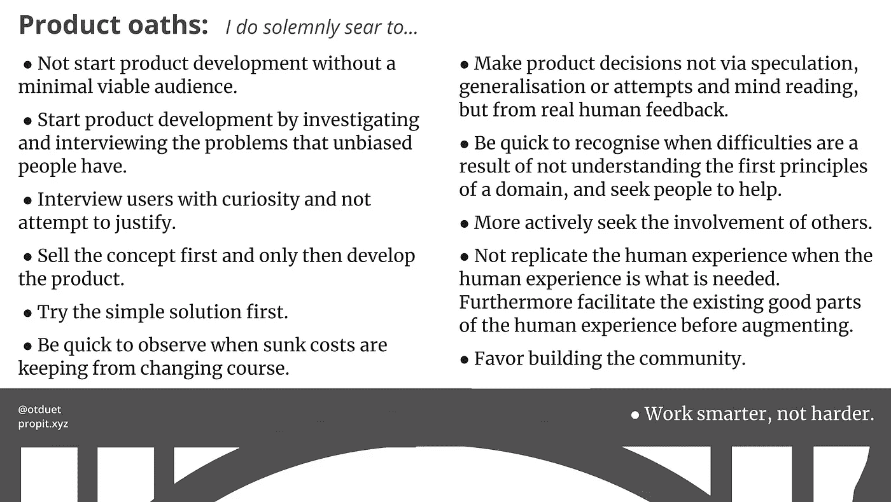

# 产品开发的 11 个誓言

> 原文：<https://medium.com/hackernoon/the-11-oaths-of-product-development-cdf4b23c0177>

> “直到你让无意识变得有意识，它才会指引你的人生，你会称之为命运。”——卡尔·荣格

在过去一年的产品开发中犯了很多错误。是时候让我的错误浮出水面了，这样我就可以从中吸取教训，成为一个更聪明、更高效的产品开发人员。

以下是我过去一年最大收获的总结。

从现在开始，我庄严宣誓:

*   没有最低限度的可行受众，就不要开始产品开发
*   通过调查和采访没有偏见的人遇到的问题来开始产品开发。
*   带着好奇心采访用户，不要试图证明。
*   先卖概念，再开发产品。
*   首先尝试简单的解决方案。
*   迅速观察沉没成本何时不会改变方向。
*   不要通过猜测、归纳或尝试和读心术来做出产品决策，而是要从真实的人类反馈中做出决策。
*   当困难是由于不理解某个领域的基本原则而导致时，要迅速意识到，并寻求他人的帮助。
*   更积极地寻求他人的参与。
*   当需要人类经验时，不要复制人类经验。此外，在增加之前，促进人类经验中现存的好的部分。
*   赞成建立社区。
*   更聪明地工作，而不是更努力。

如果这些问题听起来对你很重要，你可能会有兴趣阅读[更详细的叙述版本](/@otduet/14-product-pitfalls-for-startup-developers-like-myself-87229abd98b0?sk=862a14dfc33d37d98bb32ccd9e689841)我遇到这些问题时的个人经历，包括我认为可以走捷径和变通规则的所有方式。这可能会帮助你更快地认识到潜在的陷阱。

> 光忙是不够的。蚂蚁也是。问题是:我们在忙什么？——亨利·大卫·梭罗

喜欢这个错误总结吗？订阅我的[学习时事通讯](http://eepurl.com/gplUBb)，从我未来在所有产品开发方面的错误中吸取教训。每 6 个月总结并发送一次。