# 2023 年打造你自己的移动应用的 15 个最佳应用制造商

> 原文：<https://medium.com/hackernoon/the-15-best-app-makers-to-build-your-own-mobile-app-in-2019-57053b335f7e>

## 我们整理了一份顶级应用程序构建平台的名单，这些平台通过提供卓越的服务来提供功能完美、美学卓越的应用程序，从而证明了他们在行业中的勇气。

# 以下是最佳应用程序开发者的名单:

1.  [苹果馅饼](https://www.appypie.com)
2.  [Shoutem](http://www.shoutem.com/)
3.  [斯威夫特](https://www.swiftic.com)
4.  [好理发师](https://www.goodbarber.com/)
5.  [BuildFire](https://buildfire.com/)
6.  [Mobincube](https://www.mobincube.com/)
7.  [应用研究所](https://appinstitute.com/)
8.  [AppMachine](https://www.appmachine.com)
9.  [iBuildApp](https://ibuildapp.com/)
10.  [AppMakr](https://www.appmakr.com)
11.  [阿培尔](https://appery.io/)
12.  [移动 Roadie](https://mobileroadie.com)
13.  [应用构建器](https://www.theappbuilder.com)
14.  GameSalad
15.  [商业应用](https://www.biznessapps.com/)

# 1.苹果馅饼

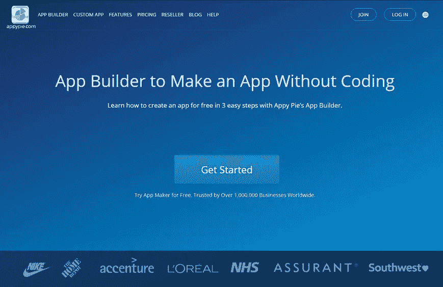

Appy Pie

世界上发展最快的应用程序构建平台——[Appy Pie](https://www.appypie.com/)已经在世界许多地方的应用程序构建行业留下了深刻的印记。我们的应用程序构建平台对于第一次构建应用程序的人和该领域的新手来说是一个福音。中小型企业发现该平台特别有益，因为他们有各种各样的计划，可以自由地开始免费构建应用程序，然后转向适合他们预算的订阅计划。

这个平台如此迅速地流行起来的一个原因是因为它提供了大量独特的功能。例如，使用 Appy Pie，您可以添加应用内购买、广告、上传电子书和其他密集内容、连接数据库、整合社交媒体、构建即时消息应用等等！最好的部分是，有一个正在开发的教程丰富的基础，这样客户就不会被功能所困，或者在应用程序中实现任何特定组件时遇到任何麻烦。除此之外，我们还有一个响应迅速的实时聊天支持，可以随时随地打电话寻求支持。这是最容易使用的平台之一，基于拖放界面，使没有编码技能的人可以毫无困难地构建他们的业务应用程序，并且只需几分钟。Appy Pie 的定价计划非常实惠，非常适合初创公司、企业家和中小型企业。

# 2.Shoutem

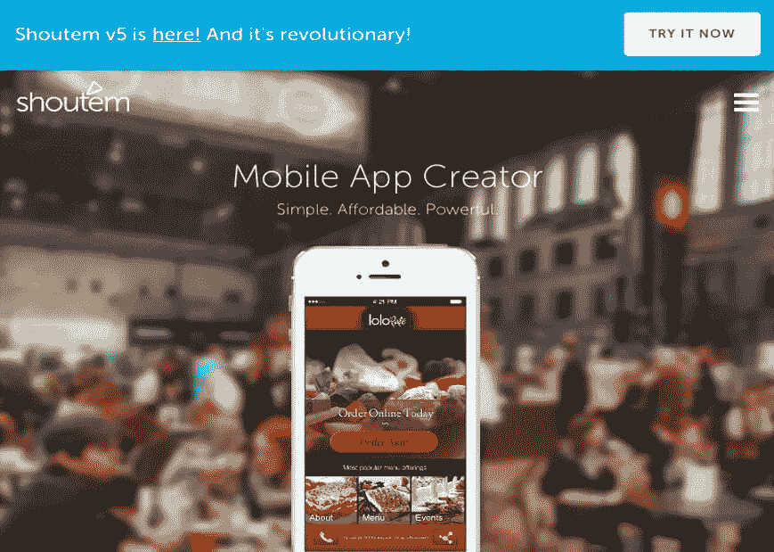

Shoutem

Shoutem 是市场上最精致的产品之一，自 2011 年成立以来一直在增长。在他们最新的 V5 中，他们做了很多，并更新了他们的平台，增强了用户体验。他们有非常光滑的模板设计，有大量的选项来定制它们，以便每个应用程序都有独特的美学和设计。你在这里制作的应用程序不仅好看，而且还会有一些很棒的功能。这个应用构建平台对于活动应用尤其有用。这款应用对社区尤其有用，因为他们有社交墙，用户可以在那里分享评论和照片。

然而，订阅计划并不那么方便。由于计划从 49 美元开始，它们可能不是最贵的，但也不便宜。他们计划中最便宜的允许你在苹果应用商店发布应用的起价是 79 美元，这相当便宜，特别是对于中小型企业或初创公司。

Shoutem 正在向开发人员开放他们的代码，以便让越来越多的人为他们构建额外的扩展或开发更多的功能，因为这是一个他们在排名中并不突出的领域。总的来说，设计、用户体验和模板可能是典范，Shoutem 作为一个应用构建平台，它提供的功能数量仍然很少。

# 3.斯威夫特茨

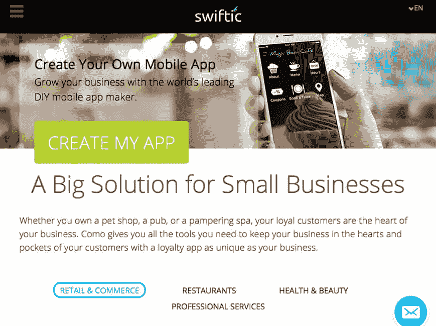

Swiftic

成立于 2010 年， [Swiftic](https://www.swiftic.com/) 始于以色列的 Como，此后一直负责为全世界超过 100 万个应用提供支持，这可能使其成为当今应用开发者池塘中最大的鱼之一。该应用构建平台提供的组件或构建模块多种多样，包括积分卡功能、预约集成、电子商务、用户评论&评级和活动。在其应用构建平台上构建的大多数应用包括餐馆、乐队和其他类型的活动组织等企业。

在他们最近的一次行动中，Swiftic 彻底调整了其定价。他们现在已经改变了他们的结构，只有一个层次，要么有每月(57 美元)订阅，每年(48 美元)或两年(41 美元)付款计划。作为一种善意的姿态和信心的展示，他们的一些更新继续承诺 6 个月的成功保证，这意味着如果你无法通过你的应用程序实现“任何有意义的业务成果”，Swiftic 将免费为你提供 6 个月的服务。

该平台组合了七种不同的模板，可以与六种不同风格的导航相结合。真正属于你自己的是，应用程序上的所有颜色、背景图像和图标都可以用你自己的作品进行调整。它们的编辑器布局非常巧妙，非常易于使用，并且它们提供的功能和设计选项非常多。尽管成功的保证可能是他们最有利可图的事情。

# 4.古德巴伯

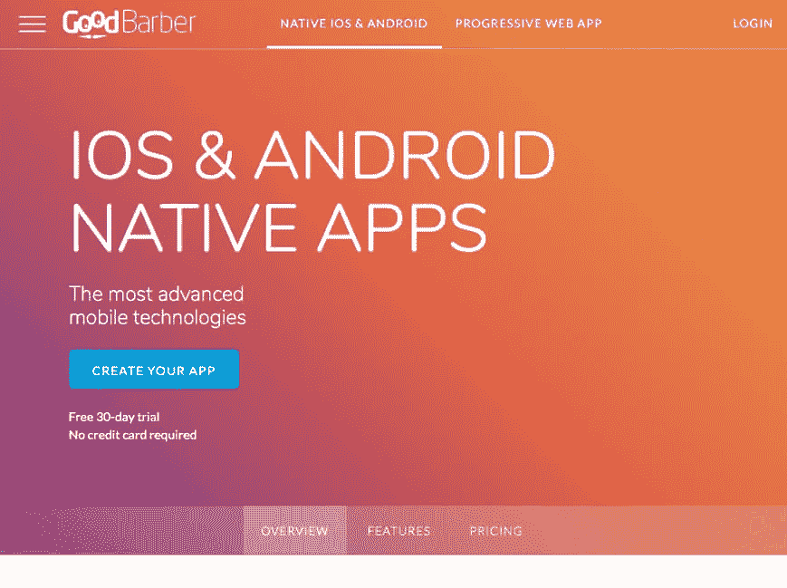

GoodBarber

从名字开始，这个应用构建器的一切都很有趣。基于法国科西嘉岛，这个应用构建平台有一些最令人印象深刻的主题。除了长相部门，该应用构建平台还以提供一些最先进的功能而闻名，包括社交网络、聊天、地理围栏、iBeacons 等。有了[古德巴伯](https://www.goodbarber.com/)，你可以以 32 美元的月订阅计划获得一个原生安卓应用，如果你想同时使用安卓& iOS，月订阅计划将高达 96 美元。然而，这两个计划都包括一个令人印象深刻的渐进式网络应用程序。

app building platform 自豪地展示了使用其平台创建的应用，以便您了解他们能够向您和其他客户提供的应用的质量和范围。

他们的模板不仅漂亮，而且为本地应用提供了极具竞争力的价格。它们提供了一些很棒的附加功能，如推送通知、聊天等。同时在构建应用程序时提供极大的灵活性。然而，一个缺点是缺乏自己的在线商店，但你可以整合第三方商店，如亚马逊，Etsy，Shopify 等。

# 5.建筑火灾

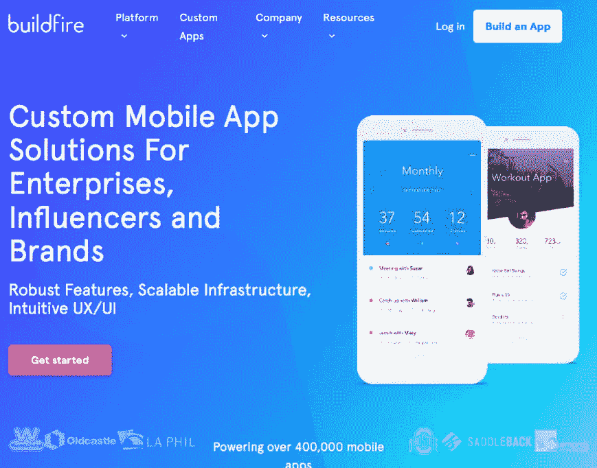

BuildFire

[BuildFire](https://buildfire.com/) 通过其应用构建平台为 30，000 家企业构建应用并提供支持，是更可靠的平台之一。他们的大多数客户属于企业、有影响力的人和品牌。BuildFire 将自己展示为一个平台，它是业内提供加速应用程序开发的领先平台之一。

用户友好的仪表板和管理控制面板的组合功能简化了发布更新的整个过程。该平台在客户中特别受欢迎，因为它易于使用，可快速重新配置，以及应用程序定制的广阔范围和可能性。可以对应用程序进行动态更改，甚至可以实时测试这些更改。他们提供免费计划和每月 49 美元的高级计划。

# 6.Mobincube

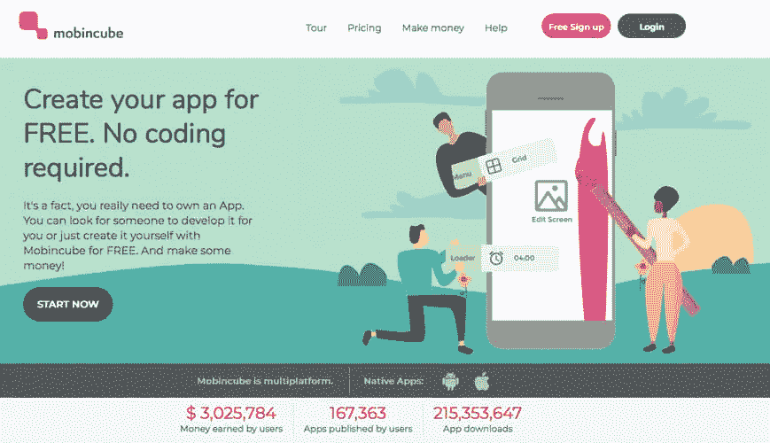

Mobincube

这个应用构建平台是那些为每个人建立应用构建者的平台之一！他们的座右铭是，每个人都应该能够建立自己的应用程序，并能够通过 Admob 平台赚很多钱。然而，重要的是你要明白，为了先赚钱，你必须做一些投资。然而，有了 Mobincube，你不必在口袋里烧一个洞，因为它出奇地便宜。Mobincube 的最低无广告计划起价为 9.99 美元。大多数人可能会感到惊讶，但这个平台让你从最低到最高的每个计划都变得本地化，这意味着你可以上传你在一个或所有流行的应用程序商店上构建的应用程序。

虽然这个编辑器有时看起来有点原始，而且为了能够使用特定的特性，您可能不得不不断地切换浏览器。然而，他们所提供的似乎是一个强大的平台，你甚至可以创建一些非常复杂的页面类型，比如使用基于 SQLite 的数据库从外部服务器获取数据。虽然在用户友好性方面可能有很大的改进空间，但没有其他应用构建平台可以免费为你提供真正的应用。

该平台具有非常有竞争力的价格和种类繁多的模板可供选择，并具有高度创新的功能可供选择。然而，仍然需要解决平台面临的技术难题，模板也有点太严格了。

# 7.应用研究所

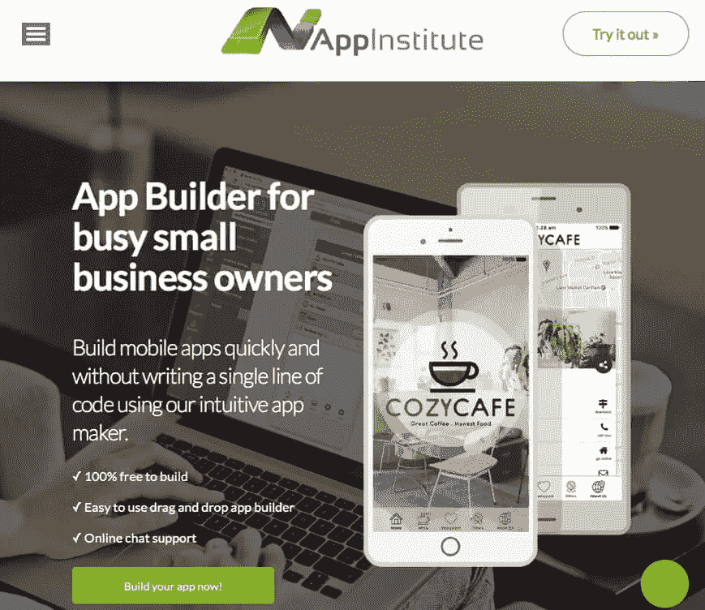

AppInstitute

目前，AppInstitute 是英国最大的应用程序制造商，已经赢得了几个著名的创业奖。当谈到电子商务功能时，这个平台特别棒，比如非常可定制的目录菜单和相当有利可图的忠诚度选项。这里很棒的一点是，你可以在应用程序中进行支付，而无需出于任何原因退出应用程序。对于那些担心安全和隐私的人来说，这是一个很好的措施。

他们的预订功能尤其独特，因为它将简单的预约或预订功能扩展到了创建一些真正丰富的活动，这些活动可以补充包括视频在内的有趣内容。

你在这里建立的应用程序可以每月订阅 49 美元(Android & PWA)或 81 美元(iOS)。该订阅附带基本推送通知和应用分析等功能。该平台上可用的功能实际上比乍看起来要强大得多。然而，您可能会观察到对后端集成的更好选择的明显需求。

# 8.AppMachine

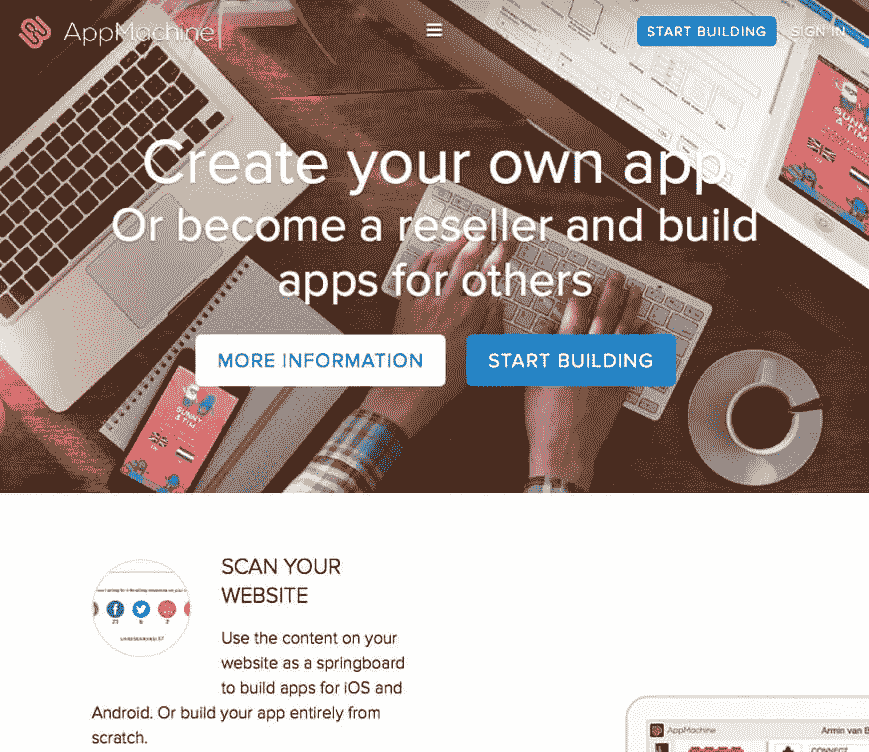

AppMachine

这个应用构建平台实际上给自己起了一个非常恰当的名字。AppMachine 的独特之处在于它尽可能多地自动化了繁琐的流程。如果你已经有了一个网站，他们只需要你的网址就可以简单地找出所有相关信息。这甚至可以包括你的脸书、Twitter 和其他社交媒体源、RSS 源，甚至你的图片。

编辑器 AppMachine 不仅在视觉上令人印象深刻，而且相当容易导航，不会以任何方式压倒您。虽然不是每一个组件从一开始就是直观的，但它们在爬上顶端的过程中肯定是有希望的。目前，他们提供两种不同的计划，Plus 每月 49 美元，Pro 每月 69 美元。虽然他们可能已经设法提供了一个相当强大的编辑器，提供了一个相当全面的构建块选择，但是用户界面需要更有逻辑性和更快。

# 9.iBuildApp

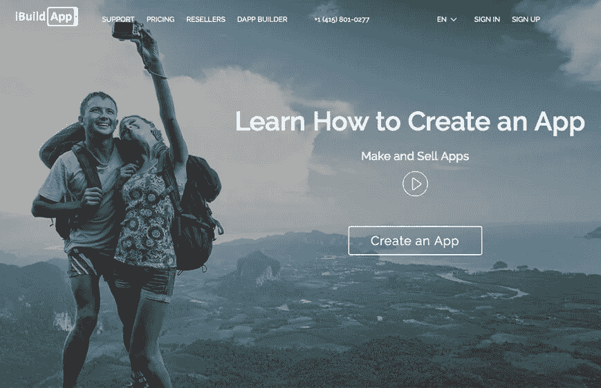

iBuildApp

[iBuildApp](https://ibuildapp.com/) 有一个最容易使用的拖放编辑器，一个内置的内容管理系统和一千多个应用程序模板可供选择！这个应用构建平台已经成为终极全能者之一，它可以构建设计精美且完全不需要编程知识的示范性应用。

应用构建平台上的特色模板可能看起来并不具有开创性，但该平台已经被使用了超过一百万次，这必须说明一些问题。从每月 9.99 美元起的基本计划开始，有每月 39 美元的商业计划，也有每月 99 美元的企业或机构计划。你甚至可以在选择更认真的投资之前进行免费试用。

# 10.AppMakr

AppMakr

现在，这是一个令人印象深刻的平台！基于新加坡的应用程序构建平台有近 200 万个应用程序。他们不仅声称只需 20 分钟就能构建一个应用程序，而且他们这样做的方式非常划算。他们有一个免费计划，可以转换为 2 美元的 PWA 月计划，以及 99 美元的 iOS 和 Android 年计划。总的来说，app 搭建平台其实还是挺实惠的。

它们提供了大量的构建模块，并提供了调整应用程序设计的选项，但在视觉上，应用程序构建器的编辑器让你感觉很无趣。它可能有一些很棒的应用程序功能和构建模块，但肯定需要进行重大的设计改革。

# 11.阿佩里

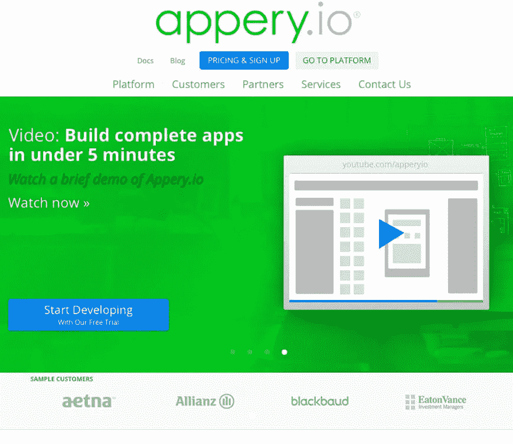

Appery

这是一个基于云的应用构建器，可用于为所有领先的应用商店(包括 Android、iOS 和 Windows Phone)构建应用，同时包括 Phone Gap，提供对其内置组件的访问。由于这是一个基于云的应用构建平台，所以不需要下载和/或安装任何东西，这使得非常快速地开始构建应用的过程变得非常方便。该平台也有一个拖放界面来构建应用程序的 UI，并允许您连接到任何 REST API，然后在您的应用程序中使用它们。更重要的是，只要需要，可以通过即时向您的应用添加云数据库和后端来存储应用数据。这里制作的应用程序也使协作变得简单，因此您可以与开发人员、业务用户和您的客户实时共享您的项目。这些计划差别很大，从免费到每月 180 美元不等。

# 12.移动道路管理员

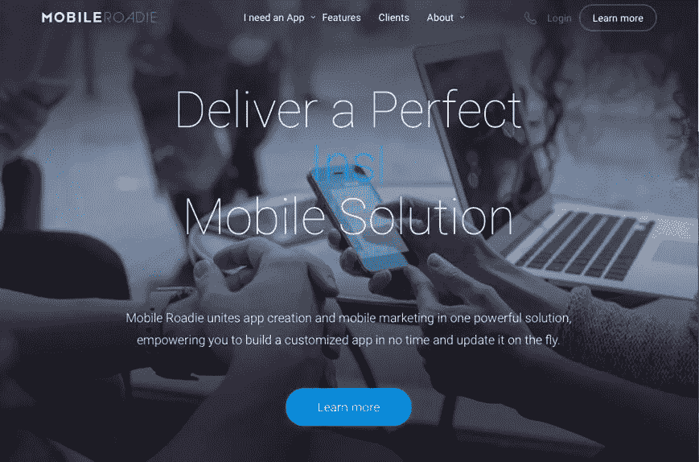

Mobile Roadie

他们是移动应用构建平台的较大玩家之一，拥有迪士尼、TED.org、环球等更多类似的客户。他们的定价计划从每月 149 美元的核心计划到每月 799 美元的专业计划。这非常清楚地表明了他们的目标客户。他们的模板有很多设计选项，但是还有一个额外的好处就是你可以根据自己的喜好调整它们。

app builder 提供了一些很棒的社区应用功能，如聊天和粉丝墙，这使得它对艺术家和乐队来说特别有趣。可以顺利集成到这里的音乐播放器很受欢迎，尤其是在音乐家当中。除此之外，应用程序构建者可以吹嘘一些非常先进的应用程序功能，如地理定位内容。

然而，由于它提供了广泛的功能，在这个平台上构建的应用程序需要更长的时间来构建。此外，平台的用户界面需要更加直观。

# 13.应用构建器

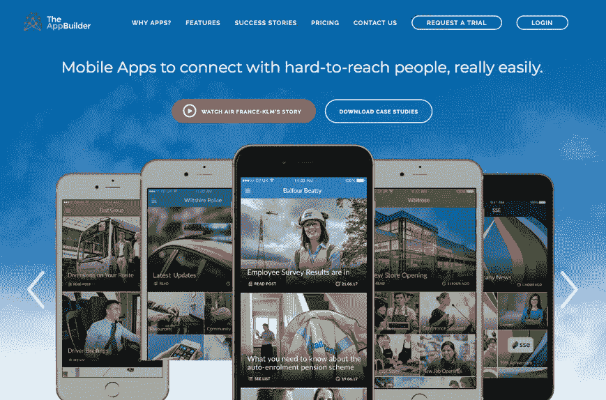

TheAppBuilder

AppBuilder 提供了两种不同的方法，并拥有一整套适合员工、客户、活动和手册的应用程序。使用在线工具包可以轻松构建应用程序，您可以从培训或应用程序构建器本身获得帮助，这样您就可以定义和构建应用程序的结构，这样您就可以在开始时填充一些内容。

您可以利用专用的应用程序库，向您的用户提供多个应用程序，您甚至可以使用自己的品牌定制它。更重要的是，你可以改变你的应用程序的结构和内容，甚至在它上线之后。你可以为 iPhone、iPad 和 Android 开发本地应用，在这个平台上，你所做的任何更新都会在 60 秒内生效。

# 14.GameSalad

GameSalad

GameSalad 是一个非常棒的平台，让您可以为包括 iOS、Android、HTML5 和 OS X 在内的许多平台构建和发布游戏。它的拖放界面让您可以在没有任何编码技能或编程知识的情况下构建游戏。

游戏创建者有一个场景和演员编辑器，这是所有动作发生的地方。这是你在场景中设置演员和创建属性、图像、声音等的地方。这个应用程序构建平台也有一个非常活跃的社区论坛，可以从其他独立游戏设计师那里获得帮助和建议。GameSalad 的定价计划从免费开始，每年高达 299 美元。

# 15.商务应用程序

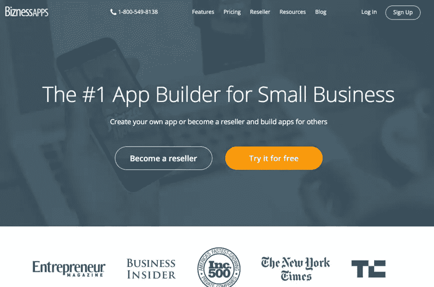

BiznessApps

[BiznessApps](https://www.biznessapps.com/) 是一个很棒的应用构建平台，可以帮助你使用一个非常简单的过程来创建商业移动应用。它有很多功能，包括食品订购、电子商务、忠诚度计划、第三方应用集成、推送通知、应用分析等。

您可以使用他们用户友好的内容管理系统在几分钟内为自己创建一个应用程序，在那里您可以使用自己的设计为各种元素定制一切。有趣的是，即使你正在设计和开发应用程序，你也可以查看它的实时预览。

使用 BiznessApps，您可以轻松地在线更新您的应用程序，并根据您的喜好进行许多更改，而不必遵循 Google Play 或 iTunes 上漫长的更新过程。除此之外，该平台还有丰富的教程和培训材料。这里的订阅计划从每月 29 美元的 PWAs 开始，到每月 99 美元的移动应用程序。

明智地选择，做好选择。找一个对你有益的应用构建器，因为对你的朋友或同事有用的可能对你没那么有用。在继续为您的移动商务应用选择应用构建平台之前，您需要给这部分流程一些时间，这一点很重要。

Appy Pie