# 2018 年在 Twitter 上关注的 200 名黑人女性名单

> 原文：<https://medium.com/hackernoon/the-2018-black-women-in-tech-to-follow-on-twitter-list-32034049a055>

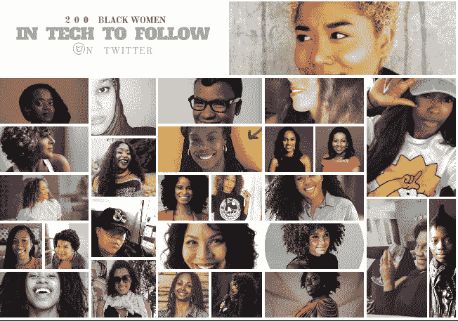

在 2018 年，如果你想知道科技领域在包容性、代码新手方面发生了什么，以及科技领域中未被充分代表的社区在做什么，你只需要看看这 200 名非凡的黑人女性就行了！

**背景:**正如你们许多人所知，这份年度榜单是我在 2015 年开始策划的一项爱心工程，并于 2016 年首次发布，作为 Twitter 上的第 185 位 [**黑人科技女性**](http://blackwomentech.com/) 的后续。

我没有得到公司的资助或赞助或任何其他有金钱价值的东西来管理这个名单，所以你知道这是一个公正的资源。

为什么是黑人女性？自从三年前第一份榜单发布以来，就有人问我，为什么在科技生态系统不包括黑人男性的情况下，我只把女性列在榜单上。

*我的回答:*在我了解到黑人女性[在接受风险投资的初创公司创始人中不到 1%](https://www.blackenterprise.com/black-women-founders-venture-capital/)(不到 0.02%)，本质上位于图腾柱的底部，代表最少的*，远远少于黑人男性、白人女性、亚裔美国女性和其他边缘化群体之后，我在 Twitter 上创建了 200 名黑人女性科技领域女性的名单，以填补一个具体而明确的空白。这个群体*不仅没有*得到资助，而且 ***是科技公司员工中最少代表*** 的群体，而 ***在科技领域的其他“关注对象”名单中几乎不存在*** 。排除产生了解决方案。*

*我想让所有人都知道我们也在这里，并让“找到我们”变得更容易，提供一份代表最少的群体的名单，这样就不会再成为我们没有被包括在内的借口。*

*我很高兴地注意到，自 2016 年公布初始名单以来，许多人已经获得了“Twitter 蓝色复选标记”验证，不管喜欢与否，这是该平台上已建立账户/品牌的标志。*

*我还注意到，许多人已经拓展并离开了技术领域，离开了 Twitter 平台，或者停止了太多的推文，这很好，但这意味着要保持资源的相关性和准确性，它需要更新。*

# *为什么是 Twitter？*

*为什么不呢？在它成为现任总统接触大量受众的首选社交媒体平台之前，它是获取任何和每个主题的最新新闻、信息和更新的枢纽，因此，它仍然是找到您需要了解的任何和所有事情的最佳方式，包括技术的多样性和包容性！*

*正如之前在这个列表中提到的，不像其他的社交媒体平台，Twitter feeds 提供了即时快速的资源和共享的知识。Twitter 是一个很好的资源来源，因为活跃在这个平台上的人们经常分享新闻、信息、文章和事件。*

*因此，对于任何组织会议、编制技术清单、寻找顾问或使团队多样化的人来说，这也是一个很好的起点。这份名单上的女性经常分享见解、信息、新闻、照片、资源、项目和其他针对不同社区的倡议，有些人一天会分享多次。他们的推文还提供了对非常活跃和富有成效的技术包容世界的见解。*

*不能再有借口说“不知道它们的存在”*

# *方法学*

*选择入选者是因为他们 1)有一个非私人帐户；2)分享各种信息、资源、链接、事件；3)积极主动；4)主要不是自我推销的；5)或自动推文；6)定期、经常更新自己的账户；和 7)主要关于技术、技术包容性或技术相关内容的推特；和 8)在这一领域做着令人惊叹的事情。此外，还做出了努力，以确保所包括的人不是拥有最多追随者的账户或已经很有名的账户，而是更多为启迪、教育和照亮她们的在线社区以及许多其他人的贡献做出集体努力的妇女。*

***缓慢起步:**2017 年，我招募了一个小团队(包括 **Elen Awalom** 和 PR Pro **阿信·艾伦德**)来帮我完成一个稍微大一点的单子(我们又增加了 15 个，使总数达到 200 个)，我们被慷慨地赠予了位于**霍华德大学**校区的 [**包容性创新孵化器**](https://www.in3dc.com/) 的一个房间，该孵化器的首席执行官和我的好朋友*

***2018 年，个人义务减缓了我们所有的集体进步，但技术和狂热的 Twitter 用户 **Shari Hunt** 加入进来，帮助保持梦想，因此，我们能够在夏威夷的人们庆祝 2019 年初之前完成这个最新版本！那是我的目标！在年底前完成！某人的年终。任何人的！(笑)***

*****最新消息:【2018 年的获奖者包括更多千禧一代的代码新手和 Twitter 社区的活跃成员，其中许多人是大学生和 25 岁以下的年轻专业人士、创新者和创始人！！我们希望维护这个社交媒体平台上最具信息量、影响力和吸引力的推特用户的强大列表。我们还增加了过去几年名单中遗漏的一些兽医。*****

*****新内容:**和往常一样，你会发现从开发人员到编码人员，从教育技术传播者到风险投资者和导师，到大型科技公司的校友，等等。***

*****关注所有:**如果你在 Twitter 上，你可以通过关注这个 [**Twitter 列表来关注列表中的所有人！**](https://twitter.com/JenebaSpeaks/lists/the-200-list-2018/members)***

***话不多说，这些是 2018 年最活跃、最相关的声音:***

# ***A.***

# ***阿比盖尔·约瑟夫***

******

***[@**drabigail Joseph**](https://twitter.com/drabigailjoseph)***

*****Twitter 简历:**教育家、艺术家、计算机科学家、设计思想家、STEM 爱好者，希望创造、合作、创新和发起有意义的社会变革。 [@edstoria](https://twitter.com/edstoria)***

# ***阿达奥拉·乌多吉***

******

***[@**AdaoraUdoji**](https://twitter.com/AdaoraUdoji)***

*****推特简历:**[# emerging tech](https://twitter.com/hashtag/EmergingTech?src=hash)[#投资人](https://twitter.com/hashtag/Investors?src=hash)[#初创公司](https://twitter.com/hashtag/Startups?src=hash)#附属公司[@ ITP](https://twitter.com/ITP)[#顾问](https://twitter.com/hashtag/Adviser?src=hash)[@ the varanyc](https://twitter.com/thevraraNYC)[@ new Inc](https://twitter.com/NEWINC)[#导师](https://twitter.com/hashtag/Mentor?src=hash)[@ the oped project](https://twitter.com/TheOpEdProject)[# EIR](https://twitter.com/hashtag/EIR?src=hash)[@ we work](https://twitter.com/WeWork)[# obscenely inquire](https://twitter.com/hashtag/obscenelyCURIOUS?src=hash)***

# ***Adepeju Jaiyeoba***

******

***[@ **pjlalah**](https://twitter.com/pjlalah)***

*****推特简历:**创始人 [@brownbutton_org](https://twitter.com/brownbutton_org) &母亲的分娩工具包|2018 威尔士亲王可持续发展企业家|英国女王光点奖获得者|[@ wash fellowship](https://twitter.com/washfellowship)Fellow***

# ***清水航空银行***

***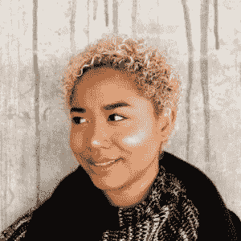***

***[@**erikashimizu**](https://twitter.com/erikashimizu)***

*****推特简历:**A 型性格，B 型志向。我自己的想法和感受。***

# ***Afrohacker***

******

***[@**afro hacker**](https://twitter.com/Afrohacker)***

*****Twitter Bio:**[# WIT](https://twitter.com/hashtag/WIT?src=hash)|软件 Eng |数据 Sci |美食鉴赏家|体育迷|分院帽把我放在斯莱特林多半是 bcos 我写 Python***

# ***艾莎·鲍***

******

***[@ **arbowe**](https://twitter.com/arbowe)***

*****Twitter 简历:**科技解决方案公司 [@ **STEMBoard**](https://twitter.com/STEMBoard) 的联合创始人兼首席执行官，缩小成就差距。***

# ***阿曼达·斯潘***

******

***[@**amandaspan**](https://twitter.com/amandaspann)***

*****Twitter 简历:** PR 少女转行 App 创始人。以前属于[@ tiphubaafrica](https://twitter.com/TiphubAfrica)和 Blerdology。《商业内幕》30 岁以下 30 岁以下的科技女性[# FSU](https://twitter.com/hashtag/FSU?src=hash)[#霍亚](https://twitter.com/hashtag/Hoya?src=hash) #904***

# ***四月之夜***

******

***[@VogueandCode](https://twitter.com/vogueandcode)***

***推特简历: Python 开发者+80/90 年代流行文化爱好者我和电脑聊天是为了好玩+在 Illustrator 中制作很酷的东西我还制作了 fetch***

# ***阿南达·李克***

***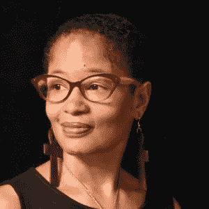***

***[@**anandaleeke**](https://twitter.com/anandaleeke)***

*****推特简历:**[#正念](https://twitter.com/hashtag/Mindfulness?src=hash)+创造力+技术:高成就者&组织雇佣我来帮助他们生活、工作&正念地使用技术！正念教师作者数字战略家***

# ***安德烈·埃文斯先生。***

******

***[@**EvansIPLaw**](https://twitter.com/EvansIPLaw)***

*****推特简历:**知识产权代理人—[#专利](https://twitter.com/hashtag/Patent?src=hash)、[#商标](https://twitter.com/hashtag/Trademark?src=hash)和[#版权](https://twitter.com/hashtag/Copyright?src=hash)法律/ 2014 白宫 STEM 变革冠军***

# ***安吉拉·本顿***

******

***[@ **阿本顿**](https://twitter.com/ABenton)***

*****推特简历:**科技先锋。第一个少数民族加速器的创始人 [@NewMEAccel](https://twitter.com/NewMEAccel) 。另:作者。癌症幸存者。妈妈。***

# ***阿尼·阿克佩***

******

***[@ **AnieAkpe**](https://twitter.com/AnieAkpe)***

*****Twitter 简历:**创始人[@ ibom LLC](https://twitter.com/IBOMLLC)[@ innov 8 tiv mag](https://twitter.com/innov8tivmag)覆盖美国[# blacks tech](https://twitter.com/hashtag/BlacksInTech?src=hash)、英国、加勒比群岛&非洲。目前在做[@ NetWorqApp](https://twitter.com/NetWorqApp)——[@ African wit](https://twitter.com/AfricanWIT)***

# ***安妮娅·威廉姆斯***

******

***[@**operaquenie**](https://twitter.com/operaqueenie)***

*****推特简历:**[@ tinselwear](https://twitter.com/tinselwear)创始人。发明家。创造者。音乐家。发型魔术师。通过 [@bbfounders](https://twitter.com/bbfounders) 和 [@sexandstartups](https://twitter.com/sexandstartups) 改变游戏。妈咪。 [@polotek](https://twitter.com/polotek) 的妻子。那就是我。***

# ***安妮莎·汤普森***

******

***[@ **安尼萨特**](https://twitter.com/anissat)***

*****推特简历:**[@ csudhextended](https://twitter.com/CSUDHExtendedEd)[# social media](https://twitter.com/hashtag/SocialMedia?src=hash)|[# Web](https://twitter.com/hashtag/Web?src=hash)[#开发者](https://twitter.com/hashtag/Developer?src=hash) | [@WebCert](https://twitter.com/WebCert) 培训师/讲师[# Adobe](https://twitter.com/hashtag/Adobe?src=hash)UGM[@ lawebprosgroup](https://twitter.com/lawebprosgroup)演讲者 [#Yeshua](https://twitter.com/hashtag/Yeshua?src=hash) (耶稣)***

# ***阿里尔·阿什-沙库尔***

******

***[@**2a squared witter**](https://twitter.com/2Asquared)***

*****推特简历:**[#生物医学工程师](https://twitter.com/hashtag/BiomedicalEngineer?src=hash)专攻心血管器械|[# BlackAndSTEM](https://twitter.com/hashtag/BlackAndSTEM?src=hash)[# women instem](https://twitter.com/hashtag/WomeninSTEM?src=hash)l Culture x STEM = My TL***

# ***艾瑞尔·黑尔***

******

***[@NerdNomadMom](https://twitter.com/nerdnomadmom)***

*****推特简介:**非洲裔巴西人。多激情的企业家。双鱼座。草根工作者。数据科学，开发计划署，网络安全。塞拉斯的妈妈。[#**DigitalNomad**](https://twitter.com/hashtag/DigitalNomad?src=hash)[#**BlackTechTwitter**](https://twitter.com/hashtag/BlackTechTwitter?src=hash)***

# ***阿尔兰·汉密尔顿***

******

***[@ **阿拉兰**](https://twitter.com/ArlanWasHere)***

*****推特简历:**同性恋。方正[@**back stage _ Cap**](https://twitter.com/Backstage_Cap)[@**projectcoveraorg**](https://twitter.com/ProjectCoverOrg)[@**bootstrapped VC**](https://twitter.com/BootstrappedVC)&[@**modern word**](https://twitter.com/modernlword)主题 S7 [@ **播客启动**](https://twitter.com/podcaststartup) Fangirl [@ **综合医院**](https://twitter.com/GeneralHospital)I[@](https://twitter.com/queergermangirl)***

# *****阿林·西蒙博士*****

**********

*****[@ ArlynSimonePhD](https://twitter.com/ArlyneSimonPhD)*****

*******推特简历:**生化工程师[**#发明家**](https://twitter.com/hashtag/Inventor?src=hash) **童书作者:**[**# abbynvents**](https://twitter.com/hashtag/AbbyInvents?src=hash)**avail。**[**@亚马逊**](https://twitter.com/amazon)**[**# STEM**](https://twitter.com/hashtag/STEM?src=hash)**main BSc**[**@ GeorgiaTech**](https://twitter.com/GeorgiaTech)**PhD**[**@ UMich**](https://twitter.com/UMich)****@ SCBWI****成员***********

# *****阿什利·莫斯利·狄更斯*****

**********

*****[@阿什莫斯利](https://twitter.com/ashmosley)*****

*******推特简介:**原名 [@ **推特**](https://twitter.com/Twitter) 。刚刚结束了一年的撒哈拉以南非洲之旅。*****

# *****阿什利·纳尔逊-霍恩斯坦*****

**********

*****[@ **ashleynh**](https://twitter.com/ashleynh)*****

*******推特简历:** iOS 工程师。会议发言人。博主。制作 [http://beacon.party](https://t.co/lm8dbKfTaC)*****

# *****阿尤里·塞拉西*****

**********

*****[@ **iAyori**](https://twitter.com/iAyori)*****

*******推特简历:** AI，工程师，作家，自创业者，伦理【http://TheSelfpreneur.com】||[# AI](https://twitter.com/hashtag/AI?src=hash)[# machine learning](https://twitter.com/hashtag/MachineLearning?src=hash)[# life model design](https://twitter.com/hashtag/LifeModelDesign?src=hash)[# ThinkDontSqueeze](https://twitter.com/hashtag/ThinkDontSqueeze?src=hash)*****

# *****B.*****

# *****巴里·威廉斯*****

**********

*****[@BariAWilliams](https://twitter.com/BariAWilliams)*****

*******推特简历:**Tech esq .+Ops |[@**StubHub**](https://twitter.com/StubHub)+[@**脸书**](https://twitter.com/Facebook)Alum | D&I/Equity advocate | Asker of why | round the way 礼仪爱好者|[#**town business**](https://twitter.com/hashtag/TownBusiness?src=hash)| Cal Alum | Views = mine。*****

# *****B.劳里*****

**********

*****[@ **beLaurie**](https://twitter.com/beLaurie)*****

*******推特简历:** |职业微笑者——科技痴迷者——体验策展人——耶稣追随者——海天|明矾:[@**Pinterest**](https://twitter.com/Pinterest)[@**a16z**](https://twitter.com/a16z)[@**code 2040**](https://twitter.com/CODE2040)[@**LinkedIn**](https://twitter.com/LinkedIn)[@**startup America**](https://twitter.com/StartupAmerica)[@](https://twitter.com/HowardU)*****

# *****碧翠丝楼*****

**********

*****[@**BeaLearnsCode**](https://twitter.com/BeaLearnsCode)*****

*******推特简历:**群山【beatrixhouse.com *****

# *****黑人女性创始人*****

*****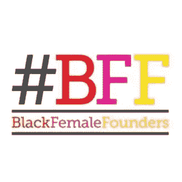*****

*****[@**BFFEmpire**](https://twitter.com/BFFFempire)*****

*******Twitter Bio:**[# BFF](https://twitter.com/hashtag/BFF?src=hash)是一个全球性的会员制组织、社区和运动，旨在帮助黑人女性领导的科技企业和女性科技领袖。*****

# *****黑人女孩守则*****

**********

*****[@**BlackGirlsCode**](https://twitter.com/BlackGirlsCode)*****

*******Twitter 个人简介:**我们的目标是让 7-17 岁的年轻有色人种女性成为建设者和创造者，拥抱当前的科技市场。*****

# *****黑人女孩极客*****

**********

*****[@**blackgirl geeks**](https://twitter.com/BlackGirlGeeks)*****

*******推特简介:**极客化账号到 [@blackgirlnerds](https://twitter.com/blackgirlnerds) 。Geekin 不是游戏。如果你是书呆子&你知道它拍手。*****

# *****布兰代斯·马歇尔*****

**********

*****[@**csdoctorsis ter**](https://twitter.com/csdoctorsister)*****

*******推特简历:**受训的计算机科学家。职业大学教授。使学术多样化。想法是我的。[#黑计算](https://twitter.com/hashtag/BlackComputing?src=hash)[#数据科学教育](https://twitter.com/hashtag/DataScienceEducation?src=hash)*****

# *****布兰妮球*****

**********

*****[@Bri_toe-knee](https://twitter.com/Brii_toe_knee)*****

*******推特简历:**软件工程师 [@ **Skookum**](https://twitter.com/Skookum) |组织者[@**girl dev it**](https://twitter.com/GirlDevelopIt)|情人[@**JavaScript**](https://twitter.com/JavaScript)|我的观点是我自己的。*****

# *****布里亚纳·福特*****

*****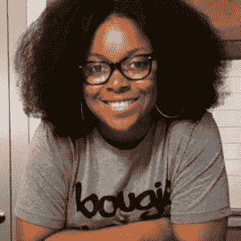*****

*****[**@ bmexplainstall**](https://twitter.com/bmexplainsitall)*****

*******Twitter 生物:**面向创业者的数字营销策略和解决方案。网络+社交+对话。创始人: [@ **布里亚南福德**](https://twitter.com/brianamford) 。 [@ **evernote**](https://twitter.com/evernote) 社区负责人。*****

# *****布里特·菲茨帕特里克*****

**********

*****[@ **布里特菲茨帕特里克**](https://twitter.com/BritFitzpatrick)*****

*******推特简历:**没有运气，只有恩典美国运通 50 岁以下 40 岁科技企业家指导专家项目经理[@ hill 7 org](https://twitter.com/hill7org)·路易斯维尔出生， [@HowardU](https://twitter.com/HowardU) 长大*****

# *****布朗女子技术学院*****

**********

*****布朗女孩科技公司*****

*******推特简历:**我们让&联系棕色皮肤的女孩，让她们准备好技能/资源，开始在科技领域的职业生涯，建立一家初创公司和/或追求创业。*****

# *****C.*****

# *****卡米尔·艾迪*****

**********

*****[@ **NikkyMill**](https://twitter.com/NikkyMill)*****

*******推特简介:** 24。工程。交叉性。设计。原 [@nvidia](https://twitter.com/nvidia) 、Google X 和 [@hplabs](https://twitter.com/hplabs) //在网络、LinkedIn、Medium、[http://hellocami.com](https://t.co/xtDIZdGgqK)阅读我的文章*****

# *****卡米尔·赫斯特*****

*****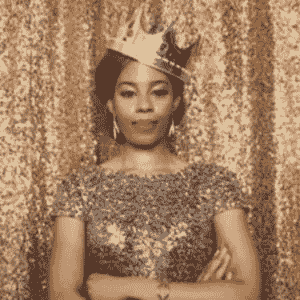*****

*****[@ **camillionz**](https://twitter.com/camillionz)*****

*******推特简历:**娱乐、科技、&热爱设计的 [@ **斯坦福**](https://twitter.com/Stanford) 明矾。在 [@ **iTunes**](https://twitter.com/iTunes) ， [@ **YouTube**](https://twitter.com/YouTube) ， [@ **Google**](https://twitter.com/Google) 度过了我的早期。现在，联合创始人&在[http://kit.com](https://t.co/ITLgwhUBJx):[@**hashtagkit**](https://twitter.com/hashtagkit)担任 ceo*****

# *****坎迪斯·希克斯*****

**********

*****@ [candace2xs_](https://twitter.com/Candace2xs_)*****

*******推特简历:**项目经理@微软。创造者&革新者。IG: Candace2xs_*****

# *****坎迪·卡斯尔伯里*****

**********

*****[@Candi](https://twitter.com/Candi)*****

*******推特简历:**交叉性+多样性+文化 [@ **推特**](https://twitter.com/Twitter)[#**IWillDoMyPart**](https://twitter.com/hashtag/IWillDoMyPart?src=hash)为了让我们的世界变得更美好——我们所有的差异我。我们。我们。这个世界。*****

# *****坎迪斯·摩根*****

*****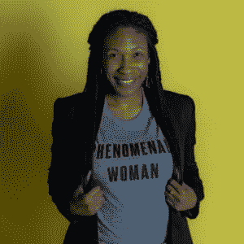*****

*****[@**Candice _ MMorgan**](https://twitter.com/Candice_MMorgan)*****

*******推特简历:**头部包含&多样性策略师 [@Pinterest](https://twitter.com/Pinterest) 。跨文化商业心理学家。代词:她/她。观点=我的。*****

# *****卡莉安·弗格斯*****

*****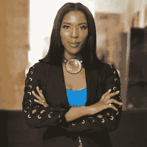*****

*****[@CarlyAnnFergus](https://twitter.com/CarlyAnnFergus)*****

*****[@**xr labs**](https://twitter.com/XRCLabs)时尚|零售|创新|科技|创业委员会主任: [@ **Opp_Net**](https://twitter.com/Opp_Net) 顾问委员会: [@ **cfda**](https://twitter.com/cfda) 伊莱恩金发射台精选: [@ **福布斯**](https://twitter.com/Forbes)+[@**WWD**](https://twitter.com/WWD)*****

# *****医学博士夏琳·布朗*****

**********

*****@[**DrCharleneBrown**](https://twitter.com/drcharlenebrown)*****

*******推特简历:**公共卫生 doc，社会企业家。[@ ReciproCareJobs](https://twitter.com/ReciproCareJobs)[@ Harvard med](https://twitter.com/harvardmed)[# prev med](https://twitter.com/hashtag/prevmed?src=hash)[# senior care](https://twitter.com/hashtag/seniorcare?src=hash)[# care giver life](https://twitter.com/hashtag/caregiverlife?src=hash)[# work force](https://twitter.com/hashtag/workforce?src=hash)[# socent](https://twitter.com/hashtag/socent?src=hash)的创始人/CEO 我的观点。*****

# *****谢丽尔·康蒂*****

**********

*****[@ **ch3ryl**](https://twitter.com/ch3ryl)*****

*******推特简历:**极客+优秀=励志创新——做大事的 CEO。我的全职工作=一个蹒跚学步的骄傲妈妈！*****

# *****奇代拉·杰尼*****

**********

*****@ [dera_jo](https://twitter.com/dera_jo)*****

*****Twitter 简历:自豪的 Igbo | JavaScript motherhen | nodeJs 学生|不一般的普通女孩|游戏爱好者|…oyirinneya*****

# *****克里斯蒂娜·莫里洛*****

**********

*****[@**divinetechygirl**](https://twitter.com/divinetechygirl)*****

*******推特简历:**云-身份-安全[@ azuread](https://twitter.com/azuread)[@微软](https://twitter.com/Microsoft) //共同主导[@ wisporg](https://twitter.com/wisporg)NYC//99 后的 Techie&2000 年代//Native//CoF[@ wocintechchat](https://twitter.com/wocintechchat)*****

# *****辛迪·奥涅克韦卢*****

*****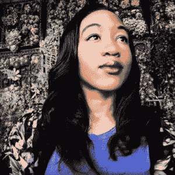*****

*****[@InnovateWhat](https://twitter.com/innovatewhat)*****

*******推特简历:**我爱 [# **灵感**](https://twitter.com/hashtag/Inspiration?src=hash) &我是一个[#**first gen**](https://twitter.com/hashtag/FirstGen?src=hash)[#**black grad**](https://twitter.com/hashtag/BlackGrad?src=hash)[#**Tech**](https://twitter.com/hashtag/Tech?src=hash)[#**影响者**](https://twitter.com/hashtag/influencer?src=hash) 学习如何让这个世界变得比我发现的时候更好！[#**BlackTechTwitter**](https://twitter.com/hashtag/BlackTechTwitter?src=hash)[#**感恩**](https://twitter.com/hashtag/Thankful?src=hash)*****

# *****鸦鸦*****

*****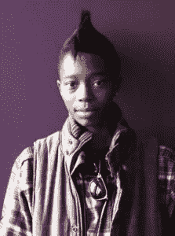*****

## *****[@姜帆](https://twitter.com/corvida)*****

*******推特简历:在**以用简单英语讲述技术而闻名国际|路径:ATP、TED、英特尔、ReadWrite、雪佛兰/通用等。*****

# *****辛西娅·盖尔庄园*****

*****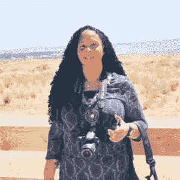*****

*****[@CynthiaManor](https://twitter.com/CynthiaManor)*****

*****艺术+技术德克萨斯州奥斯汀的数字艺术家、诗人和 IT 专业人员/SQL 程序员 UT Grad ACC 编程学生* 50+& Lovin ' IT[@**colors _ Africa**](https://twitter.com/colors_africa)[@**nouncted _ design**](https://twitter.com/anointed_design)*****

# *****D.*****

# *****达尔内·阿德玛*****

**********

*****[@Darlene91](https://twitter.com/darnele91)*****

*****Twitter 简历:软件工程师||终身学习者|| IBMer ||读者||旅行者||美食爱好者也是睡眠者。https://github.com/Darnele91*****

# *****德舒纳·斯潘塞*****

**********

*****[@ **德舒纳**](https://twitter.com/DeShuna)*****

*******推特简历:**[创始人/首席执行官@kweliTV](https://twitter.com/kweliTV) |肺癌倡导者|有目的地生活|“我的海说让你的光芒照耀世界。”*****

# *****神性马托武*****

*****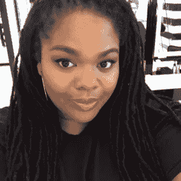*****

*****[@**divinymatovu**](https://twitter.com/divinitymatovu)*****

*******推特简历:**节目经理@ Lyft | Alum[@沃顿](https://twitter.com/Wharton) [@USC](https://twitter.com/USC) 观点为本人观点*****

# *****E.*****

# *****乌木·希克斯*****

**********

*****[@EbonyBHicks](https://twitter.com/ebonybhicks)*****

*******推特简历:**创始人&CEO[@**browngirlsntech**](https://twitter.com/browngirlsntech)，[@**browngirlscode 1**](https://twitter.com/browngirlscode1)|[#**企业家**](https://twitter.com/hashtag/entrepreneur?src=hash) ， [# **网络安全**](https://twitter.com/hashtag/cybersecurity?src=hash) ，[#**browngirlcoder**](https://twitter.com/hashtag/browngirlcoder?src=hash)|网页设计师^ [@。](https://twitter.com/Apple)*****

# *****埃米·刘易斯·布里奇曼*****

**********

*****[@**emmieglew is**](https://twitter.com/emmieglewis)*****

*******Twitter 简历:**上帝至上，五个孩子的妈妈，妻子，解决方案架构师&软件工程师，技术主管，CSM，CSD，GA Tech*****

# *****艾丽卡·贝克*****

*****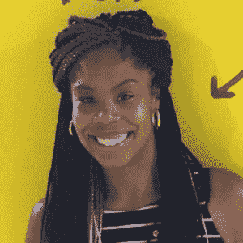*****

*****[@](https://twitter.com/EricaJoy) **艾丽卡·乔伊*******

*******Twitter 简历:**她/她/她的|工程经理|随心所欲。别管安全了。住在你害怕住的地方。毁了你的名声。臭名昭著。鲁米*****

# *****艾丽卡·马比恩*****

**********

*****[@3TrailsMabion](https://twitter.com/3trailsmabion)*****

*******推特简历:**创新，创意，改变。Google/Scratch/Code.org 认证教育家。2x 玩具。K-8 STEM 老师，妻子，母亲，朋友。博主 Self/EdTech 团队。*****

# *****艾琳·霍恩·麦金尼*****

**********

*****[@**erinhmckinney**](https://twitter.com/erinhmckinney)*****

*****[**推特简历:**](https://twitter.com/erinhmckinney) 包容性管理合伙人 [@JumpStartInc](https://twitter.com/JumpStartInc) ，创始人[@ BFFFempire](https://twitter.com/BFFFempire)&[@ KissIntelapp](https://twitter.com/KissIntelapp)——[# tech policy](https://twitter.com/hashtag/techpolicy?src=hash)[#企业家](https://twitter.com/hashtag/entrepreneur?src=hash)[#内部创业者](https://twitter.com/hashtag/intrapreneur?src=hash)[#远见者](https://twitter.com/hashtag/visionary?src=hash)[#游戏改变者](https://twitter.com/hashtag/gamechanger?src=hash)[#红唇](https://twitter.com/hashtag/redlips?src=hash)*****

# *****艾琳·提格*****

**********

*****[@ErinTeague](https://twitter.com/ErinTeague)*****

*******Twitter Bio** :打造 AR + VR 产品 [@ **youtube**](https://twitter.com/youtube) |以前 [@ **雅虎**](https://twitter.com/yahoo)&[@**Twitter**](https://twitter.com/twitter)|[@**哈佛**](https://twitter.com/harvard) ， [@ **工程**](https://twitter.com/umengineering)&[@**eecsatmi**](https://twitter.com/eecsatmi)alumina*****

# *****伊夫林·纳马拉*****

**********

*****[@ **伊纳马拉**](https://twitter.com/enamara)*****

*******推特简历:**科技企业家|泛非主义者|热爱科技、创新、科技政策| [@mipad100](https://twitter.com/mipad100) 获奖者*****

# *****F.*****

# *****费利西亚·哈奇*****

*****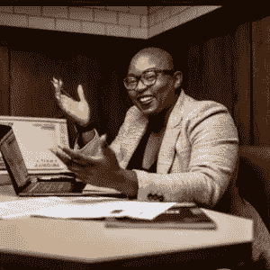*****

*****[@**FeleciaHatcher**](https://twitter.com/FeleciaHatcher)*****

*******推特简历:**企业家|作者|妈妈|白宫 2014 年变革冠军}联合创始人[@ CodeFeverMiami](https://twitter.com/CodeFeverMiami)&[@ blacktechweek](https://twitter.com/blacktechweek)&退休首席棒冰 [@FeverishMiami](https://twitter.com/FeverishMiami) |*****

# *****G.*****

# *****根马·斯特林格·霍姆斯*****

**********

*****[@bugact](https://twitter.com/bugsact)*****

*******Twitter 简历**一位备受认可、屡获殊荣的企业家、媒体影响者和主编。霍尔姆斯害虫控制公司的老板，*过你最好的生活*电台的执行制片人，GSH 媒体的主编。访问 www.genmaholmes.com*****

# *****礼物 Egwuenu*****

**********

*****[@ **lauragift21**](https://twitter.com/lauragift21)*****

*****推特传记:使网络无障碍和摄影。协办单位 [@ **ConcatenateConf**](https://twitter.com/ConcatenateConf) ，章节领导 [@ **vuevixensNG**](https://twitter.com/vuevixensNG)*****

# *****格洛丽亚·金瓦拉*****

**********

*****[@**gkimbwala**](https://twitter.com/gkimbwala)*****

*******Twitter 简历:**开发者，演讲者，妈妈。 [# **codecamp**](https://twitter.com/hashtag/codecamp?src=hash) 和[#**women eng**](https://twitter.com/hashtag/womeng?src=hash)at[@**Square**](https://twitter.com/Square)[#**women intech**](https://twitter.com/hashtag/womenintech?src=hash)[#**diversity intech**](https://twitter.com/hashtag/diversityintech?src=hash)[#**wocinTech**](https://twitter.com/hashtag/wocinTech?src=hash)[#**少数民族**](https://twitter.com/hashtag/minorities?src=hash)*****

# *****H.*****

# *****哈迪耶·穆杰德*****

*****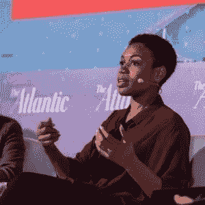*****

*****[@**hadiyahdotme**](https://twitter.com/hadiyahdotme)*****

*******推特简历:**软件工程师+创业发烧友。共同创办[@**black founders**](https://twitter.com/blackfounders)，[@**hbcutostartup**](https://twitter.com/hbcutostartup)，sw 机构 Playpen Labs([http://playpenlabs.com](https://t.co/HTJD2wUPBX))。UMES 明矾*****

# *****希瑟·费森*****

**********

*****[**@ heather faison**](https://twitter.com/HeatherFaison)*****

*******推特生物:**女生主张用科技加速改变。 [@HowardU](https://twitter.com/HowardU) grad。海拉·盖伊。DC 奥克兰路 **U*******

# *****爱达荷（Idaho 的缩写）*****

# *****伊达林博贝*****

*****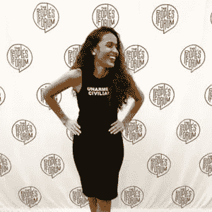*****

*****[@**IdalinBobe**](https://twitter.com/IdalinBobe)*****

*******推特简历:**创始人[http://TechActivist.Org](https://t.co/J2sVx0rinN)[# PoorPeoplesCampaign](https://twitter.com/hashtag/PoorPeoplesCampaign?src=hash)[@ Tech _ Intersect](https://twitter.com/Tech_Intersect)组织者 [#WOC](https://twitter.com/hashtag/WOC?src=hash) 前[# black girls code](https://twitter.com/hashtag/BlackGirlsCODE?src=hash)[# ThoughtWorks](https://twitter.com/hashtag/ThoughtWorks?src=hash)*****

# *****伊杰马·恩瓦图*****

*****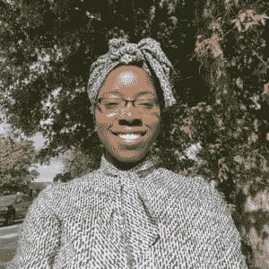*****

*****[@**ijoemasnwatu**](https://twitter.com/ijeomasnwatu)*****

*******推特简历:社交&战略顾问。当前:** [@recnparks](https://twitter.com/recnparks) 上一张:[@ colorcomntwk](https://twitter.com/colorcommntwk)[@ sbagov](https://twitter.com/sbagov)[@ hzdg](https://twitter.com/hzdg)[@ city year Philly](https://twitter.com/cityyearphilly)[@ startup instnyc](https://twitter.com/StartupInstNYC)。马太福音 5:5。*****

# *****伊莎·沃森*****

**********

*****[@Isadwatson](http://twitter.com/Isadwatson)*****

*******推特简历**:创始人、CEO[@**with your squard**](https://twitter.com/withyoursquad)。 [@ **Inc**](https://twitter.com/Inc) 30 岁以下 30。前有机化学家 [@ **辉瑞**](https://twitter.com/pfizer) 。也 ex [@ **摩根大通**](https://twitter.com/JPMorgan) 。麻省理工，康奈尔和胡毕业。钢琴家。经典的 INTJ。*****

# *****J.*****

# *****杰德·巴雷特*****

**********

*****@jaidbarrett*****

*******Twitter 简历:**信息安全专家|网络安全、数据隐私、信息安全&技术爱好者|南佛罗里达大学校友| STEM |电子商务|牙买加|观点是我自己的*****

# *****贾莉萨·特拉普*****

**********

*****[@ **贾莉萨**](https://twitter.com/JaleesaT)*****

*******推特简历:**革命教育家 UW 明矾( [@hcdeuw](https://twitter.com/hcdeuw) )目前是麻省理工学院的研究生 [@medialab](https://twitter.com/medialab)*****

# *****杰米·布罗德纳克斯*****

**********

*****[@**JamieBroadnax**](https://twitter.com/JamieBroadnax)*****

*******推特简介:**博主。书呆子。亿万富翁。开玩笑的。创始人兼自由编辑 [@blackgirlnerds](https://twitter.com/blackgirlnerds) 自由撰稿人。 [@criticschoice](https://twitter.com/criticschoice) 和 [#BFCC](https://twitter.com/hashtag/BFCC?src=hash) 成员*****

**********

*****[@JaffaCakeStudio](https://twitter.com/JaffacakeStudio)*****

*******推特简历** : Aspiringio:前端开发者+妈妈+游戏玩家+徒步旅行者+音乐人=一个全面发展且经常古怪的女人！*****

# *****珍妮特·伊克帕*****

**********

*****[@ **jikpapa**](https://twitter.com/jikpapa)*****

*******推特简历:**多元化、公平负责人&包容 [@Hired_HQ](https://twitter.com/Hired_HQ) |加入我们[http://hrd.cm/2mwDu61](https://t.co/sqI5rvVHgw)|往期[@推特](https://twitter.com/Twitter)[@谷歌](https://twitter.com/Google)[@ UofCalifornia](https://twitter.com/UofCalifornia)|[@ ucsantabara](https://twitter.com/UCSantaBarbara)[@ iublomington](https://twitter.com/IUBloomington)明矾*****

# *****贾斯敏·安德森*****

**********

*****[@techtravelcode](https://twitter.com/techtravelcode/)*****

*******Twitter 简历:** | Shopify 合伙人+首席技术官|购买我下面的“用 Shopify 学习液体”电子书|观点是我自己的|商务查询:jasmine@livehomebase.co*****

# *****杰伊·杰伊·加特*****

**********

*****[@ jene baseaks](http://twitter.com/jenebaspeaks)*****

*****【推特简历:[# Blerd](https://twitter.com/hashtag/Blerd?src=hash)| http://Jenebaspeaks.com[的 EIC](https://t.co/SdYGYB5I6g)；[@ TechyayaBlog](https://twitter.com/TechyayaBlog)[@ jj braids](https://twitter.com/JJBraids)；[# parenting pro](https://twitter.com/hashtag/ParentingPro?src=hash)[@ belly itch](https://twitter.com/Bellyitch)；制单人:[# 200 bw tech](https://twitter.com/hashtag/200BWTech?src=hash)； [@HackerNoon](https://twitter.com/HackerNoon) 投稿人:RadioShowHost [@DCRadio](https://twitter.com/DCRadio)*****

# *****詹娜·沃瑟姆*****

*****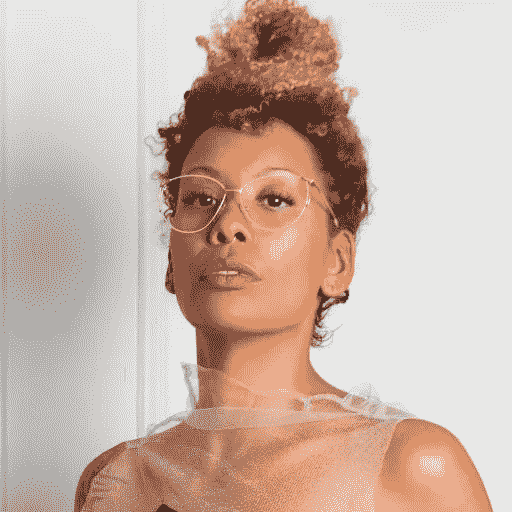*****

*****[@ **jennydeluxe**](https://twitter.com/jennydeluxe)*****

*****推特简历:黑比尔盖茨正在形成。特约撰稿人 [@NYTMag](https://twitter.com/NYTMag) &合作主持人还在处理中。与金伯利·德鲁合著《黑色未来》，2019 年⦇|| ⬘ ||⦈，同一个世界*****

# *****杰西卡·奥·马修斯*****

**********

*****[@ **杰索马特**](https://twitter.com/jessomatt)*****

*******推特简历:**发明家/企业家/社会科学家。Fndr & CEO，未知力量。相信一切真实的、颠覆性的和赋权的事物。*****

# *****杰西卡·威廉姆斯*****

**********

*****[**@techbizgirl**](https://twitter.com/techbizgurl)*****

*******推特简历:**作家。扬声器。career coach[@**GA _ Chicago**](https://twitter.com/GA_Chicago)。 [# **sidehustler**](https://twitter.com/hashtag/sidehustler?src=hash) 。[#**jespicks**](https://twitter.com/hashtag/jesspicks?src=hash)策展人。[http://bit.ly/jesspicks](https://t.co/32MOxe4tjW)*****

# *****朱厄尔·伯克·所罗门*****

**********

*****[@ **犹太人**](https://twitter.com/jewelmelanie)*****

*******推特简历:**被格蕾丝拯救目前[@亚马逊](https://twitter.com/Amazon)[创始人@Partpic](https://twitter.com/Partpic) 董事会成员[@ goodienation](https://twitter.com/goodienation)[@ harvarddcdp](https://twitter.com/harvarddcdp)[@ howardu](https://twitter.com/howardu)校友前 EIR [@google](https://twitter.com/google) 观点为本人观点*****

# *****朱厄尔·斯科特*****

**********

*****[@朱厄尔斯科特](https://twitter.com/jewelljscott)*****

*****推特简历:网络开发者。从业者。电子书阅读器。问问题，学东西。我看黑豹演首里。*****

# *****约塔卡·埃迪*****

**********

*****[@**jotakeaddy**](https://twitter.com/JotakaEaddy)*****

*******推特简历:**连接 DC &硅谷。政务负责人 [@ **LendUpCredit**](https://twitter.com/LendUpCredit) ，董事会[@**nateparkerdn**](https://twitter.com/NateParkerFdn)，Fmr 高级顾问[@**NAACP**](https://twitter.com/NAACP)♡[#**diversity intech**](https://twitter.com/hashtag/DiversityinTech?src=hash)[#**政治**](https://twitter.com/hashtag/politics?src=hash)**fin tech**—我的推文*****

# *****乔伊塞林·詹姆斯*****

**********

*****[@**jfjamesesq**](https://twitter.com/jfjamesesq)*****

*******推特简介:**倡导多元化&包容一切媒体、科技& STEM 相关的事物。RT 不背书。自豪的霍华德·拜森在包容性创新之都。*****

# *****朱莉安娜·罗蒂奇*****

*****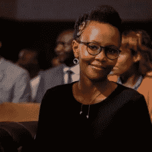*****

*****[@**afrom 使用**](https://twitter.com/afromusing)*****

*******推特生物:**制造、修复、帮助他人。WEF 年轻的全球领导者，联合创始人之一，[@ BRCKnet](https://twitter.com/BRCKnet)[@ Ushahidi](https://twitter.com/Ushahidi)+我是几个董事会的成员。这里表达的观点是我的*****

# *****朱莫克达达*****

**********

*****[@**jumokedada**](https://twitter.com/jumokedada)*****

*****推特简历:技术专家。战略家。慈善家。作家[@ signatured](https://twitter.com/SignatureRED)|[@ TechWomenWork](https://twitter.com/TechWomenWork)|[@ HUETechSummit](https://twitter.com/HUETechSummit)|[@福布斯女性](https://twitter.com/ForbesWomen)*****

# *****K.*****

# *****卡拉马·霍恩*****

**********

*****[@**thebledgurl**](https://twitter.com/theblerdgurl)*****

*******推特简历:** [@SYFYWire](https://twitter.com/SYFYWire) 特约编辑|播客|作家|顾问 [@tiylandcreative](https://twitter.com/tiylandcreative) 联合主持人[@ theradical geeks](https://twitter.com/theradicalgeeks)[# blerd](https://twitter.com/hashtag/blerd?src=hash)[# geek](https://twitter.com/hashtag/geek?src=hash)[# nerd](https://twitter.com/hashtag/nerd?src=hash)[# magical black girl](https://twitter.com/hashtag/magicalblackgirl?src=hash)*****

# *****卡米拉·泰勒*****

*****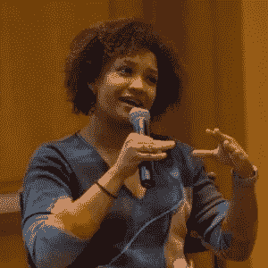*****

*****[@ **卡米拉**](https://twitter.com/kamilah)*****

*******推特简历:**新东西[@ theswaayapp](https://twitter.com/theswaayapp)@ Prev iOS[@ LinkedIn](https://twitter.com/LinkedIn)、机器人[@ wolfram research](https://twitter.com/WolframResearch)[@ IllinoisCS](https://twitter.com/IllinoisCS)@ TechBeachRtrt《哈利波特+星际迷航》 [#WomenInTechBook](https://twitter.com/hashtag/WomenInTechBook?src=hash)*****

# *****凯特·卡尔文*****

**********

*****[@ **KatCalvinLA**](https://twitter.com/KatCalvinLA)*****

*******推特简历:**创始人 [@SpreadTheVoteUS](https://twitter.com/SpreadTheVoteUS) 和 [@ProjectIDUS](https://twitter.com/ProjectIDUS) 。 [@fastcompany](https://twitter.com/fastcompany) 商业中最有创造力的 100 人。Insta 和 Medium [@katcalvinla](https://twitter.com/katcalvinla) 。勇敢是会传染的。德拉克马。*****

# *****凯瑟琳·芬尼*****

**********

*****[@ **凯瑟琳·芬尼**](https://twitter.com/KathrynFinney)*****

*******Twitter 简历:**创始人 [@ **SpreadTheVoteUS**](https://twitter.com/SpreadTheVoteUS) 和 [@ **ProjectIDUS**](https://twitter.com/ProjectIDUS) 。 [@ **fastcompany**](https://twitter.com/fastcompany) 商界 100 位最具创造力的人。Insta 和 Medium[@**katcalvinla**](https://twitter.com/katcalvinla)。勇敢是会传染的。德拉克马。*****

# *****卡亚·托马斯*****

**********

*****[@ kthomas 901](https://twitter.com/kthomas901)*****

*******推特简历:** iOS 开发者 [@slackhq](https://twitter.com/slackhq) 。创建了 PoC 写的 [@wereadtooapp](https://twitter.com/wereadtooapp) 、移动目录[# kid lit](https://twitter.com/hashtag/kidlit?src=hash)[# YAlit](https://twitter.com/hashtag/YAlit?src=hash)。[@达特茅斯](https://twitter.com/dartmouth)校友。*****

# *****凯尔斯滕·布拉格*****

**********

*****@ [KeirstenBrager](https://twitter.com/KeirstenBrager)*****

*****Twitter 简历:**关键基础设施领域的首席安全工程师。扬声器。作者:Secure The InfoSec Bag:六位数**女性职业指南*****

# *****凯利·詹姆斯*****

**********

*****[@ **Ksemaj**](https://twitter.com/Ksemaj)*****

*******推特简介:**市场。数据。有机&非转基因农业。还有什么？*****

# *****凯利·梅西*****

**********

*****[@**jazz chica**](https://twitter.com/jazzchica)*****

*******Twitter 简历:**开发者，酷儿，poly，极客，书呆子，blerd，创意，研究犹太教。kkψ终身会员。[@ ITP _ 纽约大学](https://twitter.com/itp_nyu) '19*****

# *****凯利·坎伯利*****

**********

*****[@**miss Kelley ohh**](https://twitter.com/MissKelleyOhh)*****

*******推特简历:** Nulli Secunda。 [@paigeandpaxton](https://twitter.com/paigeandpaxton) 的 CEO、[@ blue studio _ io](https://twitter.com/BlueStudios_io)[# STEM](https://twitter.com/hashtag/STEM?src=hash)[# Education](https://twitter.com/hashtag/Education?src=hash)、 [#vegan](https://twitter.com/hashtag/vegan?src=hash) 厨师、营销人员、 [@EmileCambry](https://twitter.com/EmileCambry) 的妻子。我的故事:[https://youtu.be/hn2k5FjQZkU](https://t.co/y7xiTzspso)。*****

# *****凯利·尼科尔*****

*****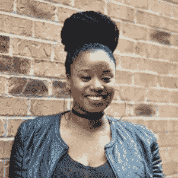*****

*****[@kellinikole](https://twitter.com/kellinikole)*****

*****我说话的时候你能看到我眼中的火。|联合创始人[@**fromnapwithlove**](https://twitter.com/fromnapwithlove)| CEO/创始人[@**Be _ NimbleCo**](https://twitter.com/Be_NimbleCo)|为文化[@**give lif**](https://twitter.com/Givelify)**y*******

# *****肯尼亚·奥尔蒙德*****

**********

*****[@ **肯尼亚**](https://twitter.com/kenya)*****

*******推特简历:**小玩意女孩，科技驯服者，艺术爱好者， [#STEM](https://twitter.com/hashtag/STEM?src=hash) 支持者，肆意漫游者，活泼志愿者，照片标榜者，灯塔爱好者， [@udcnasalumni](https://twitter.com/udcnasalumni) [，@gwalumni](https://twitter.com/gwalumni)*****

# *****凯莎·威廉姆斯*****

**********

*****[@KeshaWillz](https://twitter.com/KeshaWillz)*****

*******Twitter 简历:**软件工程经理| TED 演讲人| Alexa Champion |作者| [# **AdaAwards17**](https://twitter.com/hashtag/AdaAwards17?src=hash) 获奖者|创始人[@**colorsofsystem**](https://twitter.com/ColorsOfSTEM)|创造者[@**iamsam _ tech**](https://twitter.com/iamsam_tech)|[@**InfoQ**](https://twitter.com/InfoQ)编辑*****

# *****卡利亚·布拉斯韦尔*****

**********

*****[@**KhaliaBraswell**](https://twitter.com/KhaliaBraswell)*****

*******推特简历:**创始人/执行董事[@ INTechCamp](https://twitter.com/INTechCamp)[明矾@ CSCNCSU](https://twitter.com/CSCNCSU)&[@ UNCC](https://twitter.com/UNCC)&苹果公司[# DST](https://twitter.com/hashtag/DST?src=hash)[# NSBE](https://twitter.com/hashtag/NSBE?src=hash)[# NCWIT](https://twitter.com/hashtag/NCWIT?src=hash)*****

# *****起亚·特纳博士。D*****

*****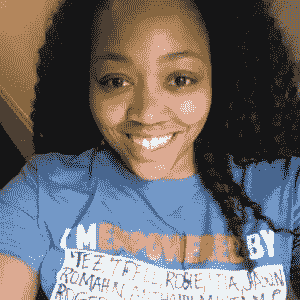*****

*****[@firedup_Teacher](https://twitter.com/firedup_teacher)*****

*****全职教授。永远的老师。作者。提倡。扬声器。主持人[@**fire dup _ Podcast**](https://twitter.com/firedup_podcast)在 Spotify 和 iTunes 上订阅被点燃的老师的播客！*****

# *****琪琪·奥尼文德*****

**********

*******@KiKiOniwinde*******

*******推特简历:**神|创始人[@**bypnetworkap**](https://twitter.com/bypnetworkapp)—连接全球黑人人才| [@ **SkyUK**](https://twitter.com/SkyUK) 学者|[@**Google**](https://twitter.com/Google)[#**poctech**](https://twitter.com/hashtag/poctech?src=hash)大使|[#**TeamGB**](https://twitter.com/hashtag/TeamGB?src=hash)#**floridagodaters**运动员*****

# *****金伯利·布赖恩特*****

**********

*****[@**6 宝石**](https://twitter.com/6Gems)*****

*******推特简历:创始人**[**@ BlackGirlsCode**](https://twitter.com/BlackGirlsCode)**~白宫变革冠军~史密森美国匠心奖**[**# makeyurmark**](https://twitter.com/hashtag/MakeYourMark?src=hash)**[**http://bit.ly/2KhwdzM**](https://t.co/dYZzSfrmcb)*******

# *****金·克雷顿*****

**********

*****[@KimCrayton1](https://twitter.com/KimCrayton1/media)*****

*******Twitter Bio:**[#**causeascene**](https://twitter.com/hashtag/causeascene?src=hash)n 个科技组织社群现状的战略颠覆&events |[@**causeascenePod**](https://twitter.com/causeascenePod)|[@**causeasceneConf**](https://twitter.com/causeasceneConf)|[@**causeasceneAll**](https://twitter.com/causeasceneAll)她/她*****

# *****基沙·理查森*****

**********

*****[@ **基沙尔森**](https://twitter.com/kisharichardson)*****

*******推特简历:**工程师|教育家|企业家*****

# *****卡玲·里德*****

**********

*****[@ **korinreid**](https://twitter.com/korinreid)*****

*******推特简历:**数据科学家，[@福布斯](https://twitter.com/forbes)2017 年 30 岁以下， [@GeorgiaTech](https://twitter.com/GeorgiaTech) 博士，作家 [@forthdistrict](https://twitter.com/forthdistrict) ，信徒*****

# *****克里斯汀·史密斯*****

**********

*****[**@ the blacktechie**](https://twitter.com/theblacktechie)*****

*******Twitter 个人简介:**转向我的 [#tech](https://twitter.com/hashtag/tech?src=hash) 旅程的下一章。&我讲，教，体育。来自 [#Bmore2ATL](https://twitter.com/hashtag/Bmore2ATL?src=hash) 。我只是想让我妈妈骄傲！*****

# *****克里斯蒂·蒂尔曼*****

*****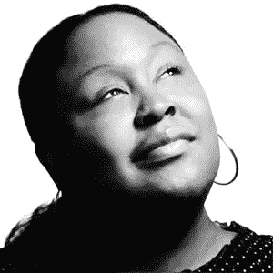*****

*****[@ **KristyT**](https://twitter.com/KristyT)*****

*******推特简历:**全球职场设计总监[@ slachq](https://twitter.com/SlackHQ)/前任 [@IDEO](https://twitter.com/IDEO) /协助创建[@ human utility](https://twitter.com/humanutility)/alumina[@ FAMU _ 1887](https://twitter.com/FAMU_1887)*****

# *****基拉·斯蒂芬*****

*****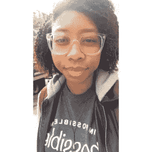*****

*****[@KyStephen](https://twitter.com/kystephenn)*****

*****推特简历:22。多伦多。prev[@**chapters indigo**](https://twitter.com/chaptersindigo)开发者 [@ **Uoft**](https://twitter.com/Uoft) 计算机科学学生。 [@ **nsbeuoft**](https://twitter.com/nsbeuoft) 总裁。[@**techsparkcanada**](https://twitter.com/techsparkcanada)教育家。*****

# *****劳拉·魏德曼·鲍尔斯*****

**********

*****[@**laurawp**](https://twitter.com/laurawp)*****

*******推特简介:**我的业余爱好:旅游。我的兼职:EIR[@新媒体风险投资](https://twitter.com/newmediaventure)。fmr[@ code 2040](https://twitter.com/Code2040)[@ who STP 44](https://twitter.com/WHOSTP44)[@ NewAmericaCA](https://twitter.com/NewAmericaCA)[@ echoing green](https://twitter.com/EchoingGreen)[@斯坦福](https://twitter.com/Stanford)[@哈佛](https://twitter.com/Harvard)。*****

# *****劳伦·戴斯*****

**********

*****[@unikornInTech](https://twitter.com/unikornintech)*****

*******Twitter 简历:**世界旅行者|多代独角兽|全栈开发者待定| [#TCC](https://twitter.com/hashtag/TCC?src=hash)*****

# *****林赛·霍姆斯*****

*****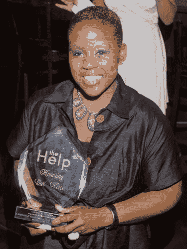*****

*****[@**lindseycholmes**](https://twitter.com/lindseycholmes)*****

*******推特简历:**[#未来学家](https://twitter.com/hashtag/Futurist?src=hash)，[#可用性](https://twitter.com/hashtag/Usability?src=hash)[# Mktg](https://twitter.com/hashtag/Mktg?src=hash)[#技术](https://twitter.com/hashtag/Tech?src=hash)&[#生产力](https://twitter.com/hashtag/Productivity?src=hash)，[#加密货币](https://twitter.com/hashtag/CryptoCurrency?src=hash)投资人/专家 [#Evernote](https://twitter.com/hashtag/Evernote?src=hash) 认证顾问，[#品牌影响力](https://twitter.com/hashtag/BrandInfluencer?src=hash)，[#δσθ](https://twitter.com/hashtag/%CE%94%CE%A3%CE%98?src=hash)*****

# *****丽莎·梅·布伦森*****

**********

*****[@**MissLisaMae**](https://twitter.com/MissLisaMae)*****

*******推特简历:**创始人[@ wonderwomentech](https://twitter.com/wonderwomentech)[#多样性](https://twitter.com/hashtag/diversity?src=hash)[#包容性](https://twitter.com/hashtag/inclusion?src=hash)2016 年 40 岁以下 40 岁以下社会创新者神奇女侠 Hacks Hacks 4 Humanity 演讲者作者专员*****

# *****丽莎·里德*****

**********

*****[@**digital nista**](https://twitter.com/Digitalnista)*****

*******推特简介:**我为 [@innov8tivmag](https://twitter.com/innov8tivmag) 写博客。[#创始人](https://twitter.com/hashtag/Founder?src=hash)[@ Tech color](https://twitter.com/Techncolor)我热衷于[#社交](https://twitter.com/hashtag/Social?src=hash)、[#数码](https://twitter.com/hashtag/Digital?src=hash)和一切[#科技](https://twitter.com/hashtag/Tech?src=hash)女性[# Wordpress](https://twitter.com/hashtag/Wordpress?src=hash)NYC[# meetup](https://twitter.com/hashtag/meetup?src=hash)的联合组织者*****

# *****丽莎·理查森博士*****

**********

*****[@ DrLisaWP](https://twitter.com/DrLisaWP)*****

*****推特简历:我搭建平台，帮助人们一起学习、成长和玩耍。妈妈。吃货。漫画+动漫宅男。*****

# *****洛拉·奥德罗拉*****

*****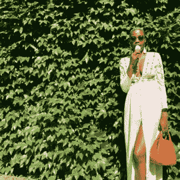*****

*****[@**lolaodelola**](https://twitter.com/lolaodelola)*****

*******推特简历:** [@blackgirltech](https://twitter.com/blackgirltech) 的妈妈，出版过的诗人、编码员、流浪者、奇妙者&反芝士蛋糕活动家。我不是我的头发，也不是我的雇主*****

# *****幸运的丹尼尔斯*****

**********

*****[@**luckieshappy**](https://twitter.com/LuckieIsHappy)*****

*******推特简历:**社交媒体语言学家。博主。高音喇叭。艺术家。设计师。极客。战略家。PM 移动摇滚明星。技术女孩。提倡。妈妈~一个快乐的幸运女孩！:-)*****

# *****卢维·阿贾伊*****

*****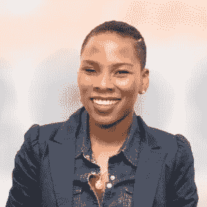*****

*****[@ **iLuvvit**](https://twitter.com/iLuvvit)*****

*****《纽约时报》畅销书《我在评判你》的作者。[http://ImJudgingYouBook.com](https://t.co/LNbfKthfMm)。扬声器。品牌战略家。主持人: [@RantsRandomness](https://twitter.com/RantsRandomness) 播客。*****

# *****林恩·约翰逊*****

*****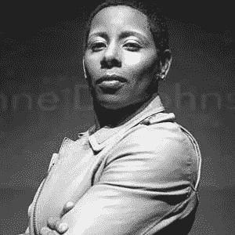*****

*****[@ **lynneluvah**](https://twitter.com/lynneluvah)*****

*******推特简历:**资深编辑 [@admonsters](https://twitter.com/admonsters) 。顾问[@ gokliq](https://twitter.com/gokliq)@ bluurpinc。附属品 [@SUNYEmpireLabor](https://twitter.com/SUNYEmpireLabor) 。原[@ wagged hk](https://twitter.com/WaggedHK)[@ RGA](https://twitter.com/RGA)[@ the _ ARF](https://twitter.com/the_ARF)[@ fast company](https://twitter.com/FastCompany)。推文=我自己的。*****

# *****米（meter 的缩写））*****

# *****马西·彼得森*****

**********

*****[@**MaciPeterson**](https://twitter.com/MaciPeterson)*****

*******推特简历:**耶稣是我的#1。因为他，我可以。联合创始人&CEO[@ on second think](https://twitter.com/onsecondthought)； [@Inc](https://twitter.com/Inc) 30 岁以下， [@BBC100Women](https://twitter.com/BBC100Women) ， [@WBJOnline](https://twitter.com/WBJOnline) 40 岁以下， [@EY](https://twitter.com/EY) 加速创业者*****

# *****梅姆·达米*****

**********

*****[@MameSays](https://twitter.com/MameSays)*****

*****“推特简历:网络开发者+时尚+科技博客的创始人——Mame 说*****

# *****曼迪·鲍曼*****

**********

*****[@OBWSapp](https://twitter.com/OBWSapp)*****

*******推特简介:**T4 最大的黑人企业名录。下载 OBWSapp！info @ official blackwallstreet.com*****

# *****莫里塔·科利*****

**********

*****[@ **毛里卡利**](https://twitter.com/MauritaColey)*****

*****社会影响执行官在媒体、电信、技术和多元文化机遇的交汇处工作。前法律合伙人和媒体行业高管。*****

# *****玛西娅·韦德·塔尔伯特*****

**********

*****[@ **脑回**](https://twitter.com/TheTechGyrl)*****

*****Twitter 个人简介:有机社交导语 [@ **CDWcorp**](https://twitter.com/CDWcorp) |内容 Mkt 爱好者|前资深编辑 [@ **EdTech_K12**](https://twitter.com/EdTech_K12) 和记者|推文为本人所有。还跟着山鬼 [@ **newsgyrl**](https://twitter.com/newsgyrl)*****

# *****玛丽亚·d·史密斯*****

**********

*****[@ **codegirl3**](https://twitter.com/codegirl3)*****

*******推特简历:**极客，Stem-Nastics，LLC / Gigabyte 杂志联合创始人，计算机科学，编程网站开发者技术布道者，母亲&妻子[http://blackwomentech.com/](https://t.co/Dfqs2JliLq)*****

# *****玛丽亚·利希滕斯特恩*****

*****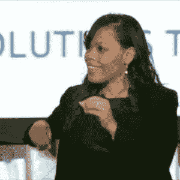*****

*****[@ **lightedstar**](https://twitter.com/lightedstar)*****

*******推特简历:**创始人[@ diverse cityv](https://twitter.com/DiverseCityV)&[@ cine shares](https://twitter.com/CINESHARES)|[@ Founding](https://twitter.com/Founding)SV Grad&SacTown 董事总经理||[@ UCLAVentures](https://twitter.com/UCLAVentures)|[@ USC](https://twitter.com/USC)黑手党| [@Cal](https://twitter.com/Cal) 熊|[#影响](https://twitter.com/hashtag/Impact?src=hash) | [#INFJ](https://twitter.com/hashtag/INFJ?src=hash)*****

# *****马里梅·贾梅*****

*****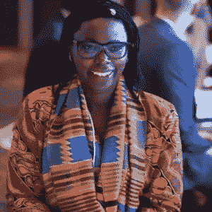*****

*****[@ **mjamme**](https://twitter.com/mjamme)*****

*******推特简历:**全球主题演讲人|守门员[@ UNICEF](https://twitter.com/UNICEF)[@ gates foundation](https://twitter.com/gatesfoundation)|创始人[@ I _ am the code](https://twitter.com/i_amtheCODE)[@ spot 1 Global](https://twitter.com/spot1global)[@ africagathering](https://twitter.com/africagathering)[@ jgigenetech](https://twitter.com/Jjiguenetech)|[@ yglvoices](https://twitter.com/yglvoices)[@ idea _ award](https://twitter.com/idea_award)*****

# *****Marjy Guery*****

*****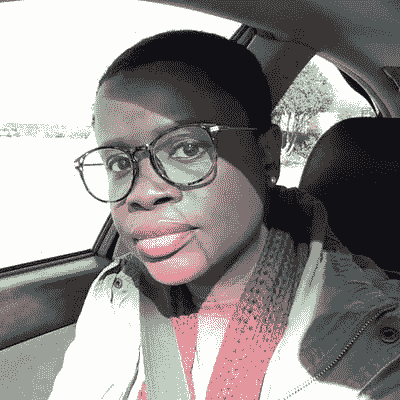*****

*****[@**ms guery**](https://twitter.com/msguery)*****

*******Twitter 个人简介:** Admin + WordPress 对 SBOs 的支持[# women intech](https://twitter.com/hashtag/WomeninTech?src=hash)[# black twitterintech](https://twitter.com/hashtag/BlackTwitterinTech?src=hash)—自学 JS+react JS Future Pentester She/Her/Sis All[# BlackLivesMatter](https://twitter.com/hashtag/BlackLivesMatter?src=hash)*****

# *****马尔洛·桑德·伦彻*****

**********

*****[@**marlorencher**](https://twitter.com/marlorencher)*****

*******推特简介:妈妈。老婆。企业家。人类学家。致力于多样化的技术创业。*******

# *****玛丽·亨雷*****

**********

*****[@ **玛丽 _ 亨瑞**](https://twitter.com/Mary_Henrye)*****

*****推特简介:让每一天都成为更好的自己。 [# **数字战略家**](https://twitter.com/hashtag/DigitalStrategist?src=hash) [# **网络安全**](https://twitter.com/hashtag/cybersecurity?src=hash)[#**YumishGM**](https://twitter.com/hashtag/YumishGM?src=hash)*****

# *****玛丽·普赖尔*****

**********

*****[@ **msmarypryor**](https://twitter.com/msmarypryor)*****

*******推特简历:**社交/大麻营销人员/健身爱好者/灵气从业者/作家(我的观点是我自己的)底特律土生土长。*****

# *****梅根·罗斯·迪基*****

*****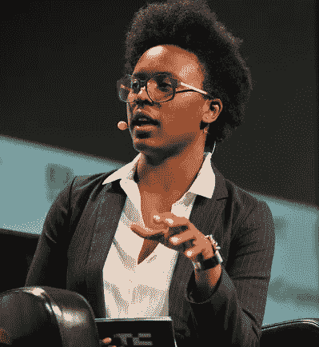*****

*****[@**meganrosedickey**](https://twitter.com/meganrosedickey)*****

*******推特简历:**资深记者[@ TechCrunch](https://twitter.com/TechCrunch)TC Mixtape[https://itunes.apple.com/us/podcast/ctrl-t/id1317432118?联合主持人代词:她/她/她的](https://t.co/mGektUjDWs)*****

# *****梅勒妮·阿劳霍*****

**********

*****[@ **melarauj0**](https://twitter.com/melarauj0)*****

*******Twitter 简历:**产品设计师 [@facebook](https://twitter.com/facebook) 。设计导师 [@a16z](https://twitter.com/a16z) 。创始人 [@joinfrontcenter](https://twitter.com/joinfrontcenter) 。*****

# *****梅丽莎·布拉德利*****

**********

*****[@ **bradleyml**](https://twitter.com/bradleyml)*****

*******推特简历:**社会影响力狂热分子、联合创始人 [@sidecarfinance](https://twitter.com/sidecarfinance) 、教授 [@msbgu](https://twitter.com/msbgu) 、合伙人[@ 1863 ventures](https://twitter.com/1863ventures)&[@ venture wdc](https://twitter.com/venturewdc)、创始人 [@newcapitalist](https://twitter.com/newcapitalist) 、连续创业者、母亲*****

# *****奔驰本特*****

**********

*****[@ **默沙东**](https://twitter.com/mercebent)*****

*******推特简历:** [@StanfordGSB](https://twitter.com/StanfordGSB) MBA 学生。前身是 summer VC [@OwlVC](https://twitter.com/OwlVC) 和[@ upload VR](https://twitter.com/UploadVR)[@ GA](https://twitter.com/GA)[@ Goldman Sachs](https://twitter.com/GoldmanSachs)[@哈佛](https://twitter.com/Harvard)[# always curious](https://twitter.com/hashtag/Alwayscurious?src=hash)[# JeepGirl](https://twitter.com/hashtag/JeepGirl?src=hash)[# Blerd](https://twitter.com/hashtag/Blerd?src=hash)*****

# *****米歇尔·亨利*****

**********

*****[@ **米歇尔 _ 亨利**](https://twitter.com/michele_henry)*****

*******推特简历:** [@Workday](https://twitter.com/Workday) HCM &财经| |[# migratory notes](https://twitter.com/hashtag/MigratoryNotes?src=hash)| |[@ va tech](https://twitter.com/VAtech)和 [@USC](https://twitter.com/USC) MBA 校友| |[# women itech](https://twitter.com/hashtag/WomeninTech?src=hash)*****

# *****米歇尔·科隆*****

**********

*****[@MichelleWebDev](https://twitter.com/MichelleWebDev)*****

*******Twitter 简历:** Web Dev 过渡到产品管理|志愿者[@**gdiphilly**](https://twitter.com/gdiphilly)| STEMinist |有时写手|朋友引用者|[#**100 daysofcode**](https://twitter.com/hashtag/100DaysOfCode?src=hash)|[#**react js**](https://twitter.com/hashtag/ReactJS?src=hash)|[#**产品管理**](https://twitter.com/hashtag/ProductManagement?src=hash)*****

# *****米桑·伊韦雷*****

**********

*****[@Misan_iwere](https://twitter.com/misan_iwere)*****

*******推特简历:**[@**UofT**](https://twitter.com/UofT)CS 学生| Web 开发者[@**UofT hatchery**](https://twitter.com/UofTHatchery)|副总裁 [@ **nsbeuoft**](https://twitter.com/nsbeuoft) |编码教育家[@**techsparkcanada**](https://twitter.com/techsparkcanada)|即将上任的软件工程师 [@ **SR_**](https://twitter.com/SR_)*****

# *****莫尼克·伍德沃德*****

**********

*****[@ **莫尼克伍德**](https://twitter.com/MoniqueWoodard)*****

*******Twitter 简历:** VC —在实验室//创始人 [@blackfounders](https://twitter.com/blackfounders) 前任: [@500Startups](https://twitter.com/500Startups) 。投资人[@ Blavity](https://twitter.com/Blavity)[@ oschollive](https://twitter.com/OSchoolLive)[@ mented cosmetics](https://twitter.com/MentedCosmetics)[@ court buddy](https://twitter.com/CourtBuddy)*****

# *****摩根·德邦*****

**********

*****[@ **摩根德邦**](https://twitter.com/MorganDeBaun)*****

*******推特简历:CEO +创始人**[**@ Blavityinc**](https://twitter.com/Blavityinc)**。**[@ afrotech](https://twitter.com/afrotech)[@ shadowandact](https://twitter.com/shadowandact)[@ 21 inety](https://twitter.com/21ninety)[@ blavity](https://twitter.com/blavity)和[@ travel noire](https://twitter.com/travelnoire)[# hustles mart](https://twitter.com/hashtag/hustlesmart?src=hash)—在这里给我们发邮件:team@blavity.com*****

# *****名词（noun 的缩写）*****

# *****南希·杜永*****

**********

*****[@NancyDoyon](https://twitter.com/NancyDouyon)*****

*******Twitter 简历:**用户体验主管、全球创新者、演讲者*****

# *****内蒂亚·麦克雷*****

**********

*****[@**netiamccray**](https://twitter.com/netiamccray)*****

*******推特简历:**[@ MBA dika](https://twitter.com/Mbadika)创始人兼执行董事。麻省理工毕业生。全球公民。美国黑人。企业家。做不可能的事的梦想家和实干家*****

# *****尼谢尔·麦考尔*****

**********

*****[@ **米歇尔 _ 麦考尔**](https://twitter.com/Nichelle_McCall)*****

*******推特简历:** [# **初创公司**](https://twitter.com/hashtag/Startup?src=hash) 战略家、[#**CEO**](https://twitter.com/hashtag/CEO?src=hash)[@**bold 指导**](https://twitter.com/BOLDGuidance) 、 [# **技术**](https://twitter.com/hashtag/Tech?src=hash) [# **企业家**](https://twitter.com/hashtag/Entrepreneur?src=hash) 、 [# **演讲人**](https://twitter.com/hashtag/Speaker?src=hash) 、连续创业者、冰淇淋、薯条的爱好者以及我的教宝宝们【T26*****

# *****尼科尔·特纳-李博士*****

**********

*****[@ **drturnerlee**](https://twitter.com/drturnerlee)*****

*******Twitter 简历:**研究员、作者、技术爱好者、政策专家、社会科学家、社会企业家、创新者和变革推动者*****

# *****妮可·汀森*****

**********

*****[@ Nikki _ T](https://twitter.com/Nikki_T)*****

*******推特简介:**创始人&CEO[#**hbcu 20 x20**多元化&包容倡导者。艺术之声的战略家。](https://twitter.com/hashtag/HBCU20x20?src=hash)[#**MyDU**](https://twitter.com/hashtag/MyDU?src=hash)+[#**耶鲁**](https://twitter.com/hashtag/Yale?src=hash) 。卑微的天后改变世界 1913。*****

# *****尼基塔·米切尔*****

*****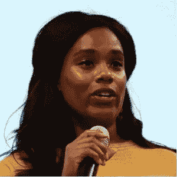*****

*****[@**NikitaTMitchell**](https://twitter.com/NikitaTMitchell)*****

*******推特简历:**无限好奇的商业战略家、演说家、作家。白天是技术人员。[编辑@夜间底线以上](https://twitter.com/abovebottomline)。订阅:[http://abovethebottomline.com](https://t.co/QPzL2wZANL)*****

# *****恩森加·伯顿*****

**********

*****[@ **智能**](https://twitter.com/Ntellectual)*****

*******推特简历:**创始人& EIC [@TheBurtonWire](https://twitter.com/TheBurtonWire) 。北卡罗来纳大学/NYU 大学/宾夕法尼亚大学/南加州大学校友。教授。作家。思想家。实干家。表达的观点是我的。转发-没那么多。1908*****

# *****O.*****

# *****Ofure Ukpebor*****

**********

*****[@ **Aufuray**](https://twitter.com/Aufuray)*****

*******推特简历:**女生。编码器。导师。活在每一刻。*****

# *****奥姆索拉·奥德唐德*****

**********

*****[@**omosolaweets**](https://twitter.com/omosolatweets)*****

*******推特简历:**临时 CTO at[http://legalos . io](https://t.co/dZ4DpDC6gc)//prev eng[@ clue](https://twitter.com/clue)， [@shopify](https://twitter.com/shopify) ，[@ kpcbfellows](https://twitter.com/kpcbfellows)etc//[@ Stanford](https://twitter.com/Stanford)CS ' 13、' 14 //挖体操、语言、刻字、人&正义*****

# *****奥莫·朱米勒*****

**********

*****[@ **omojumiller**](https://twitter.com/omojumiller)*****

*******Twitter 生物:**人类与机器智能数据人。为这一领域的初创公司提供建议。| Builds ML 产品[@ Github](https://twitter.com/Github)| Ex[@ Google](https://twitter.com/Google)|[@ Cal](https://twitter.com/Cal)PhD |[# Naija](https://twitter.com/hashtag/Naija?src=hash)|意见矿。*****

# *****页（page 的缩写）*****

# *****帕里斯·雅典娜*****

*****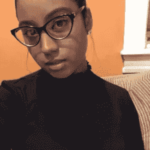*****

*****[@ParissAthena](https://twitter.com/ParissAthena)*****

*******推特简介:**前端开发是我的动力作家女演员电影制作人聪明的矮个子撒上糖、香料&冲动是我的 am♟*****

# *****帕特里夏·爱德华兹*****

**********

*****[@ **TRiiSHE**](https://twitter.com/TRiiSHE)*****

*******推特简历:**CEO/创始人[http://xisglobal.co](https://t.co/k3q2Mb4Toi)[@ nsb EDC](https://twitter.com/NSBEDC)-公关&刊物主持人+[#区块链](https://twitter.com/hashtag/Blockchain?src=hash)/crypto✎+dev[#未来主义者](https://twitter.com/hashtag/futurist?src=hash)[#创新者](https://twitter.com/hashtag/innovator?src=hash)[#战略家](https://twitter.com/hashtag/strategist?src=hash)[#媒体](https://twitter.com/hashtag/media?src=hash)[#分裂者](https://twitter.com/hashtag/DisruptTheDivide?src=hash)*****

# *****问。*****

# *****钱纳·帕特森*****

**********

*****[@ **Q_i_a_n_a**](https://twitter.com/Q_i_a_n_a)*****

*******推特简历:**证明在世界上做好事与做好事并不冲突——与 [@hopskipdrive](https://twitter.com/hopskipdrive) |校友[@ USC](https://twitter.com/USC)MBA |[@ UW](https://twitter.com/UW)|[@ UCLA](https://twitter.com/UCLA)*****

# *****R.*****

# *****拉希达·普拉蒂斯*****

**********

*****[@**rashida designer**](https://twitter.com/RashidaDesigner)*****

*****Twitter 简历:对很多东西的设计思考:产品、服务、交互、系统。非常高。*****

# *****拉希达·耶胡扎*****

**********

*****[@**rasheedayehuza**](https://twitter.com/rasheedayehuza)*****

*******推特简介:**软件工程| [http://Web。Mobile.Data](https://t.co/llyeTPAjw3) |工程师 [@wayfair](https://twitter.com/wayfair) |创始人 [@nasaratech](https://twitter.com/nasaratech)*****

# *****丽贝卡·埃农冲*****

**********

*****[@ **非洲问答**](https://twitter.com/africatechie)*****

*******Twitter 简历:**创始人 CEO[@ apps tech](https://twitter.com/AppsTech)[@ io spaces](https://twitter.com/iospaces)董事会:[@ Afrilabs](https://twitter.com/Afrilabs)[@ activ spaces](https://twitter.com/Activspaces)[@ aban angels](https://twitter.com/ABANangels)[@ Cameroon angels](https://twitter.com/cameroonangels)[@ sales force org](https://twitter.com/SalesforceOrg)[@ African _ Media](https://twitter.com/African_Media)[@ I _ am the code](https://twitter.com/i_amthecode)[# team 237](https://twitter.com/hashtag/Team237?src=hash)[et](https://twitter.com/hashtag/BringBackOurInternet?src=hash)*****

# *****里贾纳·霍努*****

**********

*****[@ **ragyare**](https://twitter.com/ragyare)*****

*******推特简历:** [@SoronkoF](https://twitter.com/SoronkoF) ， [@Techneedsgirls](https://twitter.com/Techneedsgirls) ，[@ SoronkoAcademy](https://twitter.com/SoronkoAcademy)Fellow at[@ Ashoka](https://twitter.com/Ashoka)[@ wash fellowship](https://twitter.com/WashFellowship)， [@AspenNewVoices](https://twitter.com/AspenNewVoices) ，精选 [@CNNAfricanstart](https://twitter.com/CNNAfricanstart) 。[http://www.soronkoacademy.com](https://t.co/SpuH7OHP9F)*****

# *****里泽尔·鲍勃*****

**********

*****[@RizelBobb](https://twitter.com/RizelBobb)*****

*******Twitter 简历:**[#**blacktech Twitter**](https://twitter.com/hashtag/blacktechtwitter?src=hash)软件开发者 [@ **vesonnautical**](https://twitter.com/vesonnautical) 波士顿大学学生。[@**hack _ diversity**](https://twitter.com/hack_diversity)[@**code 2040**](https://twitter.com/code2040)[@**hubspot**](https://twitter.com/hubspot)[@**resilient coders**](https://twitter.com/resilientcoders)[@**skillist**](https://twitter.com/skillist)[@**mltorg**](https://twitter.com/mltorg)[@**formlabs**](https://twitter.com/formlabs)*****

# *****鲁沙因·麦克宾*****

**********

*****[@**copasetickid**](https://twitter.com/copasetickid)*****

*******推特简历:**软件工程师[@ kickstarter](https://twitter.com/kickstarter)； [@manhattan_js](https://twitter.com/manhattan_js) IG: copasetickid*****

# *****南*****

# *****塞布丽娜·赫尔西·伊萨*****

**********

*****[@ **beingbrina**](https://twitter.com/beingbrina)*****

*******推特生物:**科技 x 新闻 x 人权。VC，领衔 [@ **beboldmedia**](https://twitter.com/beboldmedia) ，冠军幸存者[@**survivir fund**](https://twitter.com/survivorfund)。整理[@**people siftar**](https://twitter.com/peoplesiftar)。没准备好就走吧。 [# **EYL40**](https://twitter.com/hashtag/EYL40?src=hash)*****

*****圣弗拉*****

# *****萨菲娅·阿卜杜拉*****

**********

*****[@](https://twitter.com/captainsafia)**captainsafia*******

*******推特简历:**我在[@ interactio](https://twitter.com/nteractio)上做开源，写了很多，联合主持 [@bookbytesfm](https://twitter.com/bookbytesfm) 和 [@JSPartyFM](https://twitter.com/JSPartyFM) 。有远大的梦想，并坚持不懈。*****

# *****萨拉·穆罕默德*****

*****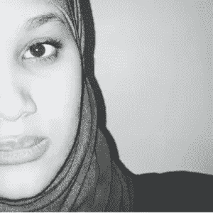*****

*****[@ **SahraXYZ**](https://twitter.com/SahraXYZ)*****

*******推特简历:**大厦 [@skinmamaco](https://twitter.com/skinmamaco) 上 [@HatchEnterprise](https://twitter.com/HatchEnterprise) |补锅匠[@ whatfooddid](https://twitter.com/whatfooddid)|影响数据 [@thisisysys](https://twitter.com/thisisysys) |ex:数据科学家[@ TechNation](https://twitter.com/TechNation)[@ Nesta _ uk](https://twitter.com/nesta_uk)[@ NHS](https://twitter.com/NHS)| MSc Adv Med Imaging[@ UCL](https://twitter.com/UCL)*****

# *****莎拉·威廉姆斯*****

**********

*****[@NerdyAndNatural](https://twitter.com/NerdyAndNatural)*****

*******推特简历:**SLW 数字公司首席执行官兼创始人|[#**WordPress 星期三**](https://twitter.com/hashtag/WordPressWednesday?src=hash) 和 [# **HeyDevs**](https://twitter.com/hashtag/HeyDevs?src=hash) |我用 WordPress 变魔术*****

# *****萨龙·伊特巴雷克*****

**********

*****[@**saronyitbarek**](https://twitter.com/saronyitbarek)*****

*******Twitter 简历:** CEO +创始人 [@CodeNewbies](https://twitter.com/CodeNewbies) 。我穿了一件 t 恤去参加我的婚礼。开发商。播客。埃塞俄比亚人。主持人[# command line pod](https://twitter.com/hashtag/CommandLinePod?src=hash)[@ red hat](https://twitter.com/redhat)IG:saronyitbarek*****

# *****踏板车凤凰*****

*****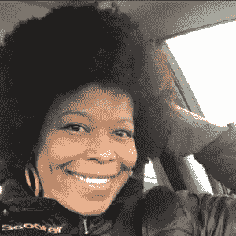*****

*****[@ScooterPhoenix](https://twitter.com/ScooterPhoenix)*****

*******推特简介:** Windows & Linux。Dev 在训练。旋转教练，学东西。推文显示成长[#**100 daysofcode**](https://twitter.com/hashtag/100daysofcode?src=hash)[#**code newbie**](https://twitter.com/hashtag/CodeNewbie?src=hash)*****

# *****莎莎-雪伊·肖*****

**********

*****[@](https://twitter.com/afroniquely)*****

*********推特简历:**我爱耶稣！[@ love 316m](https://twitter.com/love316m)|[# web designer](https://twitter.com/hashtag/WebDesigner?src=hash)[# oxygen builder](https://twitter.com/hashtag/oxygenbuilder?src=hash)[@ fresh medley](https://twitter.com/FreshMedley)[https://fmedley.com/FMDStudio](https://t.co/ZByD3eltEb)|[# natural hair](https://twitter.com/hashtag/NaturalHair?src=hash)[@ texture girl](https://twitter.com/texturedgirl)*******

# *****莎莉·亨特*****

**********

*****[@ShariHunt](https://twitter.com/sharihunt)*****

*****推特简历:科技艺术非营利组织*****

# *****莎伦·阿东哥*****

**********

*****[@**Shadongo**](https://twitter.com/Shadongo)*****

*****Twitter 简历: Techie |联合创始人[@ UwaziConsulting](https://twitter.com/UwaziConsulting)|[@ youth actionnet](https://twitter.com/YouthActionNet)Fellow |非洲乐观主义者|茶瘾者*****

# *****肖娜·斯图尔特*****

**********

*****[@ **肖纳记者**](https://twitter.com/ShaunaReporter)*****

*******推特简介:**娜芙蒂蒂墓上的炸弹涂鸦。在 [@aldotcom](https://twitter.com/aldotcom) 的社交+特色。文化、食物和烈酒作家。16 年*****

# *****贾芳·艾伦*****

**********

*****[@ **whoisSheena**](https://twitter.com/whoisSheena)*****

*****推特简历:科技艺术媒体其他兴奋剂| CEO[@ gocap way](https://twitter.com/GoCapWay)x[@ SheenaAllenApps](https://twitter.com/SheenaAllenApps)| mind full*****

# *****谢米卡·拉马尔*****

**********

*****[@Slamare15](https://twitter.com/slamare15)*****

*****Twitter 简历:数据爱好者|演讲者|渗出黑少女魔力|[@**BlackComputeHer**](https://twitter.com/BlackComputeHer)Fellow[@**HRDAG**](https://twitter.com/HRDAG)数据科学 Fellow[#**blacktech Twitter**](https://twitter.com/hashtag/blacktechtwitter?src=hash)*****

# *****雪莉·贝尔*****

**********

*****[@iamshellybell](https://twitter.com/iamshellybell)*****

*******推特简历:**创始人-**|**[**@谷歌**](https://twitter.com/Google) **数字蔻驰 DC | LGBTQ 中的 B |正在统治世界|演讲家、建筑商、技术人员**[**# shellys peaks**](https://twitter.com/hashtag/shellyspeaks?src=hash)*****

# *****谢瑞尔·多尔西*****

**********

*****[@ **谢瑞尔 _ 多西**](https://twitter.com/Sherrell_Dorsey)*****

*******Twitter 简历:**在 MS DOS + 2Pac 上长大的科技作家。署名在[@**fast coexist**](https://twitter.com/FastCoExist)[@**next city org**](https://twitter.com/NextCityOrg)[@**city lab**](https://twitter.com/CityLab)|每日黑科技快讯创始人[@**_ the plug daily**](https://twitter.com/_theplugdaily)*****

# *****谢里·史密斯*****

**********

*****[@ **史密斯小姐 11**](https://twitter.com/misssmith11)*****

*****对美食和美酒充满热情的科技和游戏记者。有技术或游戏问题吗？我是你的女人。*****

# *****肖恩塔维亚·约翰逊*****

**********

*****[@ShontaviaEsq](https://twitter.com/ShontaviaJEsq)*****

*******推特生物:**评论&批判流行文化。懂点法律，创新&创业。 [@ **机会**](https://twitter.com/SCOpportunity) 的创始人*****

# *****西安·莫森*****

**********

*****[@ s**ianamoy**](https://twitter.com/sianmorson)*****

*****| **推特生物:**创新@艺术的交叉点&科技。*****

# *****西比尔·爱德华兹*****

**********

*****[@ **赛义德**](https://twitter.com/saedwards)*****

*******Twitter 简历:**数字艺术总监和设计师，社会意识设计、营销和技术的传播者。*****

# *****希琳·米切尔*****

**********

*****[@**digital sista**](https://twitter.com/digitalsista)*****

*******推特简历:**连续创始人、演讲者、作者、多样性、技术、媒体的思想点火器&政治[http://digitalsista.me/about](https://t.co/igSaZshqK3){总是致力于改变事物 **s*******

# *****史黛西·布朗-菲尔波特*****

**********

*****[@ **sbp04**](https://twitter.com/sbp04)*****

*******推特简历:**CEO[@**task rabbit**](https://twitter.com/TaskRabbit)。热衷于支持科技界的年轻女性。消费品爱好者。妈妈。底特律本地人*****

# *****斯塔尔·罗克*****

*****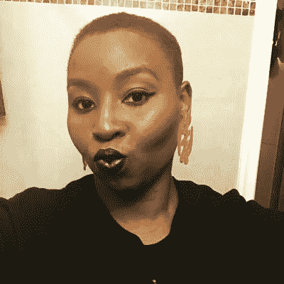*****

*****[@ **斯达 _ 洛克**](https://twitter.com/Starr_Rocque)*****

*******推特简历:**作家。数字内容创作者。格兰芬多/拉文克劳。专业高音(说真的)。作者:亚马逊上的“博主不可信”！*****

# *****斯蒂芬妮·汉弗瑞*****

**********

*****[@**TechLifeSteph**](https://twitter.com/TechLifeSteph)*****

*******推特简历:**科技生活专家 [@HarryTV](https://twitter.com/HarryTV) ， [@GMA](https://twitter.com/GMA) ， [@fox29philly](https://twitter.com/fox29philly) ， [@NewsOne](https://twitter.com/NewsOne) |点击链接了解我为[#学生](https://twitter.com/hashtag/students?src=hash)举办的[#社交媒体](https://twitter.com/hashtag/socialmedia?src=hash)研讨会或我为[#家长](https://twitter.com/hashtag/parents?src=hash)开设的在线课程的信息！*****

# *****斯蒂芬妮·兰普金*****

**********

*****[@**stephaneurial**](https://twitter.com/stephaneurial)*****

*******推特简历:**旅游爱好者，探险爱好者。斯坦福工程师&麻省理工 MBA。[@ blend door](https://twitter.com/blendoor)创始人 CEO*****

# *****斯蒂芬妮·帕克*****

**********

*****[@ **火花 2**](https://twitter.com/sparker2)*****

*******推特简历:**政策 [@YouTube](https://twitter.com/YouTube) /志愿者[@ techworkersco](https://twitter.com/techworkersco)/[@斯坦福](https://twitter.com/Stanford)明矾/联合主持人 [@TheKpopcast](https://twitter.com/TheKpopcast)*****

# *****T.*****

# *****泰鲁尔·亚历克西斯*****

**********

*****[@Tae'lurAlexis](https://twitter.com/TaelurAlexis)*****

*******推特简历:** 22 |前端工程师| INFP |创始人[http://Code daily . io](https://t.co/zhGYpaPPxP)|圣地亚哥大使|[#**depressedcottethots**](https://twitter.com/hashtag/depressedCodeThots?src=hash)|公共演讲人| [# **a11y**](https://twitter.com/hashtag/a11y?src=hash) |查看我的代码*****

# *****裁缝托利弗*****

**********

*****[@数字皇后](https://twitter.com/DigitalEmpress)*****

*******推特简介:**真人大小的布拉茨玩偶，充满激情 4 hackin |创始人[@**digital empirehq**](https://twitter.com/digitalempirehq)|查看我的网站了解更多详情*****

# *****塔科耶·扬*****

**********

*****[@**TakeyahYoung**](https://twitter.com/TakeyahYoung)*****

*******推特简历:**主讲人。企业家。生活方式工程师。 [#STEM](https://twitter.com/hashtag/STEM?src=hash) gurl。固定器。帮助 STEM 领导者&创新活得好+繁荣。[@ CoreConnection](https://twitter.com/CoreConnection)[http://CoreConnectionLifestyle.com](http://t.co/hEoKhTmPFw)*****

# *****塔玛拉·华盛顿*****

**********

*****[@ **TamaraYWash**](https://twitter.com/TamaraYWash)*****

*******推特生物:**RT =有趣≠同意。转发≠代言[# Tuskegee](https://twitter.com/hashtag/Tuskegee?src=hash)[# NCAT](https://twitter.com/hashtag/NCAT?src=hash)[# WFU](https://twitter.com/hashtag/WFU?src=hash)学养 [#JSU](https://twitter.com/hashtag/JSU?src=hash) 养大[#工程师](https://twitter.com/hashtag/Engineer?src=hash)[#科技](https://twitter.com/hashtag/Tech?src=hash)[#法律](https://twitter.com/hashtag/Law?src=hash)[#政策](https://twitter.com/hashtag/Policy?src=hash)[# MississippisGirl](https://twitter.com/hashtag/MississippisGirl?src=hash)∑θ[#林 **k**](https://twitter.com/hashtag/Link?src=hash)*****

# *****塔米·巴克纳*****

**********

*****@ [TequityDigital](https://twitter.com/tammycbuckner)*****

*****推特简历:[#**female founder**](https://twitter.com/hashtag/FemaleFounder?src=hash)[#**tech entrepreneur**](https://twitter.com/hashtag/TechEntrepreneur?src=hash)[#**tech strategy**](https://twitter.com/hashtag/TechStrategist?src=hash)[#**Dev**](https://twitter.com/hashtag/Dev?src=hash)[#**VR**](https://twitter.com/hashtag/VR?src=hash)&[#**AI**](https://twitter.com/hashtag/AI?src=hash)|我们使用有效的【T50 #**技术*******

# *****塔奈莎·蕾妮*****

**********

*****[@**educated lady 20**](https://twitter.com/educatedlady20)*****

*******推特简介:**跺着脚打破陈规。我们都值得融入！科技发烧友。前端开发人员。信徒。妈妈优先！*****

# *****坦尼娅·德帕斯*****

**********

*****[@cypheroftyr](https://twitter.com/cypheroftyr)*****

*******推特简介:**我需要多样化的游戏目录。/[# Twitch](https://twitter.com/hashtag/Twitch?src=hash)Partner/[@ orca con](https://twitter.com/OrcaCon)Prgm。/[@ rivals water deep](https://twitter.com/RivalsWaterdeep)cast/[@ Chicago nerds](https://twitter.com/chicagonerds)&[@ con _ or _ bust](https://twitter.com/con_or_bust)Board/她/她的 YVLQZ3*****

# *****塔拉·沃克*****

**********

*****[@ **塔拉瓦**](https://twitter.com/taraw)*****

*****推特简历:打印。软件工程师[@微软](https://twitter.com/Microsoft)原名[@ AWS cloud](https://twitter.com/awscloud)[# geek girl](https://twitter.com/hashtag/GeekGirl?src=hash)改变世界 1 行代码@一次。推文！=雇主[#物联网](https://twitter.com/hashtag/IoT?src=hash)[# AI](https://twitter.com/hashtag/AI?src=hash)[#移动](https://twitter.com/hashtag/Mobile?src=hash)[#云](https://twitter.com/hashtag/Cloud?src=hash)[#无服务器](https://twitter.com/hashtag/Serverless?src=hash)[#δσθ](https://twitter.com/hashtag/%CE%94%CE%A3%CE%98?src=hash)*****

# *****塔蒂亚娜·金·琼斯*****

*****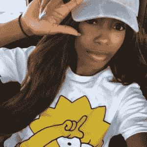*****

*****[@](https://twitter.com/TatianaKing)*****

*******推特简介:grandducessoftech。主持人 [@ForAllNerds](https://twitter.com/ForAllNerds) 。署名: [@mic](https://twitter.com/mic) [@techwelike](https://twitter.com/techwelike) 看过的:[@ strong black lead](https://twitter.com/strongblacklead)[@网飞](https://twitter.com/netflix)[@精华](https://twitter.com/essence) [@sxsw](https://twitter.com/sxsw) 。 [@HowardU](https://twitter.com/HowardU) 校友。tatiana@forallnerds.com*******

# *******泰勒·费森*******

**************

*******[@ItsTayFay](https://twitter.com/ItsTayFay)*******

*******大城市的南方女孩|霍华德校友|你最喜欢的数据科学家|[#**team python**](https://twitter.com/hashtag/TeamPython?src=hash)*******

# *****泰丽莎·道特里*****

**********

*****[@ **特利萨德**](https://twitter.com/TeLisaD)*****

*******Twitter 简历:**创始人 [@FlyTechnista](https://twitter.com/FlyTechnista) |获奖[# Tech](https://twitter.com/hashtag/Tech?src=hash)&[# Diversity](https://twitter.com/hashtag/Diversity?src=hash)倡导者|演讲者|开发设计 UX[#区块链](https://twitter.com/hashtag/Blockchain?src=hash)[# STEAM](https://twitter.com/hashtag/STEAM?src=hash)| round house-踢玻璃天花板*****

# *****特瑞·伯恩斯*****

**********

*****[@TCBurning](https://twitter.com/tcburning)*****

*******推特简历:** vc [@ **gvteam**](https://twitter.com/gvteam) ，在执行寻找下一件大事的任务。队友为[@**brave camps**](https://twitter.com/bravecamps)&[@**allraise**](https://twitter.com/allraise)。ex PM[@**Twitter**](https://twitter.com/twitter)&NYU cs kid 碧昂斯曾经说过我很美。*****

# *****提奥多拉·恩沃多*****

**********

*****[@theodoranwodo](https://twitter.com/theadoranwodo)*****

*****作家 [@ **adorahack**](https://twitter.com/adorahack) 演讲者 Google Associate Android 开发者 FullStack Web 开发者 Laravel 开发者企业家*****

# *****蒂法尼·阿什丽·贝尔*****

*****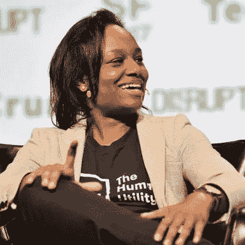*****

*****[@ **tiffani**](https://twitter.com/tiffani)*****

*******推特生物:**付水费 [@HumanUtility](https://twitter.com/HumanUtility) 当城市对贫困家庭断水时。[@ HowardU](https://twitter.com/HowardU)[@ y combinator](https://twitter.com/ycombinator)明矾。Rails/iOS 开发。水是一项人权。*****

# *****蒂芙尼·布朗*****

**********

*****[@ **webinista**](https://twitter.com/webinista)*****

*******Twitter 简历:** AFreelance web 开发者。(目前不求项目。)CSS 大师，第二版现已出:【https://www.sitepoint.com/premium/books/css-master-2nd- T42*****

# *****Tonya Evans 教授*****

**********

*****[@IPProfEvans](https://twitter.com/IPProfEvans)*****

*****Twitter 简历:法律教授(知识产权，区块链，房地产)主席，知识产权和技术在线项目。前职业网球运动员。功能界别，纽，霍华德法律。终身学习者又名 NOH8 |*****

# *****动词 （verb 的缩写）*****

# *****瓦莱丽·莫斯利*****

**********

*****[@**goforgreatest**](https://twitter.com/goforgreatness)*****

*******推特简历:**经验丰富的投资者|全球财富战略家|十亿美元妈妈|生活的爱人[https://www.linkedin.com/in/valerie-mosley-a0294111](https://t.co/g3MXpd2kN1)*****

# *****瓦莱丽·菲尼克斯*****

**********

*****[@digitalblkhippy](https://twitter.com/digitalblkhippy)*****

*****Twitter 简历:Tech By Choice 创始人全栈开发//用户体验设计师//艺术家//心理学家*****

# *****瓦莱希亚*****

**********

*****[@ **法雷莎**](https://twitter.com/valeisha)*****

*******推特简历:**全球女性负责人+黑人社区参与度 [@ **谷歌**](https://twitter.com/google) 首席执行官 [@ **weenonline**](https://twitter.com/weenonline) 明矾 [@ **巴拉克奥巴马**](https://twitter.com/barackobama)[http://heirlight.com](https://t.co/XrsqOXeuK5)[http://valeisha.org](https://t.co/15wdhXMJND)观点是我的*****

# *****凡妮莎·梅森*****

**********

*****[@](https://twitter.com/vanessamason)*****

*********Twitter 简历:联合创始人**[**@ p2health**](https://twitter.com/p2health)**|搭桥**[**# public health**](https://twitter.com/hashtag/publichealth?src=hash)**和**[**# digital health**](https://twitter.com/hashtag/digitalhealth?src=hash)**|科技包容冠军|激情包括漫游癖&**[**@耶鲁**](https://twitter.com/yale)*******

# *****W.*****

# *****窗户斯奈德*****

**********

*****[@ **窗口**](https://twitter.com/window)*****

*******推特简介:**安全等等等等*****

# *****X.*****

# *****阿信·艾兰德*****

**********

*****[@ **谢兰德**](https://twitter.com/xeiland)*****

*******推特简历:**希望改善所有人健康的公关大师；亲法者；阿姨；workerbee 奔跑者。 [@ **BFFDCorg**](https://twitter.com/BFFDCorg) 联合创始人&[@**the beaconc**](https://twitter.com/TheBeaconDC)BOD。*****

# *****Y.*****

# *****约迪·斯坦顿*****

**********

*****[@**yoditstanton**](https://twitter.com/yoditstanton)*****

*******Twitter 简历:**创始人兼首席独角兽 [@OpenSensorsio](https://twitter.com/OpenSensorsio) 物联网、软件和数据。组织者 [@WomenInData](https://twitter.com/WomenInData)*****

# *****伊冯娜·泰沃诺*****

**********

*****[@ experientiadocet](https://twitter.com/experentiadocet)*****

# *****斯塔尔·罗克*****

**********

*****[@ **斯塔尔 _ 罗克**](https://twitter.com/Starr_Rocque)*****

*******推特简历:**作家。数字内容创作者。格兰芬多/拉文克劳。专业高音(说真的)。作者:亚马逊上的“博主不可信”！推特简历:我们通过经验获得知识。我寻求通过开发 STEAM 程序来支持我的学生，这样他们就可以思考、创造、存在、做。*****