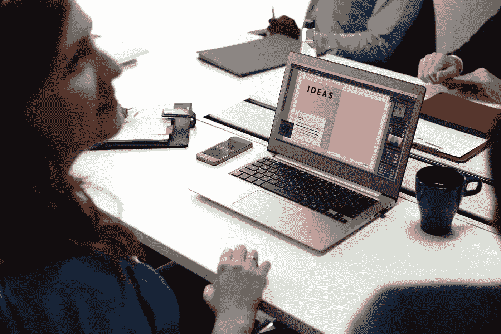

# 创新产品设计的三大支柱(以及如何实施)

> 原文：<https://medium.com/hackernoon/the-3-pillars-of-innovative-product-design-and-how-to-implement-them-ddb2d3653069>

就像鸡和蛋一样，创新和设计相互依赖，推动世界前进。在过去的十年里，这两者都已经成为大多数行业的黄金标准，因为这两者都促使企业家设想和交付比预期更多的东西，同时采取更具创造性的措施和方法。

产品设计过程可以作为创新的催化剂，提供推动想法前进所需的焦点、结构和动力。

想要走得更远的创业公司必须确保他们的设计过程不仅顺利，而且适合创新——因为这是将想法转化为可销售产品的驱动力，因此是实现创新的不可或缺的一部分。

但是，到底什么是创新设计，为什么它对创业公司很重要？

# 什么是创新设计？

大多数人谈论这个技术丰富的时代带来的好处——尤其是无数的机会。但是，没有人提到大的负面影响——很可能有许多其他创业公司试图生产和你一样的产品。也就是说，如果你希望抓住最终用户的注意力，你必须真正脱颖而出——这可以通过采用创新的设计方法来实现。

创新设计背后的三个关键考虑因素是: ***美学、功能性、*** 和 ***价值。***

从**美学**和**功能**开始是显而易见的——你必须确保你的产品看起来不同于市场上的同类产品，你必须确保它是直观的和无缝可用的。

说到提供**价值，**就是 ***创新*** 发挥作用的时候了。

确保你创造的产品对最终用户的日常生活有积极的贡献，是满足消费者需求和解决他们问题的关键。

# 如何通过设计实现创新？

创造创新产品有四个主要阶段。

## **1。探索。**

在这一阶段，设计师发现客户的需求或痛点是什么，并设身处地为最终用户着想，重新构建他们对消费者的观点。然后，他们可以获得洞察力和模式，这将有助于他们进入下一阶段。务必不惜一切代价避免假设，因为这可能会将设计引向错误的方向。

## **2。有想法。**

这是一个团队合作的阶段，设计团队释放他们的创造力，分享他们的想法和设计可能性以及可行的解决方案。

## **3。测试和提炼**。

这是原型阶段。原型是为不同的解决方案构建的，并在真实用户身上进行测试，以了解他们的反应和感受。有了收集到的信息，原型可以被调整以创造出最终的产品。

## **4。发射。**

一旦产品被提炼出来，就可以投入使用了。现在，它只需要被恰当地营销——面向你测试它的同样的观众。

创造杀手级创新拥有[许多关键组成部分](https://www.virgin.com/entrepreneur/10-steps-creating-truly-innovative-product)——这些曾经被认为有助于你为你的市场构建和创造更强大、更成功的解决方案。

# 为什么创新设计如此重要？

追求创造一个给最终用户带来价值的解决方案是所有伟大设计师的核心。这就是为什么说到底，求助于您的最终用户来帮助您拼凑他们的解决方案才是前进的方向。

花时间真正了解你的消费者；基于你收集的知识创造一个想法；利用他们的见解调整你的[原型](https://inkod.com/blog/how-to-communicate-ideas-with-rapid-prototyping)，直到它们所谓的“完美”——这些步骤将决定一个创新产品和一个不成功产品之间的差别。

创新设计的好处包括改善团队合作、设计过程清晰化以及更好的准备，它将为你的初创公司提供竞争优势，因为你有能力交付具有巨大价值的产品。

不要忘记:首先与你的消费者接触将总是帮助你决定你是否应该追求一个特定的创新，此外，确定你将需要什么来实现它——如果你决定继续下去。

# 结论

创新之路由三个核心支柱支撑:美观、功能和价值。

你在充分开发这三样东西上投入了越多的努力，你就有越多的机会创造出更具创新性、更吸引眼球的产品。

为最终用户提供价值是所有产品设计师的心愿。

创新一个为你的理想用户量身定制的解决方案——一个能解决他们每天面临的问题的解决方案——对你的产品的成功至关重要。