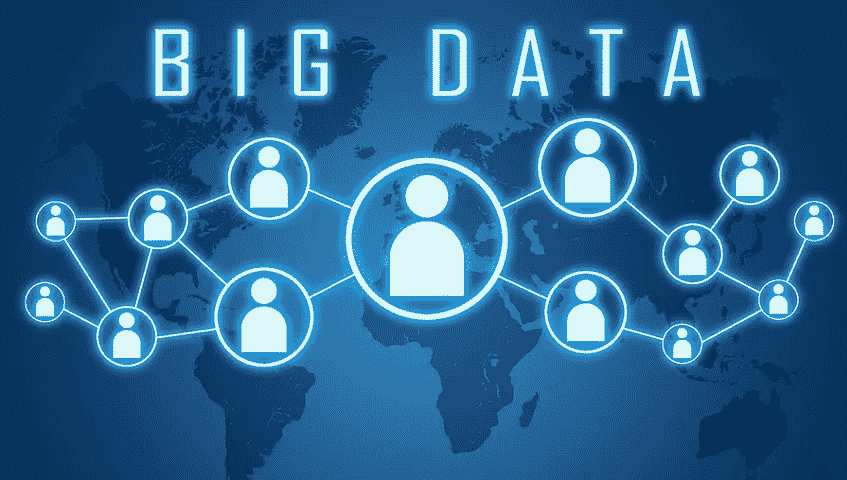

# 大数据分析的 3 V

> 原文：<https://medium.com/hackernoon/the-3-vs-of-big-data-analytics-1afd59692adb>

*想知道大数据如何成为您业务的重要组成部分吗？请继续阅读，了解大数据分析服务如何帮助科技行业在 2019 年取得成功。*

# **什么是大数据？**

大数据是从[互联网连接设备](https://hackernoon.com/everything-you-need-to-know-to-start-your-iot-project-ef036c9f6e6e)生成的非结构化、半结构化和结构化数据的快速延伸。

大数据分析服务提供的见解将有助于像 [Ecom Cash Crusher Review](https://alex-reviews.com/) 这样的营销人员更具战略性地开展目标活动，帮助医疗保健专业人员注意流行病，并帮助环保人士了解未来的可持续性。

# **3v 的大数据**

大数据分析可能是一个难以理解的概念，尤其是在当今数据种类繁多、数量庞大的情况下。为了理解这个概念，专家们把它分成了 3 个简单的部分。这三个部分是数据的三个大 V:多样性、速度和数量。

## **速度**

最初，大数据的加速必然会带来更多的机会。手头有大量的数据，一旦我们获得这些数据，你就可以用它来发现新的现实。

可悲的是，数据增长的速度已经超过了我们破译数据的能力。IDC 在 Digital Universe 进行的一项研究显示，全球数据量每两年翻一番。更重要的是，3%的数据是有组织的，只有 0.5%的数据可供分析。

大数据不仅仅是大；它长得很快。《脸书每日统计》就是一个例子。基于 Social Skinny 的洞察力，脸书上每分钟更新 293，000 条状态，上传 136，000 张照片，发布 500，000 条评论。

元数据技术和大数据技术与机器学习和人工智能相结合，将不得不发挥其最大潜力，以展示未来的前沿。

## **品种**

数据快，数据大，但数据极其多样。几十年前，数据会存在于一个简单文本文件的结构化数据库中。除了找到趋势和简单的分类之外，没有太多关于如何使用数据的选项。

显然，大数据改变了数据格局。虽然文本数据仍有一席之地，但还有其他更方便的数据表示形式。例如，视频、音频、地理空间、图像和许多其他内容都发挥了作用。

每种数据形式都有自己的独特性，就其在云上的分类和存储方式而言。这种形式的独特之处在于我们如何分析它们来创造有价值的解决方案。

## **卷**

这个世界背后有大量的数据，可能数量惊人。今天超过 90%的数据是在过去两年中生成的，估计每天有 250 亿字节的数据。

让我们从社交媒体的角度来考虑量，因为社交媒体对数据有巨大的影响。自 2016 年以来，已有超过 2 万亿条帖子和 2500 亿张照片上传。

脸书拥有丰富的个人数据，其 22 亿用户每秒都在分享数据。如果不是大数据的发展，这是不可能的。

# **结论**

借助大数据分析服务，企业会发现展示信息、做出预测和创建创新解决方案变得更加容易。使用它时，确保数据准确，以便它正常运行。因此，大数据分析是一项必要的技能，在未来将变得更加迫切。