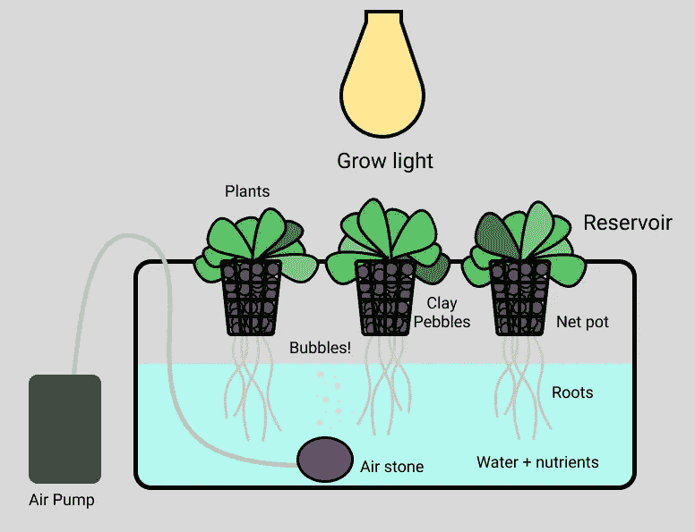
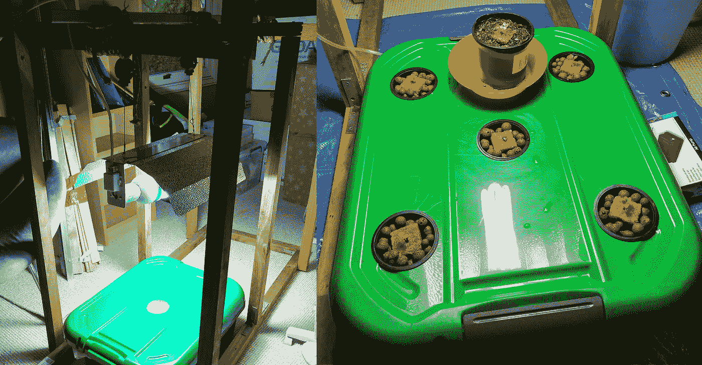
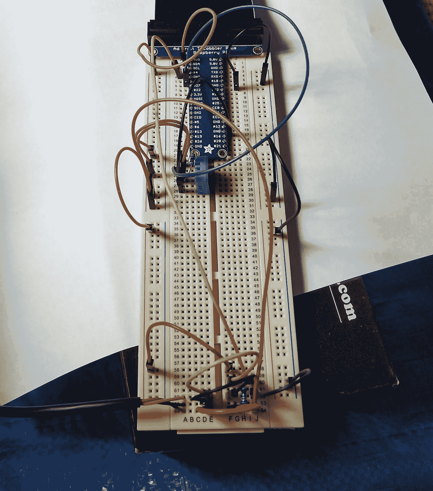
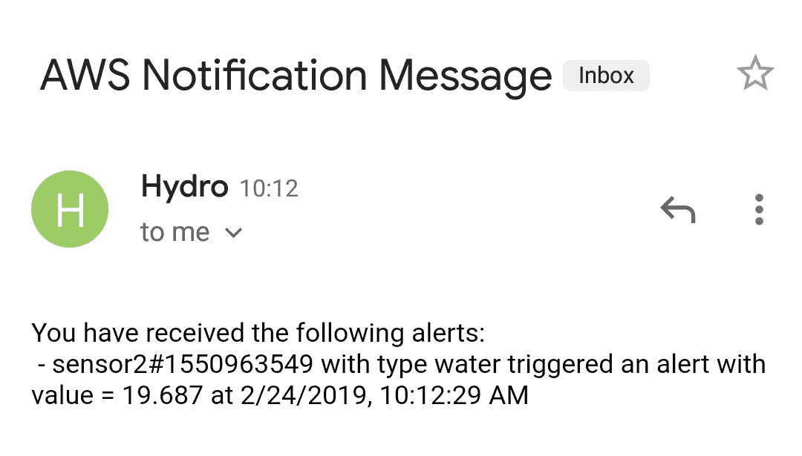
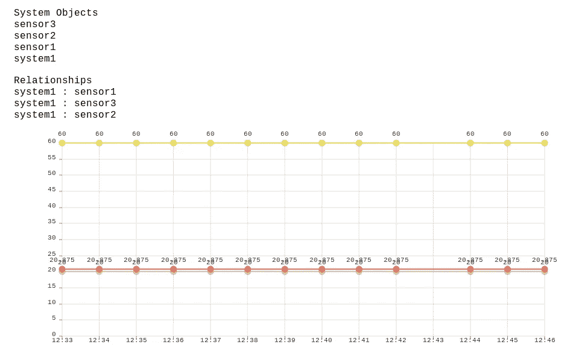
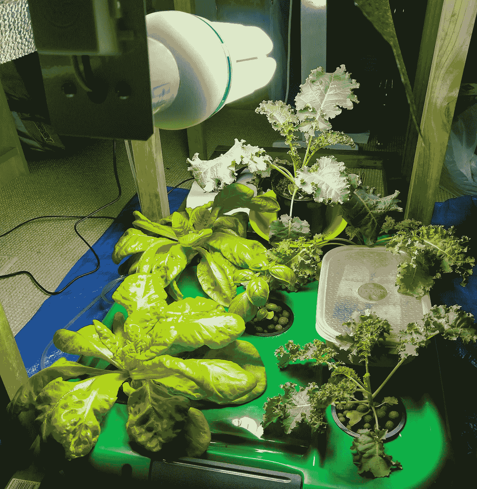

# 300 美元的莴苣:建造一个智能花园

> 原文：<https://medium.com/hackernoon/the-300-lettuce-building-a-smart-garden-c048c0e1a51>

几个月前，我的一个非常慷慨的朋友给了我一份很棒的礼物，我自己的[树莓派 3B+](https://www.raspberrypi.org/products/raspberry-pi-3-model-b-plus/) 。对于那些不熟悉的人来说，Raspberry Pi 是一种小型且价格实惠的计算机，它还可以连接到传感器和其他电子设备。

第一个挑战是决定做什么。作为一名软件开发人员，我一直在寻求拓展我的技能，我也曾经想过种植一些蔬菜。收到树莓派正是我启动一个项目所需的动力:一个智能水培花园系统，具有自动警报、数据分析和维护功能。

**剧透警告:**如果你只是想种植粮食，这个项目不是特别高效。将计算应用到一个小的家庭菜园是耗时的，有时成本很高，而且不一定能提高产量。然而，如果你对物联网、云计算以及技术如何应用于农业感兴趣，那么请继续阅读，甚至可以亲自尝试学习一些新技能！

# 水培速成班

是的，我知道你在想什么。但不仅仅是水培的。越来越多的食物也是水培的，有很多好处要考虑:更少的水，很少甚至没有化学物质，更少的土地和全年快速生长(但如果你使用照明，会消耗更多的能量！).在一个大约 11%的土地用于农业的世界里，获得清洁的水是一个主要问题，可再生能源变得越来越有效，水培法有很多优点。

我建立的系统类型被称为深水文化。这相当简单，所以我做了一个图表来解释它是如何工作的。

Everything a plant needs to thrive, but no dirt!

# 构建系统

组装这个系统需要去一趟水培店、五金店，在网上购买各种东西，还需要对我手头的材料进行创造性的再利用。

我总共花了大约 250 澳元在水培方面。最贵的部分是灯，我本可以通过在网上购买一切来节省更多的钱。我最终购买了近 20 种不同的商品，而且还能想到更多的东西可以买。不过，种植的边际成本很低，所以随着时间的推移，它会很好地发挥作用。

The picture on the left was before I finished the holes. There were also some intermediary steps in terms of growing the plants. Five plants, plus one in soil as a control.

经过一些 DIY 行动，这是最终结果。通向盒子的管子连接着看不见的气泵。该框架肯定是大材小用，但如果我决定升级的话，还有第二个系统的空间，而且它大部分是从以前的项目中构建的。

如果你对如何制作这样一个系统的详细文章感兴趣，请留下评论(或者谷歌，那里有很多信息)。

# 让它变得聪明

据我所知，这已经很酷了，植物长得很好。显然是时候增加一些不必要的复杂性了。我认为有四个主要因素:

1.  收集、储存并让人们可以接触到它
2.  自动警报
3.  基于网络的界面，用于监控/控制系统和分析数据
4.  物理自动化(考虑 pH 平衡、基于电价的动态光循环等等！)

目前我已经完成了#1，完成了相当一部分#2，并为#3 打下了初步的基础。物理自动化肯定是一个令人兴奋的前景，但它也需要另一轮的支出，我想先解决其他一切问题。

Lettuce on the left, basil in the middle and kale on the right. The reflective ‘batwing’ above the light reduces the amount of light that is wasted. The white light promotes vegetative growth whereas a yellow light works well for flowering plants.

## 收集和存储数据

我目前有两个传感器在运行，一个 DS18B20 防水温度传感器和一个 DHT11 湿度和空气温度传感器。我还有一个我一直想加进去的水传感器。它们连接到试验板，而试验板又连接到 Raspberry Pi。

The DHT11 is the blue cube. The DS18B20 is the cable connected to the breadboard at the bottom left. A pH sensor would be great but they’re quite expensive.

第一个问题是在哪里存储数据。我想尝试设计一个 NoSQL 模式，dynamo db(T1)有高达 25GB 的空间，这对于我的目的来说已经足够了。除了存储传感器读数之外，DynamoDB 表还存储有关系统配置的信息。我优化了检索系统配置和检索特定传感器在指定时间段内的数据的模式，因为我知道这将是我的两个主要用例。

然后，我编写了一个简单的 python 脚本，将传感器读数发布到我的数据库中。到目前为止，一切顺利。然而，这并不符合我的喜好。

所以我决定写一个 [GraphQL](https://graphql.org/learn/) 端点，用[无服务器](https://serverless.com/)框架和 Node.js 8.10 [Lambda](https://aws.amazon.com/lambda/) 部署。这比我现在*需要的*要复杂一点，但这些都是我一直想尝试的，我计划将来使用第三方天气和电力价格 API，这样 GraphQL 将在这一点上提供更多价值。无服务器是使用 Lambda 的一种非常愉快的方式(它也支持其他提供者！)，如果你还没有尝试过，你一定要尝试一下。

## 自动警报

在这一点上，我有了一个非常坚实的记录、存储和访问数据的设置。是时候通过设置警报来很好地利用这一点了。

我想在以下情况下得到提醒:

*   传感器读数超出了“安全”范围。
*   传感器停止发送数据(这可能意味着我的 Raspberry Pi 有问题)。
*   上述任一问题持续了很长一段时间。
*   上述任一问题得到解决(即温度降回到“安全”范围)。

为此，我求助于亚马逊简单通知服务。我一个月可以免费发 1000 封邮件，从一个 Lambda 函数发布通知非常直接。我编写了另一个无服务器项目，它的函数每 20 分钟运行一次。我在我的 DynamoDB 表中存储了关于警报状态的信息(即这个问题从晚上 10 点开始就一直存在)。

我还计划添加提醒，提醒我做一些任务，比如检查 pH 值和添加营养物质。

It’s super convenient to only need to check when alerted. If only I had that pH sensor…

## 网络界面

该系统的网络界面可以具有各种各样的特征。查看系统的当前状态、分析历史数据、控制自动化和配置警报只是一些想法。到目前为止，我已经创建了一个非常简单的应用程序 [Next.js](https://nextjs.org/) ，它使用 [Apollo Client](https://www.apollographql.com/docs/react/) 从我之前创建的 GraphQL 端点获取数据。我还没有时间在这方面做太多工作，但是有了数据检索，我很快就可以开始构建 UI 了。

I really meant it when I said bare bones. The graph shows the last 15 minutes of humidity, air temperature, and water temperature. The charting library is called [nivo](https://nivo.rocks/), it’s worth checking out.

此外，在 DynamoDB 中存储超过几周的时间序列数据似乎有点浪费，因为只有新数据会被频繁访问。为此，我计划结合 AWS [Glue](https://aws.amazon.com/glue/) 、 [S3](https://aws.amazon.com/s3/) 和 [Athena](https://aws.amazon.com/athena/) 来传输、存储和查询长期数据。这里有一个 AWS 博客[解释了这将涉及到什么。](https://aws.amazon.com/blogs/database/simplify-amazon-dynamodb-data-extraction-and-analysis-by-using-aws-glue-and-amazon-athena/)

## 物理自动化和其他酷(贵)的东西

不幸的是，这里还没有什么可展示的。第一步将是购买一个 433 兆赫的收发器和一个遥控插座。我将使用它来控制灯光，实现自动最小化电力支出等功能。

其他有用的功能可能包括[蠕动泵](https://en.wikipedia.org/wiki/Peristaltic_pump)和 pH 传感器，我可能需要从中国订购。我可能还会买一个 [Arduino](https://www.arduino.cc/en/Guide/Introduction) 来方便地访问模拟接口，因为树莓 Pi 不方便。另一个选择是给树莓派增加一个摄像头。在软件方面，我可能会尝试在 Go 中编写下一个服务。如果你对我下一步应该做什么有任何想法，请留下评论。

# 总之…

我成功地种植了食物，学到了很多新东西，还在一篇帖子里塞进了大量科技术语。希望这不会太长，也许会激发你开始自己的项目。我也犯了很多错误(你可能会注意到我的羽衣甘蓝很小)，所以下一轮我打算做得更好。即使像这样的设置也需要很多思考，它让你体会到我们通常认为理所当然的食品生产的复杂性。我也花了 300 多澳元，所以这显示了资本密集型'高科技'农业。

The title is a little misleading seeing as I got not one, but two lettuces. The red box contains some seeds which I’m germinating for once I harvest the current plants.

# 进一步的信息

如果你对科技和农业的结合感兴趣，那么看看[这个展示商业化垂直农业的视频](https://www.youtube.com/watch?v=-_tvJtUHnmU)。如果你想用一种非常简单又划算的方式尝试水培，那么看看这个视频。史诗园艺有一系列关于水培和其他园艺主题的信息文章。如果你决定试一试，那么你可以问一些关于[r/水培法](https://www.reddit.com/r/hydro/)或[初学者水培法](https://www.facebook.com/groups/637162503142454)的问题。所有使用的技术都有大量的文档和社区支持，所以您应该能够找到您需要的任何东西。

如果你对我下一步应该做什么有建议，或者如果你认为我应该写一篇更深入的帖子来讨论这个项目的某个特定元素，请留下评论。一旦我有了进一步的进展，我可能会写一篇更技术性的文章。如果你想讨论什么，你也可以在 LinkedIn 上给我发消息！