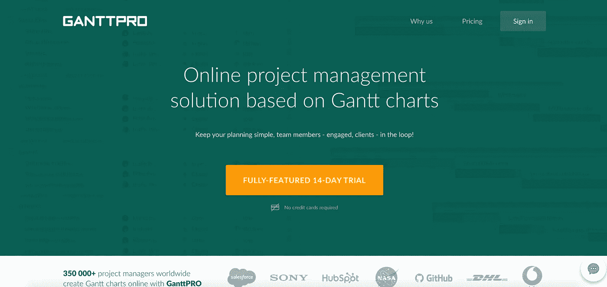
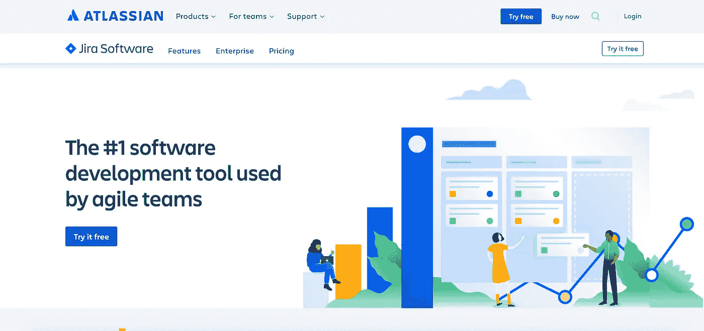
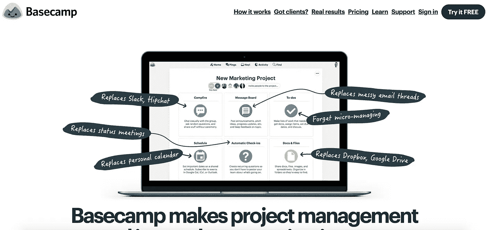
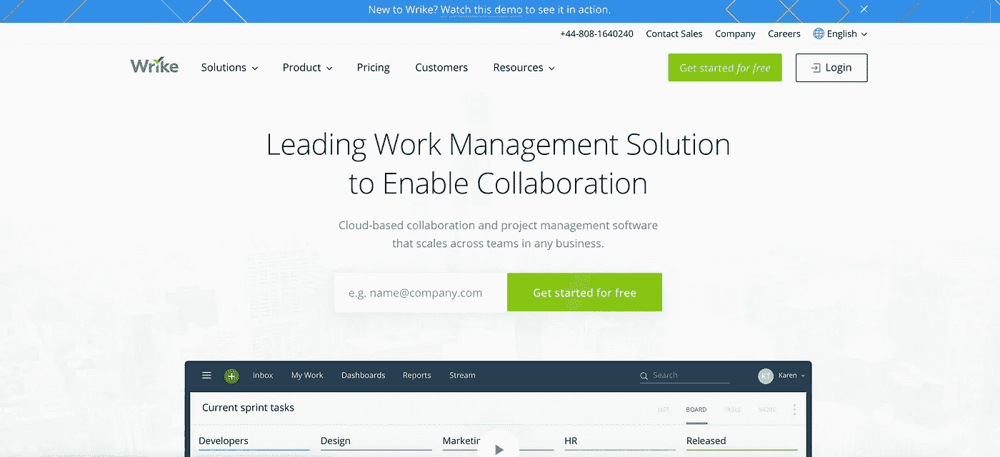

# 软件开发必须尝试的 6 个项目管理工具

> 原文：<https://medium.com/hackernoon/the-6-best-project-management-tools-for-software-development-dbe00a9771cf>

当你在做一个项目时，一切似乎都很分散，不要担心。如果你是自由职业者，感到不知所措，你可以寻求帮助。有一些项目管理工具可以帮助你变得有条理，并且有助于你的团队内部以及与你的客户之间的沟通。不同的项目管理工具有不同的特性。这里有六个软件开发的最佳项目管理工具。

**1。** [**GanttPRO**](https://ganttpro.com/)

如果你喜欢甘特图，并希望有条理，这个项目管理工具与直观的界面和尼斯 UX 设计将为您工作。GanttPRO 是为构建完美可视化的时间表和计划而创建的。IT 团队和自由职业者以及来自市场营销、建筑、零售、制造等许多其他团队都可以轻松使用该工具。软件开发团队的各种[模板](https://ganttpro.com/software-development-plan-template/)将使创建项目更快。

GanttPRO 很灵活。您可以切换到看起来像看板的板视图。该软件提供简单的计划以及其他功能，如进度跟踪、资源工作量、截止日期、任务分配、关键路径、自动计划、导出、基线、导出和共享。

GanttPRO 是云托管的，因此每个人都可以每周 7 天、每天 24 小时访问。它有助于让客户、合作伙伴或利益相关者了解情况，并确保他们了解任何项目更新。

GanttPRO 非常重视隐私。在他们的客户中，你会发现 NASA、DHL、Hubspot 以及更多世界知名的巨头。

你可以注册 14 天的免费试用。学习曲线真的很短。

**2。** [**吉拉软件**](https://www.atlassian.com/software/jira)

吉拉软件公司使用 Scrum 板来增强团队和客户之间的沟通，并改善组织。这些 Scrum 板可以被软件开发团队、人力资源、自由职业者、营销部门等等使用。这是一块任何人都能学会使用的多功能板。

吉拉软件公司也使用看板。这些板子是用来让你的团队知道未来会发生什么。这两个板块共同创造了一个伟大的项目管理工具。

**3。** [**液体规划器**](https://www.liquidplanner.com/)

这个项目管理工具帮助你看到现实生活中发生了什么。如果进行了调整，计划的每个部分都会立即进行相应的调整。你可以知道你的员工是否有太多事情要做，或者某个项目何时到期。您可以使用卡片视图查看您的计划如何从“待定”变为“进行中”和“已批准”。他们的系统中内置了集成的预算和时间管理工具，可以更轻松地跟踪您的预算。

**4。** [**大本营**](https://basecamp.com/)

使用 Basecamp，软件开发团队可以创建留言板、待办事项列表、文档、使用文件存储、处理时间表、在群聊中交流、直接发送消息等等。有一个签到问题部分，允许您向您的团队提问，并在单个线程上获得响应。

Basecamp 还具有客户端访问功能，允许您在一个区域转发客户的待办事项、消息、电子邮件等。这对你和你的客户来说都很容易使用。

使用希尔图，您可以查看进度、注释更新等。Basecamp 报告让你知道什么时候到期，今天到期。您可以使用报告来找出已经完成的工作和仍需完成的工作。

Basecamp 很灵活，允许你给不在 Basecamp 上的人发送电子邮件链接。您还可以自定义您的项目和嵌入视频。

**5。** [**智能表**](https://www.smartsheet.com/)

Smartsheet 使用小部件驱动的仪表板来帮助您做出决策。您可以实时访问您的信息，而 Smartsheet 可以帮助您的团队识别趋势并处理紧迫的问题。Smartsheet 还具有内置集成功能，可帮助您与 Microsoft Office 365、吉拉、Salesforce 等软件同步。

您可以使用 Smartsheet 构建自定义应用程序，并与您的客户和团队进行快速精确的协作。Smartsheet 对您和您的团队来说很容易使用，并且可以在整个组织中使用。

**6。** [**箭牌**](https://www.wrike.com)

Wrike 为您提供了可定制的仪表板，您可以根据不同的项目进行调整，并灵活地进行软件开发。他们使用动态请求表单和甘特图来帮助您计划、优先化和分配任务。

自定义工作流显示清晰的进度图。您还可以使用 Wrike Proof 工具进行可视化分享并提供反馈。与 Wrike 合作很容易。你可以标记视频，并能够提供即时反馈。

Wrike 可供软件开发人员、创意团队、营销人员以及贵公司的所有团队使用。Google、Adobe、微软、Box 等等都可以连接到 Wrike，帮助你的软件开发团队联系和进步。

为你的软件开发团队使用项目管理工具将帮助你更有条理。您可以跟踪团队的进展，并确保每个人都在做他们应该做的事情。如果有人落后了，你可以重新分配他们的任务来帮助他们完成工作。您可以与您的团队成员和客户协作，使整个流程更加顺畅。项目管理工具是软件开发和自由职业者的必备产品。