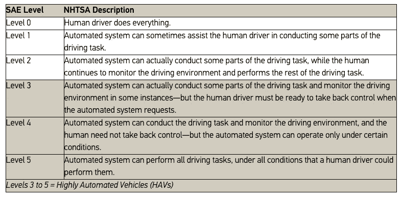
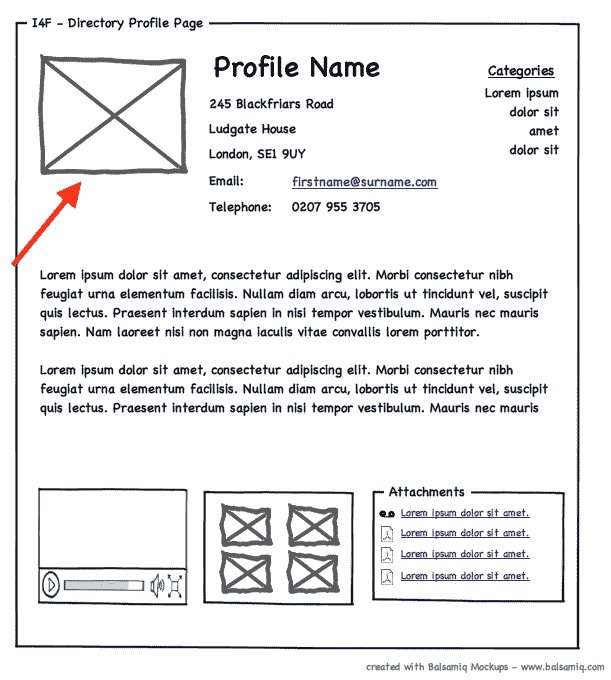

# 前端开发自动化的 6 个级别

> 原文：<https://medium.com/hackernoon/the-6-levels-of-front-end-development-automation-f6f93a24b7cd>

Anima 正在自动化前端开发。作为我们研发的一部分，我们正在发现对前端自动化的成功至关重要的见解。

在本文中，我们定义了前端自动化的 6 个级别。这些都是受 SAE(汽车工程师协会)在关于自动驾驶系统的“[分类和定义](https://blog.ansi.org/2018/09/sae-levels-driving-automation-j-3016-2018/)的报告中定义的级别的启发。

# 辖域

当谈到自动化前端开发时，理解自动化的范围很重要。当我们说“自动化”时，我们描述了源代码的自动生成，这些代码是由**人**可读的和**可维护的**。

在我们的模型中，我们只关注**用户界面**的自动化。

## 前端自动化包含的内容

1.  **造型**
2.  **布局**
3.  **交互性**
4.  **命名**

## 式样

样式是负责元素样式的代码部分。颜色、大小、位置、字体(文本元素)等…

在 web 开发中，这通常用 [CSS](https://en.wikipedia.org/wiki/Cascading_Style_Sheets) 代码编写。

## 布局

布局是负责结构、层次和响应的代码部分。通常用树形结构来描述。

在用 [DOM](https://en.wikipedia.org/wiki/Document_Object_Model) 描述的 web 开发中，使用诸如 [HTML](https://en.wikipedia.org/wiki/HTML) 或 [React](https://en.wikipedia.org/wiki/React_(JavaScript_library)) JSX 这样的标记。

## 交互性

交互性允许用户与界面进行交互。它可以是单击按钮、拖动元素、挤压、使用键盘等等。

web 开发中通常是 [Javascript](https://en.wikipedia.org/wiki/JavaScript) 代码。

## **命名**

[命名](https://en.wikipedia.org/wiki/Naming_convention_(programming))可以区别清楚不清楚的代码。更好的工程师在他们的代码中为变量、类和函数提供清晰的命名。

对于一个**可读的**和**可维护的**代码的要求之一是好的命名。

## 未包括在内

1.  网络请求。
2.  商业逻辑。
3.  任何其他与用户界面不直接相关的代码。

我们有意将重点放在*非常具体的*代码区域。此时，我们将业务逻辑和网络请求留给工程师。专注于一个较小的问题允许我们改进自动化过程。

# 级别

在这 6 个级别中，我们回顾了我们如何看待事物的当前状态，以及它们在未来 5 年将如何演变。本文于 2019 年**撰写，截至本文撰写时，已有商业采用的解决方案提供**1 级**自动化。Anima 即将发布 **Level 2** 自动化。**

## 0 级(无自动化)—工程师完成所有工作

这是当工程师收到**静态模型，**没有任何附加数据时发生的过程。没有红线，没有生成的 CSS 属性，或者除了代表最终结果的实体模型图像之外的任何东西。工程师看着模型图像，用代码重新创建一切。由于静态图像只能传达一些信息，大部分都是猜测。甚至字体大小也需要猜测，因为没有附带的数据提供它们。

## **1 级(**工程师协助) **—自动化系统有时可以通过提供前端代码的样式来协助工程师。**

为工程师提供了一个交互式网页，其中包括红线和样式代码片段(如 CSS、SASS 或更少)。有很多工具可以提供这种程度的自动化。其中包括 Zeplin、Avocode、InVision Inspect、Sketch Measure 等。生成的 CSS 对人和设备都是可读的。它可以复制粘贴或用作参考。这种程度的自动化节省了打字错误和一点时间。它仍然是部分的，因为它只能自动化**造型**(四分之一部分)。

## 级别 2(部分自动化)—自动化系统可以生成前端代码的响应布局。

系统生成布局界面的代码。这意味着样式和布局(DOM)。代码可以是 HTML、React、Swift、Java(针对 Android)、React Native、Flutter 或者其他任何前端语言。这是第一次，代码可以在设备(如浏览器)上运行，并显示与原始模型相同的像素完美界面。

## **三级(**)**——**自动化系统可以生成交互部分的前端代码。

系统为大部分部件(除命名外的所有部件)生成代码。这意味着样式、布局(DOM)和交互性。界面是交互式的和动画的。它不再是静态的，而是可以有微交互、动画、状态和过渡。

## 4 级—(高度自动化)—自动化系统可以生成前端代码的所有部分。

前端的所有 4 个部分包括:样式，布局，交互性和语义命名。代码应该是完整的、清晰的，并且可以被人类工程师维护。完整的组件可以原样使用，也可以作为工程师的参考。代码对人和设备都是可读的。

语义命名意味着元素的命名是基于它们是什么，而不是基于伴随的数据。

在下面的线框中，试着猜测所指元素的名称。完成后，向下滚动。

Can you come up with a good name for this element?

在上面的线框中，人类工程师很可能会推断出该元素是“轮廓图”。请注意，它没有说“个人资料图片”，但由于人类已经看到了许多个人资料页面，我们被训练执行模式匹配来完成这一点。机器也可以学习这个。

## 级别 5 —(完全自动化)—自动化系统可以在人工级别生成所有的前端代码。

自动化系统可以为所有的设计规格生成代码，而生成的代码与人类编写的代码无法区分。

在这个级别中，如果执行代码审查，它应该通过“图灵测试”，在该测试中，审查者无法判断是自动化系统还是人类工程师产生了代码。

定义这些级别的原因是为了让我们能够设定客户的期望。前端自动化可能意味着许多不同的事情。今天，“代码生成”对大多数人来说意味着简单的 CSS 生成。但是对我们来说，代码生成意味着更多。通过明确地陈述自动化的水平(即代码生成)，我们可以清楚地在每一步交流我们所说的“前端自动化”是什么意思。

加入我们的 5 级前端自动化之旅:[www.animaapp.com](https://www.animaapp.com/?utm_medium=blog&utm_source=anima&utm_content=levels-of-automation1)