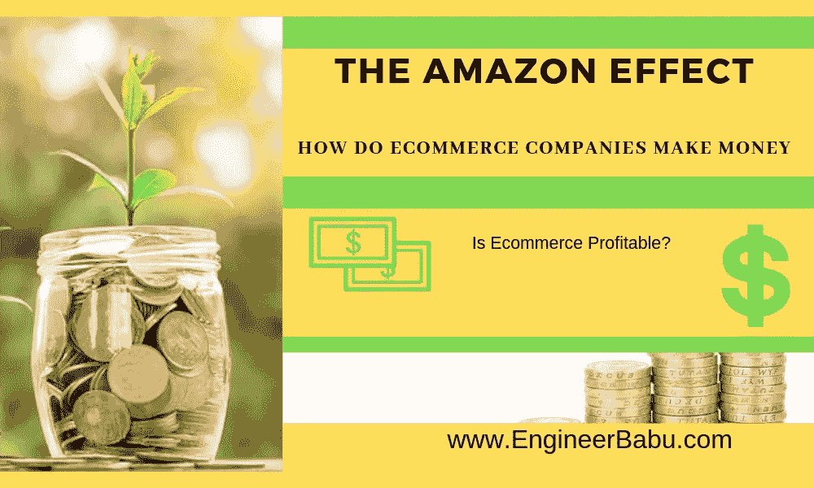
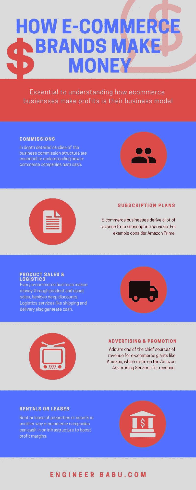
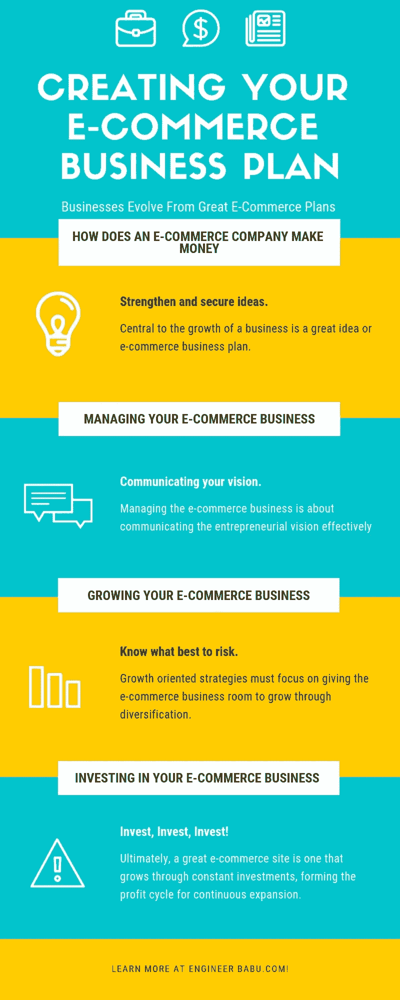

# 亚马逊效应:电子商务公司如何赚钱？

> 原文：<https://medium.com/hackernoon/the-amazon-effect-how-do-e-commerce-companies-make-money-720fc4daeba5>

亚马逊是业界一直期待的电子商务巨头。自 2014 年以来，净销售额一直在上升。2016 年，亚马逊攫取了总销售额的 70%，此后服务销售额一直在增长。对于所有那些想知道电子商务是否有利可图的人来说，答案在于亚马逊不可否认的成功，以至于“亚马逊效应”甚至已经进入了行业分析师的词汇。

就营业收入而言，服务销售的高利润率推动了增长。收入来源、AWS 服务和亚马逊 Prime 订阅也在以惊人的速度增长。

创收模式是电子商务商业计划的重要组成部分。任何希望了解如何开始一项成功的电子商务业务的人都需要明白,[赚钱](https://www.engineerbabu.com/blog/increase-online-sales-your-startup/)是繁荣的关键，而不仅仅是生存。电子商务商业模式释放价值，是价值的关键驱动力。独角兽和失败的创业公司之间有着天壤之别。对许多电子商务企业来说，扩大到 10 亿美元的价值是梦想成真。为了理解如何做电子商务业务赚钱，商业模式提供了进一步的清晰度。

# 进入独角兽圈子

无论是通过佣金、资产出售、订阅计划、广告、使用费、许可和出租或租赁，进入独角兽圈子不仅仅是遵循一种模式。像亚马逊这样的电子商务企业不会遵循一种模式。他们以混合的方式追随许多人，释放长期价值。以下是推动电子商务赚钱企业的因素:

# #1 固定订阅

Image by [Biljana Jovanovic](https://pixabay.com/users/BiljaST-2868488/?utm_source=link-attribution&utm_medium=referral&utm_campaign=image&utm_content=3219130) from [Pixabay](https://pixabay.com/?utm_source=link-attribution&utm_medium=referral&utm_campaign=image&utm_content=3219130)

注册卖家可以在电子商务平台上以固定的订阅费率托管产品。电子商务公司也可以收取固定的成交费。

# #2 佣金

Image by [Jonathan Rolande](https://pixabay.com/users/Jonathan_Rolande-6053547/?utm_source=link-attribution&utm_medium=referral&utm_campaign=image&utm_content=2564734) from [Pixabay](https://pixabay.com/?utm_source=link-attribution&utm_medium=referral&utm_campaign=image&utm_content=2564734)

根据产品类别，公司根据售出产品的价值向注册卖家收取一定比例的佣金。这个佣金一般在 5%到 20%之间。

# #3 物流

物流和运输是电子商务公司的额外收入来源。像 Flipkart、亚马逊、Snapdeal、Myntra 甚至 Jabong 这样的电子商务品牌赚取送货费。

# #4 深度折扣

网上零售商大幅打折的理由是，折扣是由注册卖家依次提供的。从 Flipkart 和亚马逊到 Snapdeal 和 Myntra，深度折扣的好处惠及所有电子商务企业。电子商务品牌配备了尖端的分析能力和专用资源，用于比较商店和网站的产品价格。基于与价格相关的研究，注册卖家可以锁定他们的价格。此外，卖家可以从在线零售商提供的折扣中获得补偿，从而实现双赢，此外，即使是最小的电子商务卖家也能获得公平的竞争环境。

网上购物仍然是成功的电子商务业务的核心，主要集中在网上购买和销售商品或服务。鉴于电子商务是增长最快的零售市场，预计到 2020 年销售额将达到 4 万亿美元，问题是“电子商务盈利吗？”只是一个空的！

# #5 找到正确的定位

在他们建立自己的网上商店之前，这些电子商务企业专注于销售什么和如何采购。找到一个成功的利基是掌握市场的关键。把握社交媒体的脉搏也能确保你的电子商务业务远远超过竞争对手。推荐的产品、评论和 YouTube 视频对于研究应该专注于哪些利基市场是有价值的。

# #6 利用社交媒体

一旦商店开张，你所需要知道的就是传播消息。为此，社交媒体仍然是一个强大的营销工具。领先的电子商务品牌，如亚马逊，甚至利基卖家都有自己的脸书商业页面。利用 Instagram 影响力赚钱是电子商务成功增长的另一个关键。

# #7 瞄准正确的受众

领先的电子商务零售商瞄准正确的客户。例如，如果电子商务业务是销售健身手表，重点是经常去健身房的活跃人士。如果出售减肥配方，你的目标是那些试图减肥的人。

# #8 利润再投资

随着业务规模和需求的增长，利润再投资是有意义的。毕竟，电子商务企业只有将资金投入到业务中，以迎合新涌入的客户，才能保持增长势头。

# #9 利用营销宣传材料增加流量

电子商务业务最难的部分是产生流量，大多数在线零售商依靠出色的营销宣传材料来消除噪音，并建立与客户产生共鸣的强大声音和品牌叙事。有效的集客营销活动推动增长。这些电子商务巨头的内容营销侧重于客户研究之旅，并解决客户的痛点。

# #10 设置目标广告

电子商务企业赚钱的另一种方式对其长期增长至关重要，那就是从一开始就瞄准客户和有利可图的利基市场的定向广告。使用特定产品广告帮助电子商务公司成长。再销售广告也是增长势头的催化剂。

# #11 使用多渠道产品分销方法

电子商务企业需要在一个以上的地点在线，以推动增长。电子商务业务的增长始于多元化，以清晰的分销渠道为支撑是关键。无论是亚马逊，还是易贝、沃尔玛、乐天等等，专注于优化和在多个渠道上市产品的公司都轻而易举地胜出。当产品通过授权经销商销售时，他们还拥有注册商标和保修。还与零售商和分销商就他们能卖什么和不能卖什么达成了明确的分销协议，包括质量控制、措施和反转移。这仍然是一个发展你的电子商务品牌的绝佳策略。

# #12 自动化流程

电子商务流程自动化程度越高，业务发展就越快、越容易。设置系统可能很费时间，但这是非常值得的。从订单执行到会计和营销，自动化可以对任何电子商务初创公司的效率、底线和利润率产生巨大影响。例如，销售数据从电子商务购物车自动转移到会计软件上。电子邮件跟进也会根据客户行为和资料自动进行。流程和系统越自动化，电子商务企业家就越能专注于业务的高价值增长活动。

# #13 投资搜索营销

尽管有有机接触，像亚马逊这样的平台也对产品进行排名。因此，在线零售商需要明确与商店和行业关键词相关的搜索营销策略。软件工具、案例研究、报告、指标和数据同样重要。

# 案例研究 1: Flipkart

B2C 电子商务公司 Flipkart 通过多种渠道销售产品，如网站、应用程序(移动和网络)、电话销售、联盟网络和社交购买。百分比佣金取决于产品和销售类型。根据税收和折扣的不同，税率可能在 5-20%之间。Flipkart 是一家在新加坡注册的公司，在印度设有子公司，旨在实现业务多元化，并从竞争对手那里获取收入模式。门户网站是收入的主要来源。此外，还有刊登费和便利费，以及运费和送货费。

Flipkart 运营着自己的支付网关、logisitcs、数字媒体和批发部门。它还通过 Myntra 等公司参与时尚类的竞争。Phone Pe 是其移动支付接口，与 Paytm 和其他移动支付 app 直接竞争。

除了有针对性的搜索结果和在线平台上的实体产品之外，Flipkart 还在其主页上出售联合品牌横幅广告，从而获得广告收入。Flipkart 庞大的用户群、日访问量、页面浏览量提供了令人难以置信的回报。一个很好的例子是 Flipkart 与小米在印度的合作。

# 案例研究 2:亚马逊

在杰夫·贝索斯愿景的推动下，以客户为中心是亚马逊的优势和 USP。亚马逊发现了拥抱这些的强大趋势。考虑到它对人工智能和机器学习的关注，以加速业务增长。根据类似的网络估计，仅在美国，亚马逊每天就有 27 亿次访问。平均而言，人们在网站上花费超过 6 分钟，浏览多达 9 个页面来购买他们想要的东西！亚马逊是美国第四大最受欢迎的电子商务网站。

亚马逊关注的焦点是选择、价格、便利性，进而是顾客。该网站旨在方便访问。亚马逊也是一家兼职制造商，销售 Kindle 电子阅读器和 Fire 平板电脑等电子设备。大幅折扣、亚马逊 Prime 的免费送货以及一系列以客户为中心的举措，使亚马逊成为一家卓越的电子商务公司。

它还提供一些项目，帮助卖家发展业务，在自己的网站和品牌网站上销售产品，并通过亚马逊完成订单。对于其卖家项目，亚马逊在其他类型的补偿中赚取固定百分比的费用。

亚马逊还通过其 AWS 或仓储系统为不同规模的开发者和企业提供服务。提供广泛的全球计算、存储、数据库和服务产品。

通过其出版服务，其遵循的电子商务商业模式允许作者和出版商选择 70%的版税选项，并通过 Kindle 和亚马逊出版提供图书。应用开发者、音乐人、电影制作人进一步在亚马逊上发布和销售内容。

简而言之，亚马逊致力于为几个利益相关者创造价值。

## 亚马逊是怎么赚钱的？

亚马逊的大部分收入来自产品销售。产品成本很高，所以亚马逊的利润很薄。他们的运营收入来自 AWS、亚马逊 Prime 和卖家服务等服务。亚马逊的商业模式从亚马逊广告、亚马逊 Prime、亚马逊 AWS 等利润率较高的产品中获取利润。网上商店是进一步发展的基础。

亚马逊从客户那里快速收取款项，然后以更长的付款期限向供应商付款。这家电子商务巨头利用短期流动性进行投资，以加速其增长。通过这一点，亚马逊已经成为一股颠覆性力量，为整个行业提供了灵活性。

## 数字

与 2018 年相比，亚马逊在 2017 年前 9 个月的广告收入翻了一番。收入从 2017 年的 29.2 亿美元增长到 2018 年的 67.2 亿美元。与脸书的 383.7 亿美元和谷歌更令人印象深刻的 836.8 亿美元相比，亚马逊仍然是一个新兴的参与者。但考虑到它经营着多元化的电子商务业务，有几个收入来源，亚马逊有许多化身。除了令人印象深刻的基础设施外，它的广告业务在 2018 年的前几个月就实现了 60 亿美元的收入。亚马逊 Prime 仍然是一个强大的商业催化剂，亚马逊 AWS 也是如此，后者在 2017 年价值 170 亿美元。

# 底线

联盟链接、在线广告和赞助可以带来收入。但是，在电子商务行业建立一个收入来源多样化的完整企业需要创新。电子商务是在线零售商和公司赚钱的常见商业模式。只要利润得到管理，流程得到扩大，这些业务就会蓬勃发展。

# 总结想法

亚马逊的创始人杰夫·贝索斯说，他的网络巨擘努力成为“一个顾客可以找到和发现任何东西的电子商务目的地”从更大的范围来看，技术是答案，因为当电子商务价格下降而不是飙升时，利润率将会增长。从长远来看，除了提供大幅折扣之外，那些扩大规模的公司正在电子商务行业取得成功。这是他们成长背后的秘方，也是他们成功的秘诀！

## 看我的其他相关文章

1.  [**2019 年 7 大电商趋势**](https://www.engineerbabu.com/blog/ecommerce-trends/)
2.  [**你的电子商务网站的 5 个安全提示**](https://www.engineerbabu.com/blog/5-security-measures-for-your-ecommerce-business/)
3.  [**全球最大的电子商务公司**](https://www.engineerbabu.com/blog/largest-ecommerce-companies-in-the-world/)
4.  [**如何开展电子商务业务**](https://www.engineerbabu.com/blog/how-to-start-an-ecommerce-business/)
5.  [**2019**](https://www.engineerbabu.com/blog/best-ecommerce-platform-for-small-business/)小型企业最佳电子商务平台