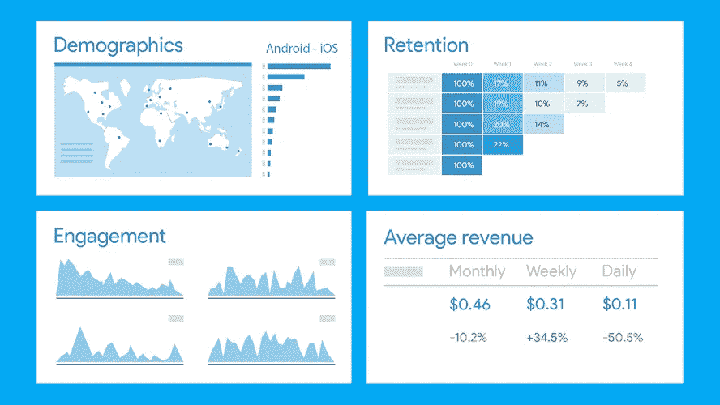
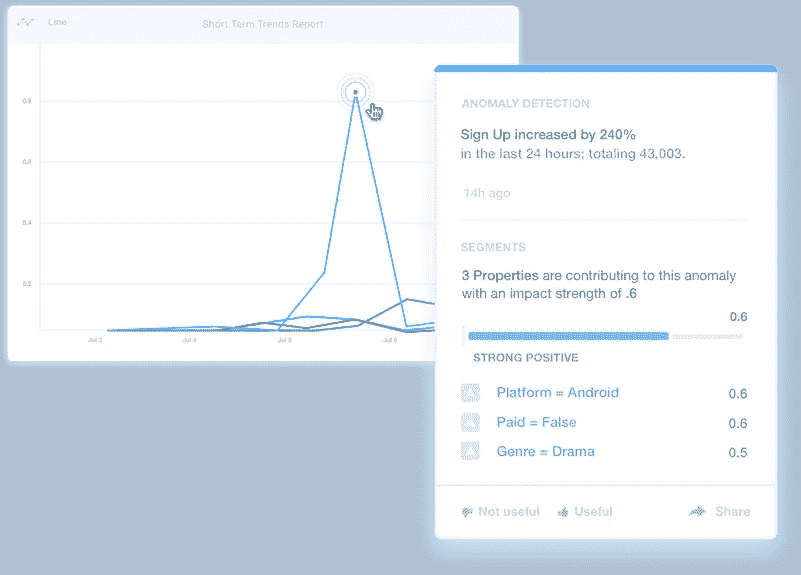
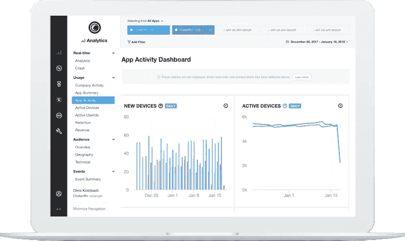
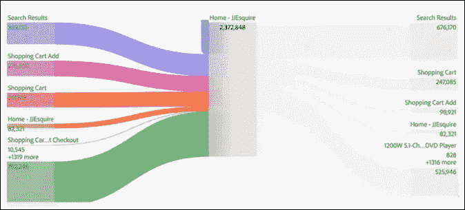
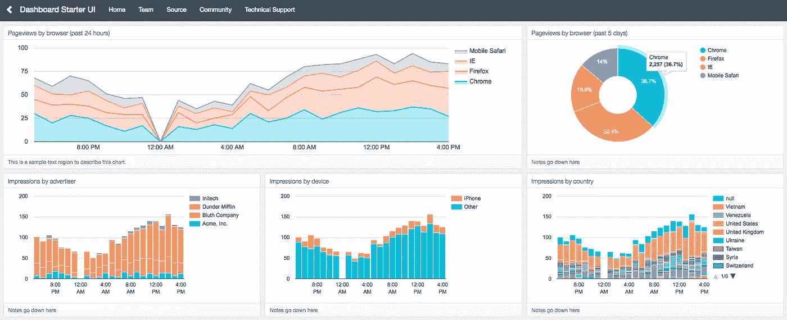
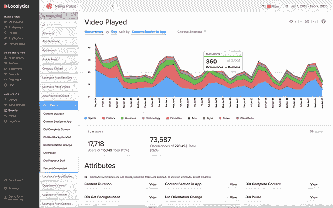
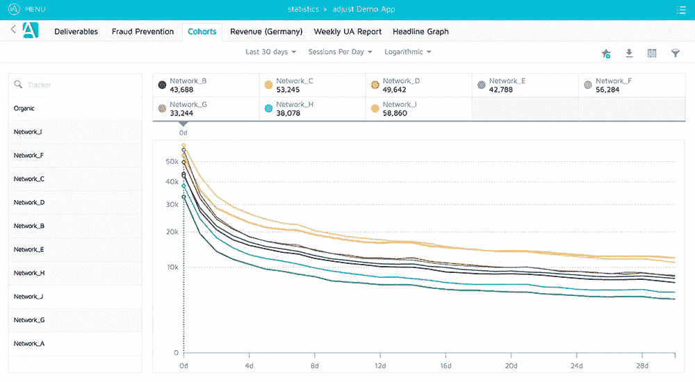
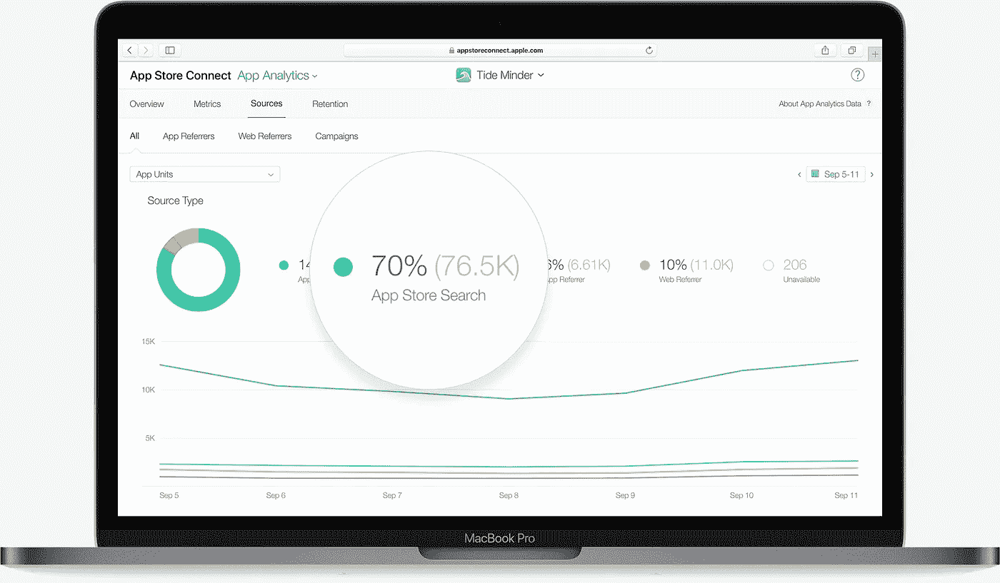
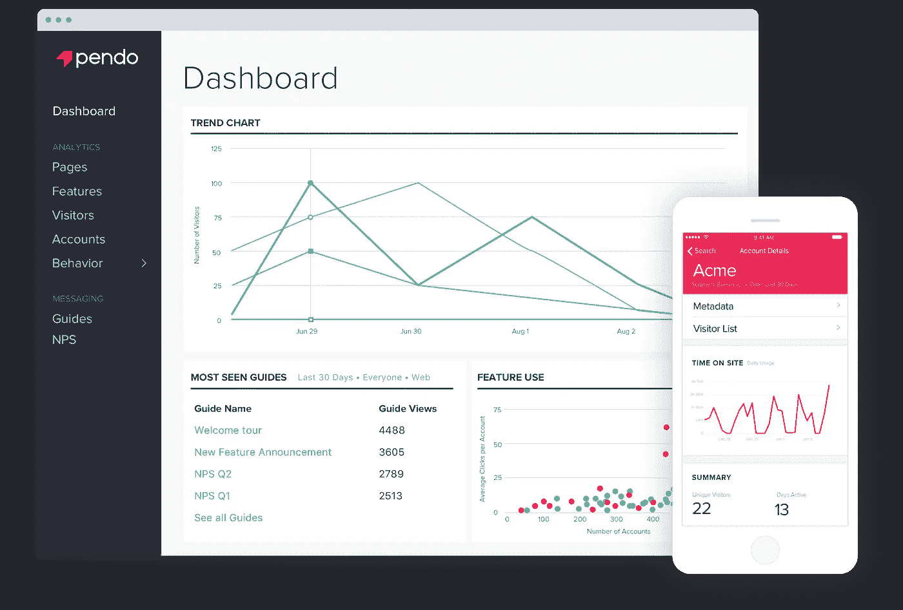
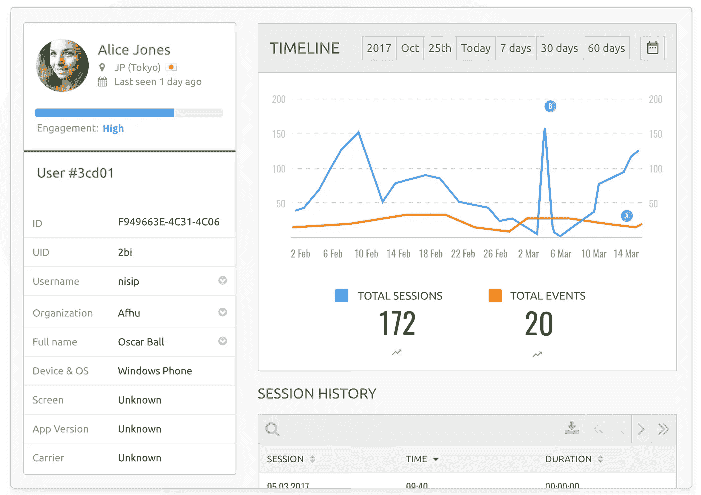

# 应用说话了:13 大 iOS 应用分析平台[2019]

> 原文：<https://medium.com/hackernoon/the-apps-have-spoken-top-13-ios-app-analytics-platforms-2019-73cee47ef54f>

Image: Unsplash

对于苹果公司来说，这是经历了大起大落的一年。这家科技巨头庆祝了 App Store 十周年，达到了一些新的金钱里程碑，经历了公关高潮和低谷，并推出了一系列新玩具。iOS 应用开发团队获得了一些新技术:iOS 12、 [Siri 快捷方式](https://www.imore.com/apps-work-siri-shortcuts)和 ARKit 2。随着 [2019 年预测](https://www.tomsguide.com/us/apple-2019-predictions,review-6045.html)包括屏幕尺寸的更多变化、改进的图形和 iPhone 11，即将到来的一年承诺会有更多的变化。

面对如此多的新创新，移动应用专业人士如果想跟上步伐，就有自己的工作要做。更快的性能和边缘到边缘的显示意味着更少的用户挫折感和更多的屏幕空间，但产品团队应该确保他们的应用程序通过每个新的更新和功能满足用户的期望。

这就是选择正确的 iOS 应用程序分析工具发挥重要作用的地方。供应商正在继续扩展他们的能力，构建额外的集成，并添加新的功能。为了帮助您就使用什么工具做出明智的决定，我们创建了一个最新的市场上最好的应用程序分析工具列表。我们研究了 App Store 中热门应用使用的分析 SDK，并列出了它们的主要功能和定价。请记住，构建任何应用分析堆栈通常需要多个 SDK，因此请注意每个工具的关键功能。他们中的许多人提供免费试用，所以你可以混合搭配，直到找到适合你需要的组合。

事不宜迟，以下是 2019 年 13 款最佳 iOS 应用分析工具。你将使用哪一个(些)来给你的应用带来最好的一年？

# iOS 应用分析工具#1: [Firebase](https://firebase.google.com/)

*“Firebase 帮助移动应用团队取得成功。”*

Image: Firebase

Firebase 建立在 Google 基础设施上，是一套产品，可以单独使用或组合使用，以加快和改善应用程序开发、用户体验和增长。Firebase 强大的 iOS 应用分析可以跨不同平台跟踪用户从获取到应用内使用的过程。Firebase 使用机器学习来提供智能用户细分和预测分析。iOS 开发人员还可以使用 Firebase 来监控流行的 Crashlytics 工具的性能问题。

特点:

*   预测分析
*   使用 Crashlytics 进行崩溃报告
*   跨平台用户跟踪
*   与谷歌的移动工具套件集成

价格:[免费、固定价格和现收现付计划](https://firebase.google.com/pricing/)

免费试用:[是](https://console.firebase.google.com/?pli=1)

# iOS 应用分析工具#2: [应用参见](https://www.appsee.com/?cpnid=701b0000000Wd7c&utm_source=medium&utm_medium=text_link&utm_campaign=ios_app_analytics_tools_2019&utm_content=appsee_home_link)

*“前所未有地了解应用内体验”*

Image: Appsee

作为定性应用分析的市场领导者，Appsee 的强大平台超越了数字指标，为产品经理、UX/UI 设计师、开发人员和移动营销人员提供了强大的现成工具。Appsee 提供会话记录和触摸热图，准确显示用户如何体验应用程序的每个屏幕和功能。这些工具与转换漏斗、崩溃报告、导航路径和 UI 分析等功能相结合。它们有助于确保对用户行为、可用性、导航等的深入、可操作的洞察。Appsee 帮助整个移动应用团队更快地做出数据驱动的决策，[减少猜测](https://blog.appsee.com/qualitative-analytics-no-time-guesswork/?cpnid=701b0000000Wd7c&utm_source=medium&utm_medium=text_link&utm_campaign=ios_app_analytics_tools_2019&utm_content=qualitative_analytics_no_time_guesswork)，并提高保留率和转化率。

特点:

*   定性分析:用户会话记录、触摸热图
*   通过电子邮件、Slack 或 SMS 警报进行崩溃分析和报告
*   转换漏斗、行动队列和导航路径
*   事件和手势的自动标记

价格:[免费、高级和企业计划](https://www.appsee.com/plans?cpnid=701b0000000Wd7c&utm_source=medium&utm_medium=text_link&utm_campaign=ios_app_analytics_tools_2019&utm_content=plans)

免费试用:[是](https://www.appsee.com/start?cpnid=701b0000000Wd7c&utm_source=medium&utm_medium=text_link&utm_campaign=ios_app_analytics_tools_2019&utm_content=free_trial_link)

# iOS 应用分析工具#3: [Mixpanel](https://mixpanel.com/)

*“创造人们喜爱的产品和体验。”*

Image: Mixpanel

Mixpanel 使产品和营销团队能够通过机器学习驱动的自动洞察对他们的数据采取智能行动。Mixpanel 的广泛平台包括用户流和转换漏斗等工具，有助于了解用户行为，提高参与度、留存率和忠诚度。Mixpanel 的预测功能甚至可以预测未来的用户行为和转化率。Mixpanel 还超越了分析领域，包括通过电子邮件、推送通知和应用内消息重新参与的工具，以及在平台内运行 A/B 测试的工具。

特点:

*   自动洞察
*   预测分析
*   转换漏斗

价格:[免费，启动计划，按需企业计划](https://mixpanel.com/pricing/)

免费试用:[是](https://mixpanel.com/register/)

# iOS 应用分析工具#4: [Flurry](http://www.flurry.com/)

*“面向移动应用的可操作分析”*

Image: Flurry

作为最受欢迎的 iOS 应用分析工具之一，Flurry 可以实时跟踪和比较整个应用组合的指标，包括 iOS、tvOS 和 watchOS 应用。Flurry 的可定制仪表板放大了用户行为、获取、转化、保留和收入。你甚至可以使用 Flurry 的机器学习来获得年龄和性别等观众指标的预测。Flurry 还包括经典的深入工具，如群组、用户路径和转换漏斗，以及崩溃分析功能。

特点:

*   预测分析
*   用户路径
*   用于采购、转换和保留的可定制仪表板

价格:免费

免费试用:[是](https://dev.flurry.com/metrics/1)

# iOS 应用分析工具#5: [Adobe Analytics](https://www.adobe.com/analytics/adobe-analytics.html)

*“通过 Adobe Analytics 了解饮食和呼吸。”*

Image: Adobe Analytics

Adobe Analytics 是一款面向企业应用的工具，提供了从属性到营销的全套工具。这些工具包括高级细分、用户流和协同等。Adobe 的分析工具实时收集数据。它们还包括基于人工智能和机器学习的预测分析，可以预测未来的行为，如流失或转换预测。

特点:

*   基于人工智能和机器学习的预测分析
*   自动异常检测
*   用户流量和群组分析

价格:[企业](https://www.adobe.com/analytics/compare-adobe-analytics-packages.html)

免费试用:否

# iOS 应用分析工具#6: [Keen](https://keen.io/)

*“在一个下午，而不是几个月内发布面向用户的指标”*

Image: Keen

Keen IO 是一个基于云的分析数据库，供开发人员创建“内部分析数据库的替代方案”。它实时传输任何用户交互的数据，然后将其存储在一个为存储事件数据而优化的数据库中。一旦收集到数据，开发人员就可以使用 Keen 的 API 对其进行分析。通过简单的查询，移动应用专业人员可以使用该平台查看带有漏斗、细分、群组分析等的自定义仪表盘。

特点:

*   批量上传历史数据
*   具有丰富属性的自定义事件跟踪
*   可定制的仪表板

价格:[按用途](https://keen.io/pricing/)

免费试用:[是](https://keen.io/signup?=pricing)

# iOS 应用分析工具#7: [Localytics](https://www.localytics.com/)

*“实时洞察推动更智能的移动应用参与度”*

Image: Localytics

Localytics 将强大的营销自动化平台与移动分析功能相结合，以提高参与度并改进功能。Localytics 分析整个用户旅程，甚至可以跟踪应用程序卸载。可定制的仪表盘和过滤器能够让移动应用团队的每个成员一目了然，详细了解与他们最相关的数据。Localytics 还包括一个行业基准功能，以便您可以将您的移动应用程序与行业中的其他应用程序进行比较。

特点:

*   预测分析
*   卸载跟踪
*   行业基准

价格:[根据要求](https://www.localytics.com/contact-sales/)

免费试用:否

# iOS 应用分析工具#8: [振幅](https://amplitude.com/)

*“创业公司产品分析”*

Image: Amplitude

振幅通过分析每一次用户互动，帮助你回答用户行为问题，提高转化率。Amplitude 最大的优势之一是其强大的动作群组工具，它有助于了解用户如何与应用程序交互，以及是什么让他们回来。振幅可以识别可能转化或成为忠实用户的不同人物角色。Amplitude Insight 使用机器学习来发送关于各种 KPI 的智能警报，帮助移动应用团队在转化率和保留率的波动中领先一步。

特点:

*   行为协同
*   基于机器学习的智能警报
*   单用户分析

价格:[免费/付费计划](https://amplitude.com/pricing)

免费试用:否

# iOS 应用分析工具#9: [调整](https://www.adjust.com/)

*“实时发现用户行为”*

Image: Adjust

Adjust 为移动营销人员提供从归属到卸载/重新安装的端到端应用分析。其可定制的事件跟踪可以涵盖每个事件和转换目标，从最初的下载和注册过程到购买完成。Adjust 的群组分析通过根据各种指标和过滤器对用户进行细分，帮助发现用户行为模式。Adjust dashboard 以其圆滑的用户友好设计而闻名，并且是高度可定制的。

特点:

*   卸载跟踪
*   漏斗和群组分析
*   可定制的事件跟踪

价格:[根据要求](https://www.adjust.com/pricing/)

免费试用:否

# iOS 应用分析工具#10: [苹果应用分析](https://developer.apple.com/app-store-connect/analytics/)

*“通过分析获得洞察力”*

Image: Apple

苹果的 App Analytics，通过 App Store Connect，包含在苹果开发者计划会员中，因此不需要编码或复杂的设置。免费的 iOS 应用分析平台跟踪 iOS、macOS 和 tvOS 应用的用户参与和营销的基本指标。它还提供了从 App Store 获得用户的数据，以及一个根据 iOS 和应用版本过滤崩溃的崩溃分析工具。

特点:

*   用户参与度指标
*   App Store 收购数据
*   崩溃分析

价格:免费

免费试用:否

# iOS 应用分析工具#11: [Pendo](https://www.pendo.io/)

*“Pendo 让软件可爱”*

Image: Pendo

Pendo 提供深入的产品分析，帮助您了解谁是您的超级用户，以及用户在应用程序中实际做了什么。Pendo 的细分功能包括对不同细分市场的用户行为进行并排比较。如果您的公司有多个应用程序，您可以在您的整个产品组合中使用 Pendo 的分析工具，并比较性能、参与度和保留率。你甚至可以使用 Pendo 通过 A/B 测试优化你的应用，运行实验，而无需编写任何代码，甚至无需发布版本更新。

特点:

*   自定义分段
*   A/B 测试
*   应用内消息、调查或演练

价格:[根据要求](https://www.pendo.io/pricing/)

免费试用:否

# iOS 应用分析工具#12: [Countly](https://count.ly/)

*“安全且可扩展的产品分析”*

Image: Countly

Countly 的可定制仪表板使用插件，您可以选择这些插件来跟踪用户行为分析、崩溃、保留甚至收入。漏斗、用户流量和群组分析向你展示用户如何在你的应用中导航，以及他们落在哪里。Countly 的“Drill”工具通过用户友好的内置查询生成器更深入地挖掘应用程序的数据来帮助回答紧迫的问题，不需要复杂的 SQL。另一个有用的功能是显示单个用户的旅程，让你看到特定用户如何浏览你的应用程序。Countly 支持 iOS、watchOS、tvOS 和 macOS。

特点:

*   漏斗、群组和用户流
*   易于使用的查询生成器
*   崩溃分析

价格:[免费/定制付费计划](https://count.ly/pricing)

免费试用:[是](https://count.ly/)

# iOS 应用分析工具#13: [堆](https://heapanalytics.com/)

*“跟踪客户数据的新标准”*

Image: Heap

Heap 是一种无需代码的点击式方法，可通过聚合和单用户级别的 iOS 应用分析来了解用户行为。它通过跨不同渠道自动收集每个用户交互的数据，使团队能够更快地做出数据驱动的决策。Heap 的转换漏斗提供跨用户群或归属渠道的信息，以准确定位用户下降的位置并帮助理解原因。动态协同功能支持创建用户细分，然后将它们与各种用户属性相结合。这有助于了解用户偏好，提高 LTV。

特点:

*   使用事件可视化工具进行点击式无代码安装
*   跨渠道分析
*   转换漏斗和动态协同

价格:[小型项目免费，中小型企业固定价格，企业按需定价](https://heapanalytics.com/pricing)

免费试用:[是](https://heapanalytics.com/signup)

# TL；博士:

随着 iOS 应用程序开发团队准备迎接又一个激动人心、充满挑战和行动的一年，现在是时候审查您的分析堆栈了。为您的 iOS 应用程序选择高质量的分析可以决定 KPI 的实质性改善和危险的下降。为什么？如果你和你的团队不理解来自你的分析的数据实际上意味着什么，你将最终在猜测、混乱和错误上浪费时间和资源。一个好的分析工具将帮助你回答正确的问题，而不是制造更多令人困惑的问题。在你开始你的 2019 年路线图之前，确保你的工具箱里有强大的工具。

逛商店寻找其他工具，如归因、A/B 测试、营销或崩溃分析？ [**下载我们的免费终极 SDK 指南**](https://www.appsee.com/ebooks/sdk-guide?cpnid=701b0000000Wd7c&utm_source=medium&utm_medium=CTA_text&utm_campaign=ios_app_analytics_tools_2019&utm_content=sdk_guide_2019) **获取年度最佳移动应用 SDK 目录。**

*想要更多关于使用移动应用程序分析而不失去理智的建议吗？*

 [## 如何在没有真正尝试的情况下成功进行移动应用分析

### “分析”是一个可怕的词。它通常意味着充满数字的图表、彩色图表覆盖的屏幕和时间——

medium.com](/nyc-design/how-to-succeed-in-mobile-app-analytics-without-really-trying-d159fd2f5cf5)