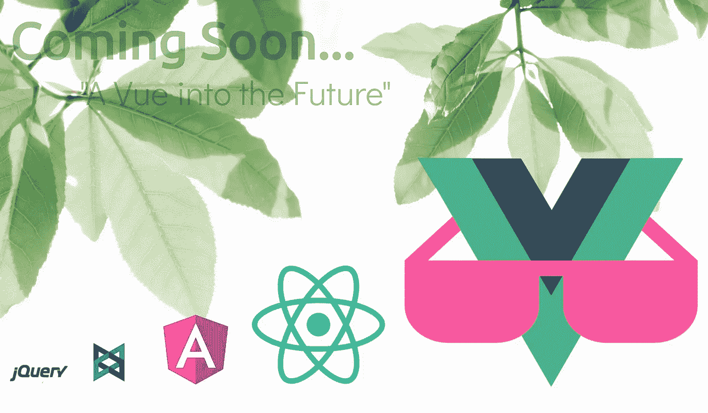
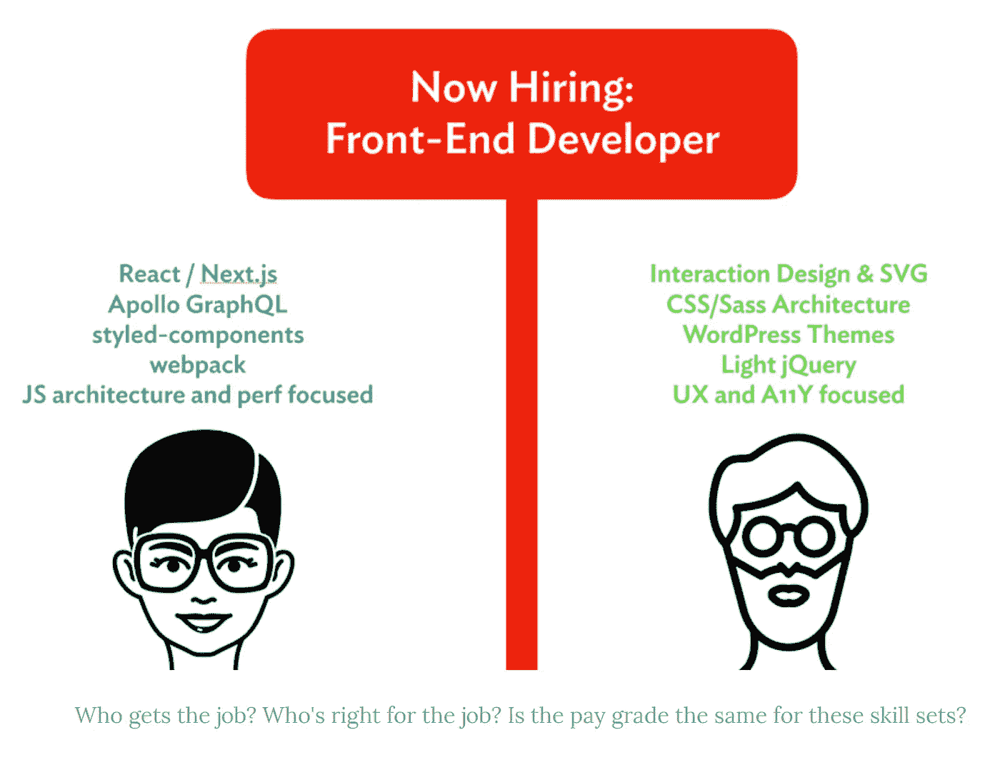
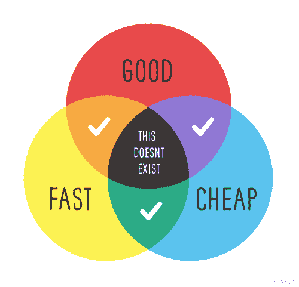
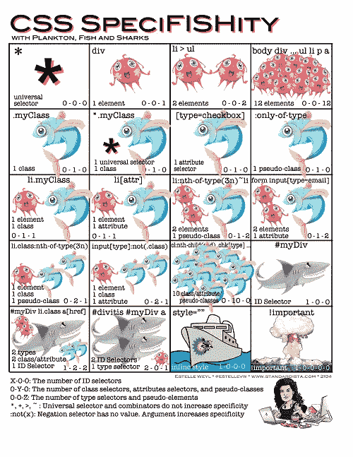
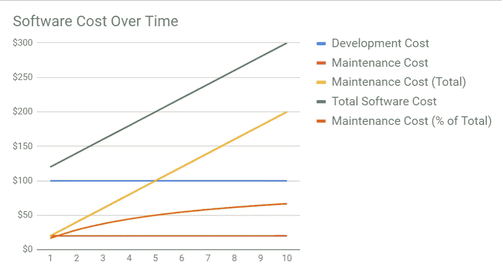
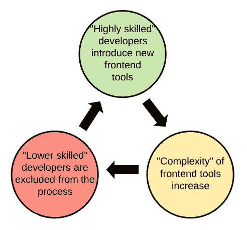

# 前端开发的“后端化”

> 原文：<https://medium.com/hackernoon/the-backendification-of-frontend-development-62f218a773d4>


# 执行摘要(TLDR)

单页应用程序(SPA)形式的同步 JavaScript 为改善 web 应用程序的用户体验提供了一个不可思议的机会。像 Bootstrap 这样的 CSS 框架使开发人员能够在处理事物的结构和行为时快速贡献样式。

不幸的是，SPA 和 CSS 框架倾向于导致相对复杂的解决方案，其中传统上分离的关注点——HTML 结构、CSS 样式和 JS 行为——被理所当然地混合在一起— **,与前几代人学到的经验相反。**


CC BY-SA [401(K) 2012](https://www.flickr.com/photos/68751915@N05/6355351769)

这种关注点的混合会阻止初级开发人员和有价值的专家(例如视觉设计、可访问性、搜索引擎优化和国际化)对项目做出有意义的贡献。

除了少数开发人员 ***有能力*** 处理所有这些问题的成本增加之外，它还会导致其他现实世界的商业影响。

例子包括:

*   诉讼
*   平坦增长
*   无法旋转
*   错过的机会
*   招聘和人员配置噩梦

随着可维护性问题的暴露，看似谨慎的技术决策可能会导致长期成本。

这种趋势的潜在原因可能是传统后端开发人员转移到前端，这与 web 应用程序从服务器端向客户端的转移相一致。在试图增加他们自己的弱点时，这些新加入者正在引入服务于他们自己需求的工具和实践，但是没有考虑到组织的整体。

如果需要 CSS 框架的前期价值，建议您避免将它们直接嵌入到您的应用程序中。相反，将它们用作围绕特定领域业务语言设计的内部 CSS 框架的装饰者。

对于 SPA 框架，建议采用强制健康分离关注点的编码实践。虽然这可以通过 React 来完成，但 Vue.js 提供了一种更好的方法来实现这一点，它可以邀请更传统的前端开发人员进行更好的协作。

# 索引

*   **前言**
*   **背景**
*   **历史:**异步 JavaScript | CSS 框架
*   **症状:** Div 汤|勾兑关注
*   **问题:**难以捉摸的忍者|专业知识的丧失|灵活性的丧失|问题影响摘要
*   **根本原因:**后端化
*   **解决方案:**处理 CSS 框架|处理 SPA 框架



Clap and Follow: [**大分裂**](https://medium.com/u/d8dc491ddf49#comment-1663775) 的文章，对这一现象的症状进行了更深入的探讨。如果你渴望得到“后端化”更详细的证据，我强烈推荐你读一读。否则请继续阅读我对**问题的分析，它的起源，以及一些可用的解决方案**。

Stolen from Chris… Muhahahaha!

# 问题

## 难以捉摸的忍者

2014 年，前端开发者客观上比后端开发者便宜。5 年后，[前端现在是全栈](https://speakerdeck.com/xbill82/the-frontend-is-a-fullstack)。


HIPPO

你可能已经注意到，在你的工作描述中，你列出的*必备*已经成倍增长。你的顶尖人才正在被挖走，你想要的候选人正被其他地方以更高的工资、更好的福利和更灵活的工作安排所吸引。

不要误解我的意思，这至少对社会的一小部分是积极的，但对任何试图经营中小型企业(SMB)的人来说可能是毁灭性的。

当你的成功战略取决于你招募、训练和留住全明星阵容的能力时，你可能会发现自己在原地打转。

## 专业知识的丧失

忍者其实是不存在的。万事通实际上什么都不是。作为一个多面手，我充分意识到你不可能擅长所有的事情(尽管我在努力)。虽然多面手肯定在你的业务中有一席之地，但它可能不应该在你的代码库深处独自工作。


当团队中的每个开发人员都是“JavaScript 忍者”时，您实际上让自己暴露在盲点中。毫无疑问，各地的应用程序都充斥着悲惨的`<div className="btn" onClick={this.handleClick}>`事件。

你说“谁在乎，它工作得很好”？虽然它可能对身体健全的人有效，但是那些依赖辅助技术的人将完全无法访问你的应用程序的某些部分。

预先的可访问性(A11Y)通常会为每个人带来更好的用户体验，所以如果你在这里走捷径，你可能不仅仅是在视觉上、身体上或认知上有障碍的人。

如果你没有道德上的压力，那么也许你更受金钱的驱使。你真的应该考虑这样一个事实，A11Y 的疏忽实际上代表了 ***重大的经济风险*** ，无论是从[失去的商业机会](https://en.wikipedia.org/wiki/Web_accessibility#Web_accessibility_legislation)还是从[诉讼的威胁](https://508compliantdocumentconversion.com/section-508-lawsuits/)来看。

> [国家盲人联合会]和 Sexton 声称 Target.com 违反了[美国残疾人法案]，因为**盲人用户不能浏览产品和购买他们想要的项目。盲人用户也无法获得就业机会、投资者新闻和公司政策等信息**。NFB 和塔吉特公司于 2008 年 8 月 27 日达成和解，赔偿 600 万美元，外加额外的损害赔偿和严格的持续监控，以确保持续的可访问性。

此外，为了简单地让它工作，您的 JavaScript 专家可能会忽略用于改进您的搜索引擎优化(SEO)的简单技术。这一点可能会造成很大伤害，因为相对于不断上升的燃烧率，收入持平可能会给任何企业带来致命打击。如果你的产品完全没有吸引力，那么它再好也没用。

## 灵活性的丧失

像 Bootstrap 和 React 这样的框架很有吸引力，因为它们提供了令人难以置信的前期速度。Bootstrap 通常被认为是一种优秀的原型工具。然而，原型工具固有地产生成品的低成本、低保真度的表示。



Good-Fast-Cheap: Pick Two.

甚至“自举”这个词也意味着用有限的资源工作。在“好-快-便宜”模式中，你选择的是快和便宜——不管这个决定是有意识的还是无意识的。换句话说，你选择投资一个充满技术债务的产品。

不相信我？想象一下你的造型开始过时的未来。新的竞争带来了更具吸引力的用户体验，是时候升级你的游戏了，否则你将面临被抛弃的命运。



你开始了一个重塑品牌的项目，从调整 Bootstrap 无穷无尽的“方便”变量开始。你在虚幻选择的不可避免的瘫痪中幸存下来，却发现你所希望的改变只是和你轮换的开发人员一致。

此外，您真正想要的深度定制包括构建一个复杂的 CSS 特异性黑客迷宫，以覆盖 Bootstrap 对直接死者选择器的自由使用。

你想修改布局，但是你发现每个组件都用一堆`col`类硬编码。可悲的是，每个元素都在各种屏幕分辨率下争夺空间。这里一个变化需要那边多五个。


除了每一个改变都需要深入到不可读的结构、风格和行为代码的蛛网中，这些代码被塞进了你的无限分割的基于组件的架构中的每个文件底部的渲染函数中…

🤯

10 磅咖啡，几个月后，你有点准备好再次在价值上竞争(但不是真的)…

如果你的目标是短期收购，你可能不在乎。但是请记住，技术的灵活性和敏捷性就是力量。如果你的产品的长期愿景是一个缓慢倾斜的机器，你可能会发现自己在谈判桌上地位低下。

## 问题影响摘要

在飞涨的劳动力成本、诉讼风险、被放弃的商业机会、有限的客户获取以及无法快速掌舵之间，看似无关紧要甚至是明智的技术决策突然产生了现实世界的商业后果。

对于从事 ***的 ***一些*** 组织，一些*** 类型的应用程序，我所讨论的一切都可能完全在掌控之中。然而， ***其他*** 从事 ***其他*** 类型应用的组织，可能会盲目地步入长期承诺的高维护噩梦。


请记住，与开发相比，软件将在维护中度过其生命的大部分时间。快速搜索发现以下维护成本分配的经验法则:

*   年度维护=初始支出的 15–20%。
*   终身维护=总支出的 40–80%(平均 60%)。

以下是 100 美元的初始开发费用在 10 年内每年维护 20%的情况:



如您所见，维护成本在短短 5 年内就超过了开发成本。在第 7 年和第 8 年之间，它跨越了 60%的总成本阈值。

然而，这是一种简化。最有可能的是，开发将贯穿应用程序的整个生命周期，项目越大，维护就越困难。从长期来看，短期目标会导致长期后果，而这种后果只会随着时间的推移而加剧。

我也想知道不可维护的项目是如何被排除在这些经验法则之外的，仅仅因为维护成本变得如此之高，以至于这些项目作为失败而被放弃了…

# 根本原因

我相信从服务器端到客户端应用程序的重大转变将大量有才华的开发人员从后端拉到了前端。这些程序员有着完全不同的优势和劣势，他们开始改变前端开发的方式来适应他们自己的需求和偏好。

这只是一个纸上谈兵的假设，但我认为这个图表有助于解释我们发现自己所处的恶性循环:



Skill Gap Preclusion Cycle

您会注意到图表中“引号”的自由用法，这是有充分理由的。“高度熟练”只是相对于其他开发人员引入前端工具的能力而言。“复杂性”是相对于正在解决的问题而言的。“低技能”是相对于现在生产中使用的工具的复杂性而言的。


有理由假设“高技能”开发人员正在引入工具，这些工具在前端扩大了他们自己的弱点，而不是增强了整个组织的能力。例如，从使用 CSS 框架中获益最多的人是最没有能力维护 CSS 的人。

我在 Bootstrap 支持者中听到的一个常见主题是“创建一个好看的工作原型是多么容易”。类似地，React 的支持者会说“*我喜欢我永远不必离开 JavaScript* ”。

如果这些是您的组织中的主导叙事，您的技术堆栈可能是围绕碰巧在前端工作的更传统的后端开发人员的需求而设计的。

我曾经目睹了一场关于基础设施解决方案的激烈辩论，其中一方指出:

> “这使得**简单的任务变得困难**，为了让**琐碎的任务变得更加容易**。”

当我看到我们的团队试图使用 Bootstrap 和后来的其他替代方案来解决的事情类型时，我觉得没有必要。对我来说，他们试图用一个笨拙的解决方案来规避一个微不足道的问题。不幸的是，琐碎是一个相对的术语。对于这些工具的支持者来说，他们为看似严峻的挑战提供了解决方案。

# 解决方法

## 处理 CSS 框架

为了开始减少你对 Bootstrap 这样的框架的依赖，我的建议是停止将框架特定的类直接应用到你的 HTML 中。相反，我会鼓励以下行为:

```
%our-warning-button {
   @extend .btn;
   @extend .btn-warning;
}.empty-shopping-cart-button {
  @extend %our-warning-button;
}
```

这种方法通过将应用程序视为您自己内部 CSS 框架的“装饰者”,帮助您将应用程序从 CSS 框架中分离出来。现在，您可以轻松地交换框架、覆盖样式，甚至滚动自己的代码，而不会牺牲前期速度。


集中样式的能力意味着用户界面设计者可以在 CSS 上工作，而不用进入组件的迷宫。领域特定语言的使用还允许与整个组织中的非技术团队成员和风险承担者进行更好的交流。

最后(也是最重要的)，你现在已经清楚地分离了你的结构和风格。

## 处理 SPA 框架

这可能会有争议，感觉像一个难以置信的长期骗局，但我建议从 React 转向 Vue.js，原因如下:

```
<template>
    <!--Structure-->
</template><script>
    <!--Behaviour-->
</script><style>
    <!--Style-->
</style>
```

你在这里看到的是 Vue 的“[单个文件组件](https://vuejs.org/v2/guide/single-file-components.html)”，它鼓励关注点的清晰分离。我非常喜欢 Vue 的这一点(以及他们对简单性的普遍承诺)。

我认为使用 Vue 有一个非常强大的商业案例，因为它降低了非 JavaScript 开发人员参与和贡献的门槛。除了他们专业技能的价值，他们还会解放你的忍者，让他们在其他地方展现惊人的才华。


不要误解我，Vue 拥有 React 这样的框架的所有特征。它非常灵活，允许你创建任何你喜欢的泥球。类似地，React 可以以这样一种方式实现，它开始变得更容易接近(尽管远没有 Vue 那么容易接近)。

总的来说，我的建议只是采用强制关注点分离的编码实践。简化成一套简单的规则，我会说:

> 1.不要在你的模板中放任何不是直接引用预先计算好的数据、方法或组件的东西。
> 
> 2.仅通过您自己设计的类来应用样式，并尽可能避免使用样式属性。

以上加上[将你的代码库分成智能和非智能组件](https://alligator.io/react/smart-dumb-components/)应该让你的 HTML 保持足够的逻辑性和风格自由。这可能会消除一些捷径，但长期的可维护性回报将超过最初的前期成本。

不过，我会留给你最后一个问题:

> “我们选择的工具会影响我们的职业生涯。”
> [我擅长 JavaScript，我发誓](https://www.youtube.com/watch?v=4zhDQe8Bvnw)。— jsday 2017，[何塞·佩雷斯·阿吉纳加](https://www.linkedin.com/in/ACoAAAJ84fsBBl50QvCB0HAF9mA0pitUZbfufgk/)

明智选择！