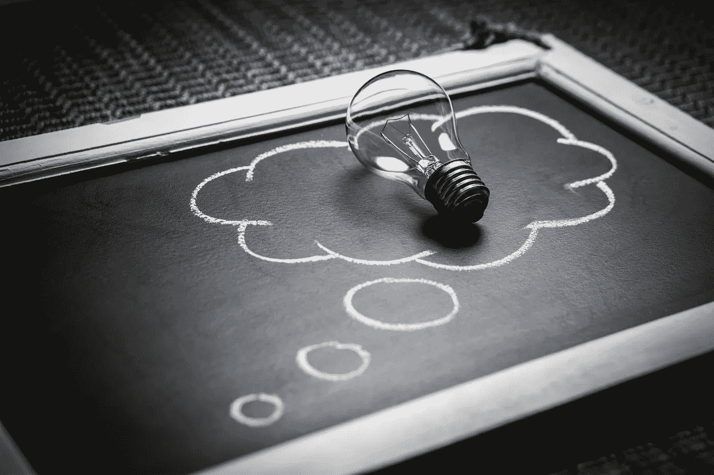
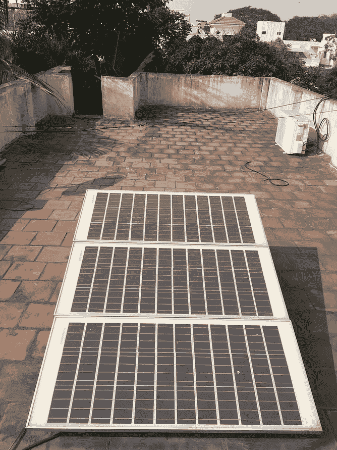
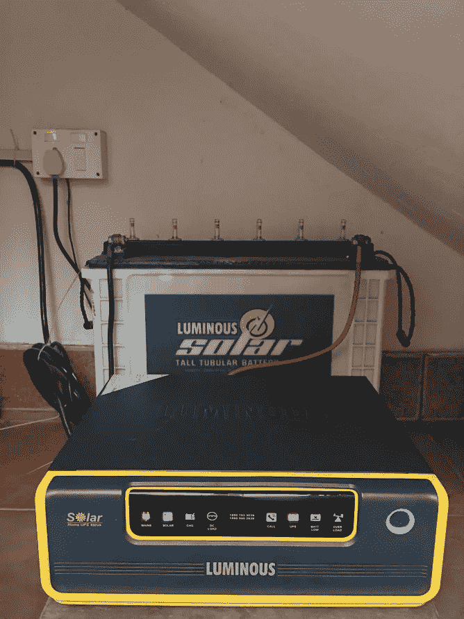
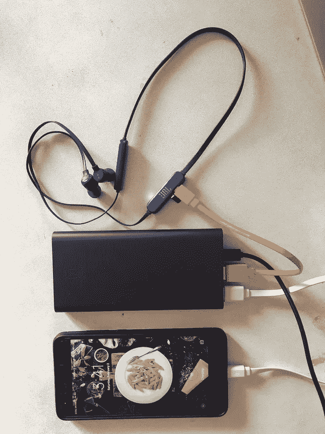

# 给电池充电的电池

> 原文：<https://medium.com/hackernoon/the-battery-that-charged-the-battery-that-charged-the-battery-289ab584cafd>

## 或者如何一次性节省 5 亿美元&保护环境

Thoughts on saving power

今天早上，我住的印度停电了，这是这里生活的一部分。然而，受影响的主要是较贫困的印度人，因为那些负担得起的人通常在家里有一个电池或逆变器，以便在停电时储存能量。这在断电期间无缝地启动，所以我们甚至不会知道断电，除非我们尝试使用像 ACs 这样的高功率设备，它不会依靠电池电源运行。

Solar panel charges battery/inverter which charges the battery power pack which charges my phone and bluetooth headset in low power mode

## 违背了断电的目的

具有讽刺意味的是，如果停电期间逆变器的使用在印度变得普遍，理论上可能会导致更多的电力消耗。这是因为当逆变器用于在逆变器中存储能量时，逆变器会增加电力消耗，并且在电池充电和放电期间会有额外的能量损失。

这将违背减载的目标。它仍然发生的唯一原因是因为商业机构在停电期间关闭，因为他们需要比逆变器能提供的更高的功率，并且不是所有的行业都能够负担得起投资昂贵的柴油发电机。

## 引发思考的电池

回来的时候，我的蓝牙耳机没电了。由于它的电池很小，我必须在低功率模式下充电，我不能使用家里常见的手机充电器。顺便说一句，当我的第一个蓝牙耳机在一年后坏掉时，我才知道这一点。维修技工告诉我，它被设计成只能通过低功率 USB 端口充电，这是你通常在笔记本电脑和个人电脑上拥有的。幸运的是，我的电源组有一个功能，通过双击它的开/关按钮可以使它在低模式下充电(缓慢闪烁的灯表示低电量充电)。

这就是我如何连接我的电源板给我的耳机充电，却发现它也没电了。当我将电源连接到墙上的插座时，我意识到我的太阳能电池板正在给我的逆变器充电，同时它也在给电源充电，而电源又在给我的蓝牙耳机充电。

我觉得整个想法非常有趣。

## 能量损耗和电池相伴而生

从逻辑上讲，直接从电源上运行比通过电池运行更有效，因为给电池充电总会有一些能量损失。想想吧。手机充电器平时不觉得暖和吗？在给设备的电池充电时，一些能量作为热量被浪费掉了。因此，当一块电池给第二块电池充电，而第二块电池又给第三块电池充电时，效率会非常低。

当然，我的手机、电源库和蓝牙耳机的电池的电量使用是可以忽略不计的。因此，这不会对我的电费账单或其他任何地方产生任何明显的影响。

除了可能在我脑子里。

只是我吗？或者世界应该重新思考如何使用电池？考虑到全球使用的数十亿便携式设备，所有这些微型电池节省的能源可能会增加很多。

我很好奇，所以我决定做数学。

## 用金钱来衡量能量损失

根据 statista.com 的数据，世界上大约有 50 亿部手机。大多数电话用户都有额外的便携式电池供电设备。就像我有一台 MacBook，一台 iPad，一个电源银行，和随机的蓝牙设备…没关系！为了简单起见，让我们假设每个手机用户有一个便携设备，这意味着存在 100 亿个便携设备/电池。

根据 2013 年福布斯[文章](https://www.forbes.com/sites/christopherhelman/2013/09/07/how-much-energy-does-your-iphone-and-other-devices-use-and-what-to-do-about-it/#5d4e09542f70)，一部手机一年的供电成本约为 0.25 美元，而手机-平板电脑-笔记本电脑的组合每年为 10 美元。自 2013 年以来，手机屏幕变得越来越大，可能需要更多的电力。这个印度站点每年生产大约 [5 台](https://www.bijlibachao.com/appliances/charging-a-mobile-phone-how-much-electricity-does-it-consume.html)，相当于₹35(大约 50 美分)。为了简单起见，让我们坚持 0.5 美元/年作为手机的平均耗电成本。

给电池充电时的能量损耗大吗？引用[上图](https://www.bijlibachao.com/appliances/charging-a-mobile-phone-how-much-electricity-does-it-consume.html):

> 移动电话充电器以及许多其他电池充电器都有将交流(交流电)转换成 DC(直流电)的变压器。变压器不仅转换电能，还消耗电能。他们有 50-90%的用电效率(来源: [EPRI](http://efficientpowersupplies.epri.com/pages/NRDC_power_supply_report.pdf) )。事实上，即使手机没有连接充电器并且开关打开，它们也会耗电。

我们可以用金钱来衡量这种能量损失吗？充电时的损耗就当 20%吧。这意味着每年花在手机充电上的 50 美分中有 20%实际上被浪费在电池效率低下上，比如充电器变热。换句话说，一部手机每年在电池充电低效上浪费 10 美分。

因为我所有的便携设备在使用时通常都在墙上的电源插座附近，所以我应该至少有一半的时间可以使用电源。现在让我们想象一下，新一代的便携式设备允许我使用电源。这意味着我可以在使用设备的一半时间里通过电池充电减少能量损失。因此，一部可以绕过电池的手机不会每年浪费 10 美分，而只会浪费一半，即每年 5 美分。

因此，如果有 100 亿个便携式设备，配置每个设备绕过电池工作将节省我们 100 亿 x 5 美分，或 5 亿美元。

这相当于每年为地球节省了令人难以置信的 5 亿美元。

## 到底实用不实用？

所有未来的便携式电子设备都可以内置并联电路直接在电源上运行吗？这并不像听起来那样不切实际。我的旧 17" MacBook Pro 的电池前段时间坏了。我懒得更换电池，现在只用 MacBook 的电源。

当然，还有其他因素，比如为未来设备重新布线以绕过电池的成本。这将增大便携式设备的体积，这与当前的趋势相反，但对于我们的环境来说，这可能是一个可以接受的交易。此外，为了绕过电池，所有未来的家庭都必须在墙上安装 USB 插座，作为所有电源插座的标准配件。也有积极的一面，因为当电池使用较少时，电池(和设备)会持续更长时间。

这同样适用于那些家用逆变器。如果印度政府想要真正降低家庭能耗，它应该想出如何为家庭提供足够的电力来保持风扇和灯的运转(同时又不能满足泵、熨斗、搅拌机、研磨机、空调等高功率设备的需求)。这样，人们就不会想投资逆变器了。污染我们长期遭受苦难的星球的废电池少多了。

以上只是开始的想法，可能和一块奶酪一样漏洞百出。然而，我相信专家们能想出更有效的主意。但要让它发挥作用，大企业中需要有人带头。

有人要吗？