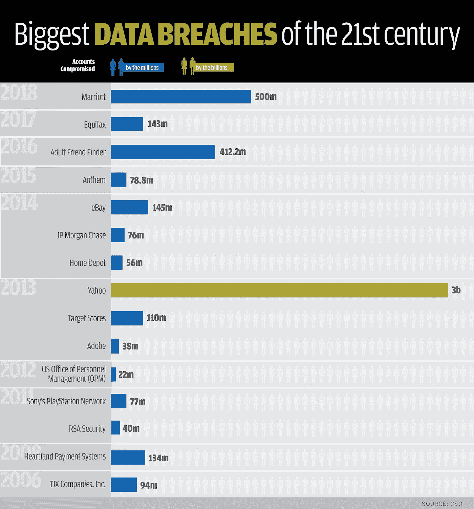

# 代理服务器给企业带来的好处

> 原文：<https://medium.com/hackernoon/the-benefits-of-proxy-servers-for-businesses-2984e930df86>

大多数人几乎不知道代理服务器是用来做什么的。如果你像大多数人一样，你可能会认为他们只是用来访问你的国家不允许的内容或在开放的 WiFi 网络上保持安全。然而，它们还有许多其他用途，对商业尤其重要。

代理服务器是一个相对简单的中间计算机，它允许你与其他网络进行间接连接。它有自己的互联网协议(IP)地址，这是公开的，而不是你的私人 IP 地址。这种机制可以用于各种业务原因，从安全目的到客户体验以及介于两者之间的任何事情。

以下是企业应该使用代理服务器的几个原因:

# 提高业务安全性

在过去的几年里，黑客攻击一直呈上升趋势。一次[数据泄露](https://en.wikipedia.org/wiki/Data_breach)可能会非常昂贵，并对你的公众形象造成损害。仅在【2019 年 1 月，就有 1769185063 条用户记录被泄露。

**以下是 21 世纪一些最大的数据泄露事件:**

csoonline.com

代理最大限度地降低了违规的可能性。它在您公司的服务器和外部流量之间增加了一个额外的安全层。由于代理服务器面向 web 并中继来自网络外部设备的请求，因此它们充当了一个很好的缓冲器。

黑客可以访问你的代理服务器，但是他们很难到达你存储重要数据的实际服务器。当然，仅仅用一个代理服务器是不可能将天才黑客完全拒之门外的。然而，与没有代理人的情况相比，你会更容易受到攻击。一些 VPN 或代理可能会跟踪您或收集您的数据。确保使用[最好的 VPN 应用](https://www.techforpc.com/top-5-vpn-apps-pc-download)，它们拥有良好的声誉，不会窃取你的数据。

# **平衡流量以防止服务器崩溃**

客户最讨厌的事情之一就是当他们真正需要的时候，一个网站关闭了。对等、云数据存储和代理服务器有助于确保这种情况不会发生，并改善客户体验。

本质上，您的内容和数据存储在全球多个服务器和云中。对等理想地帮助您的网络处理更多的流量。但是，您不能要求客户尝试不同的互联网服务提供商来获取这些内容。取而代之的是，代理服务器被用来创建一个作为接入点的单一网址。代理理想地平衡每个服务器的请求，确保没有过载。所有这一切都在后台进行，以确保客户端的无缝体验。

# **匿名完成敏感任务**

代理服务器很受欢迎，因为它们能让你的网站保持匿名。如今，网站越来越擅长检测代理。但是使用[最佳住宅代理](https://proxy-central.com/top-9-backconnect-proxy-service-providers/)，你可以轻松地完成敏感任务，并拥有流畅的浏览体验。它使用住宅 IP，由合法的互联网用户使用。不幸的是，大多数企业主不知道这个功能有多有用。

告密者、安全官员和记者依靠这种额外的安全性来保护他们自己、他们的公司、合作伙伴、客户，甚至消息来源。代理可以理想地保护你的团队正在进行的任何研究和开发。

如果你使用代理，任何试图跟踪你的流量以了解你的公司正在做什么的潜在间谍将很难跟踪你的员工。如果通过代理服务器匿名化，任何在线完成的敏感业务任务都将更加安全。

# **节省带宽和加快速度**

由于代理服务器在后台所做的额外工作，大多数人倾向于认为它只会降低互联网的速度。然而，情况并非总是如此。

您可以使用代理服务器来提高互联网速度，甚至通过缓存多个用户访问的网页和文件、压缩流量甚至阻止网站广告来节省带宽。这释放了繁忙网络上的宝贵带宽，因此，您的员工能够更快地浏览互联网。

# **控制工作场所的互联网使用**

没有雇主希望员工通过公司网络访问不合适或不安全的网站。这就是为什么大多数公司和机构的内部网络都在代理服务器上运行的主要原因。

如果网络通过代理服务器运行，您将能够控制人们可以访问哪些网站以及可以访问网络的设备。你可以[屏蔽你认为只会分散员工注意力的不当内容](https://smallbusiness.chron.com/block-website-analog-proxy-47916.html)和网站。

有了代理，您还可以记录员工出于内部原因正在访问的内容。大多数安全管理人员利用这一特性来监控潜在的安全漏洞或非法活动。