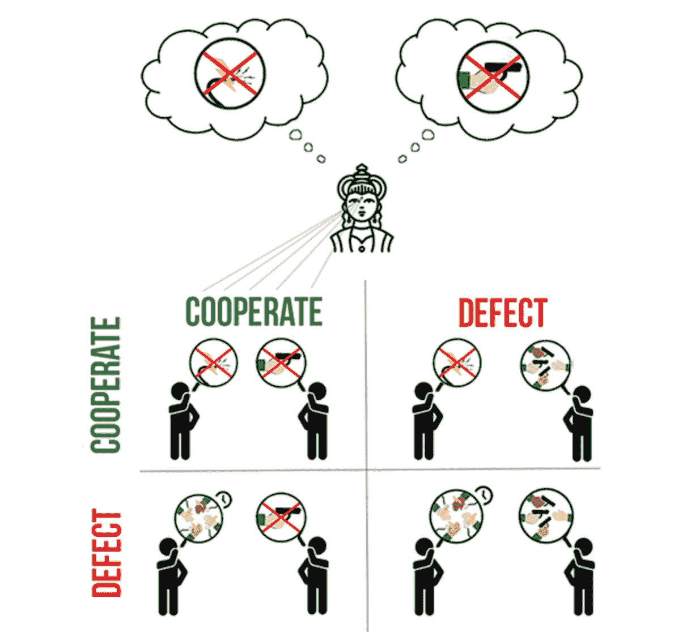
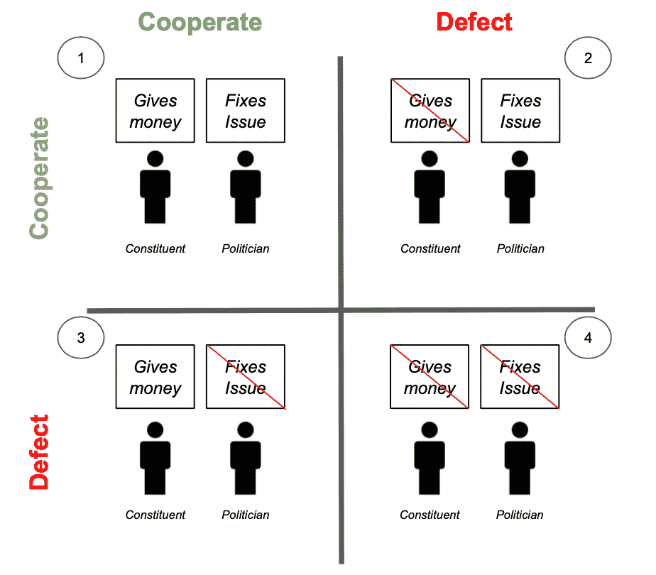

# 最好的区块链应用是当用户不知道它是区块链应用的时候

> 原文：<https://medium.com/hackernoon/the-best-blockchain-apps-will-be-when-the-user-doesnt-know-it-s-a-blockchain-app-7e11c1fc0d66>

在我的创业之旅中，我一直在对创业领域的人说一些能引起他们共鸣的话:

## “当用户甚至不知道这是一个区块链应用程序时，最好的区块链应用程序就会出现”。

在变得沮丧之前，让我澄清一下。我非常相信区块链的解决方案和应用程序(正如我的许多遭受过我无数谩骂的朋友所证明的那样)。区块链和 Web 3.0 带来的可能性令人难以置信地兴奋，有许多人和组织正在将这一愿景变为现实(我个人最喜欢的一个例子是 Kevin Owocki——git coin 的创始人)。

但是当人们听到这句话时，他们还是会从中得到安慰。一般来说，我发现他们从中得到安慰有两个原因:

1.  他们认为我这么说是为了淡化“加密冬天”和 ICO 热潮的影响
2.  我在避免他们的“区块链锤子”反应(锤子找钉子砸)。

虽然这些可能是正确和有益的，但我是在对更大的东西说话。我指的是两个概念:

1.  构建流畅自信的用户体验(阅读如下文章)

 [## 区块链技术的当前 UX 问题

### 新兴技术需要高价值和好的 UX 才能成功。事实上，一项技术的普及…

blog.goodaudience.com](https://blog.goodaudience.com/current-ux-issues-of-the-blockchain-technology-142338c6beb6) 

**2。通过在以前没有信任的地方提供一个信任的地方，创造一个事情应该如何的环境。**

这第二点就是我这篇文章要讲的。我想谈谈我们应该如何为应用程序为人们带来的结果而建设——我们应该如何建设一些东西，让人们能够让他们的社区变得更好。

有多少次你会说，“是的，我知道‘Y’应该是这样的，但是只有当每个人都同时这么做的时候才行得通——因为我们不生活在那个世界里，所以我们必须坚持用‘X’。”这是囚徒困境的一个经典例子(关于囚徒困境和博弈论的更多信息，请查看— [信任的演变](https://ncase.me/trust/))

 [## 信任的演变

### 我们为什么以及如何相互信任的游戏理论互动指南

ncase.me](https://ncase.me/trust/) 

# **囚徒困境**

为了更好地说明这一点，我将从斯科特·亚历山大的“[默想火神](https://slatestarcodex.com/2014/07/30/meditations-on-moloch/)”中提取一个例子。在这个例子中，他谈到了一个有两种规则的国家。第一，每个人必须每天电击自己 8 小时，第二，如果任何人不遵守规则一或公开反对规则一，所有其他公民必须团结起来杀死异议者。

每个人都讨厌这些规则，希望它们与众不同，但没有人愿意因为害怕死亡而冒险不遵守它们。如果每个人都决定同时遵循新的规则，这些规则可能会被违反，但由于没有办法实际协调，没有人能够相信每个人都会相互合作而不会自相残杀。

虽然这是一个极端的例子，但这是区块链应用程序可以帮助我们解决的问题类型。通过使用编码规则和经济激励，区块链应用程序实现了一种新型经济。一个每个人都可以相信每个人都会在同一时间做正确的事情，允许人们合作，并有一个更好的结果。

# **区块链技术如何帮助解决囚犯困境**

为了进一步说明这一点，让我们将它应用到现实世界的例子中。在 [Govrn](http://govrn.io/) ，我们发现了其中一种情况，并正在使用区块链的解决方案来帮助修复它。

如今，开展政治活动需要大量资金([，而且成本还在不断增加](https://www.opensecrets.org/overview/election-trends.php))。结果，政客们花费大量时间筹款和“拨钱”，而不是花时间解决问题。政客们这样做是因为他们不能保证，即使他们解决了问题，他们的选民也会知道这个解决方案并支持他们连任。

在硬币的另一面，我们作为选民有一个问题，今天给我们的政治家。我们害怕给一个说要做一件事，但又不兑现承诺的政客钱。我们想给一个能把事情做好的政治家，但我们没有好的方法向他传达我们的支持条件。这意味着政治家最终会转向能够做出这类承诺的特殊利益集团。

政治家(希望花更多时间解决问题，花更少时间筹款)和选民(希望支持政府的良好工作)都希望有更好的方式，但没有办法协调这些方式，最终都不想吃亏。

如果政治家解决了问题，但没有收到捐款，那么他们就没有能力竞选连任，如果选民在问题没有解决的情况下给了钱，那么选民就会觉得钱被浪费了，他们的意见没有被听取。

在 [Govrn](http://Govrn.io) ，我们让人们能够移动到 1 号包厢。我们正在开发一个平台，使政治家和选民能够相互信任和合作。我们的平台允许你参与基于结果的捐赠，这意味着政治家只有在解决影响你的问题时才会得到你的支持。这样，政治家可以花更多的时间解决问题，而不是花更少的时间打电话要钱。

这就是我所说的当用户不知道他们正在使用区块链的解决方案时，最好的区块链应用将会出现的意思。选民们不会因为平台建立在区块链上或者它实现了数字货币而兴奋——他们会因为看到了世界的本来面目而兴奋。看到一个平台让他们能够看到政治和世界的积极变化，他们会感到兴奋。他们对改善社区的机会感到兴奋。

这就是为什么没有人会知道这是一个区块链应用程序。他们只会知道这是一种赋予社会权力和推动社会前进的方式。

#区块链# Web3.0 #政治#创业#社交企业

*如果你对此感兴趣，请到* [*Govrn.io*](http://Govrn.io) *来看看我们吧。亚伦是 Govrn 的创始人兼首席执行官，当他不在自己的初创公司工作时，你可以发现他在太浩湖(Tahoe)滑雪。*