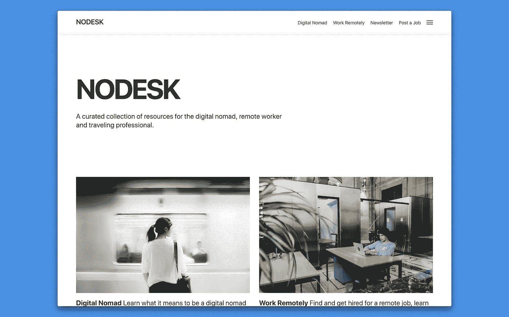

# 最佳数字游牧和远程工作读物

> 原文：<https://medium.com/hackernoon/the-best-digital-nomad-and-remote-work-reads-2018-4ad3238612ec>

## 定义 2018 年的故事，当时数字游牧成为主流，远程工作成为工作的未来

Illustration by [Katerina Limpitsouni](https://medium.com/u/4b8706e36863?source=post_page-----4ad3238612ec--------------------------------) on [unDraw](https://undraw.co/)

去年在 [NODESK](https://nodesk.co/) 上，我发表了 448 篇关于数字游民和远程工作的文章，以及偶尔的另类文章。根据 NODESK 观众最喜欢阅读和分享的内容，以及我认为最有趣的故事，这些都是最受欢迎的。

2018 年的大部分时间都是关于数字游牧生活方式成为主流，以及远程工作和完全分布式团队的兴起，这是对[现代工作场所](https://m.signalvnoise.com/the-open-plan-office-is-a-terrible-horrible-no-good-very-bad-idea-42bd9cd294e3?curator=NODESK)的直接回应。

> 通过强迫绝大多数不喜欢或讨厌开放式办公室的人进入这种配置，我们正在大规模地浪费人类的健康和潜力。他们的工作质量下降，工作满意度下降。为了什么？因为少数人喜欢这种配置？因为拍几张照片会好看？因为这会给拜访办公室的陌生人留下深刻印象？离开这里。
> 
> *—* [DHH](https://medium.com/u/54bcbf647830?source=post_page-----4ad3238612ec--------------------------------)

有数字游牧者写的关于他们的生活方式和远程工作好处的个人故事。例如， [Charles Patterson](https://medium.com/u/ed7a781ed8ce?source=post_page-----4ad3238612ec--------------------------------) 讲述了远程办公是他们做出的最佳决策。

 [## 远程设计——我一生中做出的最好的决定

### 远程工作指南及如何开始？

medium.com](/@charlespattson/designing-remote-the-best-decision-ive-made-in-my-life-17d6766ab373) 

另一个有趣的[阅读](https://krausefx.com/blog/going-nomad?curator=NODESK)是[菲利克斯·克劳斯](https://medium.com/u/55e4e605e7d2?source=post_page-----4ad3238612ec--------------------------------)决定去流浪，把他的行李减少到一个手提箱、一个手提包和一个背包。Felix 随后进行了[一年回顾](https://krausefx.com/blog/one-year-nomad?curator=NODESK)，并得出结论:

> 一年前的今天，我决定扔掉我的东西，住在一个手提箱里。这是从一个我没想到会持续很久的实验开始的。然而，365 天没有一个固定的家，我不打算改变我目前的设置。

随着这些新出现的在异国他乡寻求冒险的数字游民，出现了新的问题，比如你如何使用蹲式厕所。

 [## 好吧，我们都是成年人了，所以说真的，我到底应该如何使用蹲式厕所？

### 好的，对于任何去过北美和西欧以外的地方的人来说，你知道我在说什么。

travel.stackexchange.com](https://travel.stackexchange.com/questions/3080/ok-were-all-adults-here-so-really-how-on-earth-should-i-use-a-squat-toilet?curator=NODESK) 

除了数字游牧民，还有一些关于一些最具创新性和领先的分布式团队公司的文章，如 [GitLab](https://medium.com/u/68f5136d3254?source=post_page-----4ad3238612ec--------------------------------) 和 [InVision](https://medium.com/u/206c13695d27?source=post_page-----4ad3238612ec--------------------------------) 。

 [## GitLab 数百万美元成功的秘密:所有 350 名员工都远程工作

### 这家总部位于旧金山的初创公司为软件开发人员提供工具，它的每一名员工都在家工作。三年前，这是九个人。今天，GitLab 在 45 个国家的 350 名员工使用视频通话和聊天来保持持续的联系。

www.inc.com](https://www.inc.com/cameron-albert-deitch/2018-inc5000-gitlab.html?curator=NODESK)  [## 这家软件公司估值 10 亿美元，有 800 名员工，没有办公室

### 运营实际上并没有让公司慢下来。InVision 现在有 800 名员工(一年前不到 500 人)，估值为 10 亿美元，随着下一轮融资的临近，这一数字还会增加。以这些标准来衡量，InVision 已经比 Slack 在被 Inc .评为 2015 年年度公司时更大了。

www.inc.com](https://www.inc.com/jeff-bercovici/invision-2018-company-of-the-year-nominee.html?curator=NODESK) 

GitLab 和 InVision 是远程工作*大规模运作*的最好例子。但是远程工作有许多陷阱，而且当一家公司实施失败时，远程工作的想法经常受到指责。幸运的是，安德烈亚斯·克林格组织了一个如何管理远程团队的速成班。

 [## 管理远程团队-速成班

### 在本文中，我将介绍不同类型的远程团队设置，远程团队工作方式不同的原因和方式，何时希望远程工作，何时最好不要远程工作，最后介绍一些对我参与的团队有效的技巧…

klinger.io](http://klinger.io/post/180989912140/managing-remote-teams-a-crash-course?curator=NODESK) 

随着远程工作的兴起，求职者面临的问题是如何找到一份远程工作——NODESK 远程工作板块是今年访问量最大的板块——但当你与来自世界各地的数百甚至数千名求职者竞争时，如何获得一份远程工作。

Andrew Gobran 的文章总结了申请远程工作时应该避免的最大错误，并给出了来自 [Doist](https://medium.com/u/788627f2f641?source=post_page-----4ad3238612ec--------------------------------) 、 [Buffer](https://medium.com/u/245d5483fb27?source=post_page-----4ad3238612ec--------------------------------) 、 [InVision](https://medium.com/u/206c13695d27?source=post_page-----4ad3238612ec--------------------------------) 、 [Toggl](https://medium.com/u/9ba521ccbf87?source=post_page-----4ad3238612ec--------------------------------) 和 Timely 的招聘专家的建议。

 [## 申请远程工作时要避免的最大错误

### Doist、Buffer、InVision、Toggl 和 Timely 的招聘专家对远程职位的建议。

blog.doist.com](https://blog.doist.com/common-remote-job-application-mistakes-89cc58ed39a1) 

对于求职者来说，这不仅仅是找到一份远程工作，还包括如何选择职业和做出正确的职业决定，这些都是[等待的，但为什么](https://medium.com/u/e83b30f809db?source=post_page-----4ad3238612ec--------------------------------)在这篇长篇文章中写道。

 [## 如何选择一个职业(实际上适合你)——等等，但是为什么

### 这篇文章实际上不是我给你的职业建议，而是一个框架，我认为它可以帮助你做出职业决定，实际上反映了你是谁，你想要什么，以及我们今天快速变化的职业前景。你不是这方面的专家，但你肯定比我们这些没有自知之明的大叔更有资格判断什么对你最好。

waitbutwhy.com](https://waitbutwhy.com/2018/04/picking-career.html?curator=NODESK) 

2018 年，关于成为数字游牧者和远程工作的积极方面的故事比比皆是。但是随着对游牧民族关注的增加，出现了关于这种生活方式阴暗面的个人描述。这些是 2018 年最有影响力的故事，我希望有抱负的游牧民族能从中吸取教训。

[Amir Salihefendic](https://medium.com/u/bb7c4a93e2ee?source=post_page-----4ad3238612ec--------------------------------) 分享了他在远程工作场所的孤立、焦虑和抑郁的个人故事。必读。

 [## 大多数远程公司不会告诉你的远程工作

### 远程工作场所中的孤立、焦虑和抑郁，以及我们对此采取的措施。

blog.doist.com](https://blog.doist.com/mental-health-and-remote-work-1b77616f6945) 

Martin De Wulf 写道，尽管远程工作有很多好处，但是压力很大，对他们的心理健康和人际关系都有影响。

 [## 远程工作的压力

### 这可能会让一些人感到惊讶，但最终，我认为远程工作在过去两年中对我产生了一些影响，特别是当我从 2016 年 6 月到 2017 年 6 月几乎完全远程工作了一年的时候。

hackernoon.com](https://hackernoon.com/the-stress-of-remote-working-38be5bdcf4da) 

还有一个问题是[远程工作](https://news.ycombinator.com/item?id=15994294)或成为[数字游牧者](https://old.reddit.com/r/digitalnomad/comments/9y9d84/a_digital_nomad_is_not_respected_at_my_job_is_it/?curator=NODESK)是否会损害你的职业生涯，以及数字游牧者对国内外社区的影响，正如 [Paris Marx](https://medium.com/u/1c35f0069aa5?source=post_page-----4ad3238612ec--------------------------------) 在《数字游牧者不是未来》中所讨论的。

 [## 数字游牧者不是未来

### 生活方式企业家忽视国内外的社区。

medium.com](/@parismarx/digital-nomads-are-not-the-future-be360c7911b4) 

基于这些主题，我发现有两种数字流浪者。有些人要去做某事，有些人要离开某事。前者寻求满足自己的冒险精神，后者寻求为自己创造更好的生活。这两种数字流浪者都可能经历生活方式的艰辛，但后一种人应该注意到，正如[进一步指出的那样](https://medium.com/u/9469f2b50397?source=post_page-----4ad3238612ec--------------------------------),旅行并不能治愈心灵的不满。

 [## 旅行不能治愈心灵

### 旅行通常被视为幸福的关键。这就是为什么它不是。

medium.com](/personal-growth/travel-is-no-cure-for-the-mind-e449d3109d71) 

所有这些故事的要点是:作为一个数字流浪者或远程工作并非没有困难。就像生活中的所有事情一样，当你祈祷下雨的时候，你也要面对泥泞。那是它的一部分。

NODESK 上最受欢迎的另类文章之一是 Naval Ravikant 关于如何致富(不走运)的 Twitter 帖子。

最后，这篇关于安东尼·鲍代恩丰富生活的文章《最后一个好奇的人》是必读的。

 [## 据最了解安东尼·鲍代恩的人说，他的一生非常丰富

### 据最了解安东尼·鲍代恩的人说，他一生经历丰富。

www.gq.com](https://www.gq.com/story/anthony-bourdain-men-of-the-year-tribute?curator=NODESK) 

我肯定我错过了一些东西，但如果你想了解更多关于数字游牧者和远程工作的信息，可以在这里查看 2018 年包括往年的所有 448 篇文章。

你也可以订阅[的 NODESK 时事通讯](https://nodesk.us15.list-manage.com/subscribe?u=b9aaee7603dd29afd03e8bfd8&id=8998017842)，让 NODESK 的精华每两周直接发送到你的收件箱。

如果你今年正在寻找一个新的机会，我在 [NODESK 工作论坛](https://nodesk.co/remote-jobs/)上为你提供在家或世界各地远程工作的自由的领先公司和创业公司策划了最好的新远程工作。你也可以访问[加密货币工作](https://cryptocurrencyjobs.co/)在区块链和加密空间的远程工作。

如果您有任何功能需求、建议或总体反馈，请通过电子邮件或在 [Twitter](https://twitter.com/NODESKco) 上联系我。我的 DMs 永远是开放的。让我知道我如何能帮助你作为一个数字流浪者，远程工作者或在你寻找一个远程工作。

Illustration by [Katerina Limpitsouni](https://medium.com/u/4b8706e36863?source=post_page-----4ad3238612ec--------------------------------) on [unDraw](https://undraw.co/)

## 祝福 2019。我希望你离下一次冒险只有几天了！