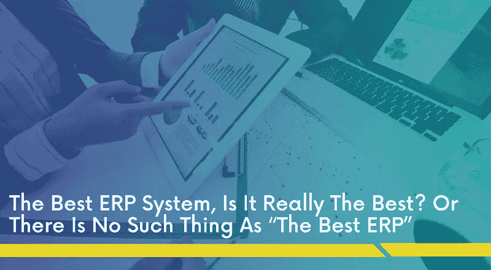

# 最好的 ERP 系统，真的是最好的吗？或者根本没有“最好的 ERP”这种东西

> 原文：<https://medium.com/hackernoon/the-best-erp-system-is-it-really-best-or-there-is-no-such-thing-as-the-best-erp-bcc198a3d1b1>

大多数小型和大型企业的所有者都在寻找，'**哪一个是最好的 ERP 系统**？'不考虑业务类型、工作方式、行业领域、需求和预算。

**但是，**

*   有没有适合所有行业细分市场的理想 ERP？
*   最好的 ERP 是根据您的业务需求制作的吗？
*   标准 ERP 是否简化了工作流程？

**或**

*   **最好的 ERP 是神话吗？**

让我们从基础开始讨论这件事:

## 为什么企业需要 ERP 系统？

在快速变化的商业世界中，做出明智的决定是必要的！

**企业更愿意实施 ERP 系统来:**

*   随机应变内部流程
*   管理公司的整体活动
*   跨不同部门跟踪任务的状态
*   简化业务流程
*   深入了解整体业务绩效。

然而，以此为契机，大多数软件供应商开发并销售他们的软件，称其为**最佳或理想的 ERP 软件**。

他们声称他们的 ERP 适用于所有业务类型和行业领域，而不管他们的业务流程和工作流程。

**但是，那真的可行吗？**

行业需求因公司的规模和性质、预算、现有系统和流程而异。

> 例如:—服务于零售业的 ERP 可能无法服务于制造业，反之亦然

# “最好的 ERP”真的能成为最好的吗？

每个企业都有自己的需求、利基和专长，那么您的业务需求如何才能适应预打包软件呢？

尽管 ERP 软件供应商根据发展趋势包括移动性、SaaS、分析、云和其他实践，但它并不适合每种类型的企业。

*   **如果你有一个中小型企业，那么在初始阶段你不一定需要复杂的功能。**
*   **如果你拥有一家大型企业，那么你可能需要潮流功能来发展你的业务，但再次实施这些功能取决于你的业务类型、规模和要求**

## 标准 ERP 系统可能有某些限制，例如:

*   不适合处理组织的独特需求
*   限制组织的工作流程
*   为未使用的模块付费
*   如果工作模式或流程发生变化，则不太适合
*   第三方集成可能会非常昂贵
*   培训员工可能需要时间
*   无法随着您的业务增长而更改和升级 ERP 软件；过时是可能的

## 那么，如何选择适合自己企业的 ERP 解决方案呢？

选择 ERP 软件不仅仅是简单地比较供应商提供的功能，而是关于 ERP 软件功能如何满足您的业务需求。

在选择 ERP 解决方案之前，你需要考虑一些问题。

*   我真的需要 ERP 吗？
*   现成的 ERP 能满足我所有的要求吗？
*   需要哪些 ERP 功能来支持我的业务？
*   我需要与现有系统集成吗？
*   我的工作流程会因为标准功能而简化吗？
*   我还需要灵活性和可伸缩性吗？
*   我可以进行第三方集成吗？
*   会涉及多少培训？
*   该系统的用户友好程度如何

这些是可以帮助您对 ERP 解决方案做出明智决策的一些关键考虑因素。

那么，为了最大限度地利用 ERP 解决方案，如何选择定制的 ERP 软件，可以根据您的业务类型、规模和要求来满足您的所有独特需求？

# 定制 ERP:为您量身定制的 ERP

定制 ERP 软件是根据您独特的业务需求开发的。借助定制的 ERP 解决方案，您可以决定要包括哪些功能。它是通过考虑组织流程、管理、战略和运营的所有属性而开发的。它自动化并简化了业务功能，并最终提高了业务生产率。

## 建造它；不要买:特斯拉采取的方法

特斯拉仔细评估了利弊，决定选择定制 ERP 解决方案。 **Tesla CIO Jay Vijayan** 计算了 SAP 实施的成本(以百万美元计)和执行所有必要集成所需的时间。

选择定制的 ERP 后，该公司可以在 4 个月内用有限的预算实现相同的功能。他们选择了一家能够定制 ERP 系统的第三方供应商来合理化他们的业务流程。

更多信息，你可以阅读由[华尔街日报](https://blogs.wsj.com/cio/2013/11/01/how-elon-musk-approaches-it-at-tesla/)发表的文章。

## 定制 ERP 系统的优势

*   允许您轻松调整和集成模块来处理浪涌
*   提供跨组织各部门的所有运营流程的完整可见性
*   确保部门内的所有活动都通过单一的报告系统进行跟踪
*   您可以按照自己实际需要的方式定制报告
*   更好地概述公司的运营
*   成本更低，因为它只开发了所需的功能。
*   提供对业务工作流和业务流程的准确性、洞察力和清晰的理解

# 最好的 ERP 被高估了

选择 ERP 的更好方法是考虑业务的性质，并寻找最适合您业务的需求。每个企业都是不同的，因此，没有放之四海而皆准的解决方案！定制 ERP 可以简化组织的各个方面，并确保高效可靠的工作流程。

通过下面的评论让我们知道你对 ERP 的想法。

这篇文章最初发表在我们的博客上: [*这里*](https://www.spec-india.com/blog/the-best-erp-system-is-it-really-best-or-there-is-no-such-thing-as-the-best-erp/)